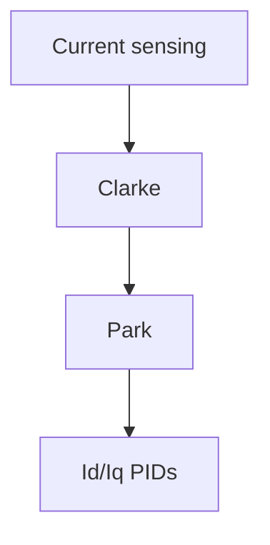

# e-foc Documentation Rules

## Documentation-first

Update `documentation/` **before or alongside** any behavioral code change — code must follow documentation,
not the opposite. If no document exists for the affected component, create one from a template first.

## Document types

| Folder | When to update |
|---|---|
| `documentation/theory/` | FOC algorithm or motor model change |
| `documentation/performance-optimization/` | Timing-critical change |
| `documentation/` (architecture/design files) | Any component with observable behavior changes |

Use `documentation/templates/architecture.md` or `documentation/templates/design.md` as the starting point.

## Visuals

All visuals must use Mermaid code blocks or ASCII art — **no external image references** (``).

## Content requirements

Each document should include:
- Mathematical background (equations for transforms, PID tuning, etc.)
- Control-loop diagram (Mermaid or ASCII)
- Hardware dependencies
- Tuning guidance where applicable

## Behavioral change = CRITICAL

A behavioral code change with no matching documentation update is a CRITICAL review violation.
