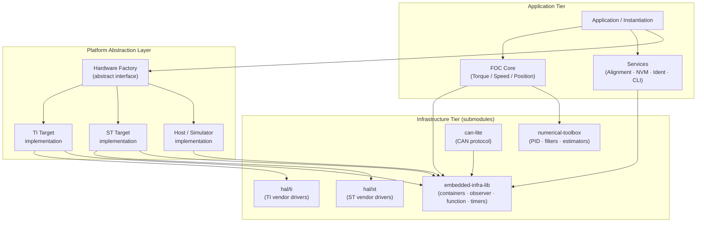
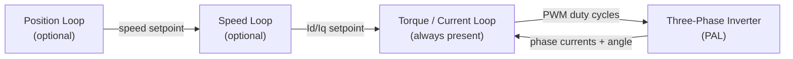
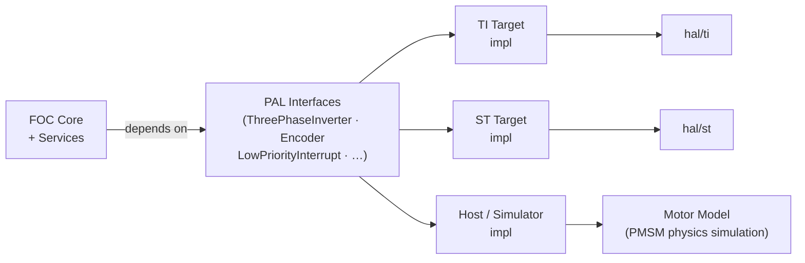
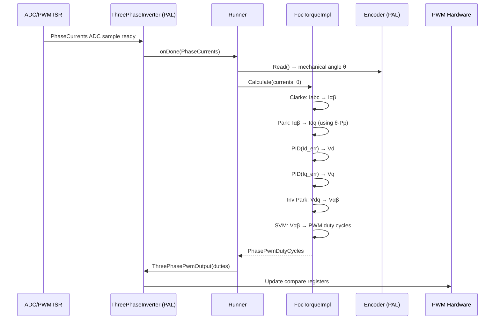
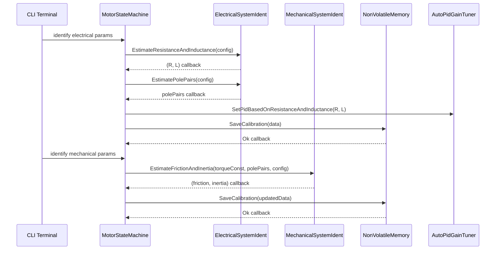

| Field     | Value                     |
|-----------|---------------------------|
| Title     | e-foc System Architecture |
| Type      | architecture              |
| Status    | draft                     |
| Version   | 0.1.0                     |
| Component | system                    |
| Date      | 2026-04-07                |

> **Note — Implementation-blind document**: This document describes *what exists and why*, not how it is coded.
> Code must follow architecture, not the opposite. Do not reference source files, class names, or implementation
> details here.
>
> **Diagrams**: All visuals must be either a Mermaid fenced code block or ASCII art inline in the document.
> External image references (``) are **not allowed**.
>
> Sequence diagrams, block diagrams, component diagrams, and state machines (Mermaid syntax) are allowed and encouraged.

---

## Assumptions & Constraints

- **Constraint**: No dynamic memory allocation on the embedded target. All objects are stack- or statically-allocated for deterministic, bounded memory footprint.
- **Constraint**: The core FOC loop executes in an interrupt service routine at 20 kHz. The complete control cycle must finish in fewer than 400 cycles at 120 MHz to guarantee real-time deadlines.
- **Constraint**: No recursion in control-loop or ISR-reachable paths. Stack usage must be statically predictable.
- **Constraint**: No C++ exceptions. Error signalling uses status return values, `std::optional`, or asynchronous callbacks.
- **Constraint**: The system targets 32-bit ARM Cortex-M microcontrollers (STM32 and TI Tiva families). Host builds are supported for unit testing and simulation only.
- **Assumption**: A single motor is controlled per instantiation. Multi-motor configurations require multiple independent instantiations.
- **Assumption**: The motor is a BLDC or PMSM (surface or interior permanent magnet) with a sinusoidal back-EMF profile suitable for FOC.
- **Assumption**: Rotor position is measured by a quadrature encoder. Hall-sensor support is defined in the driver interface but is a secondary configuration.
- **Assumption**: All motor electrical and mechanical parameters (resistance, inductance, pole pairs, inertia, friction) can be identified at startup or loaded from non-volatile storage.
- **Constraint**: The build system must be capable of producing three independent binaries — torque-only, speed-only, and position-only — as well as combinations. No unused control-mode code should be included in a given binary.

---

## System Overview

e-foc is a Field-Oriented Control (FOC) firmware for BLDC and PMSM motors. Its purpose is to transform three-phase stator currents into a rotating reference frame so that torque and flux can be regulated independently with standard linear PIDs, then synthesise the three-phase PWM voltages via Space Vector Modulation.

The system is structured in three tiers:

1. **Infrastructure tier** — external repositories providing general-purpose utilities, numerical algorithms, and vendor HAL drivers. These are consumed as submodules and are never modified by this project.
2. **Platform Abstraction Layer (PAL)** — a boundary layer that hides all microcontroller-specific peripheral details behind stable, abstract interfaces. Both physical hardware targets and the host simulator implement the same PAL contracts, enabling the control logic to run unchanged in all environments.
3. **Application tier** — the FOC algorithms, services, and application wiring that implement the motor control system as a whole.

The simulator implements the same PAL contracts as real hardware. Control logic never needs to distinguish between running on a microcontroller or on the host; this enables full-fidelity closed-loop validation without hardware.

---

## Component Decomposition

### 1. FOC Core (`source/foc/`)

The heart of the system. Decomposed into three sub-layers following a strict separation of contract, algorithm, and wiring:

| Sub-component   | Responsibility                                                                                                                                       |
|-----------------|------------------------------------------------------------------------------------------------------------------------------------------------------|
| Interfaces      | Define abstract contracts for control modes (Torque, Speed, Position) and driver peripherals (inverter, encoder, interrupt). No algorithms, no data. |
| Implementations | Concrete algorithm implementations for Clarke/Park transforms, Space Vector Modulation, trigonometric helpers, PID wrappers, and control loops.      |
| Instantiations  | Template-based wiring that combines a control-mode implementation with the Runner to produce a ready-to-use `FocController<Mode>`.                   |

The three control modes are deliberately independent and composable. A given product binary includes only the mode(s) it needs:

- **Torque control** — innermost loop: regulates phase currents to produce a commanded torque (specified as Id/Iq current setpoints).
- **Speed control** — outer loop on top of torque control: a PID regulates rotor angular velocity by commanding Id/Iq setpoints to the inner loop. The outer loop runs at a lower priority interrupt (typically 1 kHz) while the inner loop still runs at 20 kHz.
- **Position control** — outermost cascade: a PID regulates rotor position by commanding a speed setpoint to the speed loop. Builds on speed control.

The `Runner` is the only component that interacts with the PAL inverter and encoder at interrupt time. It registers the ADC-sampling callback and drives the `Calculate()` dispatch into the active control-mode implementation.

### 2. Services (`source/services/`)

Higher-level, non-real-time services that support commissioning and runtime operation. Each service is independently usable:

| Service                          | Responsibility                                                                                                                       |
|----------------------------------|--------------------------------------------------------------------------------------------------------------------------------------|
| Alignment                        | Forces a known electrical angle on the rotor at startup so the FOC reference frame is correctly initialised before normal operation. |
| Electrical System Identification | Estimates phase resistance, d/q inductances, and pole pairs by injecting test signals and measuring the response.                    |
| Mechanical System Identification | Estimates rotor inertia and viscous friction coefficient from closed-loop speed response data.                                       |
| Non-Volatile Memory (NVM)        | Persists calibration data (R, L, pole pairs, encoder offset, PID gains) and configuration across power cycles using flash.           |
| CLI                              | A terminal-based command interface for triggering services, querying state, and setting parameters from a serial console.            |

Services communicate via asynchronous callbacks using `infra::Function<void(result)>`, not return values. This allows long-running operations (identification, alignment) to yield the CPU and complete asynchronously without blocking.

### 3. Platform Abstraction Layer

The PAL provides a single platform-facing abstraction that groups creation and access to the hardware services needed by the control system:

| Peripheral | Abstraction |
|------------|-------------|
| Three-phase PWM + ADC triggered measurement | Power-stage drive and synchronised current-sampling interface |
| Quadrature encoder | Rotor-position sensing and calibration interface |
| Low-priority interrupt | Deferred scheduling interface for the speed/position outer loop |
| CAN bus | CAN 2.0B communication interface |
| Performance timer | Cycle/timestamp measurement interface for profiling |
| Serial terminal | Diagnostic trace and command-line interaction interface |

Concrete implementations exist for:
- **TI Tiva (EK-TM4C1294XL)**: platform-specific peripheral adapters for this MCU family.
- **ST STM32 (STM32F407G-DISC1)**: platform-specific peripheral adapters for this MCU family.
- **Host / Simulator**: a software-backed platform implementation that emulates the motor-control I/O needed to run the closed-loop algorithm on a development machine.

### 4. Application / Instantiation (`source/application/`)

The wiring layer. Assembles the concrete PAL implementation, the selected FOC mode(s), and the services into a runnable system. This is the only layer that is aware of the specific combination in use — all other layers depend only on abstractions.

A `MotorStateMachine` template manages the lifecycle: it holds the `FocController`, the automatic PID gain tuner, and a variant of active service states (idle, aligning, identifying), routing terminal commands to the correct service or control mode.

### 5. Tools (`source/tool/`)

Host-only tools that do not run on the embedded target:

| Tool          | Responsibility                                                                                                                                                                                   |
|---------------|--------------------------------------------------------------------------------------------------------------------------------------------------------------------------------------------------|
| Simulator     | Closed-loop software simulation: real FOC control code drives a physics-based PMSM model (Euler integration of the dq electrical equations). Used for validating control loops without hardware. |
| CAN Commander | Desktop application for sending CAN commands and logging motor telemetry.                                                                                                                        |

### 6. Infrastructure (`infra/`)

External repositories consumed as Git submodules. This project does not modify them.

| Submodule                         | Purpose                                                                                                                                                                                                                                                               |
|-----------------------------------|-----------------------------------------------------------------------------------------------------------------------------------------------------------------------------------------------------------------------------------------------------------------------|
| `infra/embedded-infra-lib` (emIL) | Heap-free C++ infrastructure: bounded containers (`BoundedVector`, `BoundedString`, `BoundedDeque`), `infra::Function<>` (zero-allocation closures), `infra::Observer`/`Subject` (type-safe observer pattern), timers, memory utilities, and build toolchain helpers. |
| `infra/numerical-toolbox`         | Numerical algorithms for control: incremental PID controllers with anti-windup, digital filters (FIR, IIR, Kalman), recursive least-squares estimators, and compiler-optimisation helpers (`OPTIMIZE_FOR_SPEED`).                                                     |
| `infra/can-lite`                  | Lightweight CAN 2.0B protocol stack: client-server model, category-based message dispatch, ISO-TP segmentation. Zero heap allocation.                                                                                                                                 |

### 7. Vendor HAL (`hal/`)

Vendor-provided hardware abstraction libraries consumed as Git submodules. They supply the low-level peripheral register access and interrupt management that the PAL concrete implementations use.

| Directory | Vendor / Board                      |
|-----------|-------------------------------------|
| `hal/ti`  | Texas Instruments Tiva (Cortex-M4F) |
| `hal/st`  | STMicroelectronics STM32            |

These are never used directly by the FOC core or services — only by the PAL concrete implementations.

---

## Interfaces & Contracts

### Provided Interfaces (exported by this system)

| Interface      | Direction | Purpose                                                                                             | Invariants                                                                                                                                |
|----------------|-----------|-----------------------------------------------------------------------------------------------------|-------------------------------------------------------------------------------------------------------------------------------------------|
| `FocTorque`    | provided  | Torque control mode — accepts Id/Iq current setpoints, yields PWM duty cycles each FOC cycle        | Must be called from the PWM/ADC interrupt context only. `Calculate()` must return within the worst-case cycle budget.                     |
| `FocSpeed`     | provided  | Speed control mode — accepts an angular-velocity setpoint in rad/s, cascades into the torque loop   | Outer loop runs at a separate lower-priority interrupt. `OuterLoopFrequency()` must be queried by the caller to configure that interrupt. |
| `FocPosition`  | provided  | Position control mode — accepts a rotor angle setpoint in radians, cascades into speed, then torque | Requires speed loop to be configured and running.                                                                                         |
| `Controllable` | provided  | Start/Stop lifecycle for a `FocController`                                                          | `Start()` arms the interrupt-driven loop. `Stop()` disarms it and leaves the motor coasting.                                              |

### Required Interfaces (consumed from the PAL)

| Interface              | Direction | Purpose                                                                                                    | Invariants                                                                                                          |
|------------------------|-----------|------------------------------------------------------------------------------------------------------------|---------------------------------------------------------------------------------------------------------------------|
| `ThreePhaseInverter`   | required  | Triggers ADC phase-current sampling and applies PWM duty cycles to the three-phase bridge                  | `PhaseCurrentsReady()` installs the callback invoked by the ADC interrupt. Must be called before `Start()`.         |
| `Encoder`              | required  | Reads rotor mechanical angle and supports zero-offset calibration                                          | Read must be non-blocking and complete in ≤ a few cycles.                                                           |
| `LowPriorityInterrupt` | required  | Schedules periodic execution of the speed and position outer loops at a lower rate than the FOC inner loop | `Register()` installs the callback. `Trigger()` is called from the FOC inner loop at the configured prescale ratio. |
| `NonVolatileMemory`    | required  | Persists and retrieves calibration and configuration data                                                  | All operations are asynchronous and invoke a callback on completion.                                                |

### SOLID Principles Applied

The interface design reflects explicit SOLID choices:

- **Single Responsibility**: Each interface (`FocTorque`, `FocSpeed`, `FocPosition`, `ThreePhaseInverter`, `Encoder`, `NonVolatileMemory`, …) is narrowly scoped to one concern. No interface carries unrelated responsibilities.
- **Open/Closed**: New control modes are added by implementing a new `FocBase`-derived interface, not by modifying existing implementations. The PAL is similarly extended by creating a new concrete `HardwareFactory` implementation for a new board without touching the core.
- **Liskov Substitution**: Every `FocController<Mode>` (torque, speed, position) is fully substitutable wherever `FocBase` or its control-mode interface is expected. The simulator's motor model is fully substitutable for the real PAL hardware.
- **Interface Segregation**: `FocBase` carries only the minimal common contract. Callers that need only torque control depend on `FocTorque`, not on `FocSpeed` or `FocPosition`. The PAL is similarly split — callers that only need an encoder do not depend on the PWM interface.
- **Dependency Inversion**: The FOC core and all services depend exclusively on abstract interfaces. Concrete implementations are injected at application wiring time via `HardwareFactory` and constructor arguments. No global variables; no direct peripheral access from the control layer.

---

## Data Flow

The primary data flow during closed-loop motor control is the 20 kHz FOC interrupt cycle:

The commissioning data flow (run once at startup or on command):

### Observer and Callback Patterns

The system uses two complementary asynchronous communication patterns, both supplied by `infra/embedded-infra-lib`:

- **`infra::Function<void(Args...)>`** — a zero-heap-allocation closure type used for one-shot or single-subscriber callbacks. All service operations (NVM, identification, alignment) deliver their results through this mechanism.
- **`infra::Observer<Observer, Subject>` / `infra::Subject<T>`** — a type-safe, heap-free observer/subject pattern used where a subject must notify multiple observers. The simulator's motor model is a `Subject`; views and loggers attach as `Observer` instances. No raw event buses or dynamic dispatch lists are used.

These patterns eliminate polling, decouple producers from consumers, and allow the application to remain single-threaded and non-blocking.

---

## Cross-Cutting Concerns

| Concern               | Policy / Approach                                                                                                                                                                                                                      |
|-----------------------|----------------------------------------------------------------------------------------------------------------------------------------------------------------------------------------------------------------------------------------|
| Memory                | Absolutely no heap on the embedded target. All objects are statically or stack-allocated. `infra::BoundedVector` and related containers replace STL heap-based containers. Host-side tools and tests may use the standard heap freely. |
| Real-time determinism | The FOC `Calculate()` path contains no virtual dispatch, no blocking calls, and no unpredictable branches. The outer loops run at lower-priority interrupts on a deterministic prescale ratio.                                         |
| Unit safety           | All physical quantities use typed unit aliases (`Ampere`, `Radians`, `Volts`, `RadiansPerSecond`, …) derived from `infra::Quantity`. Raw floating-point with no unit context is not used for motor quantities.                         |
| Compiler optimisation | Critical paths are annotated with `OPTIMIZE_FOR_SPEED` (expands to GCC/Clang `O3` + `fast-math` pragmas). Debug builds use `-Og` for debuggability.                                                                                    |
| Error handling        | No C++ exceptions. Synchronous errors use `std::optional` (absent = error). Asynchronous errors are delivered as status codes in callbacks (`NvmStatus`).                                                                              |
| Portability           | The control core has no knowledge of the underlying MCU. Portability to a new board is achieved by implementing `HardwareFactory` for that board and providing the PAL concrete implementations.                                       |
| Testability           | All modules depend on abstract interfaces, enabling host-build unit tests with mock or stub implementations. The simulator provides closed-loop integration testing without hardware.                                                  |

---

## Open Questions & Decisions

| # | Question / Decision                        | Status | Options Considered                                                                                        | Rationale                                                                                                                                                                                          |
|---|--------------------------------------------|--------|-----------------------------------------------------------------------------------------------------------|----------------------------------------------------------------------------------------------------------------------------------------------------------------------------------------------------|
| 1 | Rename `source/hardware/` to `source/pal/` | open   | Keep current name vs rename to PAL                                                                        | The architectural role is a Platform Abstraction Layer, not just "hardware". Renaming would make the intent explicit.  Deferred to avoid breaking existing include paths without a migration plan. |
| 2 | Multi-motor support                        | open   | Single instantiation per motor vs shared PAL with multiple FOC controllers                                | Current architecture supports one motor per binary. A shared PAL with multiple `FocController` instances is architecturally feasible but not yet required.                                         |
| 3 | Field-weakening                            | open   | Extend `FocTorque` interface with flux-weakening setpoint vs separate `FocTorqueFieldWeakening` interface | Required for operation above base speed. Separate interface preferred (ISP) but not yet scoped.                                                                                                    |
