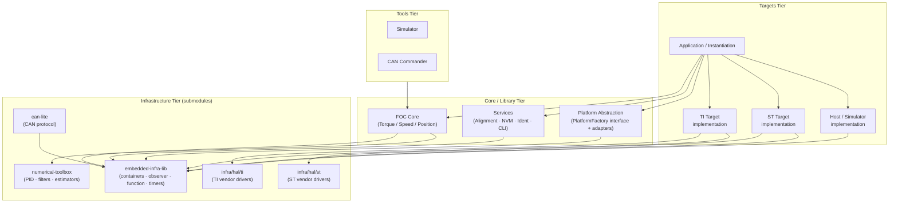
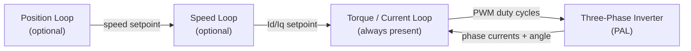
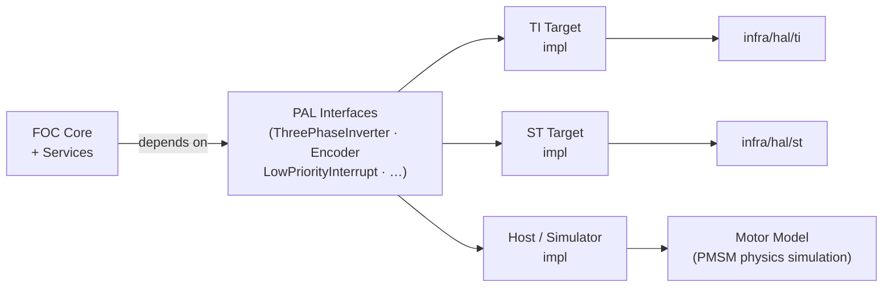
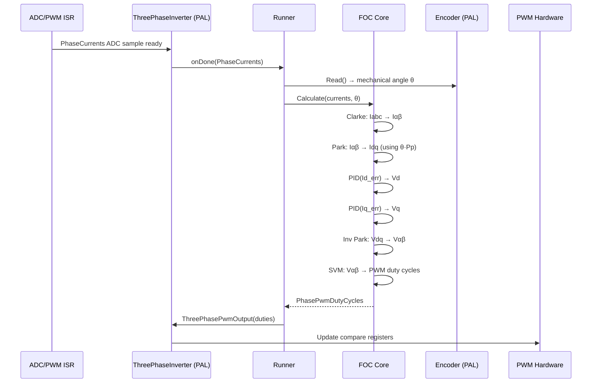
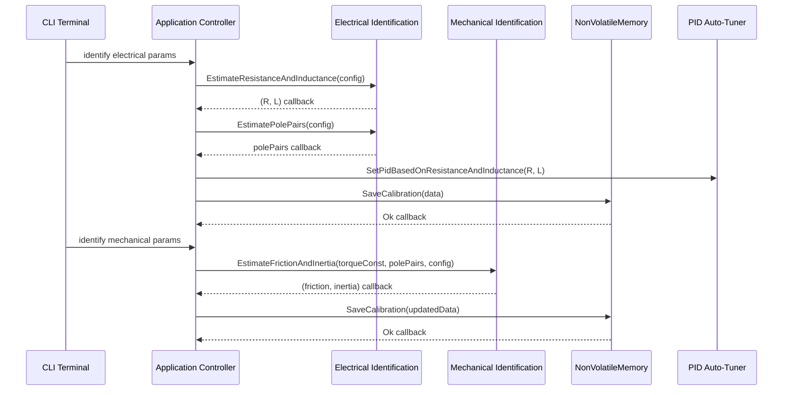
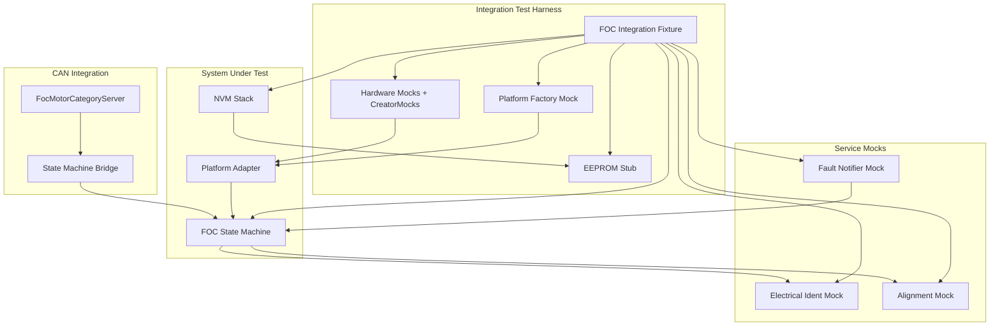

| Field     | Value                     |
|-----------|---------------------------|
| Title     | e-foc System Architecture |
| Type      | architecture              |
| Status    | draft                     |
| Version   | 0.1.0                     |
| Component | system                    |
| Date      | 2026-04-07                |

> **Note — Architecture-level document**: This document describes *what the system is and why it is structured this way*. Code must follow the architecture, not the opposite. Logical component and interface names are the vocabulary of architecture and belong here. What must be avoided: source file paths, implementation class names (e.g. `FooImpl`), and code-level algorithmic details.
>
> **Diagrams**: All visuals must be either a Mermaid fenced code block or ASCII art inline in the document.
> External image references (``) are **not allowed**.
>
> Sequence diagrams, block diagrams, component diagrams, and state machines (Mermaid syntax) are allowed and encouraged.

---

## Assumptions & Constraints

- **Constraint**: No dynamic memory allocation on the embedded target. All objects are stack- or statically-allocated for deterministic, bounded memory footprint.
- **Constraint**: The core FOC loop executes in an interrupt service routine at 20 kHz. The complete control cycle must finish in fewer than 400 cycles at 120 MHz to guarantee real-time deadlines.
- **Constraint**: No recursion in control-loop or ISR-reachable paths. Stack usage must be statically predictable.
- **Constraint**: No C++ exceptions. Error signalling uses status return values, `std::optional`, or asynchronous callbacks.
- **Constraint**: The system targets 32-bit ARM Cortex-M microcontrollers (STM32 and TI Tiva families). Host builds are supported for unit testing and simulation only.
- **Assumption**: A single motor is controlled per instantiation. Multi-motor configurations require multiple independent instantiations.
- **Assumption**: The motor is a BLDC or PMSM (surface or interior permanent magnet) with a sinusoidal back-EMF profile suitable for FOC.
- **Assumption**: Rotor position is measured by a quadrature encoder. Hall-sensor support is defined in the driver interface but is a secondary configuration.
- **Assumption**: All motor electrical and mechanical parameters (resistance, inductance, pole pairs, inertia, friction) can be identified at startup or loaded from non-volatile storage.
- **Constraint**: The build system must be capable of producing three independent binaries — torque-only, speed-only, and position-only — as well as combinations. No unused control-mode code should be included in a given binary.

---

## System Overview

e-foc is a Field-Oriented Control (FOC) firmware for BLDC and PMSM motors. Its purpose is to transform three-phase stator currents into a rotating reference frame so that torque and flux can be regulated independently with standard linear PIDs, then synthesise the three-phase PWM voltages via Space Vector Modulation.

The system is structured in four tiers:

1. **Infrastructure tier** — external repositories providing general-purpose utilities, numerical algorithms, and vendor HAL drivers. These are consumed as submodules and are never modified by this project.
2. **Core / Library tier** — the FOC algorithm library (`core/foc/`), service library (`core/services/`), and the Platform Abstraction Layer interface (`core/platform_abstraction/`). These are pure, portable libraries with no target-specific knowledge.
3. **Targets tier** — target-specific code that is NOT reusable across all environments: platform implementations (concrete `PlatformFactory` for TI, ST, and Host) and application entry points (`hardware_test`, `sync_foc_sensored`). Lives under `targets/`.
4. **Tools tier** — host-only desktop tools (simulator, CAN commander) that run on development machines only. Lives under `tools/`.

The simulator implements the same PAL contracts as real hardware. Control logic never needs to distinguish between running on a microcontroller or on the host; this enables full-fidelity closed-loop validation without hardware.

---

## Component Decomposition

### 1. FOC Core

The heart of the system. Decomposed into three sub-layers following a strict separation of contract, algorithm, and wiring:

| Sub-component   | Responsibility                                                                                                                                       |
|-----------------|------------------------------------------------------------------------------------------------------------------------------------------------------|
| Interfaces      | Define abstract contracts for control modes (Torque, Speed, Position) and driver peripherals (inverter, encoder, interrupt). No algorithms, no data. |
| Implementations | Concrete algorithm implementations for Clarke/Park transforms, Space Vector Modulation, trigonometric helpers, PID wrappers, and control loops.      |
| Instantiations  | Wiring that combines a control-mode implementation with the execution runner to produce a ready-to-use FOC controller.                               |

The three control modes are deliberately independent and composable. A given product binary includes only the mode(s) it needs:

- **Torque control** — innermost loop: regulates phase currents to produce a commanded torque (specified as Id/Iq current setpoints).
- **Speed control** — outer loop on top of torque control: a PID regulates rotor angular velocity by commanding Id/Iq setpoints to the inner loop. The outer loop runs at a lower priority interrupt (typically 1 kHz) while the inner loop still runs at 20 kHz.
- **Position control** — outermost cascade: a PID regulates rotor position by commanding a speed setpoint to the speed loop. Builds on speed control.

The `Runner` is the only component that interacts with the PAL inverter and encoder at interrupt time. It registers the ADC-sampling callback and drives the `Calculate()` dispatch into the active control-mode implementation.

### 2. Services

Higher-level, non-real-time services that support commissioning and runtime operation. Each service is independently usable:

| Service                          | Responsibility                                                                                                                       |
|----------------------------------|--------------------------------------------------------------------------------------------------------------------------------------|
| Alignment                        | Forces a known electrical angle on the rotor at startup so the FOC reference frame is correctly initialised before normal operation. |
| Electrical System Identification | Estimates phase resistance, d/q inductances, and pole pairs by injecting test signals and measuring the response.                    |
| Mechanical System Identification | Estimates rotor inertia and viscous friction coefficient from closed-loop speed response data.                                       |
| Non-Volatile Memory (NVM)        | Persists calibration data (R, L, pole pairs, encoder offset, PID gains) and configuration across power cycles using MCU internal EEPROM.           |
| CLI                              | A terminal-based command interface for triggering services, querying state, and setting parameters from a serial console.            |

Services communicate via asynchronous callbacks (zero-allocation closures from `embedded-infra-lib`), not return values. This allows long-running operations (identification, alignment) to yield the CPU and complete asynchronously without blocking.

### 3. Platform Abstraction Layer

The PAL provides a single platform-facing abstraction that groups creation and access to the hardware services needed by the control system:

| Peripheral                                  | Abstraction                                                     |
|---------------------------------------------|-----------------------------------------------------------------|
| Three-phase PWM + ADC triggered measurement | Power-stage drive and synchronised current-sampling interface   |
| Quadrature encoder                          | Rotor-position sensing and calibration interface                |
| Low-priority interrupt                      | Deferred scheduling interface for the speed/position outer loop |
| CAN bus                                     | CAN 2.0B communication interface                                |
| Performance timer                           | Cycle/timestamp measurement interface for profiling             |
| Serial terminal                             | Diagnostic trace and command-line interaction interface         |

Concrete implementations exist for:
- **TI Tiva (EK-TM4C1294XL, EK-TM4C123GXL)**: platform-specific peripheral adapters under `targets/platform_implementations/ti/`.
- **ST STM32 (STM32F407G-DISC1, NUCLEO-H563ZI)**: platform-specific peripheral adapters under `targets/platform_implementations/st/`.
- **Host / Simulator**: a software-backed platform implementation that emulates the motor-control I/O needed to run the closed-loop algorithm on a development machine, located under `targets/platform_implementations/host/`.

### 4. Application / Instantiation

The wiring layer. Assembles the concrete PAL implementation, the selected FOC mode(s), and the services into a runnable system. This is the only layer that is aware of the specific combination in use — all other layers depend only on abstractions.

The `FocStateMachine` is the central lifecycle authority. It owns the full motor commissioning and operation lifecycle: it enforces a formal five-state machine (`Idle → Calibrating → Ready ⇄ Enabled, Fault`), orchestrates the sequential calibration chain (electrical identification, alignment, and mechanical identification for speed/position modes), and responds to hardware fault notifications by immediately stopping the inverter and entering the `Fault` state. Only after `FocStateMachine` has reached `Ready` can the motor be enabled.

In CLI mode, `FocStateMachine` registers the lifecycle commands `calibrate`, `enable`, `disable`, `clear_fault`, and `clear_cal` directly on the terminal. The `TerminalFocBaseInteractor` (and its control-mode subclasses) register PID tuning and setpoint commands on the same terminal, leaving lifecycle management exclusively to the state machine.

### 5. Tools

Host-only tools that do not run on the embedded target:

| Tool          | Responsibility                                                                                                                                                                                   |
|---------------|--------------------------------------------------------------------------------------------------------------------------------------------------------------------------------------------------|
| Simulator     | Closed-loop software simulation: real FOC control code drives a physics-based PMSM model (Euler integration of the dq electrical equations). Used for validating control loops without hardware. |
| CAN Commander | Desktop application for sending CAN commands and logging motor telemetry.                                                                                                                        |

### 6. Infrastructure

External repositories consumed as Git submodules. This project does not modify them.

| Submodule                         | Purpose                                                                                                                                                                                                                                                               |
|-----------------------------------|-----------------------------------------------------------------------------------------------------------------------------------------------------------------------------------------------------------------------------------------------------------------------|
| `infra/embedded-infra-lib` (emIL) | Heap-free C++ infrastructure: bounded containers (`BoundedVector`, `BoundedString`, `BoundedDeque`), `infra::Function<>` (zero-allocation closures), `infra::Observer`/`Subject` (type-safe observer pattern), timers, memory utilities, and build toolchain helpers. |
| `infra/numerical-toolbox`         | Numerical algorithms for control: incremental PID controllers with anti-windup, digital filters (FIR, IIR, Kalman), recursive least-squares estimators, and compiler-optimisation helpers (`OPTIMIZE_FOR_SPEED`).                                                     |
| `infra/can-lite`                  | Lightweight CAN 2.0B protocol stack: client-server model, category-based message dispatch, ISO-TP segmentation. Zero heap allocation.                                                                                                                                 |

### 7. Vendor HAL

Vendor-provided hardware abstraction libraries consumed as Git submodules. They supply the low-level peripheral register access and interrupt management that the PAL concrete implementations use.

| Directory | Vendor / Board                      |
|-----------|-------------------------------------|
| `infra/hal/ti`  | Texas Instruments Tiva (Cortex-M4F) |
| `infra/hal/st`  | STMicroelectronics STM32            |

These are never used directly by the FOC core or services — only by the PAL concrete implementations.

---

## Interfaces & Contracts

### Provided Interfaces (exported by this system)

| Interface      | Direction | Purpose                                                                                             | Invariants                                                                                                                                |
|----------------|-----------|-----------------------------------------------------------------------------------------------------|-------------------------------------------------------------------------------------------------------------------------------------------|
| `FocTorque`    | provided  | Torque control mode — accepts Id/Iq current setpoints, yields PWM duty cycles each FOC cycle        | Must be called from the PWM/ADC interrupt context only. `Calculate()` must return within the worst-case cycle budget.                     |
| `FocSpeed`     | provided  | Speed control mode — accepts an angular-velocity setpoint in rad/s, cascades into the torque loop   | Outer loop runs at a separate lower-priority interrupt. `OuterLoopFrequency()` must be queried by the caller to configure that interrupt. |
| `FocPosition`  | provided  | Position control mode — accepts a rotor angle setpoint in radians, cascades into speed, then torque | Requires speed loop to be configured and running.                                                                                         |
| `Controllable` | provided  | Start/Stop lifecycle for a `FocController`                                                          | `Start()` arms the interrupt-driven loop. `Stop()` disarms it and leaves the motor coasting.                                              |

### Required Interfaces (consumed from the PAL)

| Interface              | Direction | Purpose                                                                                                    | Invariants                                                                                                          |
|------------------------|-----------|------------------------------------------------------------------------------------------------------------|---------------------------------------------------------------------------------------------------------------------|
| `ThreePhaseInverter`   | required  | Triggers ADC phase-current sampling and applies PWM duty cycles to the three-phase bridge                  | `PhaseCurrentsReady()` installs the callback invoked by the ADC interrupt. Must be called before `Start()`.         |
| `Encoder`              | required  | Reads rotor mechanical angle and supports zero-offset calibration                                          | Read must be non-blocking and complete in ≤ a few cycles.                                                           |
| `LowPriorityInterrupt` | required  | Schedules periodic execution of the speed and position outer loops at a lower rate than the FOC inner loop | `Register()` installs the callback. `Trigger()` is called from the FOC inner loop at the configured prescale ratio. |
| `NonVolatileMemory`    | required  | Persists and retrieves calibration and configuration data                                                  | All operations are asynchronous and invoke a callback on completion.                                                |

### SOLID Principles Applied

The interface design reflects explicit SOLID choices:

- **Single Responsibility**: Each interface (`FocTorque`, `FocSpeed`, `FocPosition`, `ThreePhaseInverter`, `Encoder`, `NonVolatileMemory`, …) is narrowly scoped to one concern. No interface carries unrelated responsibilities.
- **Open/Closed**: New control modes are added by implementing a new derived control interface, not by modifying existing implementations. The PAL is similarly extended by creating a new platform factory implementation for a new board without touching the core.
- **Liskov Substitution**: Every FOC controller instantiation (torque, speed, position) is fully substitutable wherever the base control interface is expected. The simulator's motor model is fully substitutable for the real PAL hardware.
- **Interface Segregation**: `FocBase` carries only the minimal common contract. Callers that need only torque control depend on `FocTorque`, not on `FocSpeed` or `FocPosition`. The PAL is similarly split — callers that only need an encoder do not depend on the PWM interface.
- **Dependency Inversion**: The FOC core and all services depend exclusively on abstract interfaces. Concrete implementations are injected at application wiring time via the platform factory and constructor arguments. No global variables; no direct peripheral access from the control layer.

---

## Data Flow

The primary data flow during closed-loop motor control is the 20 kHz FOC interrupt cycle:

The commissioning data flow (run once at startup or on command):

### Observer and Callback Patterns

The system uses two complementary asynchronous communication patterns, both supplied by `infra/embedded-infra-lib`:

- **Zero-allocation closures** (from `embedded-infra-lib`) — used for one-shot or single-subscriber callbacks. All service operations (NVM, identification, alignment) deliver their results through this mechanism.
- **Observer/Subject pattern** (from `embedded-infra-lib`) — a type-safe, heap-free mechanism where a subject notifies multiple observers. The simulator's motor model is a subject; views and loggers attach as observers. No raw event buses or dynamic dispatch lists are used.

These patterns eliminate polling, decouple producers from consumers, and allow the application to remain single-threaded and non-blocking.

---

## Cross-Cutting Concerns

| Concern               | Policy / Approach                                                                                                                                                                                                                     |
|-----------------------|---------------------------------------------------------------------------------------------------------------------------------------------------------------------------------------------------------------------------------------|
| Memory                | Absolutely no heap on the embedded target. All objects are statically or stack-allocated. Bounded containers from `embedded-infra-lib` replace STL heap-based containers. Host-side tools and tests may use the standard heap freely. |
| Real-time determinism | The FOC `Calculate()` path contains no virtual dispatch, no blocking calls, and no unpredictable branches. The outer loops run at lower-priority interrupts on a deterministic prescale ratio.                                        |
| Unit safety           | All physical quantities use typed unit aliases (`Ampere`, `Radians`, `Volts`, `RadiansPerSecond`, …) from `embedded-infra-lib`. Raw floating-point with no unit context is not used for motor quantities.                             |
| Compiler optimisation | Critical paths use per-file optimisation pragmas (GCC/Clang `O3` + `fast-math`). Debug builds use `-Og` for debuggability.                                                                                                            |
| Error handling        | No C++ exceptions. Synchronous errors use `std::optional` (absent = error). Asynchronous errors are delivered as typed status codes in callbacks.                                                                                     |
| Portability           | The control core has no knowledge of the underlying MCU. Portability to a new board is achieved by implementing a platform factory for that board and providing the PAL concrete implementations.                                     |
| Testability           | All modules depend on abstract interfaces, enabling host-build unit tests with mock or stub implementations. The simulator provides closed-loop integration testing without hardware.                                                 |

---

## Open Questions & Decisions

| # | Question / Decision                                    | Status   | Options Considered                                                                                        | Rationale                                                                                                                                                                                                                                               |
|---|--------------------------------------------------------|----------|-----------------------------------------------------------------------------------------------------------|---------------------------------------------------------------------------------------------------------------------------------------------------------------------------------------------------------------------------------------------------------|
| 1 | Rename `source/hardware/` and extract platform targets | resolved | Keep current name vs rename to PAL vs full extraction | Renamed to `core/platform_abstraction/` (interface + adapters only). Platform implementations (TI, ST, Host) and application targets moved to top-level `targets/`. Host-only tools moved to top-level `tools/`. Core tier is now purely libraries. `source/` directory renamed to `core/`. |
| 2 | Multi-motor support                                    | open     | Single instantiation per motor vs shared PAL with multiple FOC controllers                                | Current architecture supports one motor per binary. A shared PAL with multiple `FocController` instances is architecturally feasible but not yet required.                                                                                              |
| 3 | Field-weakening                                        | open     | Extend `FocTorque` interface with flux-weakening setpoint vs separate `FocTorqueFieldWeakening` interface | Required for operation above base speed. Separate interface preferred (ISP) but not yet scoped.                                                                                                                                                         |

---

## Integration Testing

The integration test suite verifies the cooperative behaviour of three core subsystems:

1. **FOC State Machine** — the lifecycle controller (`Idle` → `Calibrating` → `Ready` ⇄ `Enabled`, `Fault`) that orchestrates calibration services and the FOC control loop.
2. **Non-Volatile Memory stack** — the chain from the NVM region abstraction through the EEPROM interface to the concrete NVM service. Integration tests use a real in-memory EEPROM stub rather than a mocked NVM service.
3. **CAN-to-State-Machine bridge** — the observer that translates CAN FOC motor commands into state machine transition commands.

Platform hardware (ADC, PWM, encoder) is mocked at the application-decorator level using hardware-interface mocks injected through creator proxies. The Platform Factory interface is fulfilled by a test double whose creator methods hand out these proxies, allowing the real Platform Adapter to be exercised unchanged. EEPROM storage is provided by an in-memory stub that satisfies the EEPROM interface and persists data across the lifetime of a single test scenario.

Integration tests run exclusively on the host build. The host event dispatcher simulates the asynchronous callback chains used by NVM and calibration services. All mock instances use strict mock policies; lenient mocking is forbidden.

### Integration Boundaries

| Boundary                                 | Real Component                                             | Test Double                                                                  |
|------------------------------------------|------------------------------------------------------------|------------------------------------------------------------------------------|
| Platform peripherals (ADC, PWM, encoder) | Platform Adapter (real) backed by hardware-interface mocks | Test fixture owns creator proxies; Platform Factory test double returns them |
| EEPROM storage                           | In-memory 512-byte array                                   | Replaces embedded EEPROM driver                                              |
| Calibration services                     | Electrical identification mock, alignment mock             | `StrictMock<>` wrapping service interfaces                                   |
| Fault notification                       | Fault notifier mock                                        | `StrictMock<>` wrapping fault notifier                                       |
| CAN transport                            | Category server `HandleMessage` invoked directly           | Bypasses CAN wire encoding                                                   |
| Terminal / tracer                        | Stream writer stub                                         | No-op for terminal output                                                    |

### Requirements Traceability

| Requirement ID | Verified by Feature                                                                                               |
|----------------|-------------------------------------------------------------------------------------------------------------------|
| REQ-SM-001     | `state_machine_lifecycle.feature` — Motor starts in Idle                                                          |
| REQ-SM-002     | `state_machine_lifecycle.feature` — Calibration transitions to Calibrating                                        |
| REQ-SM-003     | `calibration_flow.feature` — step ordering scenarios                                                              |
| REQ-SM-004     | `calibration_flow.feature` — full calibration reaches Ready                                                       |
| REQ-SM-005     | `calibration_flow.feature` — pole pairs failure                                                                   |
| REQ-SM-006     | `state_machine_lifecycle.feature` — Motor enabled from Ready                                                      |
| REQ-SM-007     | `state_machine_lifecycle.feature` — Motor disabled to Ready                                                       |
| REQ-SM-008     | `state_machine_lifecycle.feature` — Fault on hardware fault                                                       |
| REQ-SM-009     | `state_machine_lifecycle.feature` — Fault cleared to Idle                                                         |
| REQ-SM-010     | `state_machine_lifecycle.feature` — Valid NVM boots to Ready                                                      |
| REQ-SM-011     | `calibration_flow.feature` — calibration data saved to NVM                                                        |
| REQ-INT-001    | `can_foc_motor.feature` — CAN Start enables motor                                                                 |
| REQ-INT-002    | `can_foc_motor.feature` — CAN Stop disables motor                                                                 |
| REQ-INT-003    | `can_foc_motor.feature` — CAN ClearFault clears fault                                                             |
| REQ-INT-004    | Not scenario-based — routing through the category server is a structural constraint verified by the bridge design |
