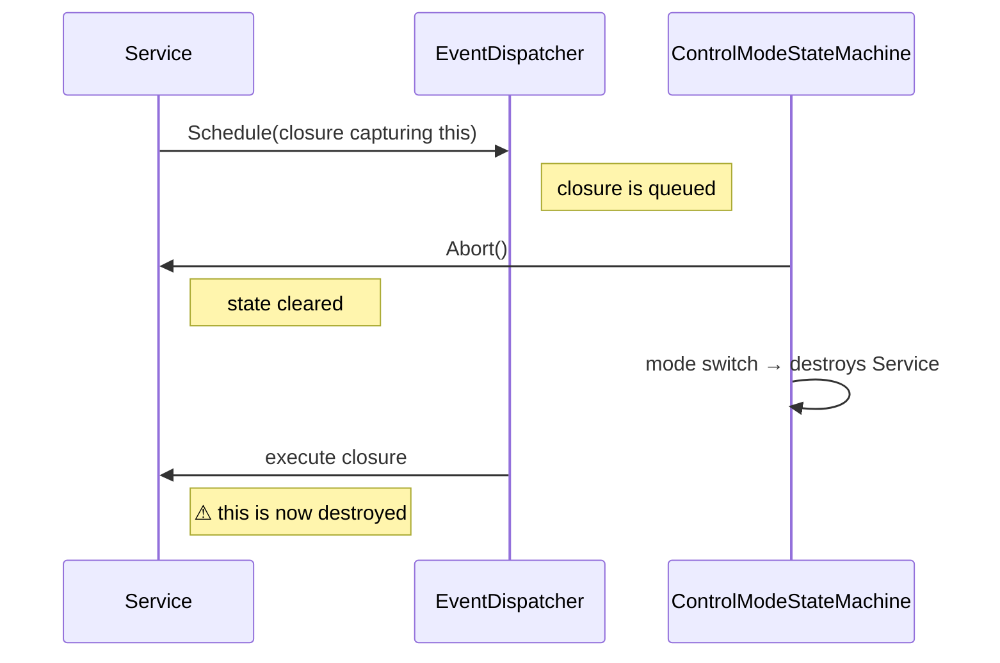
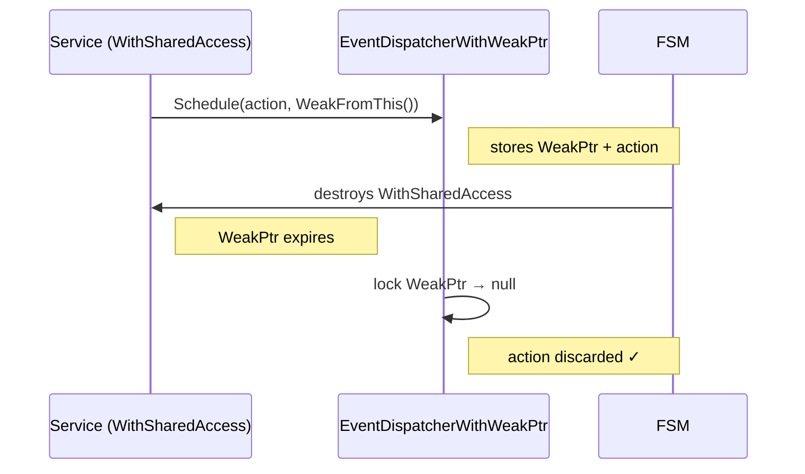
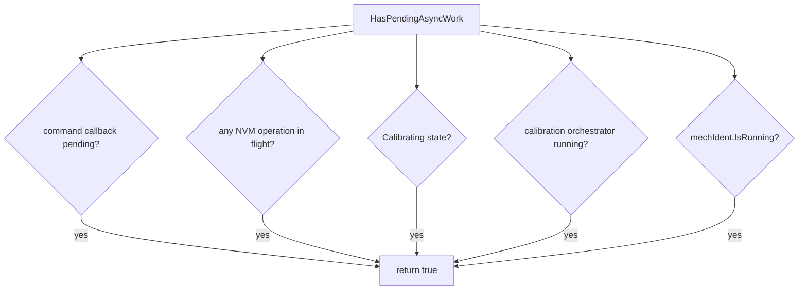
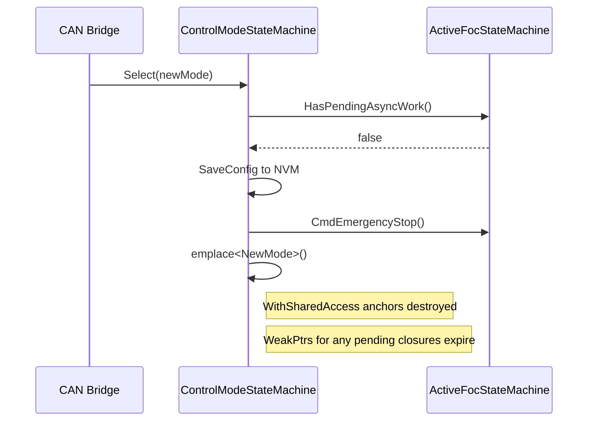
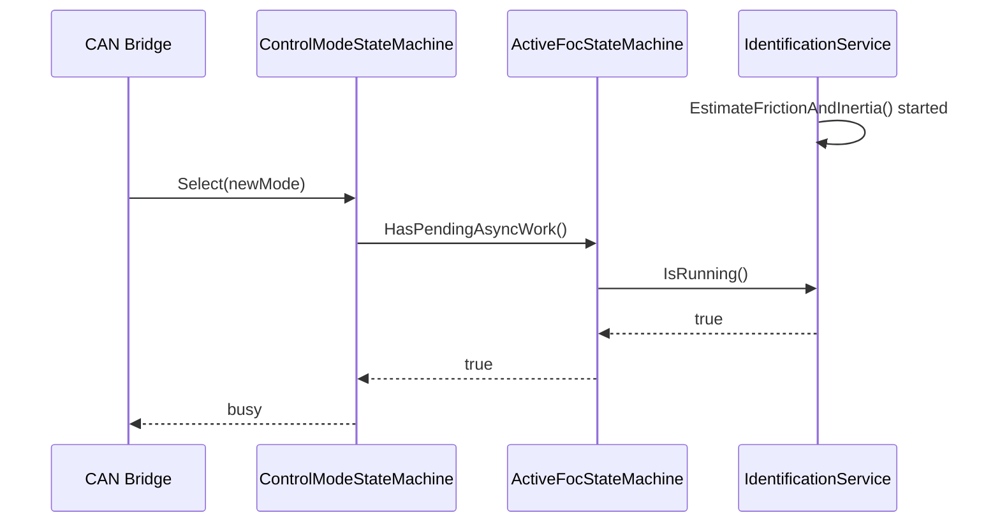
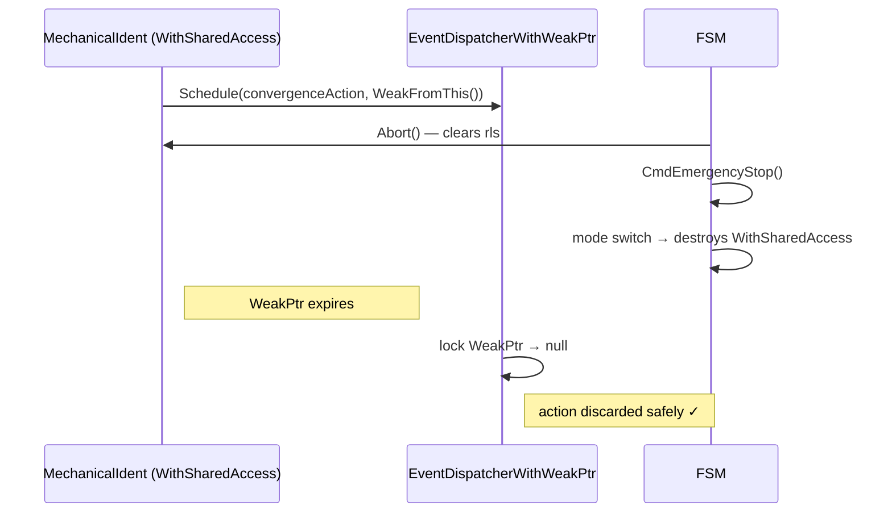

| Field     | Value                          |
|-----------|--------------------------------|
| Title     | Async Callback Lifetime Safety |
| Type      | design                         |
| Status    | accepted                       |
| Version   | 1.0.0                          |
| Component | async-safety                   |
| Date      | 2026-09-14                     |

---

## Responsibilities

**Is responsible for:**
- Defining the project-wide pattern for scheduling event-dispatcher closures on objects whose lifetime may end before the closure fires
- Specifying when and how `HasPendingAsyncWork()` must be extended to reflect all active async operations
- Documenting the invariant that the `AccessedBySharedPtr` control block relies on, and how the codebase maintains it

**Is NOT responsible for:**
- Real-time ISR paths — this pattern applies only to work dispatched through the main event loop
- General shared-ownership semantics unrelated to async scheduling
- Heap-allocated object management (this pattern is exclusively for stack- and statically-allocated objects)

---

## Background: The Use-After-Free Risk

Services and notifiers in e-foc schedule deferred work on the global event dispatcher. A typical flow:

Reading any member through `this` after the object is destroyed is undefined behaviour. The same risk applies when the FSM variant is replaced while a closure referencing a sub-object is still in the queue.

---

## Solution: Two Layers

The codebase defends against this with two complementary mechanisms that operate at different scopes.

### Layer 1 — Dispatch Safety: WeakPtr-Bound Closures

Every service that schedules event-dispatcher closures inherits `EnableSharedFromThis<T>` and is constructed inside a `WithSharedAccess<T>` wrapper. `WithSharedAccess<T>` bundles the object with its `AccessedBySharedPtr` control block. Any `WeakPtr<T>` derived via `WeakFromThis()` expires exactly when the wrapper is destroyed.

Closures are scheduled using the WeakPtr overload of `EventDispatcherWithWeakPtr`. When the dispatcher dequeues a closure, it attempts to lock the WeakPtr. If the object was already destroyed, the attempt returns null and the closure is silently discarded — no member is read, no undefined behaviour occurs.

**Invariant enforced by `AccessedBySharedPtr`:** The control block asserts that no WeakPtrs remain outstanding at the moment the wrapper is destroyed. In production, this invariant is maintained because the event dispatcher processes closures in FIFO order: a closure scheduled before the mode-switch NVM callback fires before the mode-switch takes effect, releasing the WeakPtr in time. In tests, fixtures must drain the dispatcher (via `ExecuteAllActions()`) in `TearDown()` before any `WithSharedAccess`-wrapped member is destroyed.

### Layer 2 — Business-Logic Guard: `HasPendingAsyncWork()`

The WeakPtr mechanism ensures memory safety regardless of timing. The second layer ensures correct application behaviour: no mode switch should proceed while an identification service is actively driving hardware.

`HasPendingAsyncWork()` aggregates the running state of all async services:

`ControlModeStateMachine::Select()` checks `HasPendingAsyncWork()` before initiating a mode switch. If it returns `true`, the select returns `busy` and the caller retries. If it returns `false`, the mode switch proceeds.

The lifecycle transition table uses the same predicate as the guard of every command that starts asynchronous work (`Calibrate`, `ReAlign`, `ReserveExternalCalibration`, `ClearCalibration`, `SetFluxLinkage`) and of `Enable`, so a request never overlaps outstanding work of an earlier one (see the transition table section of `state-machine.md`).

Each identification service exposes `IsRunning()` on its interface. This method reports whether the service is actively running an identification sweep — not merely whether a dispatcher slot is pending. The `HasPendingAsyncWork()` check at mode-switch time and the WeakPtr discard at dispatch time together cover all failure scenarios.

---

## Component Details

### `WithSharedAccess<T>` Wrapper

`WithSharedAccess<T>` is a non-copyable value type that contains:
- The `AccessedBySharedPtr` control block (anchor)
- The `T` object itself
- A `SharedPtr<T>` that keeps the anchor alive for the wrapper's lifetime

Member declaration order is load-bearing: `sharedPtr` is destroyed first (drops the shared count), then `T` (which destroys `EnableSharedFromThis::weakPtr`, making the control block unreferenced), then `accessedBy` (which asserts the control block is unreferenced at destruction time). Reversing this order would trigger the assertion.

`T` must inherit `EnableSharedFromThis<T>`. `WithSharedAccess<T>` construction arguments are forwarded to `T`'s constructor.

### `HasPendingAsyncWork()` Contract

Every class in the `FocStateMachine` hierarchy that adds async operations must also extend the return value of `HasPendingAsyncWork()` to cover those operations.

The base implementation (`FocStateMachineCommon`) covers:
- The pending command callback (`PendingCommand::Pending()`)
- Every NVM operation from the call until its callback, the boot-time check and load included (`NvmActivity::InFlight()`)
- Active calibration state (`Calibrating` variant)
- The calibration orchestrator, which reports `electricalIdent.IsRunning()`

`OuterLoopStateMachine` overrides to additionally cover:
- Direct CAN mechanical identification (`mechIdent.IsRunning()`)

Any future service that exposes identification or async operations reachable outside the `Calibrating` state must add a corresponding `IsRunning()` check here.

### `IsRunning()` Interface

Each identification service interface exposes `IsRunning() const` returning `true` while an estimation is in progress and `false` otherwise. The implementation tracks whether the internal estimation state is populated. Calling `Abort()` resets the state and causes `IsRunning()` to return `false` immediately.

---

## Sequence Diagrams

### Normal Mode Switch (No Pending Work)

### Mode Switch Blocked (Identification Running)

### Emergency Stop During Pending Dispatch

---

## Interfaces

### Provided

| Interface | Purpose | Contract |
|-----------|---------|----------|
| `infra::WithSharedAccess<T>` | Wraps a stack-allocated `T` so that `WeakPtr<T>` obtained via `WeakFromThis()` expires when the wrapper is destroyed | `T` must inherit `infra::EnableSharedFromThis<T>`; all `WeakPtr` instances derived from the object must be released before the wrapper is destroyed |
| `IsRunning() const` | Exposed by each identification service; reports whether an estimation sweep is currently active | Returns `true` from the first call to the start method until either the estimation completes, the done callback fires, or `Abort()` is called |

### Required

| Interface | Purpose | Contract |
|-----------|---------|----------|
| `infra::EventDispatcherWithWeakPtr` | Defers a closure and discards it if the associated `WeakPtr` has expired by execution time | Must be the globally active dispatcher; the WeakPtr overload of `Schedule()` must be used — the plain `void()` overload does not check the pointer |
| `infra::EnableSharedFromThis<T>` | Provides `WeakFromThis()` on the service class | The service must be constructed via `infra::WithSharedAccess<T>`; calling `WeakFromThis()` on a bare instance returns a null pointer and closures are always discarded |
| `HasPendingAsyncWork()` | Checked by `ControlModeStateMachine::Select()` before switching modes | Must return `true` while any identification service is running or any async command is outstanding; the FSM subclass that owns the service is responsible for including `service.IsRunning()` in its override |

---

## Constraints & Limitations

| Constraint | Description |
|------------|-------------|
| `AccessedBySharedPtr` invariant | All `WeakPtr` instances must be released before the `WithSharedAccess` wrapper is destroyed. In tests, this requires `ExecuteAllActions()` in `TearDown()` for every fixture that holds a `WithSharedAccess`-wrapped member. |
| FIFO ordering required | The safety argument for production code depends on the event dispatcher processing closures in FIFO order. Any scheduler change that breaks FIFO ordering must be audited against this pattern. |
| `T` must inherit `EnableSharedFromThis<T>` | `WithSharedAccess<T>` provides no safety benefit if `T` does not inherit `EnableSharedFromThis<T>`, because `WeakFromThis()` would return a null pointer and all closures would be discarded regardless of object lifetime. |
| Static objects exempt | Objects with application-static lifetime (e.g., the top-level `Logic` composite) do not require this pattern because they can never be destroyed while closures are pending. |
