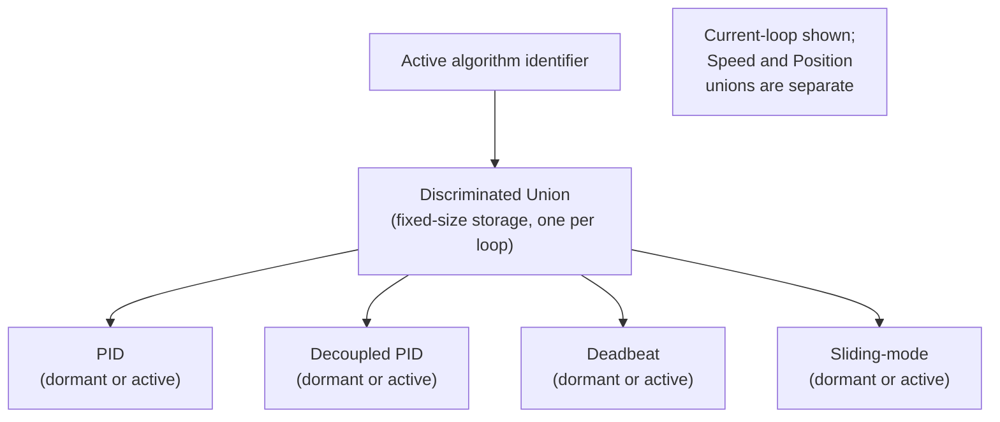
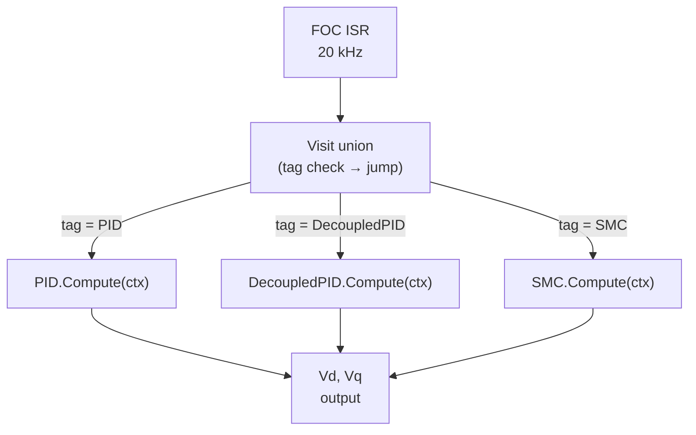
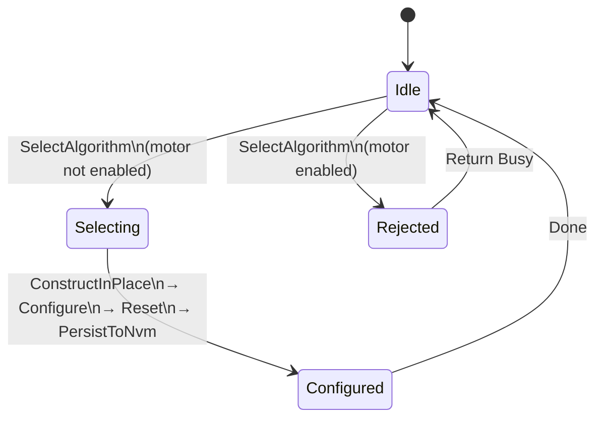
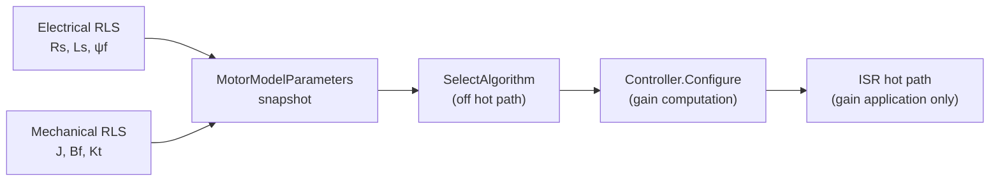
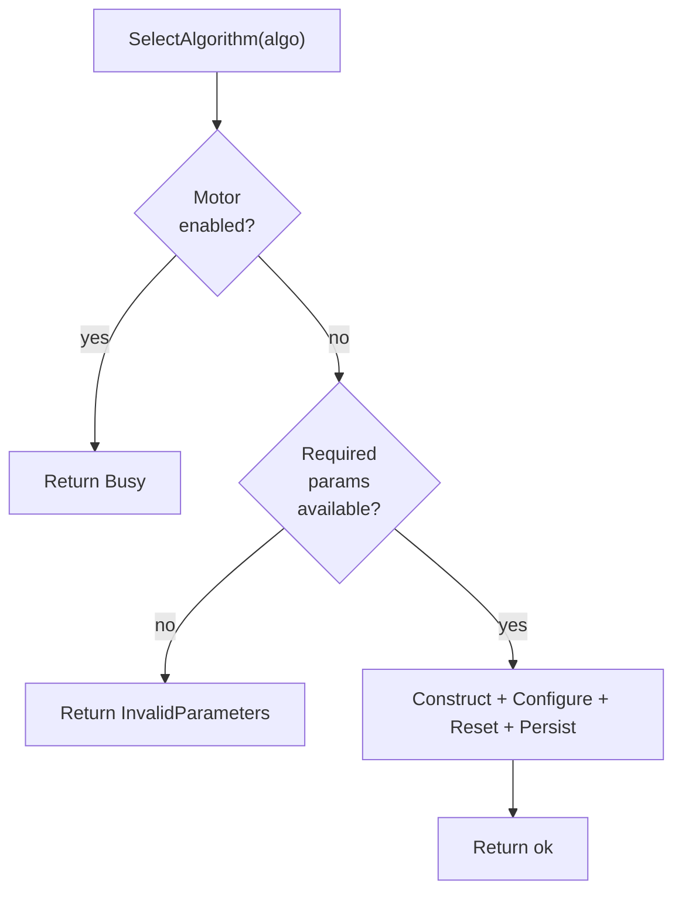
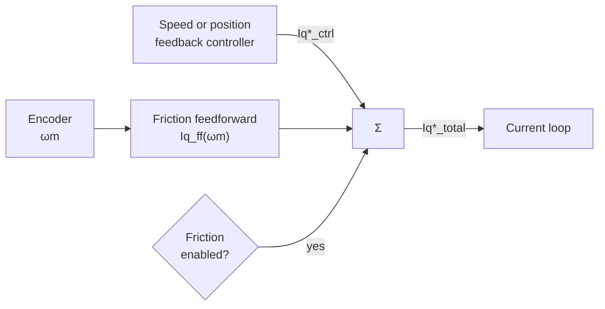
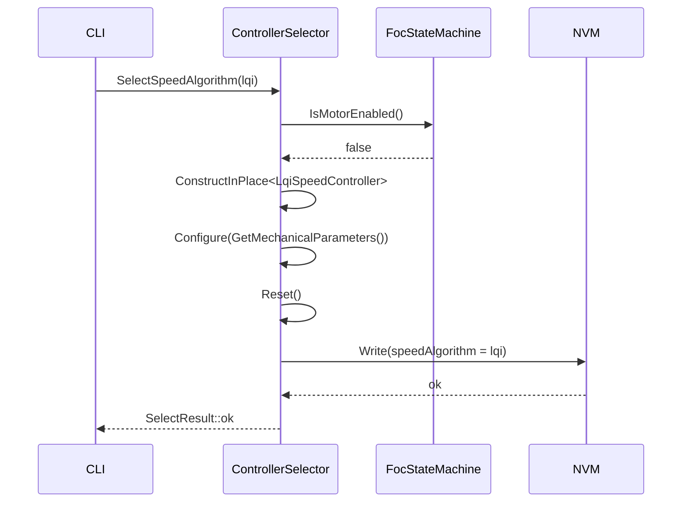
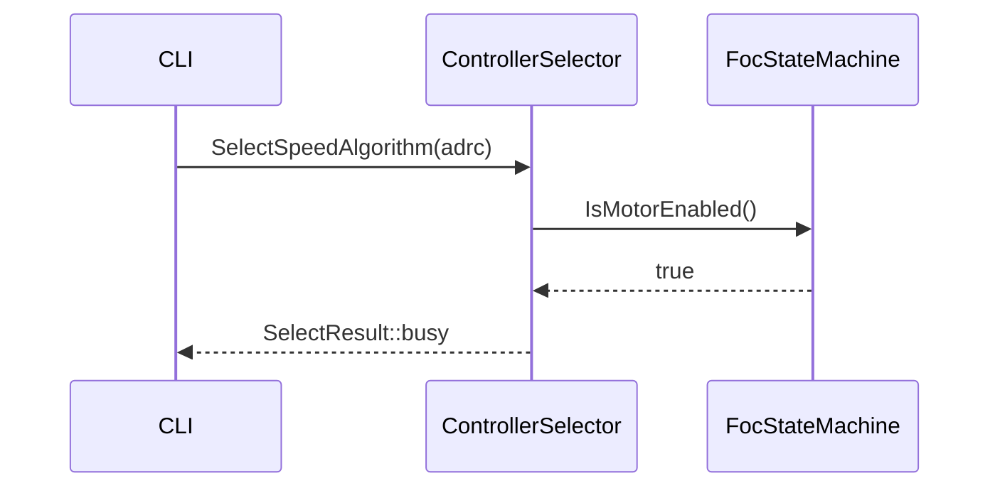
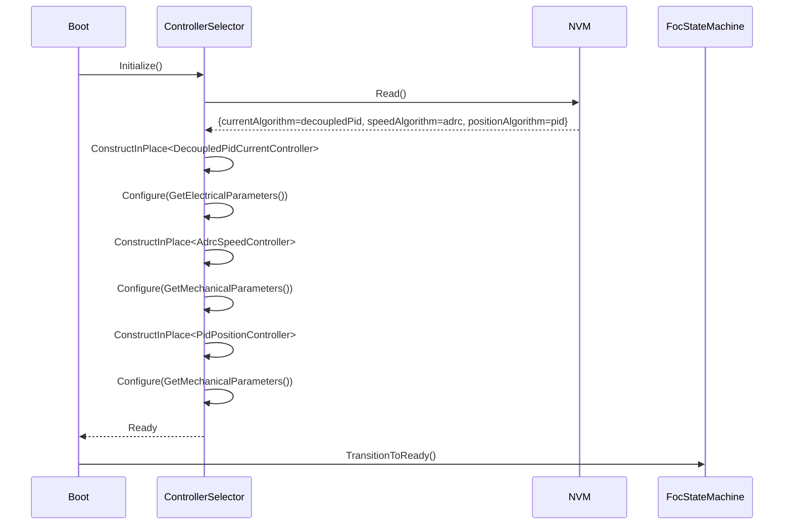
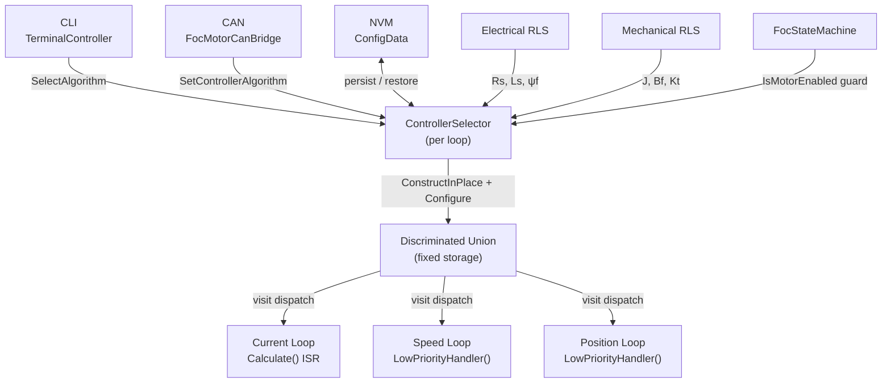

| Field     | Value                        |
|-----------|------------------------------|
| Title     | Runtime Controller Selection |
| Type      | design                       |
| Status    | draft                        |
| Version   | 0.2.0                        |
| Component | controller-selection         |
| Date      | 2026-08-14                   |

> **IMPORTANT — Implementation-blind document**: This document describes *behavior, structure, and
> responsibilities* WITHOUT referencing code. **No code blocks using programming languages (C++, C,
> Python, CMake, shell, etc.) are allowed.** Use Mermaid diagrams to express behavior instead.
> Prose descriptions of algorithms are encouraged; source-level details are not.
>
> **Diagrams**: All visuals must be either a Mermaid fenced code block (` ```mermaid `) or ASCII art inline
> in the document. External image references using Markdown image syntax are **not allowed**.

---

## Responsibilities

**Is responsible for:**
- Maintaining a collection of concrete controller instances for each of the three FOC loops
  (current, speed, position), all stored in fixed-size, statically-allocated storage without heap use
- Activating one controller per loop at runtime by constructing it in place from the available set
- Routing each loop's per-sample computation to the active controller with zero virtual-dispatch
  overhead through type-aware dispatch (variant visit)
- Enforcing that algorithm selection is only permitted while the motor is in a non-enabled state
- Propagating motor model parameters from the online RLS estimators to the newly selected controller
  immediately after selection
- Persisting the active algorithm identifier for each loop to non-volatile memory upon each selection
- Restoring the persisted algorithm identifiers at boot and re-configuring the controllers from NVM
  before the first Enable command
- Exposing algorithm selection to the CLI terminal and the CAN bus interface

**Is NOT responsible for:**
- Implementing the control algorithms themselves — each concrete controller is self-contained
- Executing FOC transforms (Clarke, Park, SVM) — these remain inline in the FOC loop
- Estimating motor model parameters — that is the responsibility of the RLS identification services
- Safety monitoring or fault detection — the FOC state machine owns these
- Tuning algorithm-specific parameters beyond what is derivable from motor model parameters

---

## Component Details

### Part A — Algorithm Enumeration

Each of the three FOC loops has an independent enumeration of available algorithm choices.

Each loop has its own independent algorithm enumeration. An algorithm is only valid for the loop it
is listed under; there is no sharing of algorithm identifiers across loops.

**Current loop** — executes at 20 kHz in the FOC ISR:

| Algorithm     | Description                                             |
|---------------|---------------------------------------------------------|
| PID           | Incremental PI baseline                                 |
| Decoupled PID | PI plus cross-coupling and back-EMF feedforward         |
| Deadbeat      | One-step or two-step predictive voltage inversion       |
| Sliding-mode  | Robust switching control with boundary-layer saturation |

**Speed loop** — executes at 1 kHz in the low-priority handler:

| Algorithm | Description                                                        |
|-----------|--------------------------------------------------------------------|
| PID       | Incremental PI baseline                                            |
| LQI       | DARE-computed state-feedback with integral augmentation            |
| ADRC      | Extended-state observer + active disturbance cancellation          |
| Two-DOF   | Reference pre-filter + PI; decoupled tracking and stiffness tuning |

**Position loop** — executes at 1 kHz in the low-priority handler:

| Algorithm | Description                                                       |
|-----------|-------------------------------------------------------------------|
| PID       | Incremental PD/PID baseline                                       |
| Cascade P | Industry-standard P position → speed loop; single Kv parameter    |
| LQR       | DARE-computed state-feedback (θ, ω)                               |
| LQI       | LQR with position integral augmentation                           |
| Two-DOF   | Reference pre-filter + feedback; decoupled tracking and stiffness |
| ILC       | Iterative learning control for repetitive servo tasks             |

**Friction compensation** is not an algorithm in any of the three enumerations. It is an independent
on/off augmentation that adds a nonlinear feedforward correction to the $i_q^*$ output of the speed
or position controller before it enters the current loop. It can be enabled alongside any speed or
position algorithm. See Part I.

The enumeration for each loop is fixed at build time. The default for all loops at first boot is PID.

---

### Part B — Heap-Free Variant Storage

All concrete controller instances for a given loop are held simultaneously in a single fixed-size
discriminated union (a type-safe union that tracks which alternative is currently active). Only the
active alternative is live at any time; inactive alternatives exist as constructed but dormant objects.

Switching the active algorithm constructs the new controller in place inside the union, destroying the
previous one, with no dynamic memory allocation. The total storage required is the size of the largest
concrete controller in the set, determined at build time.

This pattern is identical to the one already used by `ControlModeStateMachine` for switching between
Torque, Speed, and Position control modes.



---

### Part C — Hot-Path Dispatch via Type-Aware Visit

The per-sample `Compute` call — which runs at 20 kHz in the current loop ISR — must not incur
indirect dispatch through a virtual base-class pointer, as this prevents the compiler from inlining
and optimising the critical arithmetic.

Dispatch is performed by visiting the discriminated union: the visitor examines the stored type tag
and jumps directly to the concrete implementation, allowing the compiler to devirtualize the call
and inline the arithmetic. The resulting machine code is equivalent to a switch table with a
direct function body inlined at each case, not a vtable indirection. There is no allocation and
no heap touch in this path.

The visit call is the only place where `Compute` is invoked in the ISR; all controller-specific
setup, gain computation, and model updates occur off the hot path in the configuration routine.



---

### Part D — State Gating

Algorithm selection is a configuration-time operation, not a run-time one. It is only permitted while
the motor state machine is in the **Ready** or **Idle** state (motor disabled). A selection request
arriving while the motor is **Enabled** is rejected immediately with a `Busy` result code without
altering the active algorithm or any controller state.

The guard is symmetric with the existing `ControlModeStateMachine::Select` guard, which also rejects
mode changes while the motor is enabled.



On a successful selection, the sequence is:
1. Construct the new controller in place in the union (destroying the previous one).
2. Update the active algorithm identifier.
3. Configure the new controller with the current motor model parameter snapshot from RLS.
4. Reset the new controller's internal integrators and observer state to zero.
5. Persist the algorithm identifier to NVM.

Step 4 (Reset) ensures the controller starts from a clean state regardless of what state the motor
or the previous controller was in.

---

### Part E — Motor Model Parameter Flow

When an algorithm is selected, it is immediately configured using the most recent snapshot of the
motor model parameters. The parameters are drawn from two sources:

- **Electrical parameters** (`Rs`, `Ls`, `ψf`, `Vdc`, pole pairs): from the electrical RLS
  identification service, as set by the calibration sequence.
- **Mechanical parameters** (`J`, `Bf`, `Kt`): from the mechanical RLS identification service,
  available after the speed/position calibration phase.

The configuration call is a one-time operation that computes all gains and pre-computed matrices
(e.g., DARE solution for LQR/LQI) before the controller becomes active. The ISR then executes
only the pre-computed gain application.

If the RLS estimators produce updated parameter estimates during operation (continuous identification
mode), the active controllers are not automatically reconfigured. Reconfiguration with updated
parameters requires a new `SelectAlgorithm` call (or an explicit `ReconfigureFromCurrentParameters`
command), which requires the motor to be disabled.



---

### Part F — CLI Interface

The CLI terminal service exposes algorithm selection through a `ctrl` command group, consistent with
the existing `TerminalTorque`, `TerminalSpeed`, and `TerminalPosition` command handlers.

| Command                     | Effect                                                       |
|-----------------------------|--------------------------------------------------------------|
| `ctrl current <algorithm>`  | Selects the current-loop algorithm. Returns `ok` or `busy`.  |
| `ctrl speed <algorithm>`    | Selects the speed-loop algorithm. Returns `ok` or `busy`.    |
| `ctrl position <algorithm>` | Selects the position-loop algorithm. Returns `ok` or `busy`. |
| `ctrl status`               | Prints the active algorithm for each loop.                   |

Valid `<algorithm>` tokens are the lower-case algorithm names (e.g., `pid`, `decoupled_pid`,
`sliding_mode`, `lqi`, `adrc`, `lqr`). Unknown tokens produce a usage error without altering state.

The CLI handler enforces the same motor-enabled guard described in Part D. The `busy` response is
returned without side effects if the motor is enabled.

---

### Part G — CAN Interface

Algorithm selection is exposed as a CAN frame in the existing `FocMotorCanBridge` message set.
Two frame types are added:

| Frame                       | Direction     | Payload                                                           |
|-----------------------------|---------------|-------------------------------------------------------------------|
| `SetControllerAlgorithm`    | Host → Device | Loop identifier (1 byte) + Algorithm identifier (1 byte)          |
| `GetControllerAlgorithm`    | Host → Device | Loop identifier (1 byte)                                          |
| `ControllerAlgorithmStatus` | Device → Host | Loop (1 byte) + Active algorithm (1 byte) + SelectResult (1 byte) |

The device responds to `SetControllerAlgorithm` with a `ControllerAlgorithmStatus` frame containing
the resulting `SelectResult`. The `Busy` result follows the same `CanAckStatus` mapping as the
existing `SetControlMode` command.

---

### Part H — Required Parameters Per Controller

Each controller algorithm has specific parameter dependencies. These dependencies determine what must
be available before that algorithm can be selected, and who is responsible for providing each value.

#### Parameter Sources

Parameters come from three distinct sources with different availability windows:

| Source                     | Parameters                                                      | Available after                 |
|----------------------------|-----------------------------------------------------------------|---------------------------------|
| Motor datasheet (static)   | Pole pairs $p$, flux linkage $\psi_f$, peak current $I_{q,max}$ | Before any run                  |
| Electrical RLS calibration | $R_s$, $L_s$, $V_{dc}$                                          | After electrical identification |
| Mechanical RLS calibration | $J$, $B_f$, $K_t = \tfrac{3}{2} p \psi_f$                       | After mechanical identification |

$\psi_f$ is the only datasheet value not directly observable by the RLS estimators. If unavailable from
the datasheet, it can be derived from the rated torque constant: $\psi_f = K_{t,rated} \cdot 2/(3p)$.

$V_{dc}$ is measured dynamically during operation; a nominal value must be known at configuration
time for gain normalisation.

#### Per-Algorithm Parameter Requirements

**Current loop:**

| Parameter                     |           PID            |      Decoupled PID       |         Deadbeat         |       Sliding-mode        |
|-------------------------------|:------------------------:|:------------------------:|:------------------------:|:-------------------------:|
| $R_s$, $L_s$ (electrical RLS) |         Required         |         Required         |     Required (tight)     |         Required          |
| $\psi_f$ (datasheet)          |       Not required       |  Required — back-EMF FF  |       Not required       |       Not required        |
| $V_{dc}$                      | Required — normalisation | Required — normalisation | Required — normalisation | Required — normalisation  |
| $I_{q,max}$                   |     For output clamp     |     For output clamp     |        For clamp         | For switching gain sizing |

Deadbeat requires the tightest RLS convergence. Decoupled PID is the only current-loop algorithm
that requires $\psi_f$ from the motor datasheet.

**Speed loop:**

| Parameter                   |     PID      |          LQI          |          ADRC          |   Two-DOF    |
|-----------------------------|:------------:|:---------------------:|:----------------------:|:------------:|
| $J$, $B_f$ (mechanical RLS) | Not required | Required — DARE plant | Required — $b_0=K_t/J$ | Not required |
| $K_t$ (derived)             | Not required |       Required        |        Required        | Not required |
| $I_{q,max}$                 |  For clamp   |  Required — R weight  |       For clamp        |  For clamp   |

ADRC is the most forgiving: $b_0$ tolerates ±50% error. Two-DOF and PID require no mechanical
RLS and are available as soon as electrical calibration completes.

**Position loop:**

| Parameter                   |     PID      |    Cascade P    |         LQR         |         LQI         |   Two-DOF    |       ILC       |
|-----------------------------|:------------:|:---------------:|:-------------------:|:-------------------:|:------------:|:---------------:|
| $J$, $B_f$ (mechanical RLS) | Not required |  Not required   |      Required       |      Required       | Not required |  Not required   |
| $K_t$ (derived)             | Not required |  Not required   |      Required       |      Required       | Not required |  Not required   |
| $I_{q,max}$                 |  For clamp   | Speed-loop dep. | Required — R weight | Required — R weight |  For clamp   | Speed-loop dep. |
| Trial length $N$ (samples)  |      —       |        —        |          —          |          —          |      —       |    Required     |

ILC requires the trial length $N$ to be specified at selection time. It does not require
mechanical RLS parameters — it learns the correction empirically — but it does require a stable
inner feedback controller (Cascade P, LQR, or Two-DOF) to be active first.

**Friction compensation augmentation:**

| Parameter                                 | Source                        | Notes                             |
|-------------------------------------------|-------------------------------|-----------------------------------|
| $T_c$ — Coulomb torque (N·m)              | Friction sweep identification | Not from RLS                      |
| $T_s$ — Static torque (N·m)               | Friction sweep identification | $T_s > T_c$ always                |
| $\omega_{st}$ — Stribeck velocity (rad/s) | Friction sweep identification | Typically 0.1–2 rad/s             |
| $K_t$                                     | Derived from $\psi_f$, $p$    | Used to convert $T_f$ to $i_{ff}$ |

#### Tuning Knobs (design choices, not estimated)

Each algorithm exposes a small set of tuning parameters that encode the operator's performance intent.
These are not estimated — they are set explicitly and stored alongside the algorithm identifier.

**Current loop:**

| Algorithm     | Tuning knobs                                   | Suggested starting point                                                 |
|---------------|------------------------------------------------|--------------------------------------------------------------------------|
| PID           | $K_p$, $K_i$, $K_d$                            | Pole-zero cancellation: $K_p = L_s \omega_{bw}$, $K_i = R_s \omega_{bw}$ |
| Decoupled PID | Current bandwidth $\omega_{bw}$                | $2\pi \cdot 1000$ rad/s — same as plain PID                              |
| Deadbeat      | One-step / two-step variant                    | Two-step for $L_s < 0.3$ mH; one-step otherwise                          |
| Sliding-mode  | Switching gain $K_{sw}$, boundary layer $\phi$ | $\phi = 0.2$ A; $K_{sw} = 2$–$3\times$ worst-case coupling               |

**Speed loop:**

| Algorithm | Tuning knobs                                                | Suggested starting point                                   |
|-----------|-------------------------------------------------------------|------------------------------------------------------------|
| PID       | $K_p$, $K_i$, $K_d$                                         | $K_p = 2 J \omega_c / K_t$, $K_i = K_p B_f / J$            |
| LQI       | $q_\omega$, $q_I$, $R$                                      | $q_\omega = 1$, $q_I = 0.1$, $R = 1 / I_{q,max}^2$         |
| ADRC      | Observer bandwidth $\omega_o$, control bandwidth $\omega_c$ | $\omega_c = 2\pi \cdot 30$ rad/s; $\omega_o = 5\,\omega_c$ |
| Two-DOF   | $K_p$, $K_i$ (feedback), $\tau_{ff}$ (pre-filter)           | PI gains as PID; $\tau_{ff} = 1/\omega_c$                  |

**Position loop:**

| Algorithm | Tuning knobs                  | Suggested starting point                                |
|-----------|-------------------------------|---------------------------------------------------------|
| PID       | $K_p$, $K_i$, $K_d$           | $K_p = \omega_{pos}^2 J / K_t$; light derivative        |
| Cascade P | $K_v$, $K_{ff}$               | $K_v = \omega_{speed}/5$; $K_{ff} = 0$ initially        |
| LQR       | $q_\theta$, $q_\omega$, $R$   | $q_\theta = 1$, $q_\omega = T_s^o$, $R = 1/I_{q,max}^2$ |
| LQI       | As LQR plus $q_I$             | $q_I = 0.01$ added to LQR starting point                |
| Two-DOF   | Feedback gains, $\tau_{ff}$   | Feedback as LQR; $\tau_{ff} = 1/\omega_{pos}$           |
| ILC       | $Q$, $\ell$, trial length $N$ | $Q = 0.95$, $\ell = 0.5$, $N$ = task period × 1000      |

**Friction compensation (augmentation):**

| Knob            | Description                                                  | Suggested           |
|-----------------|--------------------------------------------------------------|---------------------|
| $T_c$           | Coulomb torque (N·m)                                         | From friction sweep |
| $T_s$           | Static torque (N·m)                                          | From friction sweep |
| $\omega_{st}$   | Stribeck velocity (rad/s)                                    | From friction sweep |
| Dead-zone width | Linear ramp around $\omega_m=0$ to smooth sign discontinuity | 0.05–0.2 rad/s      |

Tuning knobs are stored in NVM alongside the algorithm identifier and are restored on boot. They are
not recalculated from RLS parameters — they represent the operator's tuning intent and persist
independently of parameter updates.

#### Readiness Gate per Algorithm

The selection guard (Part D) enforces not only the motor-enabled check but also a parameter-readiness
check. Attempting to select an algorithm whose required parameters are not yet available returns
`InvalidParameters` rather than `ok`.



The readiness state for each parameter source is:

| Source                           | Readiness condition                                                           |
|----------------------------------|-------------------------------------------------------------------------------|
| Datasheet params ($p$, $\psi_f$) | Set during motor configuration before calibration                             |
| Electrical RLS                   | Calibration sequence reached and completed the electrical identification step |
| Mechanical RLS                   | Calibration sequence reached and completed the mechanical identification step |

Current-loop algorithms (Decoupled PID, SMC) become selectable after electrical identification.
Speed and position algorithms (LQI, ADRC, LQR) additionally require mechanical identification.

---

### Part I — Friction Compensation Augmentation

Friction compensation is an independently controlled feedforward layer, separate from the algorithm
variant selection described in Parts A–C. It is not part of the discriminated union and does not
replace any feedback controller; instead it adds a nonlinear $i_q^*$ correction that cancels the
expected Coulomb and Stribeck friction before the current loop sees it.

#### Enable/Disable

Friction compensation has a single on/off enable flag stored in NVM. It can be toggled independently
of the active algorithm on each loop, with the same motor-stopped guard as algorithm selection. The
enable state survives power cycles.

#### Parameter Source

The three friction parameters ($T_c$, $T_s$, $\omega_{st}$) come from a dedicated friction
identification step that is separate from the mechanical RLS calibration. The mechanical RLS
estimates only the viscous coefficient $B_f$. Friction parameters must be identified by a friction
sweep (constant-velocity ramp while logging steady-state $i_q^*$) and stored in NVM. Friction
compensation cannot be enabled until this identification has been completed.

#### Signal Path



When friction compensation is disabled the feedforward output is zero and the signal path is
identical to the non-augmented case.

#### Guard Conditions

| Condition                   | Effect                                                                              |
|-----------------------------|-------------------------------------------------------------------------------------|
| Motor enabled               | Enable/disable of friction compensation rejected (same NACK as algorithm selection) |
| Friction not yet identified | Attempting to enable returns InvalidParameters                                      |
| Algorithm changed           | Friction compensation state is preserved — it is independent of algorithm           |

---

### Part J — NVM Persistence

The active algorithm identifier for each loop is stored as three additional fields in the existing
`ConfigData` structure alongside `previousDefaultControlMode`. On boot:

1. NVM is read and validated.
2. If valid, the persisted algorithm identifiers are loaded and used to configure each loop's
   controller using the also-persisted motor model parameters.
3. If invalid (first boot, CRC mismatch), the default (PID for all loops) is used and written.

The persistence ensures that an operator who selects ADRC for the speed loop does not need to
repeat the selection after every power cycle. The motor state machine will transition directly to
`Ready` with the previously selected algorithms active, ready to enable.

---

## Interfaces

### Provided

| Interface                        | Purpose                                                                                 | Contract                                                                           |
|----------------------------------|-----------------------------------------------------------------------------------------|------------------------------------------------------------------------------------|
| SelectCurrentAlgorithm           | Selects the active current-loop controller by enum value                                | Returns `ok` if motor is disabled, `busy` if enabled. Effect is immediate if `ok`. |
| SelectSpeedAlgorithm             | Selects the active speed-loop controller by enum value                                  | As above.                                                                          |
| SelectPositionAlgorithm          | Selects the active position-loop controller by enum value                               | As above.                                                                          |
| ActiveCurrentAlgorithm           | Returns the currently active current-loop algorithm identifier                          | Always returns a valid enum value. Never blocks.                                   |
| ActiveSpeedAlgorithm             | Returns the currently active speed-loop algorithm identifier                            | As above.                                                                          |
| ActivePositionAlgorithm          | Returns the currently active position-loop algorithm identifier                         | As above.                                                                          |
| ComputeCurrentControl            | Dispatches to the active current controller for one sample                              | Called at 20 kHz from ISR. Zero heap. No virtual dispatch.                         |
| ComputeSpeedControl              | Dispatches to the active speed controller for one sample                                | Called at 1 kHz from low-priority handler.                                         |
| ComputePositionControl           | Dispatches to the active position controller for one sample                             | Called at 1 kHz from low-priority handler.                                         |
| ReconfigureFromCurrentParameters | Re-applies the latest RLS snapshot to the active controllers without changing algorithm | Motor must be disabled.                                                            |

### Required

| Interface               | Purpose                                                                   | Contract                                                                            |
|-------------------------|---------------------------------------------------------------------------|-------------------------------------------------------------------------------------|
| IsMotorEnabled          | Checks whether the motor state machine is in the Enabled state            | Used to enforce the selection guard. Must be callable from off the ISR.             |
| GetElectricalParameters | Retrieves the current RLS estimate of `Rs`, `Ls`, `ψf`, `Vdc`, pole pairs | Called during Select and ReconfigureFromCurrentParameters.                          |
| GetMechanicalParameters | Retrieves the current RLS estimate of `J`, `Bf`, `Kt`                     | Called during Select and ReconfigureFromCurrentParameters for speed/position loops. |
| NvmWrite                | Persists the algorithm identifiers to non-volatile storage                | Called once per successful selection. Must not block the hot path.                  |
| NvmRead                 | Reads persisted algorithm identifiers at boot                             | Called during boot initialization before any Enable.                                |

---

## Data Model

| Entity               | Field             | Type / Unit       | Range                                         | Notes                                                              |
|----------------------|-------------------|-------------------|-----------------------------------------------|--------------------------------------------------------------------|
| CurrentAlgorithm     | enum              | uint8             | pid, decoupledPid, deadbeat, slidingMode      | Selectable current-loop strategy                                   |
| SpeedAlgorithm       | enum              | uint8             | pid, lqi, adrc, twoDof                        | Selectable speed-loop strategy                                     |
| PositionAlgorithm    | enum              | uint8             | pid, lqr, lqi                                 | Selectable position-loop strategy                                  |
| SelectResult         | enum              | uint8             | ok, busy, invalidAlgorithm, invalidParameters | Return code from SelectAlgorithm                                   |
| MotorModelParameters | Rs                | Ohm (float)       | > 0                                           | From electrical RLS                                                |
| MotorModelParameters | Ls                | Henry (float)     | > 0                                           | From electrical RLS                                                |
| MotorModelParameters | psiF              | Weber (float)     | > 0                                           | From alignment calibration                                         |
| MotorModelParameters | polePairs         | uint8             | ≥ 1                                           | Motor constant                                                     |
| MotorModelParameters | Vdc               | Volt (float)      | > 0                                           | Measured dynamically                                               |
| MotorModelParameters | currentLoopRate   | Hertz (uint32)    | > 0                                           | $1/T_s^i$; required to discretize the plant for Deadbeat and SMC   |
| MotorModelParameters | J                 | kg·m² (float)     | > 0                                           | From mechanical RLS                                                |
| MotorModelParameters | Bf                | N·m·s/rad (float) | ≥ 0                                           | From mechanical RLS                                                |
| MotorModelParameters | Kt                | N·m/A (float)     | > 0                                           | Derived from psiF and polePairs                                    |
| NvmRecord            | currentAlgorithm  | uint8             | 0–255                                         | Validated on load; invalid → default (PID)                         |
| NvmRecord            | speedAlgorithm    | uint8             | 0–255                                         | As above                                                           |
| NvmRecord            | positionAlgorithm | uint8             | 0–255                                         | As above                                                           |
| NvmRecord            | frictionEnabled   | bool              | true/false                                    | Friction augmentation enable flag                                  |
| AlgorithmTuning      | currentTuning     | float[2]          | domain-specific                               | [ωbw] for PID/Dec-PID; [Ksw, φ] for SMC; variant flag for Deadbeat |
| AlgorithmTuning      | speedTuning       | float[3]          | domain-specific                               | [qω, qI, R] for LQI; [ωo, ωc] for ADRC; [Kp, Ki, τff] for Two-DOF  |
| AlgorithmTuning      | positionTuning    | float[4]          | domain-specific                               | [Kv, Kff] Cascade P; [qθ, qω, R] LQR; +qI for LQI; [Q, ℓ, N] ILC   |
| FrictionParams       | Tc                | float / N·m       | > 0                                           | Coulomb torque; from friction sweep                                |
| FrictionParams       | Ts                | float / N·m       | > Tc                                          | Static torque; from friction sweep                                 |
| FrictionParams       | omegaSt           | float / rad·s⁻¹   | > 0                                           | Stribeck velocity; from friction sweep                             |
| FrictionParams       | deadZone          | float / rad·s⁻¹   | > 0                                           | Sign-function linear ramp width                                    |
| IlcConfig            | trialLength       | uint16            | 1–65535 samples                               | Fixed at ILC selection time; cannot change at runtime              |

---

## State Machine

The controller selection component has no states of its own — it is stateless except for the
union's active alternative and the active enum values. Its behaviour is governed entirely by the
motor state machine's current state (enabled vs. not enabled).

The sequence on a successful algorithm selection:



The sequence on a rejected selection (motor enabled):



Boot restoration sequence:



---

## Block Diagram



---

## Constraints & Limitations

| Constraint                     | Value / Description                                                                                                                                                                                                               |
|--------------------------------|-----------------------------------------------------------------------------------------------------------------------------------------------------------------------------------------------------------------------------------|
| Heap allocation                | Zero. All controller instances reside in fixed-size, statically-allocated storage.                                                                                                                                                |
| Hot-path virtual dispatch      | None. The visit dispatch inlines directly to concrete implementations.                                                                                                                                                            |
| Selection while enabled        | Rejected. `SelectResult::busy` returned; no state change.                                                                                                                                                                         |
| Current loop cycle overhead    | Visit dispatch adds ≤ 10 cycles versus direct call on the measured cycle budget.                                                                                                                                                  |
| Maximum number of algorithms   | Fixed at build time by the union type list. Adding a new algorithm requires a rebuild.                                                                                                                                            |
| NVM write latency              | NVM write occurs synchronously after selection; motor must remain disabled during the write.                                                                                                                                      |
| Parameter staleness            | Controllers are configured with the RLS snapshot at selection time. They are not automatically updated if RLS estimates change during operation.                                                                                  |
| Mechanical parameters required | Speed and position algorithm configuration requires that the mechanical RLS identification has been completed. Attempting to select LQI or LQR before mechanical calibration is done produces an `InvalidParameters` result.      |
| DARE numerical stability       | For extremely large inertia (Bd → 0) or zero viscous friction (Ad → 1), the DARE solution may be ill-conditioned. A controllability pre-check is performed before solving; an ill-conditioned system returns `InvalidParameters`. |

---

## Open Questions

| # | Question                                                                                                                                                                                             | Options                                                                                    | Status |
|---|------------------------------------------------------------------------------------------------------------------------------------------------------------------------------------------------------|--------------------------------------------------------------------------------------------|--------|
| 1 | Should the CAN `SetControllerAlgorithm` frame be acknowledged synchronously (blocking until NVM write completes) or asynchronously (NVM write deferred)?                                             | Synchronous (simpler, adds latency) vs. asynchronous (lower bus latency, NVM write queued) | open   |
| 2 | Should `ReconfigureFromCurrentParameters` be exposed on the CLI, or only as a CAN command?                                                                                                           | CLI only / CAN only / both                                                                 | open   |
| 3 | When the motor transitions from Speed mode to Position mode, should the position-loop LQR gains be recomputed from the speed-mode ADRC's parameter snapshot, or should they be stored independently? | Independent storage (current design) vs. shared parameter snapshot                         | open   |
