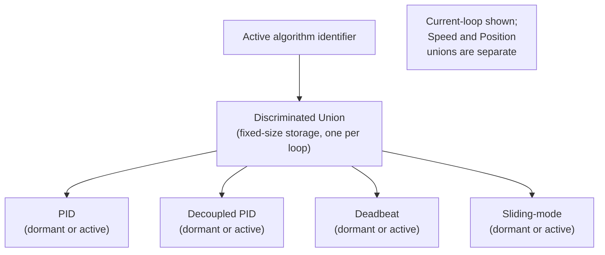
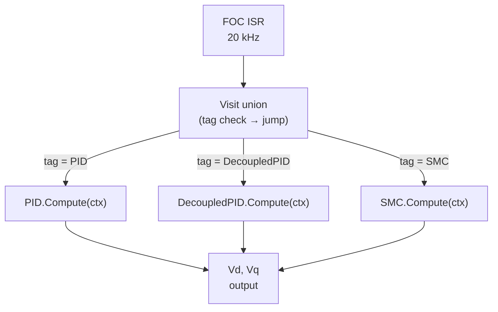
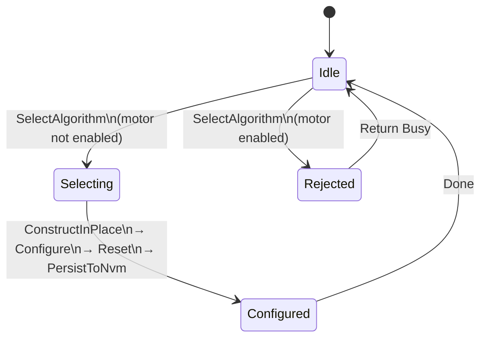
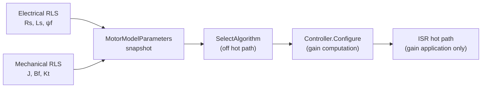
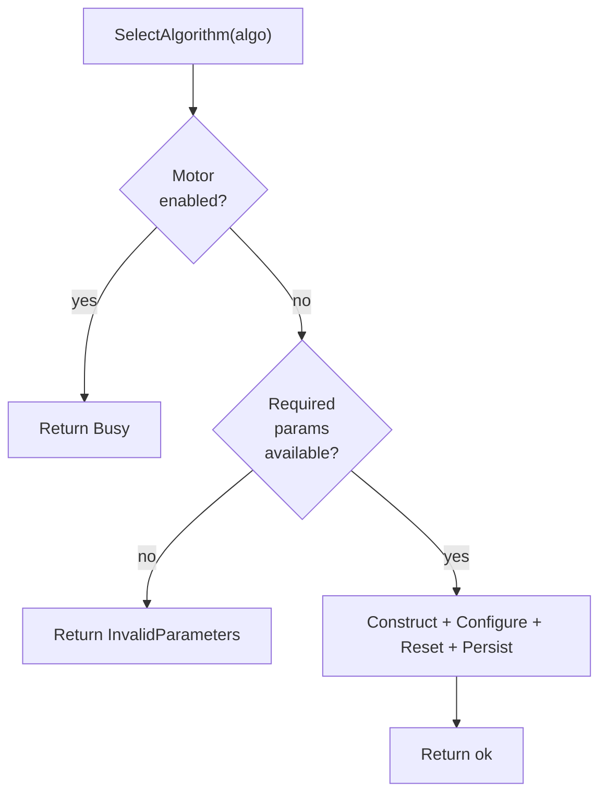
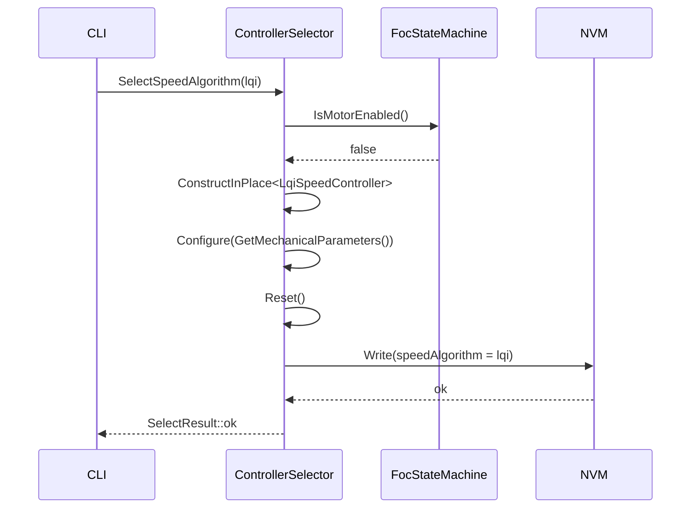
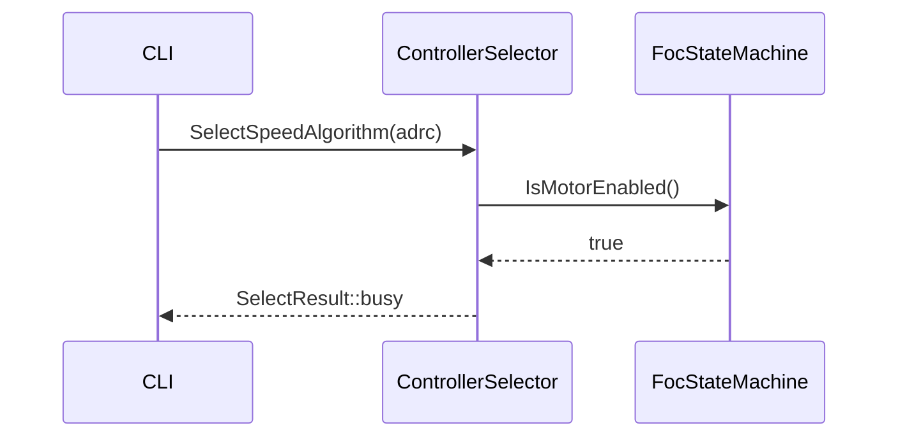
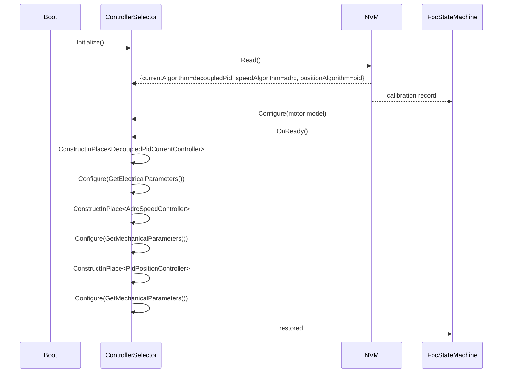
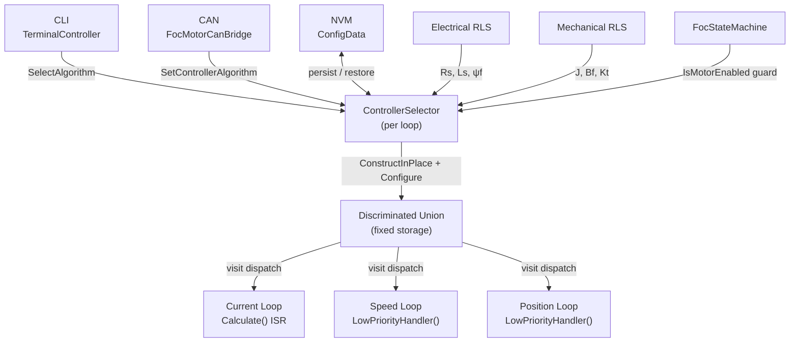

| Field     | Value                        |
|-----------|------------------------------|
| Title     | Runtime Controller Selection |
| Type      | design                       |
| Status    | accepted                     |
| Version   | 0.3.0                        |
| Component | controller-selection         |
| Date      | 2026-08-17                   |

> **IMPORTANT — Implementation-blind document**: This document describes *behavior, structure, and
> responsibilities* WITHOUT referencing code. **No code blocks using programming languages (C++, C,
> Python, CMake, shell, etc.) are allowed.** Use Mermaid diagrams to express behavior instead.
> Prose descriptions of algorithms are encouraged; source-level details are not.
>
> **Diagrams**: All visuals must be either a Mermaid fenced code block (` ```mermaid `) or ASCII art inline
> in the document. External image references using Markdown image syntax are **not allowed**.

---

## Responsibilities

**Is responsible for:**
- Maintaining a collection of concrete controller instances for each of the three FOC loops
  (current, speed, position), all stored in fixed-size, statically-allocated storage without heap use
- Activating one controller per loop at runtime by constructing it in place from the available set
- Routing each loop's per-sample computation to the active controller with zero virtual-dispatch
  overhead through type-aware dispatch (variant visit)
- Enforcing that algorithm selection is only permitted while the motor is in a non-enabled state
- Propagating motor model parameters from the online RLS estimators to the newly selected controller
  immediately after selection
- Persisting the active algorithm identifier for each loop to non-volatile memory upon each selection
- Restoring the persisted algorithm identifiers at boot and re-configuring the controllers from NVM
  before the first Enable command
- Exposing algorithm selection to the CLI terminal

**Is NOT responsible for:**
- Implementing the control algorithms themselves — each concrete controller is self-contained
- Executing FOC transforms (Clarke, Park, SVM) — these remain inline in the FOC loop
- Estimating motor model parameters — that is the responsibility of the RLS identification services
- Safety monitoring or fault detection — the FOC state machine owns these
- Tuning algorithm-specific parameters beyond what is derivable from motor model parameters

---

## Component Details

### Part A — Algorithm Enumeration

Each of the three FOC loops has an independent enumeration of available algorithm choices.

Each loop has its own independent algorithm enumeration. An algorithm is only valid for the loop it
is listed under; there is no sharing of algorithm identifiers across loops.

**Current loop** — executes at 20 kHz in the FOC ISR:

| Algorithm     | Description                                             |
|---------------|---------------------------------------------------------|
| PID           | Incremental PI baseline                                 |
| Decoupled PID | PI plus cross-coupling and back-EMF feedforward         |
| Deadbeat      | One-step or two-step predictive voltage inversion       |
| Sliding-mode  | Robust switching control with boundary-layer saturation |

**Speed loop** — executes at 1 kHz in the low-priority handler:

| Algorithm | Description                                                        |
|-----------|--------------------------------------------------------------------|
| PID       | Incremental PI baseline                                            |
| LQI       | DARE-computed state-feedback with integral augmentation            |
| ADRC      | Extended-state observer + active disturbance cancellation          |
| Two-DOF   | Reference pre-filter + PI; decoupled tracking and stiffness tuning |

**Position loop** — executes at 1 kHz in the low-priority handler:

| Algorithm | Output            | Description                                                  |
|-----------|-------------------|--------------------------------------------------------------|
| PID       | Speed reference   | Incremental PI on the wrapped position error                 |
| Cascade P | Speed reference   | Industry-standard P position → speed loop; single gain       |
| LQR       | Current reference | DARE-computed state feedback on (θ, ω)                       |
| LQI       | Current reference | LQR with position integral augmentation                      |
| Two-DOF   | Speed reference   | Reference pre-filter + PI; tracking and stiffness tune apart |

Each position algorithm declares whether it produces a speed reference or a current reference.
A speed reference runs through the existing speed and current loops unchanged. A current
reference bypasses the speed loop and feeds the current loop directly, because the state
feedback laws already regulate speed as part of their own state vector; running them on top of
a speed loop would stack two regulators on the same state.

The enumeration for each loop is fixed at build time. The default for all loops at first boot is PID.

---

### Part B — Heap-Free Variant Storage

All concrete controller instances for a given loop are held simultaneously in a single fixed-size
discriminated union (a type-safe union that tracks which alternative is currently active). Only the
active alternative is live at any time; inactive alternatives exist as constructed but dormant objects.

Switching the active algorithm constructs the new controller in place inside the union, destroying the
previous one, with no dynamic memory allocation. The total storage required is the size of the largest
concrete controller in the set, determined at build time.

This pattern is identical to the one already used by `ControlModeStateMachine` for switching between
Torque, Speed, and Position control modes.



---

### Part C — Hot-Path Dispatch via Type-Aware Visit

The per-sample `Compute` call — which runs at 20 kHz in the current loop ISR — must not incur
indirect dispatch through a virtual base-class pointer, as this prevents the compiler from inlining
and optimising the critical arithmetic.

Dispatch is performed by visiting the discriminated union: the visitor examines the stored type tag
and jumps directly to the concrete implementation, allowing the compiler to devirtualize the call
and inline the arithmetic. The resulting machine code is equivalent to a switch table with a
direct function body inlined at each case, not a vtable indirection. There is no allocation and
no heap touch in this path.

The visit call is the only place where `Compute` is invoked in the ISR; all controller-specific
setup, gain computation, and model updates occur off the hot path in the configuration routine.



---

### Part D — State Gating

Algorithm selection is a configuration-time operation, not a run-time one. It is only permitted while
the motor state machine is in the **Ready** or **Idle** state (motor disabled). A selection request
arriving while the motor is **Enabled** is rejected immediately with a `Busy` result code without
altering the active algorithm or any controller state.

The guard is symmetric with the existing `ControlModeStateMachine::Select` guard, which also rejects
mode changes while the motor is enabled.



On a successful selection, the sequence is:
1. Construct the new controller in place in the union (destroying the previous one).
2. Update the active algorithm identifier.
3. Configure the new controller with the current motor model parameter snapshot from RLS.
4. Reset the new controller's internal integrators and observer state to zero.
5. Persist the algorithm identifier to NVM.

Step 4 (Reset) ensures the controller starts from a clean state regardless of what state the motor
or the previous controller was in.

---

### Part D2 — Design Feasibility for the Position State Feedback Laws

The position plant is a near double integrator, which makes its discrete Riccati solve far more
fragile than the first-order speed plant. Solved on the raw state $(\theta, \omega)$ at a 1 kHz
outer rate it does not converge at all in single precision. Three conditioning measures make it
tractable:

1. **Time-scaled state.** The design runs on $(\theta,\ \omega T_s)$ rather than
   $(\theta,\ \omega)$, so the state matrix becomes
   $A = \begin{bmatrix} 1 & 1 \\ 0 & 1 - \tfrac{B_f}{J} T_s \end{bmatrix}$
   with every entry near unity.
2. **Normalised input.** The input matrix is fixed at $B = [0\ \ 1]^T$ by folding the actuator
   authority $\tfrac{K_t}{J} T_s^2 I_{max}$ into a scalar applied to the resulting command. The
   Riccati recursion therefore never sees the motor's torque scale.
3. **Bandwidth-derived effort weight.** $R = 1 / (\omega_{bw} T_s)^2$, with $\omega_{bw} T_s$
   clamped to $[10^{-3},\ 0.5]$. This makes settling time scale as $2 / \omega_{bw}$ seconds
   with roughly 4 % overshoot across four decades of bandwidth, so `bandwidth` remains the single
   aggressiveness knob it is for every other loop.

The state weights are shape knobs only. `positionErrorWeight` anchors the cost at one and the
remaining weights enter as ratios against it, clamped to $[10^{-3},\ 10^3]$. Anchoring matters
for more than conditioning: if the position entry of $Q$ can reach zero the cost stops penalising
the integrator state and the recursion has no stabilising solution to find.

These measures shrink but do not eliminate non-convergence. `Lqr::TryCreate` is therefore used
throughout in preference to the aborting constructor, and feasibility is part of the selection
rule rather than an afterthought:

- `PositionControllerTraits::IsSelectable` runs the actual Riccati solve for LQR and LQI. A
  selection whose design does not converge returns `invalidParameters` and **leaves the
  previously active algorithm running**, so the motor never ends up holding a silently dead loop.
- `SetPositionTunings` is refused outright while the motor is enabled, returning `busy`. A live
  motor is not a safe place to redesign the law that is holding it.
- When disabled, `SetPositionTunings` revalidates the new tunings against the active algorithm
  and rejects them if the design fails, keeping the last accepted gains live.

This is why `SetPositionTunings` returns `SelectResult` where the current and speed loops return
`void`: those loops derive their gains algebraically and cannot fail.

`IntegralStateFeedbackLqi` is not used for the LQI position law even though it now offers a
`TryCreate` factory. It augments the plant with `C · (−Ts)`, which reintroduces the sample period
into the integral row and undoes the time scaling above; at a 1 kHz outer rate that row is three
orders of magnitude smaller than the rest of the matrix and the solve stops converging. The
augmentation is therefore written out explicitly in the scaled coordinates, where the integral
state simply accumulates the position deviation per sample, and solved with
`Lqr<float, 3, 1>::TryCreate`.

---

### Part E — Motor Model Parameter Flow

When an algorithm is selected, it is immediately configured using the most recent snapshot of the
motor model parameters. The parameters are drawn from two sources:

- **Electrical parameters** (`Rs`, `Ls`, `ψf`, `Vdc`, pole pairs): from the electrical RLS
  identification service, as set by the calibration sequence.
- **Mechanical parameters** (`J`, `Bf`, `Kt`): from the mechanical RLS identification service,
  available after the speed/position calibration phase.

The configuration call is a one-time operation that computes all gains and pre-computed matrices
(e.g., DARE solution for LQR/LQI) before the controller becomes active. The ISR then executes
only the pre-computed gain application.

If the RLS estimators produce updated parameter estimates during operation (continuous identification
mode), the active controllers are not automatically reconfigured. Reconfiguration with updated
parameters requires a new `SelectAlgorithm` call (or an explicit `ReconfigureFromCurrentParameters`
command), which requires the motor to be disabled.



---

### Part F — CLI Interface

`ControlModeStateMachine` registers the selection commands on the terminal.

| Command                           | Alias | Effect                                    |
|-----------------------------------|-------|-------------------------------------------|
| `select_current_algorithm <alg>`  | `sca` | Selects the current-loop algorithm        |
| `select_speed_algorithm <alg>`    | `ssa` | Selects the speed-loop algorithm          |
| `select_position_algorithm <alg>` | `spa` | Selects the position-loop algorithm       |
| `active_algorithms`               | `aa`  | Prints the active algorithm for each loop |

Valid `<alg>` tokens are the lower-case algorithm names: `pid`, `decoupled`, `deadbeat` and
`sliding` for the current loop; `pid`, `lqi`, `adrc` and `twodof` for the speed loop; and `pid`,
`cascadep`, `lqr`, `lqi` and `twodof` for the position loop. Unknown tokens produce a usage
error without altering state.

The commands enforce the motor-enabled guard described in Part D and report the `SelectResult`
verbatim, so an operator always learns why a selection was refused.

---

### Part G — CAN Interface

Algorithm selection is **not** exposed over CAN. The `can-lite` `foc_motor` category defines no
frame for it, and the CAN bridge does not reinterpret an existing frame to carry an algorithm
identifier. Selection and query are CLI-only; see REQ-CTRL-001 and REQ-CTRL-013.

---

### Part H — Required Parameters Per Controller

Each controller algorithm has specific parameter dependencies. These dependencies determine what must
be available before that algorithm can be selected, and who is responsible for providing each value.

#### Parameter Sources

Parameters come from three distinct sources with different availability windows:

| Source                     | Parameters                                                      | Available after                 |
|----------------------------|-----------------------------------------------------------------|---------------------------------|
| Motor datasheet (static)   | Pole pairs $p$, flux linkage $\psi_f$, peak current $I_{q,max}$ | Before any run                  |
| Electrical RLS calibration | $R_s$, $L_s$, $V_{dc}$                                          | After electrical identification |
| Mechanical RLS calibration | $J$, $B_f$, $K_t = \tfrac{3}{2} p \psi_f$                       | After mechanical identification |

$\psi_f$ is the only datasheet value not directly observable by the RLS estimators. If unavailable from
the datasheet, it can be derived from the rated torque constant: $\psi_f = K_{t,rated} \cdot 2/(3p)$.

$V_{dc}$ is measured dynamically during operation; a nominal value must be known at configuration
time for gain normalisation.

#### Per-Algorithm Parameter Requirements

**Current loop:**

| Parameter                     |           PID            |      Decoupled PID       |         Deadbeat         |       Sliding-mode        |
|-------------------------------|:------------------------:|:------------------------:|:------------------------:|:-------------------------:|
| $R_s$, $L_s$ (electrical RLS) |         Required         |         Required         |     Required (tight)     |         Required          |
| $\psi_f$ (datasheet)          |       Not required       |  Required — back-EMF FF  |       Not required       |       Not required        |
| $V_{dc}$                      | Required — normalisation | Required — normalisation | Required — normalisation | Required — normalisation  |
| $I_{q,max}$                   |     For output clamp     |     For output clamp     |        For clamp         | For switching gain sizing |

Deadbeat requires the tightest RLS convergence. Decoupled PID is the only current-loop algorithm
that requires $\psi_f$ from the motor datasheet.

**Speed loop:**

| Parameter                   |     PID      |          LQI          |          ADRC          |   Two-DOF    |
|-----------------------------|:------------:|:---------------------:|:----------------------:|:------------:|
| $J$, $B_f$ (mechanical RLS) | Not required | Required — DARE plant | Required — $b_0=K_t/J$ | Not required |
| $K_t$ (derived)             | Not required |       Required        |        Required        | Not required |
| $I_{q,max}$                 |  For clamp   |  Required — R weight  |       For clamp        |  For clamp   |

ADRC is the most forgiving: $b_0$ tolerates ±50% error. Two-DOF and PID require no mechanical
RLS and are available as soon as electrical calibration completes.

**Position loop:**

| Parameter                   |     PID      |    Cascade P    |         LQR         |         LQI         |   Two-DOF    |
|-----------------------------|:------------:|:---------------:|:-------------------:|:-------------------:|:------------:|
| $J$, $B_f$ (mechanical RLS) | Not required |  Not required   |      Required       |      Required       | Not required |
| $K_t$ (derived)             | Not required |  Not required   |      Required       |      Required       | Not required |
| $I_{q,max}$                 |  For clamp   | Speed-loop dep. | Required — R weight | Required — R weight |  For clamp   |

#### Tuning Knobs (design choices, not estimated)

Each loop exposes one tuning record shared by all of its algorithms: a single closed-loop bandwidth
plus a small set of law-specific weights. The record is not estimated — it encodes the operator's
performance intent, and each algorithm reads only the fields that apply to it. Gains are always
derived from the bandwidth and the motor model, never supplied per axis.

**Current loop:**

| Knob             | Default          | Consumed by                      |
|------------------|------------------|----------------------------------|
| Bandwidth        | 2π·1000 rad/s    | PID, Decoupled PID               |
| Switching gain   | 0.2              | Sliding-mode                     |
| Boundary layer   | 0.5              | Sliding-mode                     |
| Two-step variant | off              | Deadbeat                         |

The sliding-mode error map inside the boundary layer contracts only while the switching gain stays
below the boundary layer, so the ratio of the two is bounded by design.

**Speed loop:**

| Knob                      | Default      | Consumed by  |
|---------------------------|--------------|--------------|
| Bandwidth                 | 2π·30 rad/s  | PID, ADRC    |
| Speed error weight        | 1.0          | LQI          |
| Integral weight           | 0.1          | LQI          |
| Observer bandwidth ratio  | 5.0          | ADRC         |
| Reference time constant   | 5.3 ms       | Two-DOF      |

**Position loop:**

| Knob                    | Default     | Consumed by            |
|-------------------------|-------------|------------------------|
| Bandwidth               | 2π·3 rad/s  | PID, Cascade P, LQR, LQI |
| Position error weight   | 1.0         | PID, LQR, LQI          |
| Speed error weight      | 0.1         | LQR, LQI               |
| Integral weight         | 0.05        | PID, LQI               |
| Reference time constant | 53 ms       | Two-DOF                |

Two-DOF on both outer loops derives its feedback part from the same bandwidth as the corresponding
PID law and adds only the reference pre-filter time constant on top.

Of these knobs only the current loop bandwidth and the speed loop bandwidth are persisted, as part
of the calibration record. The remaining weights and the position loop bandwidth are not stored and
return to their defaults on boot.

#### Readiness Gate per Algorithm

The selection guard (Part D) enforces not only the motor-enabled check but also a parameter-readiness
check. Attempting to select an algorithm whose required parameters are not yet available returns
`InvalidParameters` rather than `ok`.



The readiness state for each parameter source is:

| Source                           | Readiness condition                                                           |
|----------------------------------|-------------------------------------------------------------------------------|
| Datasheet params ($p$, $\psi_f$) | Set during motor configuration before calibration                             |
| Electrical RLS                   | Calibration sequence reached and completed the electrical identification step |
| Mechanical RLS                   | Calibration sequence reached and completed the mechanical identification step |

Current-loop algorithms (Decoupled PID, SMC) become selectable after electrical identification.
Speed and position algorithms (LQI, ADRC, LQR) additionally require mechanical identification.

---

### Part I — NVM Persistence

The active algorithm identifier for each loop is stored as three additional fields in the existing
`ConfigData` structure alongside `defaultControlMode`. On boot:

1. NVM is read and validated.
2. If valid, the persisted algorithm identifiers are loaded and used to configure each loop's
   controller using the also-persisted motor model parameters.
3. If invalid (first boot, CRC mismatch), the default (PID for all loops) is used and written.

Restoration is driven by the state machine's transition into `Ready`, not by construction of the
control mode: the motor model only reaches the loops when the calibration record has been applied,
which happens asynchronously after the NVM read completes. Applying the persisted identifiers any
earlier would reject every model-dependent algorithm (deadbeat, decoupled PID, speed LQI, speed
ADRC, position LQR, position LQI).

Two failure kinds are distinguished when a persisted identifier cannot be activated:

| Failure                                                    | Effect on `ConfigData`                                        |
|------------------------------------------------------------|---------------------------------------------------------------|
| Byte out of enum range, or names no algorithm for that loop | Corrected to the active algorithm — the record is meaningless |
| Valid algorithm, not selectable yet (`InvalidParameters`)   | Preserved, and retried on the next entry to `Ready`           |

The persistence ensures that an operator who selects ADRC for the speed loop does not need to
repeat the selection after every power cycle. The motor state machine will transition directly to
`Ready` with the previously selected algorithms active, ready to enable.

---

## Interfaces

### Provided

| Interface                        | Purpose                                                                                 | Contract                                                                           |
|----------------------------------|-----------------------------------------------------------------------------------------|------------------------------------------------------------------------------------|
| SelectCurrentAlgorithm           | Selects the active current-loop controller by enum value                                | Returns `ok` if motor is disabled, `busy` if enabled. Effect is immediate if `ok`. |
| SelectSpeedAlgorithm             | Selects the active speed-loop controller by enum value                                  | As above.                                                                          |
| SelectPositionAlgorithm          | Selects the active position-loop controller by enum value                               | As above.                                                                          |
| ActiveCurrentAlgorithm           | Returns the currently active current-loop algorithm identifier                          | Always returns a valid enum value. Never blocks.                                   |
| ActiveSpeedAlgorithm             | Returns the currently active speed-loop algorithm identifier                            | As above.                                                                          |
| ActivePositionAlgorithm          | Returns the currently active position-loop algorithm identifier                         | As above.                                                                          |
| ComputeCurrentControl            | Dispatches to the active current controller for one sample                              | Called at 20 kHz from ISR. Zero heap. No virtual dispatch.                         |
| ComputeSpeedControl              | Dispatches to the active speed controller for one sample                                | Called at 1 kHz from low-priority handler.                                         |
| ComputePositionControl           | Dispatches to the active position controller for one sample                             | Called at 1 kHz from low-priority handler.                                         |
| ReconfigureFromCurrentParameters | Re-applies the latest RLS snapshot to the active controllers without changing algorithm | Motor must be disabled.                                                            |

### Required

| Interface               | Purpose                                                                   | Contract                                                                            |
|-------------------------|---------------------------------------------------------------------------|-------------------------------------------------------------------------------------|
| IsMotorEnabled          | Checks whether the motor state machine is in the Enabled state            | Used to enforce the selection guard. Must be callable from off the ISR.             |
| GetElectricalParameters | Retrieves the current RLS estimate of `Rs`, `Ls`, `ψf`, `Vdc`, pole pairs | Called during Select and ReconfigureFromCurrentParameters.                          |
| GetMechanicalParameters | Retrieves the current RLS estimate of `J`, `Bf`, `Kt`                     | Called during Select and ReconfigureFromCurrentParameters for speed/position loops. |
| NvmWrite                | Persists the algorithm identifiers to non-volatile storage                | Called once per successful selection. Must not block the hot path.                  |
| NvmRead                 | Reads persisted algorithm identifiers at boot                             | Called during boot initialization before any Enable.                                |

---

## Data Model

| Entity               | Field             | Type / Unit       | Range                                         | Notes                                                              |
|----------------------|-------------------|-------------------|-----------------------------------------------|--------------------------------------------------------------------|
| CurrentAlgorithm     | enum              | uint8             | pid, decoupledPid, deadbeat, slidingMode      | Selectable current-loop strategy                                   |
| SpeedAlgorithm       | enum              | uint8             | pid, lqi, adrc, twoDof                        | Selectable speed-loop strategy                                     |
| PositionAlgorithm    | enum              | uint8             | pid, cascadeP, lqr, lqi, twoDof               | Selectable position-loop strategy                                  |
| PositionOutputKind   | enum              | uint8             | speedReference, currentReference               | Declares whether a position law drives the speed or current loop   |
| SelectResult         | enum              | uint8             | ok, busy, invalidAlgorithm, invalidParameters | Return code from SelectAlgorithm                                   |
| MotorModelParameters | Rs                | Ohm (float)       | > 0                                           | From electrical RLS                                                |
| MotorModelParameters | Ls                | Henry (float)     | > 0                                           | From electrical RLS                                                |
| MotorModelParameters | psiF              | Weber (float)     | > 0                                           | From alignment calibration                                         |
| MotorModelParameters | polePairs         | uint8             | ≥ 1                                           | Motor constant                                                     |
| MotorModelParameters | Vdc               | Volt (float)      | > 0                                           | Measured dynamically                                               |
| MotorModelParameters | currentLoopRate   | Hertz (uint32)    | > 0                                           | $1/T_s^i$; required to discretize the plant for Deadbeat and SMC   |
| MotorModelParameters | J                 | kg·m² (float)     | > 0                                           | From mechanical RLS                                                |
| MotorModelParameters | Bf                | N·m·s/rad (float) | ≥ 0                                           | From mechanical RLS                                                |
| MotorModelParameters | Kt                | N·m/A (float)     | > 0                                           | Derived from psiF and polePairs                                    |
| NvmRecord            | currentAlgorithm  | uint8             | 0–255                                         | Validated on load; invalid → default (PID)                         |
| NvmRecord            | speedAlgorithm    | uint8             | 0–255                                         | As above                                                           |
| NvmRecord            | positionAlgorithm | uint8             | 0–255                                         | As above                                                           |
| CalibrationRecord    | currentLoopBandwidth | rad/s (float)  | ≥ 0                                           | Persisted current loop bandwidth                                   |
| CalibrationRecord    | speedLoopBandwidth   | rad/s (float)  | ≥ 0                                           | Persisted speed loop bandwidth                                     |

---

## State Machine

The controller selection component has no states of its own — it is stateless except for the
union's active alternative and the active enum values. Its behaviour is governed entirely by the
motor state machine's current state (enabled vs. not enabled).

The sequence on a successful algorithm selection:



The sequence on a rejected selection (motor enabled):



Boot restoration sequence:



---

## Block Diagram



---

## Constraints & Limitations

| Constraint                     | Value / Description                                                                                                                                                                                                               |
|--------------------------------|-----------------------------------------------------------------------------------------------------------------------------------------------------------------------------------------------------------------------------------|
| Heap allocation                | Zero. All controller instances reside in fixed-size, statically-allocated storage.                                                                                                                                                |
| Hot-path virtual dispatch      | None. The visit dispatch inlines directly to concrete implementations.                                                                                                                                                            |
| Selection while enabled        | Rejected. `SelectResult::busy` returned; no state change.                                                                                                                                                                         |
| Current loop cycle overhead    | Visit dispatch adds ≤ 10 cycles versus direct call on the measured cycle budget.                                                                                                                                                  |
| Maximum number of algorithms   | Fixed at build time by the union type list. Adding a new algorithm requires a rebuild.                                                                                                                                            |
| NVM write latency              | NVM write occurs synchronously after selection; motor must remain disabled during the write.                                                                                                                                      |
| Parameter staleness            | Controllers are configured with the RLS snapshot at selection time. They are not automatically updated if RLS estimates change during operation.                                                                                  |
| Mechanical parameters required | Speed and position algorithm configuration requires that the mechanical RLS identification has been completed. Attempting to select LQI or LQR before mechanical calibration is done produces an `InvalidParameters` result.      |
| DARE numerical stability       | For extremely large inertia (Bd → 0) or zero viscous friction (Ad → 1), the DARE solution may be ill-conditioned. A controllability pre-check is performed before solving; an ill-conditioned system returns `InvalidParameters`. |

---

## Open Questions

| # | Question                                                                                                                                                                                             | Options                                                                                    | Status |
|---|------------------------------------------------------------------------------------------------------------------------------------------------------------------------------------------------------|--------------------------------------------------------------------------------------------|--------|
| 1 | Should the CAN `SetControllerAlgorithm` frame be acknowledged synchronously (blocking until NVM write completes) or asynchronously (NVM write deferred)?                                             | Synchronous (simpler, adds latency) vs. asynchronous (lower bus latency, NVM write queued) | open   |
| 2 | Should `ReconfigureFromCurrentParameters` be exposed on the CLI, or only as a CAN command?                                                                                                           | CLI only / CAN only / both                                                                 | open   |
| 3 | When the motor transitions from Speed mode to Position mode, should the position-loop LQR gains be recomputed from the speed-mode ADRC's parameter snapshot, or should they be stored independently? | Independent storage (current design) vs. shared parameter snapshot                         | open   |
