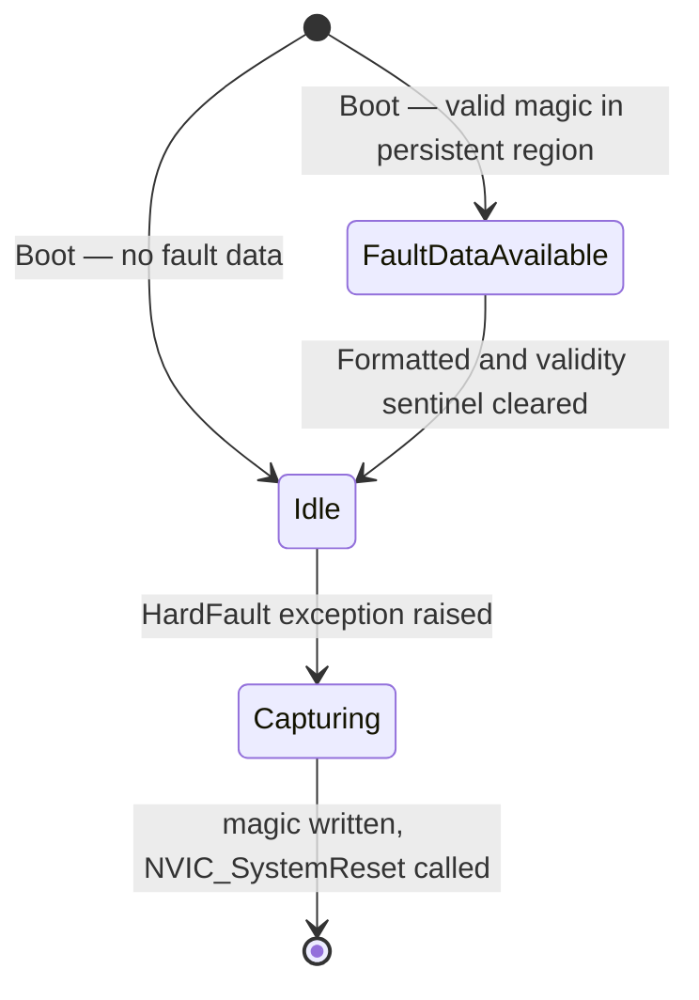
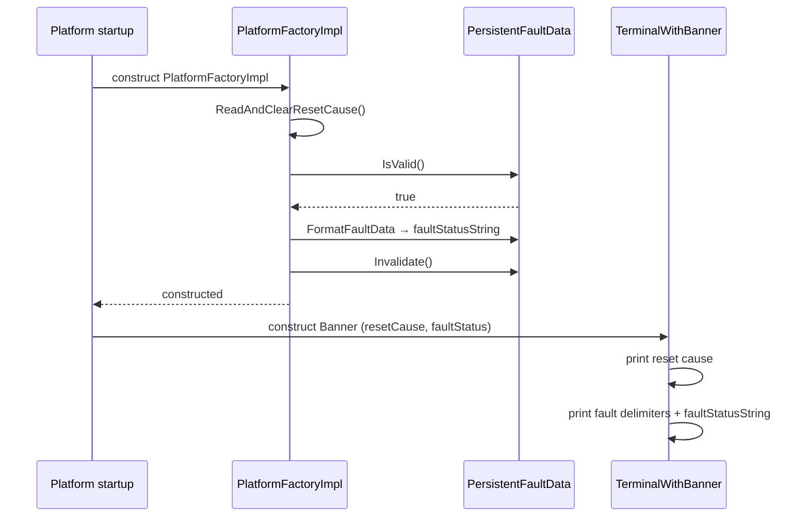
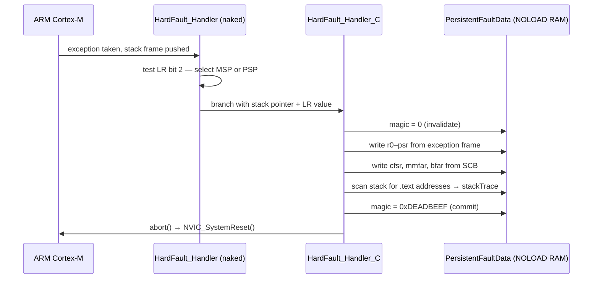

| Field     | Value            |
|-----------|------------------|
| Title     | Error Handling Design |
| Type      | design           |
| Status    | stable           |
| Version   | 1.0.0            |
| Component | error-handling   |
| Date      | 2026-04-13       |

---

## Responsibilities

**Is responsible for:**
- Capturing Cortex-M CPU register state and a stack-address backtrace when a HardFault exception occurs, before the system resets.
- Persisting that diagnostic snapshot in a memory region that is not cleared on reset, so it survives the subsequent boot.
- Reporting the cause of the most recent reset (power-up, brown-out, software, hardware, or watchdog) to the application layer via `PlatformFactory`.
- Exposing the formatted fault snapshot and reset cause to the CLI at boot time.
- Providing a platform-initiated software reset via `PlatformFactory::Reset()`.

**Is NOT responsible for:**
- Deciding what the application does after a fault (handled by the application layer).
- Correcting or masking the fault condition.
- Logging to persistent storage beyond the single 1 KiB fault region.
- CAN-bus boot notification or any network-layer diagnostics.

---

## Component Details

### Fault capture — HardFault handler

A naked assembly trampoline runs in HardFault exception context before any C function prologue executes. It determines whether the exception was entered from thread mode (using PSP as the stack pointer) or from handler mode (using MSP), then passes the correct stack frame pointer to the C-level capture routine.

The capture routine writes all eight words of the ARM exception stack frame (R0–R3, R12, LR, PC, xPSR) plus three Cortex-M fault status registers (CFSR, MMFAR, BFAR) into the persistent region. It also scans the stack above the exception frame and records any word whose value falls within the `.text` section as a probable return address — this constitutes the backtrace. A validity sentinel is written last; this is the atomic commit point. If the MCU loses power or watchdog-resets mid-write, an incomplete capture is detected and discarded on the next boot.

After capture, the handler calls `abort()`, which the platform startup maps to `NVIC_SystemReset()`.

### Persistent fault region

The fault data structure (`PersistentFaultData`) is placed in a dedicated `.error_handling` linker section that is marked `NOLOAD`. The linker scripts for both TI and ST targets locate this section inside RAM but exclude it from the BSS zero-fill at startup, so its contents survive across a warm reset. The region is exactly 1 KiB and the linker asserts this at link time.

### Reset cause detection

Each platform's `PlatformFactoryImpl` reads the hardware-specific reset status register during construction, before anything else modifies it. It converts the raw vendor bits to the platform-agnostic `ResetCause` enumeration and clears the register so that subsequent resets are not misreported. The `ResetCause` value is then accessible for the lifetime of the application via `PlatformFactory::GetResetCause()`.

### Boot-time CLI reporting

The CLI banner reads both the reset cause and any pending fault snapshot from `PlatformFactory` during construction. If a valid snapshot exists, it is formatted into a human-readable string and the validity sentinel is cleared immediately after formatting, so the snapshot is consumed at most once. The formatted string is retained for the lifetime of the application for later `fault_status` CLI queries. The banner prints the reset cause unconditionally and surrounds fault data with visible delimiters.

---

## Interfaces

### Provided

| Interface | Purpose | Contract |
|-----------|---------|----------|
| `PlatformFactory::Reset()` | Trigger an immediate software reset | Called synchronously; does not return |
| `PlatformFactory::GetResetCause() const` | Return the reset cause captured at boot | Valid for the lifetime of the application; thread-safe by value semantics |
| `PlatformFactory::FaultStatus() const` | Return the formatted fault string (empty if no fault) | Valid for the lifetime of the application once the constructor returns |

### Required

| Interface | Purpose | Contract |
|-----------|---------|----------|
| Platform linker script | Provide `.error_handling` NOLOAD section in RAM | Must be placed before `.bss` to avoid zero-fill |
| ARM Cortex-M NVIC | Deliver HardFault exception to the handler trampoline | Always-enabled; not configurable via NVIC_EnableIRQ |
| `SYSCTL->RESC` (TI) / `RCC->CSR` or `RCC->RSR` (ST) | Provide reset source bits at boot | Read once; cleared after read |

---

## Data Model

| Entity | Field | Type / Unit | Range | Notes |
|--------|-------|-------------|-------|-------|
| PersistentFaultData | magic | 32-bit unsigned | 0 or 0xDEADBEEF | Written last to commit capture |
| PersistentFaultData | r0–r3, r12, lr, pc, psr | 32-bit unsigned | Any | ARM exception stack frame words |
| PersistentFaultData | cfsr, mmfar, bfar | 32-bit unsigned | Any | Cortex-M fault status registers |
| PersistentFaultData | stackTrace[243] | 32-bit unsigned array | Any | Addresses within `.text` found on stack |
| PersistentFaultData | stackTraceCount | 32-bit unsigned | 0–243 | Number of valid trace entries |
| ResetCause | — | enum | powerUp, brownOut, software, hardware, watchdog | MCU-agnostic |

---

## State Machine

---

## Sequence Diagrams

### Boot with prior fault

### HardFault capture

