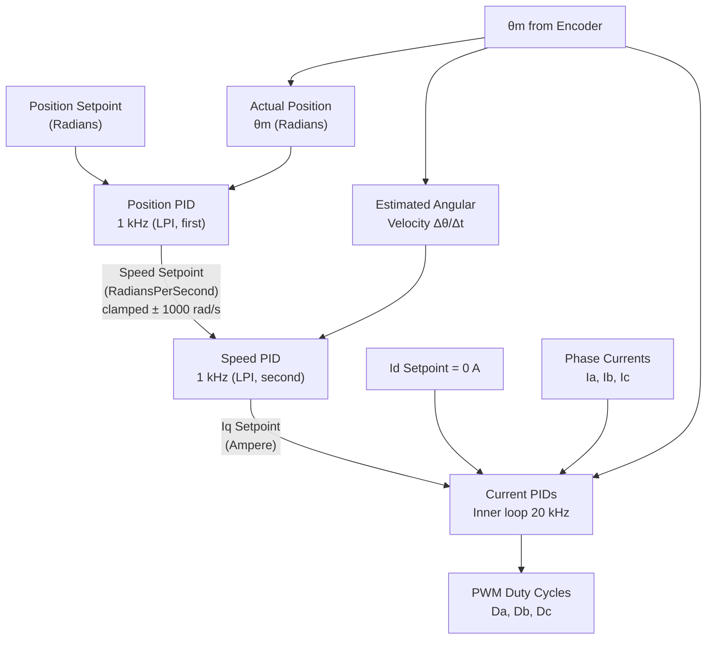
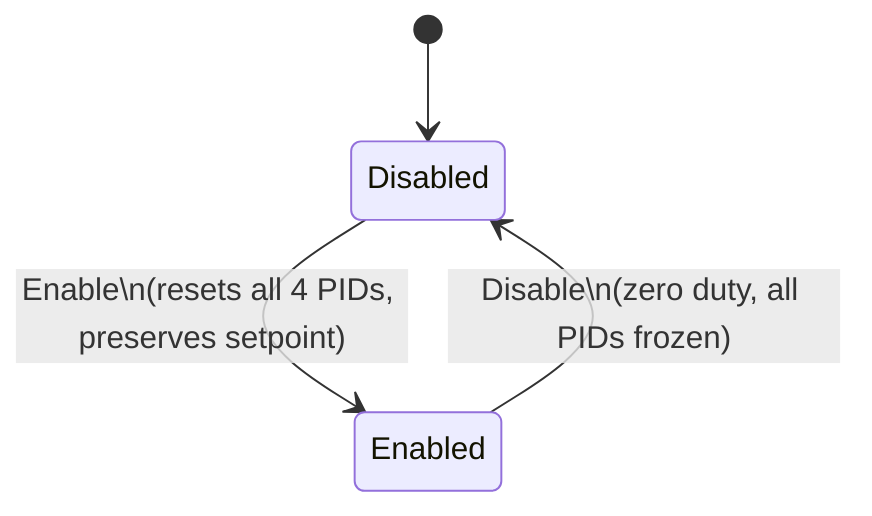
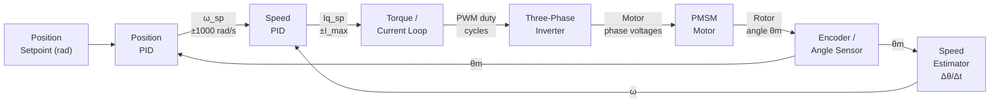

| Field     | Value                |
|-----------|----------------------|
| Title     | FOC Position Control |
| Type      | design               |
| Status    | draft                |
| Version   | 0.1.0                |
| Component | foc-position         |
| Date      | 2026-04-07           |

> **IMPORTANT — Implementation-blind document**: This document describes *behavior, structure, and
> responsibilities* WITHOUT referencing code. **No code blocks using programming languages (C++, C,
> Python, CMake, shell, etc.) are allowed.** Use Mermaid diagrams to express behavior instead.
> Prose descriptions of algorithms are encouraged; source-level details are not.
>
> **Diagrams**: All visuals must be either a Mermaid fenced code block (` ```mermaid `) or ASCII art inline
> in the document. External image references using Markdown image syntax are **not allowed**.

---

## Responsibilities

**Is responsible for:**
- Executing the three-level FOC cascade: an outermost position PID loop, a middle speed PID loop (both at 1 kHz within the same LPI callback), and the innermost current control loop (20 kHz)
- Regulating rotor mechanical position to a commanded setpoint in radians
- Computing the speed setpoint for the middle loop as the output of the position PID, clamped to a safe approach-speed limit
- Estimating rotor angular velocity from consecutive mechanical angle samples (same wrap-around compensation as speed control) for the middle loop
- Arming and resetting all four PID controllers (position, speed, d-axis, q-axis) on Enable / Disable
- Accepting a position setpoint in mechanical radians and propagating all derived setpoints through the cascade

**Is NOT responsible for:**
- Reading phase currents or encoder position directly from hardware — these are supplied by the Runner
- Writing duty cycles to the PWM hardware — duty cycles are returned to the Runner
- Multi-turn position tracking or wrap-around management at the position level — the application must command positions within a range compatible with single-turn resolution
- Flux weakening (Id is always commanded to 0 A)

---

## Component Details

### Three-Loop Cascade Architecture

Position control extends the speed control design by adding a third outermost loop. All three loops share the same `LowPriorityInterrupt` trigger; the outer two loops execute sequentially within a single LPI callback, while the innermost loop executes in the high-priority 20 kHz ISR.

| Loop        | Rate   | Context                | Input                      | Output                 |
|-------------|--------|------------------------|----------------------------|------------------------|
| Inner loop  | 20 kHz | High-priority FOC ISR  | Phase currents, θm         | PWM duty cycles        |
| Middle loop | 1 kHz  | Low-priority interrupt | θm from last inner cycle   | Iq setpoint (Ampere)   |
| Outer loop  | 1 kHz  | Low-priority interrupt | θm (position), position SP | Speed setpoint (rad/s) |

The position loop fires **before** the speed loop within the same LPI callback. This ensures the speed setpoint written by the position PID is immediately consumed by the speed PID in the same interrupt invocation, keeping both derived setpoints in step.



### Outer Loop — Position PID

The position PID processes the signed error between the commanded position setpoint and the current mechanical angle θm:

```
speed_setpoint = PositionPID( position_setpoint − θm )
```

Its output is clamped symmetrically to ± 1000 rad/s. This limit determines the maximum angular velocity the controller will command at any position error magnitude, functioning as the approach-speed ceiling. A tighter value produces slower, gentler moves; a larger value allows faster convergence but requires finer speed and current tuning to remain stable.

No wrap-around compensation is applied at the position level. The application is responsible for commanding target positions within a range where the single-turn angle measurement is unambiguous. For multi-turn use cases, external tracking logic must convert multi-turn counts to a monotonic position value before writing the setpoint.

### Middle Loop — Speed Estimation and Speed PID

The speed estimation and speed PID in the middle loop are functionally identical to those described in the FOC Speed Control design document. The speed PID output is clamped to ± maxCurrent (Ampere) and written as the Iq setpoint for the inner current loop.

The speed setpoint consumed by the speed PID is the clamped output of the position PID from the same LPI invocation, not a value set by the application.

### Inner Loop — Torque and Current Control

The inner loop is functionally identical to the FOC Torque Control design document: Clarke, Park, d-axis PID, q-axis PID, inverse Park, and SVM. It runs independently at 20 kHz and reads its Iq setpoint from the value most recently written by the middle loop.

The d-axis setpoint is always 0 A.

### Enable and Disable

**Enable**: resets and arms all four PID controllers in cascade order (position, speed, d-axis, q-axis). The last position setpoint is preserved.

**Disable**: disarms all four PIDs. `Calculate()` returns zero duty cycles until re-enabled.



### LPI Callback Execution Order Within One 1 kHz Tick

Within a single LPI callback, the position and speed loops execute in strict order:

1. **Position PID fires first**: reads θm, computes position error, produces and clamps speed setpoint.
2. **Speed PID fires second**: reads the freshly updated speed setpoint, computes speed error using Δθ/Δt, produces and clamps Iq setpoint.
3. Callback returns. On the next 20 kHz ISR cycle, the inner loop picks up the updated Iq setpoint.

This ordering guarantees that the speed setpoint used by the speed PID in any given outer-loop tick is always the one computed by the position PID in that same tick.

---

## Interfaces

### Provided

| Interface          | Purpose                                                                  | Contract                                                                          |
|--------------------|--------------------------------------------------------------------------|-----------------------------------------------------------------------------------|
| SetPolePairs       | Configures the pole-pair count for electrical angle calculation.         | Must be called before the first `Calculate()`. Must not be changed while Enabled. |
| Enable             | Arms all four PIDs and resets their integrator state.                    | Safe to call repeatedly. Position setpoint is preserved.                          |
| Disable            | Disarms all PIDs and forces zero duty cycle output.                      | Safe to call from any context.                                                    |
| SetCurrentTunings  | Sets P, I, D gains for d-axis and q-axis current PIDs.                   | Gains normalised by 1/(√3·Vdc) internally.                                        |
| SetSpeedTunings    | Sets P, I, D gains for the speed PID, including the current clamp limit. | Speed PID output clamped to ± maxCurrent.                                         |
| SetPositionTunings | Sets P, I, D gains for the position PID.                                 | Position PID output clamped to ± 1000 rad/s.                                      |
| SetPoint           | Sets the target position in mechanical radians.                          | Written atomically; used on the next outer-loop cycle.                            |
| Calculate          | Executes the inner 20 kHz FOC torque loop for one cycle.                 | Called from the FOC ISR; returns `PhasePwmDutyCycles`. Must not block.            |

### Required

| Interface            | Purpose                                                                                 | Contract                                                                                                                            |
|----------------------|-----------------------------------------------------------------------------------------|-------------------------------------------------------------------------------------------------------------------------------------|
| LowPriorityInterrupt | Provides the callback registration point for the combined position + speed outer loops. | The inner-loop ISR triggers the LPI at the 1 kHz prescale ratio. Both outer-loop stages execute sequentially in one LPI invocation. |

---

## Data Model

| Entity              | Field        | Type / Unit              | Range                | Notes                                                               |
|---------------------|--------------|--------------------------|----------------------|---------------------------------------------------------------------|
| Position setpoint   | θ_sp         | Radians (float)          | Application-defined  | Not wrapped — application must supply single-turn-compatible target |
| Actual position     | θm           | Radians (float)          | [0, 2π)              | Mechanical angle from encoder                                       |
| Position PID output | ω_sp         | RadiansPerSecond (float) | [−1000, +1000] rad/s | Clamped speed setpoint for middle loop                              |
| Estimated speed     | ω            | RadiansPerSecond (float) | computed from Δθ/Δt  | Finite difference with ±π wrap correction                           |
| Speed PID output    | Iq_sp        | Ampere (float)           | ± maxCurrent         | Written to inner loop                                               |
| d-axis setpoint     | Id_sp        | Ampere (float)           | 0 A fixed            | SPMSM maximum torque per ampere                                     |
| Previous angle      | θm_prev      | Radians (float)          | [0, 2π)              | Saved each outer cycle for speed estimator                          |
| Outer loop period   | Δt           | Seconds (float)          | 1 / outer_frequency  | Constant after construction                                         |
| Pole pairs          | P            | Integer (unsigned)       | ≥ 1                  | Motor property                                                      |
| Max current         | maxCurrent   | Ampere (float)           | > 0                  | Upper bound on Iq setpoint from speed PID                           |
| Speed clamp         | ± 1000 rad/s | RadiansPerSecond (float) | fixed                | Position PID output saturation; determines approach speed cap       |

---

## Sequence Diagrams

### Single 1 kHz LPI Tick — Position and Speed Outer Loops

```mermaid
sequenceDiagram
    participant LPI as LowPriorityInterrupt
    participant PosLoop as Position PID Stage
    participant SpdLoop as Speed PID Stage
    participant Inner as Torque Inner Loop (20 kHz)

    LPI->>PosLoop: LowPriorityHandler fires
    PosLoop->>PosLoop: Read θm (current position)
    PosLoop->>PosLoop: error = θ_setpoint − θm
    PosLoop->>PosLoop: ω_setpoint = PositionPID(error), clamped ± 1000 rad/s
    PosLoop->>SpdLoop: Write ω_setpoint
    SpdLoop->>SpdLoop: Compute Δθ = θm − θm_prev (±π wrap correction)
    SpdLoop->>SpdLoop: ω = Δθ / Δt; save θm as θm_prev
    SpdLoop->>SpdLoop: Iq_setpoint = SpeedPID(ω_setpoint − ω), clamped ± maxCurrent
    SpdLoop->>Inner: Write Iq_setpoint (atomic)
    Note over Inner: Next 20 kHz ISR picks up updated Iq_setpoint
```

---

## Block Diagram



---

## Constraints & Limitations

| Constraint                         | Value / Description                                                                                                                   |
|------------------------------------|---------------------------------------------------------------------------------------------------------------------------------------|
| Inner loop rate                    | 20 kHz — called from the FOC ISR once per PWM period.                                                                                 |
| Outer loop rate                    | 1 kHz (same for both position and speed stages). Must be an integer divisor of 20 kHz.                                                |
| Position PID speed clamp           | ± 1000 rad/s. This hard limit governs maximum approach speed at any position error.                                                   |
| No multi-turn tracking             | Position setpoint is in single-turn radians. Multi-turn logic must be handled externally.                                             |
| No position wrap-around correction | A large step in position setpoint that crosses the encoder wrap boundary may cause a transient. Applications must avoid such steps.   |
| LPI callback order                 | Position PID must always execute before the speed PID within the same LPI callback. Reversing the order yields stale speed setpoints. |
| No flux weakening                  | Id = 0 is invariant. High-speed flux-weakening operation is out of scope.                                                             |
| Cycle budget (inner loop)          | `Calculate()` must complete in <= 4500 cycles (75% of the 6000-cycle control period at 120 MHz / 20 kHz).                                                                               |
| PID state at Enable                | All four integrators are zeroed on Enable; position setpoint is preserved.                                                            |
| Setpoint atomicity                 | Speed and Iq setpoints written by outer loops must be read atomically by downstream loops on 32-bit ARM.                              |
