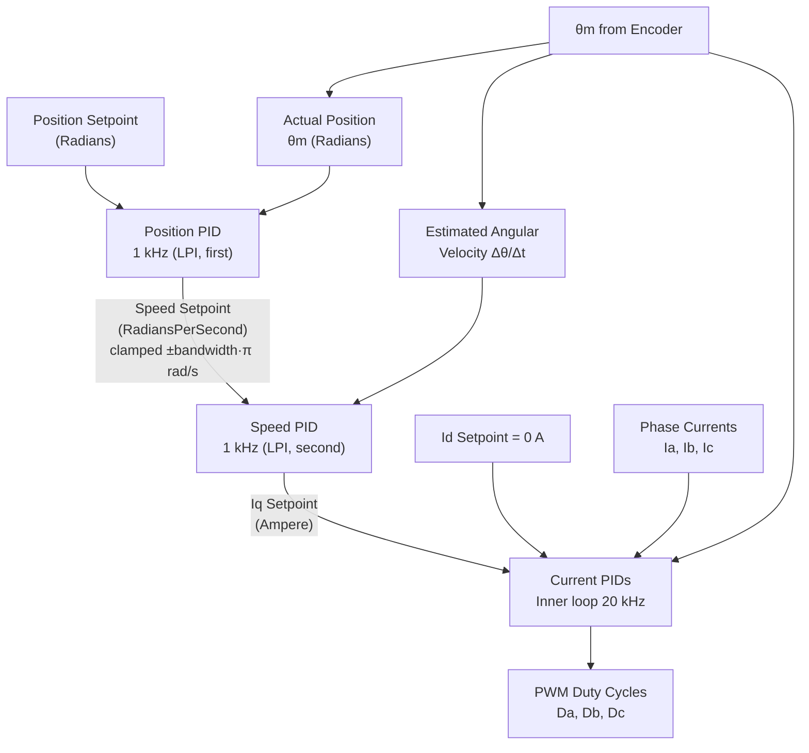
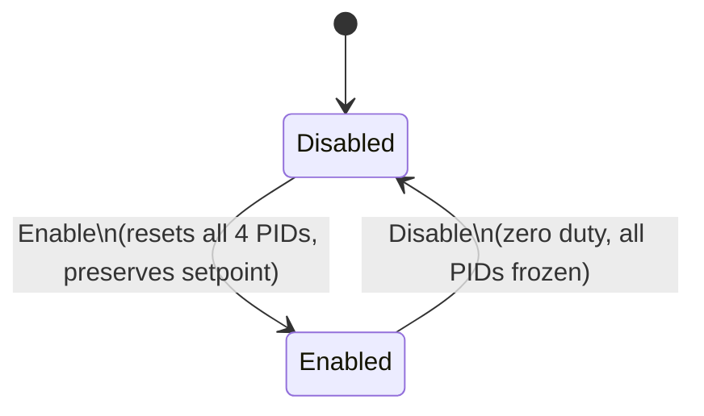
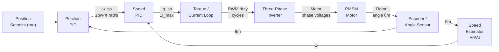

| Field     | Value                |
|-----------|----------------------|
| Title     | FOC Position Control |
| Type      | design               |
| Status    | draft                |
| Version   | 0.1.0                |
| Component | foc-position         |
| Date      | 2026-04-07           |

> **IMPORTANT — Implementation-blind document**: This document describes *behavior, structure, and
> responsibilities* WITHOUT referencing code. **No code blocks using programming languages (C++, C,
> Python, CMake, shell, etc.) are allowed.** Use Mermaid diagrams to express behavior instead.
> Prose descriptions of algorithms are encouraged; source-level details are not.
>
> **Diagrams**: All visuals must be either a Mermaid fenced code block (` ```mermaid `) or ASCII art inline
> in the document. External image references using Markdown image syntax are **not allowed**.

---

## Responsibilities

**Is responsible for:**
- Executing the FOC cascade: an outermost position loop and a middle speed loop (both at 1 kHz within the same LPI callback), and the innermost current control loop (20 kHz)
- Regulating rotor mechanical position to a commanded setpoint in radians
- Dispatching to the selected position algorithm and routing its output to either the speed loop or, for the state feedback laws, straight to the current loop
- Estimating rotor angular velocity from consecutive mechanical angle samples (same wrap-around compensation as speed control) for the middle loop
- Resetting the position, speed and current controller state on Enable / Disable
- Accepting a position setpoint in mechanical radians and propagating all derived setpoints through the cascade

**Is NOT responsible for:**
- Reading phase currents or encoder position directly from hardware — these are supplied by the Runner
- Writing duty cycles to the PWM hardware — duty cycles are returned to the Runner
- Multi-turn position tracking — the setpoint is a single-turn mechanical angle, and the loop always takes the shorter way round to it
- Flux weakening (Id is always commanded to 0 A)

---

## Component Details

### Three-Loop Cascade Architecture

Position control extends the speed control design by adding a third outermost loop. All three loops share the same `LowPriorityInterrupt` trigger; the outer two loops execute sequentially within a single LPI callback, while the innermost loop executes in the high-priority 20 kHz ISR.

| Loop        | Rate   | Context                | Input                      | Output                 |
|-------------|--------|------------------------|----------------------------|------------------------|
| Inner loop  | 20 kHz | High-priority FOC ISR  | Phase currents, θm         | PWM duty cycles        |
| Middle loop | 1 kHz  | Low-priority interrupt | θm from last inner cycle   | Iq setpoint (Ampere)   |
| Outer loop  | 1 kHz  | Low-priority interrupt | θm (position), position SP | Speed setpoint (rad/s) |

The position loop fires **before** the speed loop within the same LPI callback. This ensures the speed setpoint written by the position PID is immediately consumed by the speed PID in the same interrupt invocation, keeping both derived setpoints in step.


```mermaid
graph TB
    PSP["Position Setpoint\n(Radians)"] --> PPID["Position PID\n1 kHz (LPI, first)"]
    APOS["Actual Position\nθm (Radians)"] --> PPID
    PPID -->|"Speed Setpoint\n(RadiansPerSecond)\nclamped ±bandwidth·π rad/s"| SPID["Speed PID\n1 kHz (LPI, second)"]
    AV["Estimated Angular\nVelocity Δθ/Δt"] --> SPID
    SPID -->|"Iq Setpoint\n(Ampere)"| CPID["Current PIDs\nInner loop 20 kHz"]
    ZERO["Id Setpoint = 0 A"] --> CPID
    PHASES["Phase Currents\nIa, Ib, Ic"] --> CPID
    ANGLE["θm from Encoder"] --> CPID
    ANGLE --> AV
    ANGLE --> APOS
    CPID --> DUTY["PWM Duty Cycles\nDa, Db, Dc"]
```

### Outer Loop — Selectable Position Law

The position error is always the wrapped difference between the setpoint and the current mechanical angle θm, folded into [−π, π] so a move across the encoder seam takes the shorter way round rather than most of a turn backwards.

`PositionControllerSelector` holds every position algorithm in a `std::variant` and dispatches through `std::visit`, exactly as the current and speed loops do. Each algorithm declares the kind of output it produces:

- **Speed reference** (PID, Cascade P, Two-DOF): the value is written as the speed setpoint and the speed loop runs immediately afterwards in the same callback, as it always has.
- **Current reference** (LQR, LQI): the speed loop is skipped entirely and the value becomes the q-axis current setpoint directly. These laws carry ω in their own state vector and already regulate it, so running them on top of a speed loop would stack two regulators on the same state.

The speed-reference laws saturate at one loop bandwidth of speed per π radians of error. The current-reference laws clamp to ± maxCurrent, and LQI stops accumulating its integral state whenever that clamp is active.

See `documentation/design/controller-selection.md` for the algorithm set, the numerical conditioning the state feedback designs require, and the rules governing when a selection or a retune is refused.

### Middle Loop — Speed Estimation and Speed PID

The speed estimation and speed PID in the middle loop are functionally identical to those described in the FOC Speed Control design document. The speed PID output is clamped to ± maxCurrent (Ampere) and written as the Iq setpoint for the inner current loop.

When a speed-reference position law is active, the speed setpoint consumed by the speed PID is the output of the position law from the same LPI invocation, not a value set by the application. When a current-reference law is active the speed loop does not run at all.

### Inner Loop — Torque and Current Control

The inner loop is functionally identical to the FOC Torque Control design document: Clarke, Park, d-axis PID, q-axis PID, inverse Park, and SVM. It runs independently at 20 kHz and reads its Iq setpoint from the value most recently written by the middle loop.

The d-axis setpoint is always 0 A.

### Enable and Disable

**Enable**: resets and arms all four PID controllers in cascade order (position, speed, d-axis, q-axis). The last position setpoint is preserved.

**Disable**: disarms all four PIDs. `Calculate()` returns zero duty cycles until re-enabled.


```mermaid
stateDiagram-v2
    [*] --> Disabled
    Disabled --> Enabled : Enable\n(resets all 4 PIDs, preserves setpoint)
    Enabled --> Disabled : Disable\n(zero duty, all PIDs frozen)
```

### LPI Callback Execution Order Within One 1 kHz Tick

Within a single LPI callback, the position and speed loops execute in strict order:

1. **Position law fires first**: reads θm, computes the wrapped position error, produces either a speed setpoint or an Iq setpoint.
2. **Speed PID fires second, if the position law produced a speed setpoint**: reads the freshly updated setpoint, computes speed error using Δθ/Δt, produces and clamps the Iq setpoint. A current-reference law writes the Iq setpoint itself and this step is skipped.
3. Callback returns. On the next 20 kHz ISR cycle, the inner loop picks up the updated Iq setpoint.

This ordering guarantees that the Iq setpoint used by the inner loop is always the one derived in the most recent outer-loop tick.

---

## Interfaces

### Provided

| Interface               | Purpose                                                  | Contract                                                                                                                                                                                    |
|-------------------------|----------------------------------------------------------|---------------------------------------------------------------------------------------------------------------------------------------------------------------------------------------------|
| Configure               | Supplies the motor model, including the pole-pair count. | Must be called before the first `Calculate()`. Must not be changed while Enabled.                                                                                                           |
| Enable                  | Resets the position law and arms the loops beneath it.   | Safe to call repeatedly. Position setpoint is preserved.                                                                                                                                    |
| Disable                 | Disarms all PIDs and forces zero duty cycle output.      | Safe to call from any context.                                                                                                                                                              |
| SetCurrentTunings       | Sets the current loop closed-loop bandwidth.             | Gains are derived from the motor model and normalised internally.                                                                                                                           |
| SetSpeedTunings         | Sets the speed loop closed-loop bandwidth.               | Speed loop output clamped to ± maxCurrent.                                                                                                                                                  |
| SetPositionTunings      | Sets the position loop bandwidth and cost weights.       | Returns `SelectResult`. Refused with `busy` while enabled; refused with `invalidParameters` if the active law cannot be redesigned for the new tunings, leaving the last accepted set live. |
| SelectPositionAlgorithm | Selects the position algorithm.                          | Refused with `busy` while enabled, and with `invalidParameters` when the design does not converge; the previously active algorithm stays live.                                              |
| SetPoint                | Sets the target position in mechanical radians.          | Written atomically; used on the next outer-loop cycle.                                                                                                                                      |
| Calculate               | Executes the inner 20 kHz FOC torque loop for one cycle. | Called from the FOC ISR; returns `PhasePwmDutyCycles`. Must not block.                                                                                                                      |

### Required

| Interface            | Purpose                                                                                 | Contract                                                                                                                            |
|----------------------|-----------------------------------------------------------------------------------------|-------------------------------------------------------------------------------------------------------------------------------------|
| LowPriorityInterrupt | Provides the callback registration point for the combined position + speed outer loops. | The inner-loop ISR triggers the LPI at the 1 kHz prescale ratio. Both outer-loop stages execute sequentially in one LPI invocation. |

---

## Data Model

| Entity              | Field        | Type / Unit              | Range                | Notes                                                               |
|---------------------|--------------|--------------------------|----------------------|---------------------------------------------------------------------|
| Position setpoint   | θ_sp         | Radians (float)          | Application-defined  | Not wrapped — application must supply single-turn-compatible target |
| Actual position     | θm           | Radians (float)          | [0, 2π)              | Mechanical angle from encoder                                       |
| Position PID output | ω_sp         | RadiansPerSecond (float) | [−bw·π, +bw·π] rad/s | Clamped speed setpoint; saturation = one speed-loop bandwidth per π rad of error |
| Estimated speed     | ω            | RadiansPerSecond (float) | computed from Δθ/Δt  | Finite difference with ±π wrap correction                           |
| Speed PID output    | Iq_sp        | Ampere (float)           | ± maxCurrent         | Written to inner loop                                               |
| d-axis setpoint     | Id_sp        | Ampere (float)           | 0 A fixed            | SPMSM maximum torque per ampere                                     |
| Previous angle      | θm_prev      | Radians (float)          | [0, 2π)              | Saved each outer cycle for speed estimator                          |
| Outer loop period   | Δt           | Seconds (float)          | 1 / outer_frequency  | Constant after construction                                         |
| Pole pairs          | P            | Integer (unsigned)       | ≥ 1                  | Motor property                                                      |
| Max current         | maxCurrent   | Ampere (float)           | > 0                  | Upper bound on Iq setpoint from speed PID                           |
| Speed clamp         | ± bandwidth·π rad/s | RadiansPerSecond (float) | derived from speed-loop bandwidth | Position PID output saturation; determines approach speed cap |

---

## Sequence Diagrams

### Single 1 kHz LPI Tick — Position and Speed Outer Loops

```mermaid
sequenceDiagram
    participant LPI as LowPriorityInterrupt
    participant PosLoop as Position PID Stage
    participant SpdLoop as Speed PID Stage
    participant Inner as Torque Inner Loop (20 kHz)

    LPI->>PosLoop: LowPriorityHandler fires
    PosLoop->>PosLoop: Read θm (current position)
    PosLoop->>PosLoop: error = θ_setpoint − θm
    PosLoop->>PosLoop: ω_setpoint = PositionPID(error), clamped ± bandwidth·π rad/s
    PosLoop->>SpdLoop: Write ω_setpoint
    SpdLoop->>SpdLoop: Compute Δθ = θm − θm_prev (±π wrap correction)
    SpdLoop->>SpdLoop: ω = Δθ / Δt; save θm as θm_prev
    SpdLoop->>SpdLoop: Iq_setpoint = SpeedPID(ω_setpoint − ω), clamped ± maxCurrent
    SpdLoop->>Inner: Write Iq_setpoint (atomic)
    Note over Inner: Next 20 kHz ISR picks up updated Iq_setpoint
```

---

## Block Diagram


```mermaid
graph LR
    PSP["Position\nSetpoint (rad)"] --> PPID["Position\nPID"]
    PPID -->|"ω_sp\n±bw·π rad/s"| SPID["Speed\nPID"]
    SPID -->|"Iq_sp\n±I_max"| TORQ["Torque /\nCurrent Loop"]
    TORQ -->|"PWM duty\ncycles"| INV["Three-Phase\nInverter"]
    INV -->|"Motor\nphase voltages"| MOTOR["PMSM\nMotor"]
    MOTOR -->|"Rotor\nangle θm"| ENC["Encoder /\nAngle Sensor"]
    ENC -->|"θm"| PPID
    ENC -->|"θm"| SPEST["Speed\nEstimator\nΔθ/Δt"]
    SPEST -->|"ω"| SPID
```

---

## Constraints & Limitations

| Constraint                      | Value / Description                                                                                                                 |
|---------------------------------|-------------------------------------------------------------------------------------------------------------------------------------|
| Inner loop rate                 | 20 kHz — called from the FOC ISR once per PWM period.                                                                               |
| Outer loop rate                 | 1 kHz (same for both position and speed stages). Must be an integer divisor of 20 kHz.                                              |
| Speed-reference clamp           | One loop bandwidth of speed per π radians of error, which bounds the approach speed at any position error.                          |
| No multi-turn tracking          | Position setpoint is in single-turn radians. Multi-turn logic must be handled externally.                                           |
| Position wrap-around correction | The position error is folded into [−π, π], so a setpoint across the encoder seam moves the short way round.                         |
| LPI callback order              | The position law must always execute before the speed PID within the same LPI callback. Reversing the order yields stale setpoints. |
| No flux weakening               | Id = 0 is invariant. High-speed flux-weakening operation is out of scope.                                                           |
| Cycle budget (inner loop)       | `Calculate()` must complete in <= 4500 cycles (75% of the 6000-cycle control period at 120 MHz / 20 kHz).                           |
| Controller state at Enable      | Every integrator and observer is zeroed on Enable; the position setpoint is preserved.                                              |
| Setpoint atomicity              | Speed and Iq setpoints written by outer loops must be read atomically by downstream loops on 32-bit ARM.                            |
