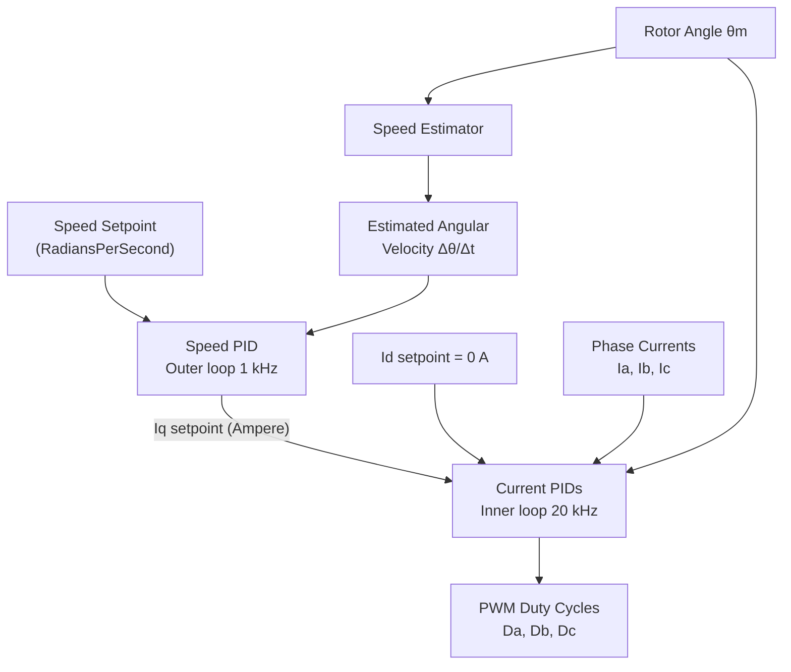
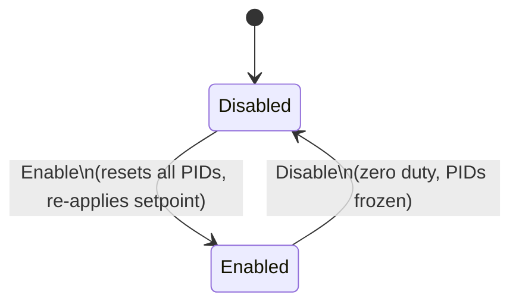
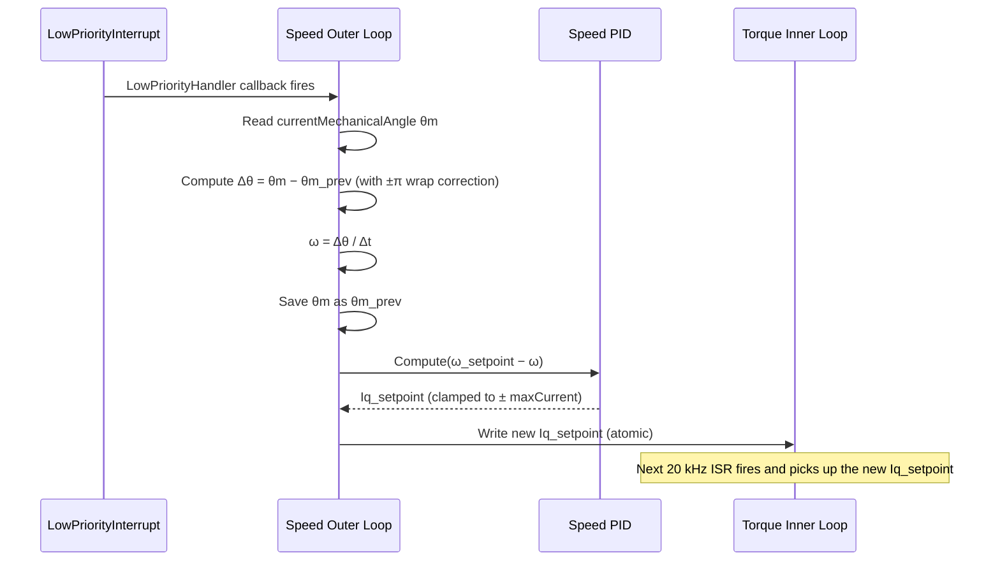
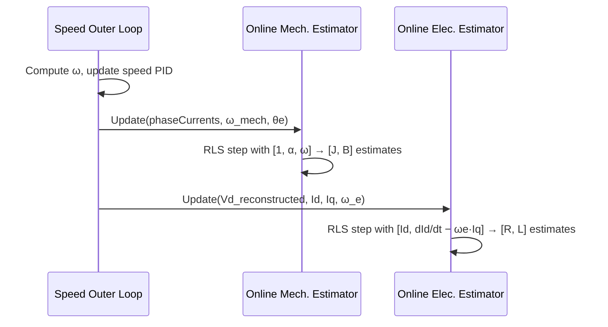

| Field     | Value             |
|-----------|-------------------|
| Title     | FOC Speed Control |
| Type      | design            |
| Status    | draft             |
| Version   | 0.1.0             |
| Component | foc-speed         |
| Date      | 2026-04-07        |

> **IMPORTANT — Implementation-blind document**: This document describes *behavior, structure, and
> responsibilities* WITHOUT referencing code. **No code blocks using programming languages (C++, C,
> Python, CMake, shell, etc.) are allowed.** Use Mermaid diagrams to express behavior instead.
> Prose descriptions of algorithms are encouraged; source-level details are not.
>
> **Diagrams**: All visuals must be either a Mermaid fenced code block (` ```mermaid `) or ASCII art inline
> in the document. External image references using Markdown image syntax are **not allowed**.

---

## Responsibilities

**Is responsible for:**
- Executing the two-level FOC cascade: an outer speed PID loop (1 kHz by default) and an inner current control loop (20 kHz)
- Estimating rotor angular velocity from successive mechanical angle samples using finite differences with wrap-around compensation
- Regulating rotor speed to the commanded setpoint in radians per second
- Producing the Iq (quadrature current) setpoint that drives the inner torque loop, bounded by a configurable current limit
- Registering an outer-loop callback with the `LowPriorityInterrupt` interface so that the outer loop fires at the correct prescale ratio
- Providing `OuterLoopFrequency()` so that the application can schedule the `LowPriorityInterrupt` at the correct rate
- Arming and resetting all three PID controllers (speed, d-axis, q-axis) on Enable / Disable

**Is NOT responsible for:**
- Reading phase currents or encoder position directly from hardware — these are supplied by the Runner
- Writing duty cycles to PWM hardware — duty cycles are returned to the Runner
- Position control or any loop beyond the speed layer
- Flux weakening (Id is always commanded to 0 A)

---

## Component Details

### Two-Loop Cascade Architecture

Speed control builds on the torque control loop by adding a supervisory outer loop. The two loops operate at different rates and in different interrupt contexts:

| Loop       | Rate   | Context                | Input                    | Output               |
|------------|--------|------------------------|--------------------------|----------------------|
| Inner loop | 20 kHz | High-priority FOC ISR  | Phase currents, θm       | PWM duty cycles      |
| Outer loop | 1 kHz  | Low-priority interrupt | θm from last inner cycle | Iq setpoint (Ampere) |

The inner loop is identical to the torque control loop described in the FOC Torque Control design document. The outer loop adds the speed PID and the speed estimation step.



### Outer Loop — Speed Estimation and Speed PID

The outer loop is triggered by the `LowPriorityInterrupt` at a prescale ratio determined by the ratio of the inner-loop frequency to the desired outer-loop frequency (e.g., 20 kHz / 1 kHz = 20 inner cycles per outer cycle).

**Speed estimation by finite difference:**

The angular velocity is estimated from the difference between the current mechanical angle sample and the previous angle sample, divided by the outer-loop period Δt:

```
ω = Δθ / Δt
```

Because the encoder angle wraps around at 2π, the raw angle difference may be discontinuous at the wrap boundary. Wrap-around compensation applies a correction: if the computed Δθ is greater than +π, it is shifted by −2π; if it is less than −π, it is shifted by +2π. This produces a signed angular velocity in the range (−π/Δt, +π/Δt) radians per second for any physical speed below half the Nyquist rate of the sampling interval.

**Speed PID:**

The speed PID receives the speed error (setpoint minus estimate) and produces the Iq setpoint. Its output is clamped to ± maxCurrent (in Ampere), which directly limits the peak torque the motor can apply while tracking the speed command. This clamp is the primary over-current protection for the speed-control mode.

The d-axis setpoint remains 0 A throughout.

### LowPriorityInterrupt — Outer Loop Scheduling

The `LowPriorityInterrupt` is an abstract scheduling interface. The speed control component registers its outer-loop handler with this interface at construction time. The inner-loop ISR counts cycles and triggers the `LowPriorityInterrupt` at the appropriate prescale ratio, causing the outer-loop handler to execute without RTOS involvement.

`OuterLoopFrequency()` returns the configured outer-loop rate so the application layer can assert or configure the LPI trigger frequency correctly.

### Enable and Disable

**Enable**: resets and arms all three PID controllers (speed, d-axis, q-axis). The last speed setpoint is preserved so the motor resumes commanding toward the previous target.

**Disable**: disarms all three PIDs. `Calculate()` returns zero duty cycles. The outer loop continues to receive its LPI callbacks but produces no Iq output while disarmed.



---

## Interfaces

### Provided

| Interface          | Purpose                                                              | Contract                                                                                   |
|--------------------|----------------------------------------------------------------------|--------------------------------------------------------------------------------------------|
| SetPolePairs       | Configures the pole-pair count for the electrical angle calculation. | Must be called before the first `Calculate()`. Must not be changed while Enabled.          |
| Enable             | Arms all three PIDs and resets their integrator state.               | Safe to call repeatedly. Speed setpoint is preserved.                                      |
| Disable            | Disarms all PIDs and forces zero duty cycle output.                  | Safe to call from any context.                                                             |
| SetCurrentTunings  | Sets P, I, D gains for the d-axis and q-axis current PIDs.           | Gains normalised by 1/(√3·Vdc) internally. Takes effect on the next `Calculate()`.         |
| SetSpeedTunings    | Sets P, I, D gains for the outer speed PID.                          | Output of speed PID is clamped to ± maxCurrent. Takes effect on the next outer-loop cycle. |
| SetPoint           | Sets the speed setpoint in radians per second.                       | Written atomically; used on the next outer-loop cycle.                                     |
| Calculate          | Executes the inner 20 kHz FOC torque loop for one cycle.             | Called from the FOC ISR; returns `PhasePwmDutyCycles`. Must not block.                     |
| OuterLoopFrequency | Returns the configured outer-loop frequency in Hz.                   | Pure query; no side effects. Can be called before Enable.                                  |
| SetOnlineMechanicalEstimator | Attaches an online mechanical parameter estimator (optional). | Estimator updated each outer-loop cycle. Enable/Disable managed externally (by the state machine). |
| SetOnlineElectricalEstimator | Attaches an online electrical parameter estimator (optional). | Reconstructed Vd supplied from inner-loop cached state. Assumes non-salient motor (Ld ≈ Lq). |

### Required

| Interface            | Purpose                                                                        | Contract                                                                                                                                                             |
|----------------------|--------------------------------------------------------------------------------|----------------------------------------------------------------------------------------------------------------------------------------------------------------------|
| LowPriorityInterrupt | Provides the callback registration point for the outer-loop speed PID handler. | The inner-loop ISR triggers the LPI at the correct prescale ratio. The outer-loop handler must execute within its own interrupt context, not the 20 kHz ISR context. |

---

## Data Model

| Entity            | Field      | Type / Unit              | Range               | Notes                                                    |
|-------------------|------------|--------------------------|---------------------|----------------------------------------------------------|
| Speed setpoint    | ω_sp       | RadiansPerSecond (float) | ± mechanical max    | Written by application; applied on next outer-loop tick  |
| Estimated speed   | ω          | RadiansPerSecond (float) | computed from Δθ/Δt | Computed each outer-loop cycle                           |
| Speed PID output  | Iq_sp      | Ampere (float)           | ± maxCurrent        | Written to inner loop; clamped by speed PID output limit |
| d-axis setpoint   | Id_sp      | Ampere (float)           | 0 A fixed           | SPMSM maximum torque per ampere                          |
| Previous angle    | θm_prev    | Radians (float)          | [0, 2π)             | Saved each outer cycle for finite-difference estimator   |
| Outer loop period | Δt         | Seconds (float)          | 1 / outer_frequency | Constant after construction                              |
| Pole pairs        | P          | Integer (unsigned)       | ≥ 1                 | Motor property                                           |
| Max current       | maxCurrent | Ampere (float)           | > 0                 | Upper bound on Iq setpoint from speed PID                |

---

## Sequence Diagrams

### Single Outer-Loop Cycle (1 kHz LPI Event)



### Online Estimator Update Within Outer-Loop Cycle

When online estimators are attached and enabled, each 1 kHz outer-loop cycle also feeds observations to them after the speed PID step:



`Vd_reconstructed` is the d-axis voltage back-computed from the last normalized Vd output of the inner loop and the DC bus voltage.

---

## Constraints & Limitations

| Constraint                     | Value / Description                                                                                        |
|--------------------------------|------------------------------------------------------------------------------------------------------------|
| Inner loop rate                | 20 kHz — called from the FOC ISR once per PWM period.                                                      |
| Outer loop rate                | Configurable; default 1 kHz. Must be a integer divisor of 20 kHz.                                          |
| Iq saturation                  | Speed PID output clamped to ± maxCurrent (Ampere). This limits peak torque.                                |
| Speed estimator wrap threshold | Assumes physical speed below π / Δt rad/s (half the Nyquist limit of the outer-loop sampling rate).        |
| No flux weakening              | Id = 0 is fixed. Operating above base speed without flux weakening is the application's responsibility.    |
| LPI scheduling                 | The outer loop does not use an RTOS. The inner loop ISR triggers the LPI — no timer or task involved.      |
| Cycle budget                   | Inner loop `Calculate()` must complete in < 400 cycles at 120 MHz.                                         |
| Setpoint atomicity             | The Iq setpoint written by the outer loop must be read atomically by the inner loop on 32-bit ARM targets. |
