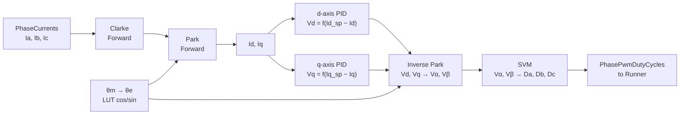
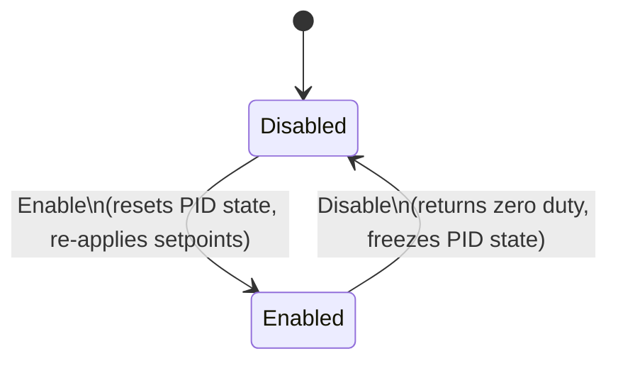

| Field     | Value              |
|-----------|--------------------|
| Title     | FOC Torque Control |
| Type      | design             |
| Status    | draft              |
| Version   | 0.1.0              |
| Component | foc-torque         |
| Date      | 2026-04-07         |

> **IMPORTANT — Implementation-blind document**: This document describes *behavior, structure, and
> responsibilities* WITHOUT referencing code. **No code blocks using programming languages (C++, C,
> Python, CMake, shell, etc.) are allowed.** Use Mermaid diagrams to express behavior instead.
> Prose descriptions of algorithms are encouraged; source-level details are not.
>
> **Diagrams**: All visuals must be either a Mermaid fenced code block (` ```mermaid `) or ASCII art inline
> in the document. External image references using Markdown image syntax are **not allowed**.

---

## Responsibilities

**Is responsible for:**
- Executing the innermost FOC current control loop at 20 kHz in interrupt context
- Converting three-phase stator currents to the rotor-synchronous dq frame via Clarke and Park transforms
- Regulating the d-axis current (Id) to its setpoint using a dedicated PID controller
- Regulating the q-axis current (Iq) to its setpoint using a dedicated PID controller
- Converting the resulting voltage demands back to three-phase PWM duty cycles via inverse Park and SVM
- Accepting a combined (Id, Iq) setpoint from an outer control loop or directly from an application
- Providing Enable and Disable transitions that safely reset internal PID state

**Is NOT responsible for:**
- Reading phase current values from the ADC hardware — currents are passed in as arguments
- Committing duty cycles to the PWM hardware — duty cycles are returned to the Runner
- Measuring or tracking rotor position — the mechanical angle is passed in as an argument
- Outer-loop speed or position control
- Flux weakening (Id ≠ 0 operation is structurally possible but not yet supported)

---

## Component Details

### Innermost Control Loop — 20 kHz ISR Execution

The torque control loop is the innermost layer of the FOC cascade. It is invoked once per PWM switching period (default 20 kHz) by the hardware interrupt handler that drives the three-phase inverter. The entire loop — from phase current input to duty cycle output — must complete within the interrupt budget.

The eleven-step sequence executed each cycle is:

1. Receive phase currents (Ia, Ib, Ic) as the `PhaseCurrents` argument.
2. Read the rotor mechanical angle θm from the `Radians` argument (supplied by the Runner from the encoder).
3. Compute the electrical angle: `θe = θm × pole_pairs`.
4. Evaluate `cos(θe)` and `sin(θe)` via the fast trigonometric LUT — one evaluation, results reused.
5. Clarke forward: (Ia, Ib) → (Iα, Iβ); Ic is derived from the balanced-phase constraint.
6. Park forward: (Iα, Iβ, θe) → (Id, Iq).
7. d-axis PID: error = Id_setpoint − Id → output = Vd.
8. q-axis PID: error = Iq_setpoint − Iq → output = Vq.
9. Inverse Park: (Vd, Vq, θe) → (Vα, Vβ).
10. Space vector modulation: (Vα, Vβ) → (duty_a, duty_b, duty_c).
11. Return `PhasePwmDutyCycles` to the Runner for immediate PWM register update.



### d-axis and q-axis PID Controllers

Two independent incremental PID controllers regulate the direct (d) and quadrature (q) current components independently. Both PIDs share the same structural properties:

- **Output clamping**: symmetric to [−1, +1], representing a normalised fraction of the DC bus voltage.
- **Anti-windup**: the integrator is clamped whenever the output reaches the saturation boundary, preventing integrator wind-up during transients.
- **Gain normalisation**: when `SetCurrentTunings()` is called, the raw proportional, integral, and derivative gains are scaled internally by `1 / (√3 · Vdc)`. This decouples the tuning parameters from the specific DC bus voltage, so gains remain meaningful across different supply configurations.
- **Incrementalism**: the PID uses the incremental (velocity) form, accumulating output from step to step, which naturally limits abrupt changes at Enable transitions.

The d-axis setpoint is normally 0 A for a surface PMSM (Id = 0 gives maximum torque per ampere). Setting Id_setpoint to a non-zero negative value for flux weakening is structurally possible but the operational consequences are outside the scope of this document.

### Enable and Disable

**Enable**: arms both the d-axis and the q-axis PID controllers and resets their internal integrator state to zero. The most recently stored setpoints (Id_setpoint, Iq_setpoint) are re-applied immediately — there is no rollback to zero. This allows seamless re-engagement after a brief disable event without a step change in the setpoint.

**Disable**: disarms both PIDs. While disarmed, the `Calculate()` method returns zero duty cycles regardless of the current error. PID state is frozen and will be fully reset on the next Enable call.

The two states are the only run-time states of this component:



### Pole-Pair Configuration

The pole-pair count is an integer property that translates the mechanical rotor angle supplied by the encoder into the electrical angle required by the Park transform. It must be configured before the first `Calculate()` call. Changing it while enabled produces undefined control behaviour and must be avoided.

---

## Interfaces

### Provided

| Interface         | Purpose                                                              | Contract                                                                                        |
|-------------------|----------------------------------------------------------------------|-------------------------------------------------------------------------------------------------|
| SetPolePairs      | Configures the motor's pole-pair count used in the θe calculation.   | Must be called before the first `Calculate()`. Must not be changed while Enabled.               |
| Enable            | Arms both PID controllers and resets their integrator state.         | Safe to call repeatedly. PIDs start from a clean state each time. Last setpoints are preserved. |
| Disable           | Disarms both PID controllers and forces zero duty cycle output.      | Safe to call from any context. `Calculate()` returns zero while disabled.                       |
| SetCurrentTunings | Provides proportional, integral, and derivative gains for both PIDs. | Gains are internally normalised by 1/(√3·Vdc). Takes effect on the next `Calculate()` call.     |
| SetPoint          | Sets the (Id, Iq) current setpoint in Ampere.                        | New setpoint is used on the next `Calculate()` invocation. Can be called while Enabled.         |
| Calculate         | Executes the full 11-step FOC torque loop for one control cycle.     | Must be called at 20 kHz from ISR context. Returns `PhasePwmDutyCycles`. Must not block.        |

### Required

| Interface | Purpose                                                                                                                        | Contract |
|-----------|--------------------------------------------------------------------------------------------------------------------------------|----------|
| None      | The inverter and encoder are managed externally by the Runner; they are not accessed directly by the torque control component. | —        |

---

## Data Model

| Entity            | Field        | Type / Unit           | Range           | Notes                                            |
|-------------------|--------------|-----------------------|-----------------|--------------------------------------------------|
| Phase currents    | Ia, Ib, Ic   | Ampere (float)        | ± motor rated A | Ic derived; passed in from ADC callback          |
| Synchronous frame | Id, Iq       | Ampere (float)        | ± motor rated A | Regulated quantities                             |
| Current setpoint  | Id_sp, Iq_sp | Ampere (float)        | ± motor rated A | Id_sp = 0 for SPMSM MTPA; Iq_sp from application |
| Voltage demands   | Vd, Vq       | Dimensionless (float) | [−1, +1]        | PID output; normalised to DC bus                 |
| Duty cycles       | Da, Db, Dc   | Dimensionless (float) | [0.0, 1.0]      | Returned to Runner for PWM register write        |
| Mechanical angle  | θm           | Radians (float)       | [0, 2π)         | Supplied by Runner; pole-pairs multiply to θe    |
| Electrical angle  | θe           | Radians (float)       | [0, 2π)         | θm × pole_pairs; used for Park and inverse Park  |
| Pole pairs        | P            | Integer (unsigned)    | ≥ 1             | Motor property; configured once at startup       |

---

## Constraints & Limitations

| Constraint                      | Value / Description                                                                                       |
|---------------------------------|-----------------------------------------------------------------------------------------------------------|
| Control loop rate               | 20 kHz — must be called once per PWM switching period from the FOC interrupt.                             |
| Cycle budget                    | < 400 cycles at 120 MHz for the full `Calculate()` execution.                                             |
| No virtual dispatch in hot path | `Calculate()` must not incur virtual function call overhead.                                              |
| Output duty cycle format        | Normalised floating-point [0.0, 1.0]; conversion to PWM timer counts is the Runner's responsibility.      |
| Electrical angle wrapping       | Handled by the LUT normalisation within FastTrigonometry — no explicit modulo operation required in loop. |
| Gain normalisation dependency   | `SetCurrentTunings()` requires the DC bus voltage (Vdc) to be known at configuration time.                |
| No flux weakening               | Id_setpoint ≠ 0 is structurally accepted but operational flux-weakening strategy is not yet defined.      |
| PID state at Enable             | Integrators are always zeroed on Enable, regardless of previous state.                                    |
