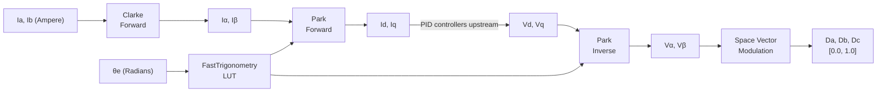

| Field     | Value                       |
|-----------|-----------------------------|
| Title     | FOC Mathematical Transforms |
| Type      | design                      |
| Status    | draft                       |
| Version   | 0.1.0                       |
| Component | foc-transforms              |
| Date      | 2026-04-07                  |

> **IMPORTANT — Implementation-blind document**: This document describes *behavior, structure, and
> responsibilities* WITHOUT referencing code. **No code blocks using programming languages (C++, C,
> Python, CMake, shell, etc.) are allowed.** Use Mermaid diagrams to express behavior instead.
> Prose descriptions of algorithms are encouraged; source-level details are not.
>
> **Diagrams**: All visuals must be either a Mermaid fenced code block (` ```mermaid `) or ASCII art inline
> in the document. External image references using Markdown image syntax are **not allowed**.

---

## Responsibilities

**Is responsible for:**
- Converting three-phase stator currents to a two-phase stationary frame (Clarke transform)
- Converting between the stationary αβ frame and the rotor-synchronous dq frame (Park transform)
- Providing a composite Clarke → Park (and inverse) operation that evaluates trigonometric functions exactly once per call
- Converting a two-component voltage vector in the αβ frame to three-phase PWM duty cycles (Space Vector Modulation)
- Supplying fast sine and cosine approximations via a pre-computed lookup table for use in the FOC hot path

**Is NOT responsible for:**
- Reading or writing hardware peripherals (ADC, PWM, encoder)
- Managing PID controllers or setpoints
- Determining rotor position — electrical angle must be supplied by the caller
- Any control strategy decisions (torque, speed, or position setpoints)
- Scaling voltage vectors to physical units — inputs and outputs are normalised fractions relative to the DC bus

---

## Component Details

### Clarke Transform — Three-Phase to Stationary αβ Frame

The Clarke transform is a geometric projection that reduces a balanced three-phase system to an equivalent two-axis representation. It requires no knowledge of rotor position.

**Forward transform** (currents 3-phase → αβ):

The α component is identical to phase-A current.  
The β component combines phase-A and phase-B with a 1/√3 scaling factor:

```
Iα = Ia
Iβ = (Ia + 2·Ib) / √3
```

The third phase current Ic is not measured directly; it is derived from the balanced-system constraint `Ia + Ib + Ic = 0`. This two-sensor topology reduces hardware cost at the cost of assuming ideal phase balance.

**Inverse transform** (voltages αβ → 3-phase):

Reconstructs the three-phase voltage references from Vα and Vβ, using the same geometric relationships in reverse. The output of the inverse Clarke is fed into the Space Vector Modulator.

**Invariants:**
- The input system must be balanced (sum of the three phase values is zero).
- The transform is purely linear and involves no state — every call is independent.

### Park Transform — Stationary αβ to Rotor-Synchronous dq Frame

The Park transform rotates the stationary αβ frame to align with the rotor magnetic field. The result is a coordinate frame that is stationary relative to the rotor, so DC steady-state values represent constant torque and flux components.

**Forward transform** (αβ → dq):

```
Id =  Iα·cos(θe) + Iβ·sin(θe)
Iq = −Iα·sin(θe) + Iβ·cos(θe)
```

The d-axis (direct) current component is aligned with the rotor flux. For a surface-permanent-magnet synchronous motor (SPMSM), the d-axis setpoint is held at zero to maximise torque per ampere. The q-axis (quadrature) current is proportional to electromagnetic torque.

**Inverse transform** (dq → αβ):

```
Vα = Vd·cos(θe) − Vq·sin(θe)
Vβ = Vd·sin(θe) + Vq·cos(θe)
```

The inverse Park transform is applied after the PID controllers produce voltage demands Vd and Vq, converting them back to the stationary frame for SVM processing.

**Electrical angle:**

The electrical angle θe is obtained by multiplying the mechanical rotor angle θm by the motor's pole-pair count P:

```
θe = θm · P
```

The caller is responsible for supplying the correct θe.

**Invariants:**
- The same θe (and therefore the same cos/sin pair) must be used for both the forward Park in the current-sensing path and the inverse Park in the voltage-output path within a single control cycle.
- The transform is stateless — no memory of previous cycles.

### Composite ClarkePark — Chained Transform with Single Trigonometric Evaluation

The ClarkePark composite combines the forward Clarke and forward Park transforms (or their inverses) into a single operation. The motivation is efficiency: cos(θe) and sin(θe) are computed exactly once and reused for both the Park rotation in the forward direction and the inverse Park rotation.

The forward composite takes (Ia, Ib, θe) and produces (Id, Iq) directly.  
The inverse composite takes (Vd, Vq, θe) and produces (Vα, Vβ) directly.

This is the form used by all inner-control-loop implementations in this project.

### Space Vector Modulation — αβ Voltage Vector to PWM Duty Cycles

Space Vector Modulation (SVM) maps a two-component voltage reference vector in the αβ plane to three symmetrical PWM duty cycles. The αβ plane is divided into six sectors (numbered 0–5), each covering a 60-degree arc of the regular hexagon inscribed in the modulation boundary circle.

**Sector determination:**

The active sector is determined from the signs and relative magnitudes of Vα and Vβ. Each sector selects a unique pair of active voltage vectors (non-zero switching states) that bracket the reference vector.

**Dwell time calculation:**

Within the selected sector, the reference vector is decomposed into components along the two active voltage vectors. The two resulting dwell times (T1 and T2) sum to less than the full switching period; the remainder is distributed equally between the two null vectors V0 (all phases low) and V7 (all phases high) to maintain switching symmetry.

**Duty cycle output:**

Phase duty cycles are computed from T1, T2, and the null-vector times. Output values are saturated to the range [0.0, 1.0] and represent the fraction of the switching period during which each phase is in the high state.

**Constraints:**
- Input Vα, Vβ are normalised fractions relative to the DC bus (dimensionless, typically in [−1, +1]).
- Output duty cycles are in the range [0.0, 1.0]; values outside this range are clamped.
- SVM does not accept angles directly — it operates only on the (Vα, Vβ) pair.


### Fast Trigonometry — Lookup-Table Sine and Cosine

Direct hardware transcendental functions (`sin`, `cos`) introduce variable latency and are unsuitable for a 20 kHz ISR. A 512-entry pre-computed lookup table (LUT) covering one full period [0, 2π) provides both sine and cosine with bounded, cycle-predictable evaluation time.

**LUT characteristics:**
- 512 entries, each a 32-bit floating-point value
- Stored in ROM (read-only, `constexpr`) at a 16-byte memory alignment boundary
- Total ROM footprint: 512 × 4 bytes = 2 048 bytes (2 KB)
- Covers exactly one full period; the angle is normalised to [0, 2π) before indexing

**Cosine** is derived from the sine LUT by a quarter-period index offset — no separate cosine table is required.

**Interpolation:** Linear interpolation between adjacent LUT entries provides accuracy sufficient for FOC applications; the quantisation error is below the noise floor of 12-bit ADC current sensing.

---

## Interfaces

### Provided

| Interface                        | Purpose                                       | Contract                                                                                                                    |
|----------------------------------|-----------------------------------------------|-----------------------------------------------------------------------------------------------------------------------------|
| Clarke — Forward                 | Converts (Ia, Ib) to (Iα, Iβ)                 | Ic is derived internally; inputs must satisfy the balanced-phase assumption. Output is immediately valid.                   |
| Clarke — Inverse                 | Converts (Vα, Vβ) to (Va, Vb, Vc)             | Produces all three phase voltages. The sum of outputs is zero.                                                              |
| Park — Forward                   | Converts (Iα, Iβ, θe) to (Id, Iq)             | Caller supplies pre-computed or LUT-evaluated cos(θe) and sin(θe). Stateless.                                               |
| Park — Inverse                   | Converts (Vd, Vq, θe) to (Vα, Vβ)             | Uses the same θe as the forward Park in the same control cycle.                                                             |
| ClarkePark — Forward             | Converts (Ia, Ib, θe) to (Id, Iq) in one call | Computes cos/sin once; result is identical to chaining Clarke then Park separately.                                         |
| ClarkePark — Inverse             | Converts (Vd, Vq, θe) to (Vα, Vβ) in one call | Computes cos/sin once; result is identical to chaining inverse Park then inverse Clarke separately.                         |
| SpaceVectorModulation — Generate | Converts (Vα, Vβ) to three duty cycles        | Inputs must be normalised fractions. Outputs are always in [0.0, 1.0]. Sector detection and null-vector split are internal. |
| FastTrigonometry — Sine          | Returns an approximation of sin(θ)            | θ is normalised to [0, 2π) internally. ROM LUT; no floating-point transcendental at runtime.                                |
| FastTrigonometry — Cosine        | Returns an approximation of cos(θ)            | Derived from the sine LUT via a quarter-period offset. Same ROM, no additional storage.                                     |

### Required

| Interface | Purpose                                                                        | Contract |
|-----------|--------------------------------------------------------------------------------|----------|
| None      | All transforms are pure mathematical algorithms with no external dependencies. | —        |

---

## Data Model

| Entity              | Field      | Type / Unit           | Range           | Notes                                           |
|---------------------|------------|-----------------------|-----------------|-------------------------------------------------|
| Three-phase current | Ia, Ib     | Ampere (float)        | ± rated current | Ic derived; not stored                          |
| Stationary frame    | Iα, Iβ     | Ampere (float)        | ± rated current | Output of Clarke forward                        |
| Synchronous frame   | Id, Iq     | Ampere (float)        | ± rated current | Output of Park forward                          |
| Voltage demand      | Vd, Vq     | Dimensionless (float) | [−1, +1]        | Normalised to DC bus                            |
| Stationary voltage  | Vα, Vβ     | Dimensionless (float) | [−1, +1]        | Output of inverse Park / input to SVM           |
| Phase duty cycles   | Da, Db, Dc | Dimensionless (float) | [0.0, 1.0]      | Clamped; 0 = always low, 1 = always high        |
| Electrical angle    | θe         | Radians (float)       | [0, 2π)         | θm × pole_pairs; normalised before LUT indexing |
| LUT                 | Sine table | float[512]            | [−1.0, +1.0]    | constexpr; 2 KB ROM; 16-byte aligned            |

---

## Block Diagram



---

## Constraints & Limitations

| Constraint                      | Value / Description                                                                                  |
|---------------------------------|------------------------------------------------------------------------------------------------------|
| Two-sensor current topology     | Ic is derived, not measured. Clarke forward is invalid if the three-phase system is unbalanced.      |
| LUT ROM footprint               | 2 048 bytes (2 KB) of read-only memory.                                                              |
| LUT accuracy                    | Approximation error is bounded and below the noise floor of 12-bit ADC current sensing.              |
| SVM input normalisation         | Vα, Vβ must be dimensionless fractions in [−1, +1] relative to the DC bus, not physical volt values. |
| SVM output saturation           | Duty cycles are clamped to [0.0, 1.0]. Over-modulation is silently saturated, not flagged.           |
| Electrical angle responsibility | The caller is responsible for computing θe = θm × pole_pairs before invoking any Park operation.     |
| Stateless transforms            | No transform retains state between calls. Every call is independent.                                 |
| Hot-path constraint             | All transforms must execute within the cycle budget of the 20 kHz FOC interrupt.                     |
