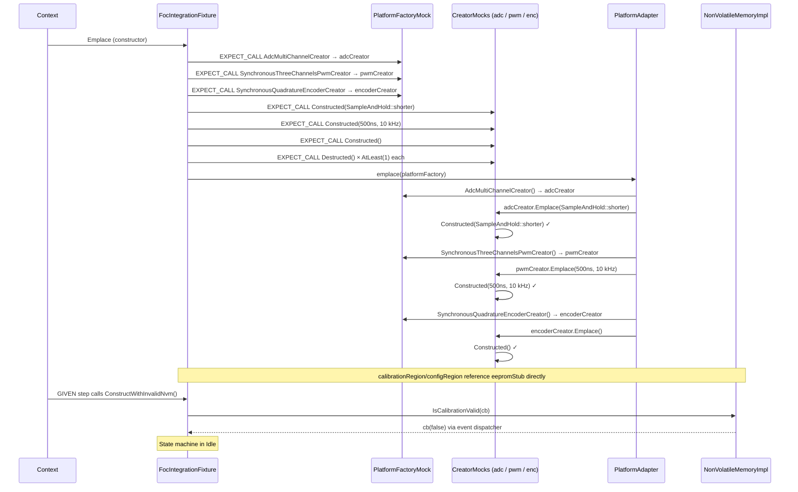
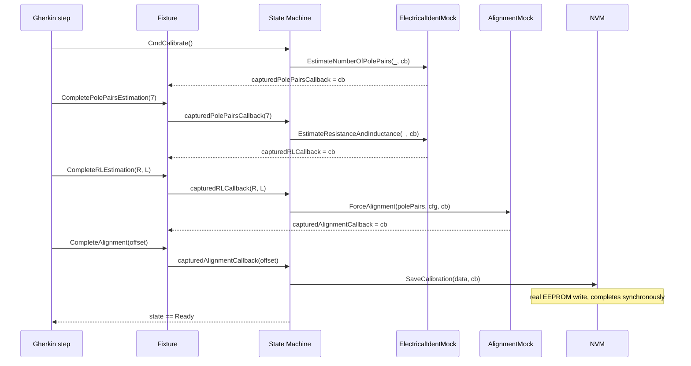
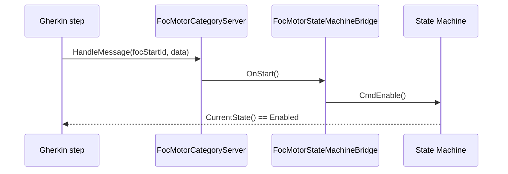

| Field     | Value                      |
|-----------|----------------------------|
| Title     | Integration Testing Design |
| Type      | design                     |
| Status    | draft                      |
| Version   | 0.2.0                      |
| Component | integration-testing        |
| Date      | 2026-04-12                 |

> **Note — Design-level document**: This document describes *how the integration tests are implemented*. It expands on the architecture by specifying component responsibilities, data flows, and design decisions that would not be obvious to a reviewer unfamiliar with the system.
>
> **Diagrams**: All visuals must be Mermaid fenced code blocks or ASCII art. External image references are **not allowed**.

---

## Overview

This document covers the design of the `integration_tests/` suite. It references the integration testing architecture in `documentation/architecture/system.md` (section: Integration Testing) for the high-level context and the requirements (`documentation/requirements/`) for the acceptance criteria each scenario verifies.

The test suite uses the **amp-cucumber-cpp-runner v4.0.0** framework. Scenarios are authored in Gherkin (`.feature` files). Step definitions share state through a typed context (`context.Get<FocIntegrationFixture>()`).

---

## Responsibilities

**Is responsible for:**
- Providing a shared test context (`FocIntegrationFixture`) that owns and wires all system-under-test components for each Cucumber scenario
- Mocking hardware peripherals (ADC, PWM, encoder) through proxy creators so the real Platform Adapter runs unchanged
- Supplying an in-memory EEPROM stub so the full NVM stack executes synchronously without embedded hardware
- Enabling step-by-step async callback control for calibration sequence testing
- Injecting CAN commands directly into the category server to verify state machine transitions independently of CAN transport encoding

**Is NOT responsible for:**
- Testing FOC control algorithm correctness — covered by unit tests in `core/foc/implementations/test/`
- Testing CAN framing or transport encoding — covered by `can-lite` unit and integration tests
- Running on an embedded target — host-only suite

### Platform Factory Mock

The Platform Factory Mock is a pure GMock — it contains only `MOCK_METHOD` declarations for all pure virtual methods of `PlatformFactory`. No creator members or inner stubs live inside it.

The fixture owns the hardware mock instances and the `infra::CreatorMock<>` proxies that wrap them. The `PlatformFactoryMock`'s creator-method expectations are set up in the fixture constructor to return references to these proxies. When the `PlatformAdapter` is constructed it calls `Emplace()` on each creator, which fires the `Constructed()` mock method; on destruction `Destructed()` is called.

Hardware mocks owned by the fixture:

| Mock class                                    | Wrapped type                       | `Constructed()` args                                 |
|-----------------------------------------------|------------------------------------|------------------------------------------------------|
| `StrictMock<AdcPhaseCurrentMeasurementMock>`  | `AdcPhaseCurrentMeasurement`       | `PlatformFactory::SampleAndHold::shorter`            |
| `StrictMock<SynchronousThreeChannelsPwmMock>` | `hal::SynchronousThreeChannelsPwm` | `std::chrono::nanoseconds{500}`, `hal::Hertz{10000}` |
| `StrictMock<QuadratureEncoderDecoratorMock>`  | `QuadratureEncoderDecorator`       | *(none)*                                             |

The `EepromStub` (512-byte in-memory array, all `0xFF` at construction, synchronous R/W) is a separate non-mock class owned by the fixture. The NVM regions reference the stub directly.

### FOC Integration Fixture

Central test fixture (`FocIntegrationFixture`) shared across all scenarios via the Cucumber context. Member construction order is declaration order; the key constraint is that the `PlatformAdapter` must be constructed after the creator-method expectations are registered.

Lifecycle of each scenario:

The `FocStateMachineImpl` is always constructed with `AutoTransitionPolicy` so that test steps can call `CmdCalibrate()`, `CmdEnable()` and `CmdDisable()` directly without going through the terminal CLI.

### State Machine Bridge

`FocMotorStateMachineBridge` implements `FocMotorCategoryServerObserver` and delegates the relevant lifecycle commands to `FocStateMachineBase`:

| CAN observer callback | State machine method |
|-----------------------|----------------------|
| `OnStart()`           | `CmdEnable()`        |
| `OnStop()`            | `CmdDisable()`       |
| `OnClearFault()`      | `CmdClearFault()`    |
| All others            | no-op                |

---

## Component Details

### Calibration Flow

The calibration scenario requires step-by-step control of async callbacks. The fixture captures each service callback as a member:

### CAN Integration

To keep scenarios focused on the state machine response rather than CAN wire encoding, CAN frames are injected via `FocMotorCategoryServer::HandleMessage()` directly. A `CanFrameTransport` backed by a `StrictMock<hal::CanMock>` is still required because the server sends acknowledgement frames via the transport.

---

## Interfaces

### Provided to Step Definitions

The `FocIntegrationFixture` exposes the following test API consumed by Gherkin step definitions:

| Method | Purpose |
|--------|---------|
| `ConstructWithInvalidNvm()` | Constructs the state machine with an empty EEPROM — starts in Idle |
| `ConstructWithValidNvm(data)` | Pre-populates EEPROM and constructs the state machine — starts in Ready |
| `SetupCalibrationExpectations()` | Arms the pole-pairs estimation mock to capture its callback |
| `CompletePolePairsEstimation(n)` | Fires the captured pole-pairs callback with a success result |
| `CompleteRLEstimation(R, L)` | Fires the captured R/L callback and arms the alignment mock |
| `CompleteAlignment(offset)` | Fires the captured alignment callback, triggering NVM save |
| `SetupCanIntegration()` | Wires the CAN category server and bridge to the state machine |
| `InjectCanStart()` | Injects a CAN Start message via `FocMotorCategoryServer::HandleMessage` |
| `InjectCanStop()` | Injects a CAN Stop message via `FocMotorCategoryServer::HandleMessage` |
| `InjectCanClearFault()` | Injects a CAN ClearFault message via `FocMotorCategoryServer::HandleMessage` |

### Required from System Under Test

| Component | Interface | Purpose |
|-----------|-----------|----------|
| FOC State Machine | `FocStateMachineBase` | Lifecycle commands and state inspection |
| Non-Volatile Memory | `NonVolatileMemory` | Calibration data load and save for the NVM-boot path |
| CAN Category Server | `FocMotorCategoryServer` | CAN command dispatch via `HandleMessage` |
| Electrical Identification | `ElectricalParametersIdentification` | Controlled via mock in calibration scenarios |
| Motor Alignment | `MotorAlignment` | Controlled via mock in calibration scenarios |
| Fault Notifier | `FaultNotifier` | Triggered via mock to test hardware-fault transitions |

---

## Feature-to-Requirements Mapping

| Feature file                      | Scenarios                                                                           | Requirements covered                                                                               |
|-----------------------------------|-------------------------------------------------------------------------------------|----------------------------------------------------------------------------------------------------|
| `state_machine_lifecycle.feature` | Idle on boot, calibration start, enable/disable, fault, fault clear, valid NVM boot | REQ-SM-001..010                                                                                    |
| `calibration_flow.feature`        | Full calibration success, calibration failure                                       | REQ-SM-003..005, REQ-SM-011                                                                        |
| `can_foc_motor.feature`           | CAN Start, CAN Stop, CAN ClearFault                                                 | REQ-INT-001..003 (REQ-INT-004 is structural — verified by bridge design, not a dedicated scenario) |
