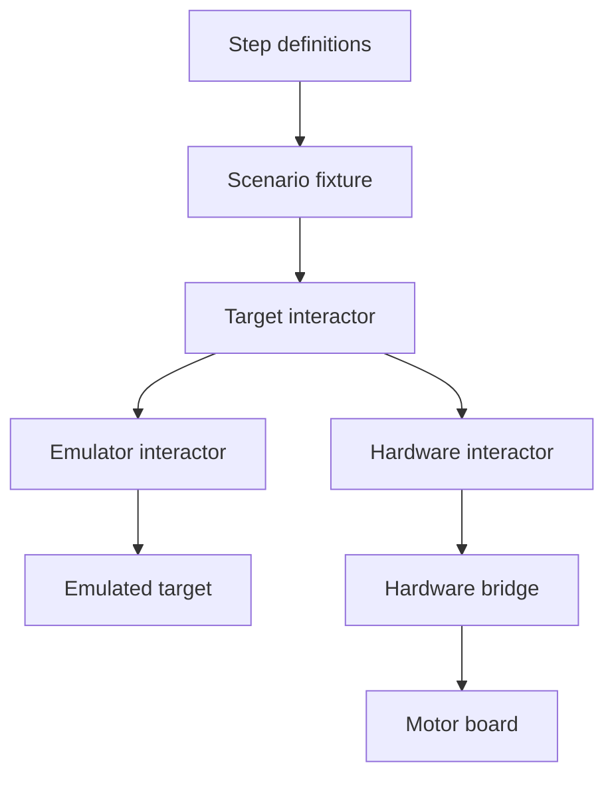
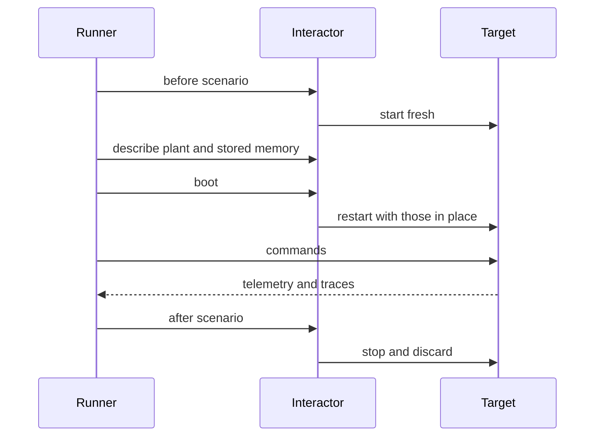

| Field     | Value                      |
|-----------|----------------------------|
| Title     | Integration Testing Design |
| Type      | design                     |
| Status    | accepted                   |
| Version   | 1.0.0                      |
| Component | integration-testing        |
| Date      | 2026-09-21                 |

> **Note — Design-level document**: This document describes *how the integration tests are
> structured*. It expands on the architecture by specifying component responsibilities, data flows,
> and design decisions that would not be obvious to a reviewer unfamiliar with the system.
>
> **Diagrams**: All visuals must be Mermaid fenced code blocks or ASCII art. External image
> references are **not allowed**.

---

## Overview

The suite is a **black-box driver**. It starts a target running the real firmware, speaks to it
over the product's own CAN command set, and asserts on the telemetry and traces that come back. It
does not reach into the firmware, does not mock its components, and knows nothing of its internal
types.

Scenarios are authored in Gherkin and live in a single directory. A tag decides which target
implements a scenario, and the runner is invoked with that tag.

| Tag               | Target                                           | Detailed in                                    |
|-------------------|--------------------------------------------------|------------------------------------------------|
| `@sil`            | Real firmware under an emulator, simulated motor | `documentation/design/software-in-the-loop.md` |
| `@sil-protection` | The same, board-protection scenarios held apart  | The same document, Part E                      |
| `@hil`            | Real firmware on hardware, over the bridge       | This document                                  |

> Earlier revisions described an in-process host fixture that mocked the platform and drove the
> state machine directly. No such fixture exists, and none is planned: mocking the platform and
> then asserting on the state machine tests the wiring of the test, not the product.

---

## Responsibilities

**Is responsible for:**
- Starting, stopping and isolating a target for each scenario
- Presenting one interactor seam so a scenario reads the same whichever target implements it
- Encoding commands and decoding telemetry on the product's wire format
- Describing the simulated world a software-in-the-loop target runs in

**Is NOT responsible for:**
- Control algorithm correctness in the small — that is what the unit tests under each library cover
- CAN framing and payload layout — that is the wire contract tests' job
- Substituting for hardware-in-the-loop, which alone exercises silicon, timing and analogue paths

---

## Component Details

### The interactor seam

Everything a scenario needs from a target sits behind one interface: lifecycle, command and
telemetry transport, and — for a simulated target only — the world the firmware runs in.

```mermaid
graph TD
    STEPS["Step definitions"] --> FIXTURE["Scenario fixture"]
    FIXTURE --> SEAM["Target interactor"]
    SEAM --> SIL["Emulator interactor"]
    SEAM --> HIL["Hardware interactor"]
    SIL --> QEMU["Emulated target"]
    HIL --> BRIDGE["Hardware bridge"]
    BRIDGE --> BOARD["Motor board"]
```

The simulation seam — describe the plant, describe stored memory, restart — defaults to doing
nothing and to reporting that simulation is unsupported. A hardware target inherits that default,
and a scenario that configures a plant fails loudly rather than quietly testing something else.

### Scenario lifecycle

Each scenario gets a fresh target. Setup accumulates in the scenario's own state and is applied in
a single restart, so a scenario that describes a plant, a calibration and a set of algorithms still
starts the target once rather than once per description.

```mermaid
sequenceDiagram
    participant R as Runner
    participant I as Interactor
    participant T as Target
    R->>I: before scenario
    I->>T: start fresh
    R->>I: describe plant and stored memory
    R->>I: boot
    I->>T: restart with those in place
    R->>T: commands
    T-->>R: telemetry and traces
    R->>I: after scenario
    I->>T: stop and discard
```

### Observation

Three channels, all of them the product's own:

- **Telemetry** carries the lifecycle state, the fault code, and the measured speed and position.
- **Command acknowledgements** carry acceptance or the reason for refusal.
- **Traces** carry what the firmware decided, most importantly which algorithm each loop ended up
  running, which can differ from what was asked for.
- **Plant trajectory**, on a simulated target only, carries what the motor actually did, sampled
  on the control-tick time base, and the tick each command frame was delivered on. This is the
  channel the performance and disturbance scenarios measure; see the software-in-the-loop design.

Trace output only drains while the target's event loop has work, so an assertion that waits for a
trace polls telemetry rather than waiting passively. Trace lines are retained across the frames the
command path reads, and cleared per scenario and per restart, so an assertion cannot match a line
from an earlier boot.

### Isolation

Scenarios ran into each other through three shared resources, all now per session: the working
directory holding the target's files, the socket carrying frames, and the captured output.

---

## Interfaces

### Provided to step definitions

| Capability        | Purpose                                                         |
|-------------------|-----------------------------------------------------------------|
| Lifecycle         | Start, stop and restart the target                              |
| Command transport | Send a category command and await its acknowledgement           |
| Telemetry         | Await a state, a fault code, or read the measured position      |
| Serial capture    | Drain and search the target's trace output                      |
| Simulation        | Describe the plant and the stored calibration and configuration |
| Response          | Capture the plant trajectory and measure step and disturbance metrics on it |

### Required from the system under test

- A CAN command set covering mode selection, calibration, alignment, enable, disable, setpoints,
  telemetry requests and fault clearing
- Telemetry reporting state, fault code, measured speed and measured position
- Traces naming the algorithm each control loop is running
- For a simulated target, that it read its plant description at boot

No test-only command is added to the product to make the suite work.

---

## Feature-to-Requirements Mapping

Each scenario carries the requirement identifiers it verifies as tags alongside its runner tag.
The traceability matrix is generated from those tags during release, reading the feature directory
directly, so the mapping lives with the scenarios rather than in this document where it would rot.
