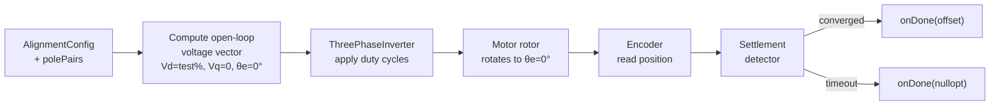
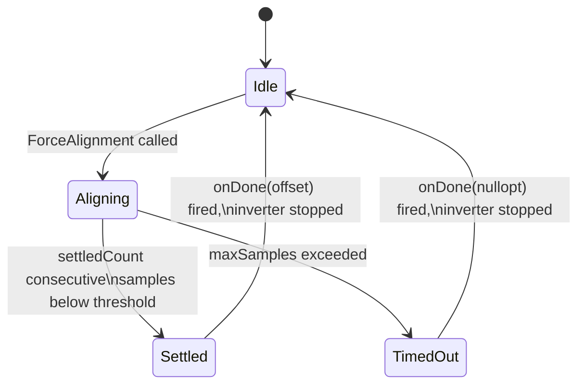

| Field     | Value                   |
|-----------|-------------------------|
| Title     | Service: Motor Alignment |
| Type      | design                  |
| Status    | draft                   |
| Version   | 0.1.0                   |
| Component | service-alignment       |
| Date      | 2026-04-07              |

> **IMPORTANT — Implementation-blind document**: This document describes *behavior, structure, and
> responsibilities* WITHOUT referencing code. **No code blocks using programming languages (C++, C,
> Python, CMake, shell, etc.) are allowed.** Use Mermaid diagrams to express behavior instead.
> Prose descriptions of algorithms are encouraged; source-level details are not.
>
> **Diagrams**: All visuals must be either a Mermaid fenced code block (` ```mermaid `) or ASCII art inline
> in the document. External image references using Markdown image syntax are **not allowed**.

---

## Responsibilities

**Is responsible for:**
- Calibrating the encoder zero-offset so that the encoder frame and the motor's electrical rotor frame are aligned (position = 0 in the encoder corresponds to electrical angle = 0° in the rotor)
- Applying an open-loop DC voltage vector at electrical angle 0° via the three-phase inverter to force the rotor to a known magnetic position
- Detecting rotor settlement by monitoring encoder position change over consecutive samples
- Reporting the calibrated encoder offset (in radians) via a single completion callback on success, or reporting failure if the rotor does not settle within the allowed time
- Stopping the inverter cleanly after the procedure completes, whether successfully or not
- Enforcing mutual exclusion: silently ignoring re-entry while an alignment is already in progress

**Is NOT responsible for:**
- Persisting the returned encoder offset to NVM — that is the caller's decision
- Running during normal FOC operation — the FOC loop must be stopped by the caller before alignment begins
- Measuring or interpreting motor electrical parameters (R, L, pole pairs)
- Providing any feedback during the alignment beyond the single completion callback

---

## Component Details

### Preconditions and Configuration

Before invoking alignment, the caller must have:

1. Stopped the normal FOC loop so the three-phase inverter is not claimed by a current control loop.
2. Provided the number of pole pairs for the motor under test.
3. Constructed an `AlignmentConfig` specifying:
   - **test voltage percent** — fraction of DC bus voltage (0–100 %) applied to the d-axis during the procedure
   - **sampling frequency** — the rate at which encoder samples are taken and settlement is checked (Hz)
   - **max samples** — the total number of sampling ticks before the procedure times out
   - **settled threshold** — the maximum absolute encoder position change (radians) that qualifies as "not moving"
   - **settled count** — the number of consecutive below-threshold samples required to declare settlement

These parameters are tuned by the application engineer for the specific motor and mechanical load. A typical configuration applies 10–20 % of bus voltage and requires 20 consecutive samples within 0.001 rad of one another before declaring settlement.

### Open-Loop Voltage Application

The alignment service drives the inverter directly in open-loop mode, bypassing all current feedback. It synthesises a stationary voltage vector by computing the inverse Clarke and inverse Park transforms with:

- d-axis voltage = test_voltage_percent / 100 (normalised to DC bus)
- q-axis voltage = 0 (no torque component)
- electrical angle = 0°

The resulting three-phase duty cycles are submitted to the inverter each sampling tick for the duration of the procedure. Because the q-axis component is zero, the resulting stator field is purely aligned with the d-axis at 0°. A surface PMSM or BLDC rotor will rotate to align its permanent-magnet d-axis with this field and remain there.



### Settlement Detection

Settlement detection is a simple sliding window state machine. At each sampling tick (controlled by the inverter's ADC interrupt callback):

1. The encoder position is read.
2. The absolute difference between the current and previous position sample is computed.
3. If this difference is below `settledThreshold`, the consecutive-settlement counter is incremented; otherwise the counter is reset to zero.
4. If the counter reaches `settledCount`, the rotor is declared settled.
5. If the total sample count reaches `maxSamples` without settlement, a timeout is declared.

The encoder position at the moment of settlement declaration becomes the calibration offset. This offset represents the mechanical angle the rotor adopts when the electrical d-axis is at 0°; subtracting it from any subsequent encoder reading yields the corrected angle for the closed-loop FOC controller.

### State Machine

The service follows a four-state machine:



While in the **Aligning** state, any further call to `ForceAlignment` is silently ignored — the service will not restart or nest. Only one alignment may be in progress at any time. Transitions out of the **Aligning** state always stop the inverter before invoking the callback, so the caller's callback receives control only after the hardware is in a safe, stopped state.

### Completion Callback Semantics

The `onDone` callback accepts a single `std::optional<Radians>` argument:

- `std::optional` with a value: alignment succeeded; the contained value is the encoder offset in radians.
- Empty `std::optional`: alignment failed (timeout); the caller should not use any offset and may retry.

The callback fires exactly once per `ForceAlignment` invocation. The callback is reset (using `infra::AutoResetFunction` semantics) after firing so that stale references cannot cause a second invocation.

---

## Interfaces

### Provided

| Interface | Purpose | Contract |
|-----------|---------|----------|
| `ForceAlignment(polePairs, AlignmentConfig, onDone)` | Starts the alignment procedure using the supplied configuration; reports the calibrated encoder offset (or failure) via `onDone` when complete | Silently ignored if already aligning; `onDone` fires exactly once; inverter is stopped before `onDone` is called |

### Required

| Interface | Purpose | Contract |
|-----------|---------|----------|
| `ThreePhaseInverter` | Open-loop voltage application during alignment; source of ADC sampling callbacks that drive the settlement state machine | Must not be concurrently claimed by any other controller during the alignment procedure |
| `Encoder` | Reads the current rotor mechanical angle at each sampling tick so that settlement can be detected and the offset can be captured | Must be initialised and tracking position before `ForceAlignment` is called |
