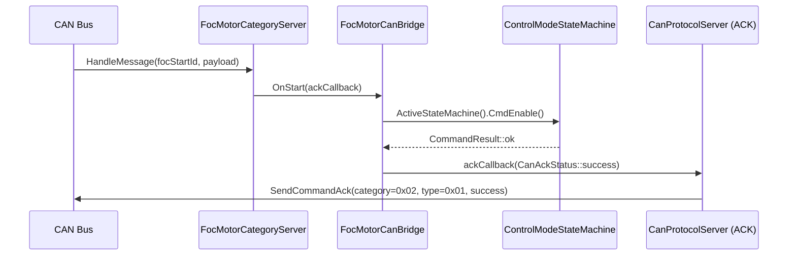
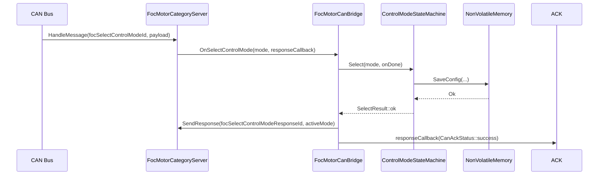
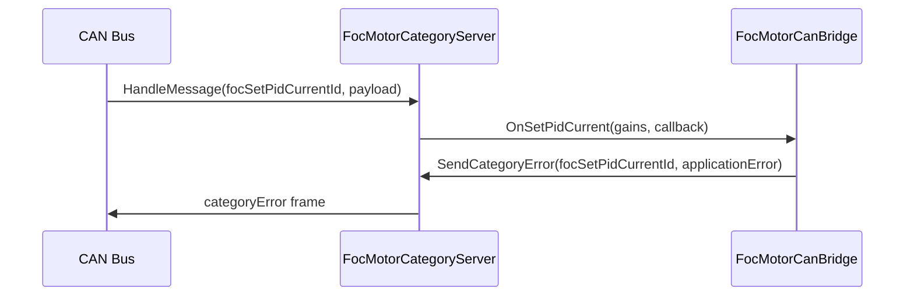
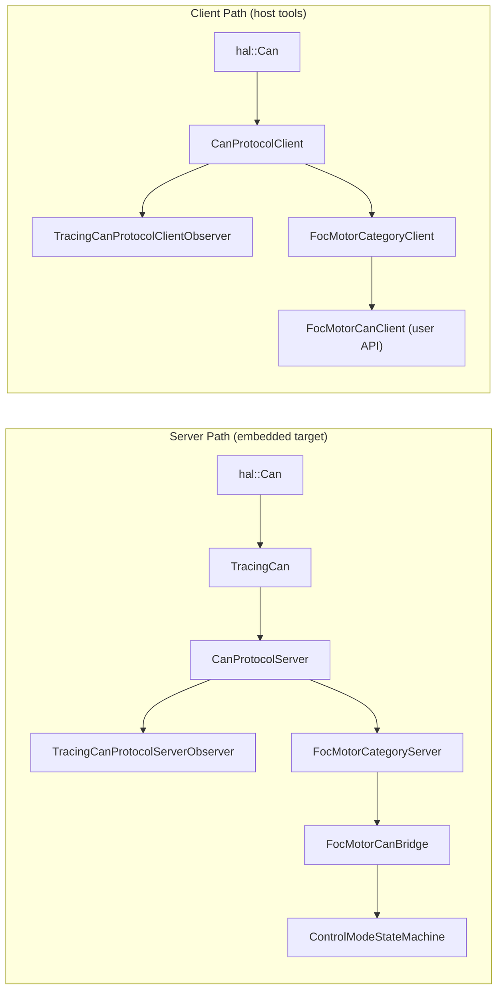

| Field     | Value                    |
|-----------|--------------------------|
| Title     | CAN Service Layer Design |
| Type      | design                   |
| Status    | draft                    |
| Version   | 0.1.0                    |
| Component | can-service              |
| Date      | 2026-08-21               |

> **IMPORTANT — Implementation-blind document**: This document describes *behavior, structure, and
> responsibilities* WITHOUT referencing code. **No code blocks using programming languages (C++, C,
> Python, CMake, shell, etc.) are allowed.** Use Mermaid diagrams to express behavior instead.
> Prose descriptions of algorithms are encouraged; source-level details are not.
>
> **Diagrams**: All visuals must be either a Mermaid fenced code block or ASCII art inline
> in the document. External image references (``) are **not allowed**.

---

## Responsibilities

**Is responsible for:**
- Defining the FOC motor CAN category (ID `0x02`) message format — command IDs, response IDs, scale factors, and error codes — in one canonical location.
- Implementing the server category: decoding incoming CAN frames into typed observer callbacks and encoding typed results into response frames.
- Implementing the client category: encoding typed setpoints into CAN frames and decoding response frames into typed callbacks.
- Bridging the server category to `ControlModeStateMachine`, translating motor control commands into state machine transitions.
- Providing a user-facing client API that composes the protocol client, transport, and category client into a single object for use by host-side tools and SIL tests.
- Applying tracing decorators at every layer boundary so all CAN frames and protocol lifecycle events are observable.
- Delegating identification commands to `ElectricalParametersIdentification` and `MechanicalParametersIdentification` services and broadcasting results via response frames.
- Persisting encoder resolution and telemetry rate changes to `NonVolatileMemory`.
- Broadcasting on-demand telemetry status frames in response to `RequestTelemetry`.

**Is NOT responsible for:**
- The CAN protocol framing, sequence validation, or ACK dispatch — those belong to `can-lite` core.
- The FOC control algorithms, state machine transitions, or calibration — those belong to `core/foc/` and `core/state_machine/`.
- Motor physics or hardware-specific logic.

---

## Component Details

### Part A — FOC Motor Message Catalogue

All message type IDs, category ID, scale factors, and error codes are centralised in `FocMotorMessages.hpp`. No other component in `core/can/` or `core/state_machine/` re-defines these constants; all refer to this single source.

The category occupies slot `0x02` (the first application-reserved category ID). Commands occupy message types `0x00–0x7F`; responses occupy `0x80–0xFF`. The category error frame uses the `can-lite` reserved type `0xFE`.

Physical-to-wire conversions use fixed-point scale factors:

| Quantity   | Wire type | Scale factor | Example                 |
|------------|-----------|--------------|-------------------------|
| Current    | int16     | 10           | 1.5 A → 15 wire         |
| Speed      | int16     | 1            | 300 rad/s → 300 wire    |
| Position   | int16     | 100          | 3.14 rad → 314 wire     |
| Voltage    | int16     | 10           | 24.0 V → 240 wire       |
| PID gain   | int16     | 1            | passed through unscaled |
| Resistance | int16     | 1000         | 0.5 Ω → 500 wire        |
| Inductance | int16     | 1000         | 1.0 mH → 1000 wire      |

### Part B — FocMotorCategoryServer

Inherits `CanCategoryServer` from `can-lite`. Registers one `CanMessageHandler` per command type; each handler decodes the payload using `CanPayloadReader`, skips the sequence byte (required for server categories), converts wire values to physical units, and calls the corresponding observer method.

The observer interface provides callbacks for:
- `OnStart`, `OnStop`, `OnClearFault`, `OnEmergencyStop` — lifecycle commands with a `CanAckStatus` result callback.
- `OnSelectControlMode` — takes a `FocMotorMode` and a result callback.
- `OnSetTorqueSetpoint`, `OnSetSpeedSetpoint`, `OnSetPositionSetpoint` — take a typed unit quantity and a completion callback.
- `OnSetPidCurrent`, `OnSetPidSpeed`, `OnSetPidPosition` — receive a bandwidth parameter parsed from the CAN frame and forward to the corresponding `TrySet*Bandwidth` on `ControlModeStateMachine`.
- `OnIdentifyElectrical` — delegates to `ElectricalParametersIdentification`; on success broadcasts `focElectricalParamsResponseId` with resistance, inductance, and pole-pair count.
- `OnIdentifyMechanical` — requires Ready state; delegates to `MechanicalParametersIdentification`; on success broadcasts `focMechanicalParamsResponseId` with friction and inertia.
- `OnRequestTelemetry` — broadcasts current state and fault code via `focTelemetryStatusResponseId`.
- `OnSetEncoderResolution`, `OnConfigureTelemetryRate` — validate payload, update and persist `ConfigData` via `NonVolatileMemory`.

### Part C — FocMotorCategoryClient

Inherits `CanCategoryClient` from `can-lite`. Provides typed `Send*` methods that encode physical units into wire format via `CanPayloadWriter` and call `SendCommand(nodeId, messageType, payload)`.

Registers response handlers for the server-to-client response message types. Response handlers decode the payload and invoke the corresponding observer callbacks.

### Part D — FocMotorCanBridge

Implements the `FocMotorCategoryServerObserver` interface. Holds references to `FocMotorCategoryServer` and `ControlModeStateMachine`. Translates each observer callback into the appropriate state machine call:

- `OnStart` → `CmdEnable()`; success calls the ack callback, rejection sends `invalidState`.
- `OnStop` → `CmdDisable()`.
- `OnClearFault` → `CmdClearFault()`.
- `OnEmergencyStop` → `CmdEmergencyStop()`.
- `OnSelectControlMode` → `Select(mode, onDone)`; the result callback sends the mode response or a category error.
- `OnSetTorqueSetpoint`, `OnSetSpeedSetpoint`, `OnSetPositionSetpoint` → validate mode and range, then delegate to `TrySet*` on the state machine.
- PID bandwidth commands → `TrySet*Bandwidth(bandwidth)` on the state machine; `invalidPayload` if rejected.
- Identification commands → delegate to the injected identification services; broadcast parameter response frames on success; `calibrationFailed` on estimation failure; `busy` if a prior identification is in progress.
- `OnRequestTelemetry` → broadcast current state and fault code via `focTelemetryStatusResponseId`; always succeeds.
- `OnSetEncoderResolution` / `OnConfigureTelemetryRate` → persist to `NonVolatileMemory`; `persistenceFailed` on write error; `busy` if a prior NVM save is in flight.

The bridge validates that the correct control mode is active before accepting a setpoint command. An out-of-range setpoint results in `invalidPayload`. A mode mismatch results in `categoryError/modeMismatch`.

### Part E — FocMotorCanClient

A self-contained client object for use in host tools and SIL tests. Internally composes `CanFrameTransport`, `CanProtocolClient`, and `FocMotorCategoryClient` as value members (no heap). Constructed with a `hal::Can&` reference and a target node ID.

Provides the same `Send*` API as `FocMotorCategoryClient` but hides the transport and protocol client, so callers only need a CAN bus reference and a node ID.

### Part F — `CanLivenessWatchdog`

`CanProtocolServer` already tracks client liveness: it restarts a timer on every frame from the client and calls `Offline()` on its observers when `clientTimeout` elapses with no traffic. Nothing acted on that notification, so unplugging the bus mid-spin left the drive holding its last setpoint indefinitely.

`CanLivenessWatchdog` is a `CanProtocolServerObserver` that closes the loop. On `Offline()` it checks whether
the active state machine is in `Enabled`; if so it traces and issues `CmdEmergencyStop`, which stops the
inverter. When the drive is not enabled the notification is ignored — a bus that goes quiet while the motor is
stopped is not a hazard, and faulting there would obstruct commissioning.

It is composed in the instantiation layer alongside the CAN bridge, so the bridge and category server stay free of lifecycle policy.

### Part G — Fault Broadcast Priority

`BroadcastFaultStatus` sends its frame at `CanPriority::emergency` (0) rather than through `SendTelemetry`,
which uses `CanPriority::telemetry` (12). CAN arbitration is by identifier, and the priority field is the high
bits of the identifier, so a telemetry-priority fault notification loses arbitration to routine telemetry on a
busy bus — exactly when the bus is busiest and the notification matters most. The payload is unchanged.

### Part H — Tracing Decorators

All tracing is applied via `can-lite`'s decorator classes:

| Decorator                          | Wraps               | Traces                                       |
|------------------------------------|---------------------|----------------------------------------------|
| `TracingCan`                       | `hal::Can`          | Every raw CAN frame sent and received        |
| `TracingCanProtocolServerObserver` | `CanProtocolServer` | Server online/offline events                 |
| `TracingCanProtocolClientObserver` | `CanProtocolClient` | Server online/offline, ACK timeouts per node |

These are composed in the instantiation layer (`Logic.hpp`) so the production code paths gain full observability without any tracing logic in the category or bridge classes themselves.

---

## Interfaces

### Provided

| Interface                      | Purpose                                                                            | Contract                                                                       |
|--------------------------------|------------------------------------------------------------------------------------|--------------------------------------------------------------------------------|
| FocMotorCategoryServerObserver | Observer interface for the server category                                         | Callbacks must not block or allocate; called from the event dispatcher context |
| FocMotorCategoryClientObserver | Observer interface for the client category                                         | Callbacks must not block or allocate                                           |
| FocMotorCanClient public API   | User-facing send methods (`Start`, `Stop`, `SetTorque`, `SetSpeed`, `SetPosition`) | Returns `bool` indicating whether the frame was queued; ACK is delivered async |

### Required

| Interface                 | Purpose                           | Contract                                                                |
|---------------------------|-----------------------------------|-------------------------------------------------------------------------|
| `CanFrameTransport`       | Sends and receives raw CAN frames | Provided by `can-lite`; must be constructed before the category objects |
| `ControlModeStateMachine` | Accepts motor control commands    | All methods are synchronous or deliver results via `infra::Function`    |
| `hal::Can`                | Raw CAN bus access                | Required by `CanProtocolServer` and `CanProtocolClient`                 |
| `services::Tracer`        | Diagnostic output                 | Must outlive the tracing decorator objects                              |

---

## Data Model

| Entity                | Field    | Type / Unit | Range                         | Notes                       |
|-----------------------|----------|-------------|-------------------------------|-----------------------------|
| FocMotorMode          | mode     | enum uint8  | torque=0, speed=1, position=2 | Transmitted as single byte  |
| Torque setpoint       | iq       | int16 wire  | INT16_MIN – INT16_MAX         | Physical = wire / 10 [A]    |
| Speed setpoint        | speed    | int16 wire  | INT16_MIN – INT16_MAX         | Physical = wire / 1 [rad/s] |
| Position setpoint     | position | int16 wire  | INT16_MIN – INT16_MAX         | Physical = wire / 100 [rad] |
| FocMotorCategoryError | code     | enum uint8  | 0–5                           | See FocMotorMessages.hpp    |

---

## Sequence Diagrams

### Start Command (server path)

### SelectControlMode (server path)

### Stub Command (applicationError path)

---

## Block Diagram

---

## Constraints & Limitations

| Constraint              | Value / Description                                                                                        |
|-------------------------|------------------------------------------------------------------------------------------------------------|
| No heap                 | All objects are value members or statically allocated; `infra::Function` for callbacks                     |
| One observer per server | `CanCategoryServer` uses `infra::Subject<Observer>` — only one bridge may attach at a time                 |
| Setpoint range          | Torque: bounded by inverter `MaxCurrentSupported`; speed: 1000 rad/s; position: ±2π rad                    |
| Sequence byte           | Server handlers always skip the first byte (sequence number) before reading payload fields                 |
| Ident re-entrancy       | A second identification command while one is in-flight returns `busy` via `SendCategoryError`              |
| NVM re-entrancy         | A second config-persist command while one is in-flight returns `busy` via `SendCategoryError`              |
| Mechanical ident        | `mechIdent` is optional (nullable pointer); if absent, `OnIdentifyMechanical` returns `notImplemented`     |
| Telemetry speed/pos     | `focTelemetryStatusResponseId` frames encode zero for speed and position (live readings not yet available) |

---

## Open Questions

| # | Question                                                         | Resolution                                                                                   | Status   |
|---|------------------------------------------------------------------|----------------------------------------------------------------------------------------------|----------|
| 1 | Implement telemetry push (BroadcastFaultStatus, periodic status) | On-demand via `OnRequestTelemetry`; periodic timer deferred                                  | resolved |
| 2 | PID gain commands                                                | Accepted: kp field mapped to loop bandwidth via `TrySet*Bandwidth`                           | resolved |
| 3 | Mechanical identification via CAN                                | Delegated to injected `MechanicalParametersIdentification*`; nullable for targets lacking it | resolved |
