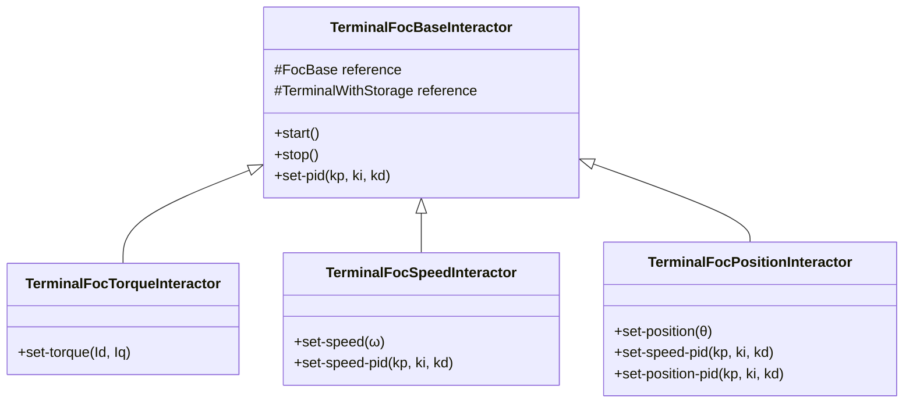
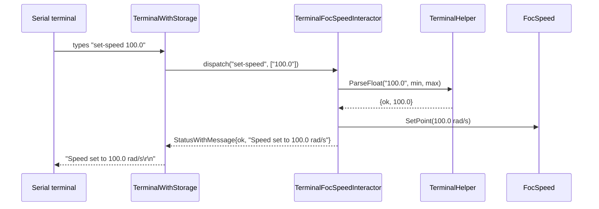
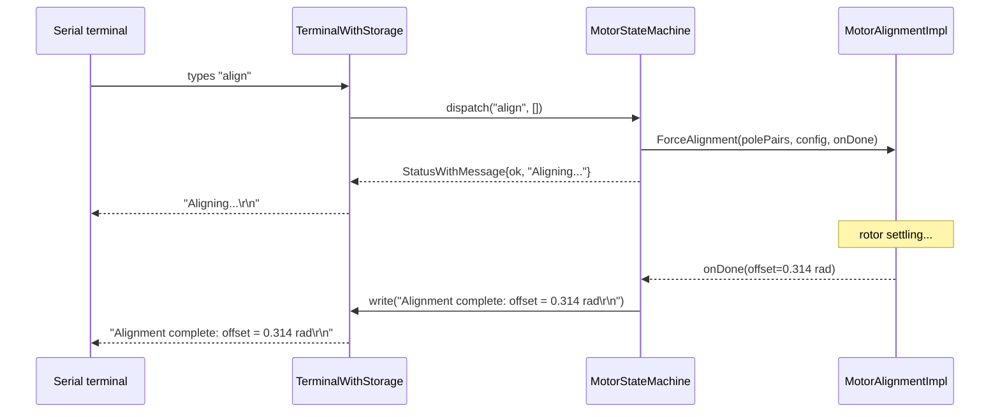

| Field     | Value                                    |
|-----------|------------------------------------------|
| Title     | Service: Command-Line Interface (CLI)    |
| Type      | design                                   |
| Status    | draft                                    |
| Version   | 0.1.0                                    |
| Component | service-cli                              |
| Date      | 2026-04-07                               |

> **IMPORTANT — Implementation-blind document**: This document describes *behavior, structure, and
> responsibilities* WITHOUT referencing code. **No code blocks using programming languages (C++, C,
> Python, CMake, shell, etc.) are allowed.** Use Mermaid diagrams to express behavior instead.
> Prose descriptions of algorithms are encouraged; source-level details are not.
>
> **Diagrams**: All visuals must be either a Mermaid fenced code block (` ```mermaid `) or ASCII art inline
> in the document. External image references using Markdown image syntax are **not allowed**.

---

## Responsibilities

**Is responsible for:**
- Providing a human-readable serial command-line interface for commissioning, diagnostics, and runtime control of the motor
- Parsing user-typed command strings into typed arguments (numeric values, enums) using `TerminalHelper`, and returning structured `StatusWithMessage` responses on success or failure
- Routing commands to the appropriate control mode interface (`FocTorque`, `FocSpeed`, `FocPosition`) based on which interactor is active
- Delegating identification, alignment, and NVM operations to the corresponding services via the `MotorStateMachine` when commands such as `align`, `identify-electrical`, and `save-calibration` are issued
- Printing a welcome banner with version information and available commands when the terminal first connects
- Ensuring all string handling uses bounded-size containers — no heap allocation at any point

**Is NOT responsible for:**
- Physical serial framing, character echo, or byte-level UART management — those are handled by the `TerminalWithStorage` infrastructure component
- Choosing which control mode is active — the active interactor is configured at construction by the application
- Executing identification or alignment procedures itself — commands are forwarded to the relevant service; results are printed asynchronously when the service callback fires

---

## Component Details

### Three-Layer Interactor Hierarchy

The CLI is structured as a three-level inheritance hierarchy of interactors. Each level adds commands specific to a control mode while inheriting the common commands of the level above.



Only one interactor is active at a time; the application constructs exactly the interactor matching the desired control mode and connects it to the `MotorStateMachine`.

#### `TerminalFocBaseInteractor` — Shared Commands

| Command | Arguments | Action |
|---------|-----------|--------|
| `start` | none | Calls `FocBase::Enable()` |
| `stop` | none | Calls `FocBase::Disable()` |
| `set-pid` | kp, ki, kd (float) | Sets current-loop PID gains via `FocBase::SetCurrentTunings()` |

These commands are available in all control modes.

#### `TerminalFocTorqueInteractor` — Torque Mode

| Command | Arguments | Action |
|---------|-----------|--------|
| `set-torque` | Id (A), Iq (A) | Sets the d-axis and q-axis current setpoints via `FocTorque::SetPoint()` |

#### `TerminalFocSpeedInteractor` — Speed Mode

| Command | Arguments | Action |
|---------|-----------|--------|
| `set-speed` | ω (rad/s) | Sets the speed setpoint via `FocSpeed::SetPoint()` |
| `set-speed-pid` | kp, ki, kd (float) | Sets speed-loop PID gains via `FocSpeed::SetSpeedTunings()` |

#### `TerminalFocPositionInteractor` — Position Mode

| Command | Arguments | Action |
|---------|-----------|--------|
| `set-position` | θ (rad) | Sets the position setpoint via `FocPosition::SetPoint()` |
| `set-speed-pid` | kp, ki, kd (float) | Sets speed-loop PID gains within the position cascade |
| `set-position-pid` | kp, ki, kd (float) | Sets position-loop PID gains via `FocPosition::SetPositionTunings()` |

### `TerminalWithBanner` — Decorator

`TerminalWithBanner` wraps any `TerminalWithStorage` instance and intercepts the first connection event. On first connect, it prints a formatted welcome message containing:

- Firmware version string
- Board/hardware identifier
- A list of available commands (derived from the registered interactor)

After the banner is printed, all subsequent inputs and outputs pass through to the underlying `TerminalWithStorage` unchanged. The banner is printed at most once per connection — reconnecting the serial terminal causes the banner to be printed again.

### `TerminalHelper` — Argument Parsing

`TerminalHelper` is a stateless utility that is invoked by each command handler to convert bounded-string tokens extracted from the command line into typed values. It handles:

- **Floating-point numbers** — parsed from a bounded-string token; out-of-range or malformed input produces a `StatusWithMessage` with a human-readable description and a non-ok status so that the interactor can return the error directly to the caller without further processing.
- **Enumerations** — matched case-insensitively against a compile-time list of valid string representations; unknown values produce an error with the list of valid options in the message.
- **Integer values** — parsed with range checking against a caller-supplied minimum and maximum.

`TerminalHelper` operates entirely on `infra::BoundedString` tokens — no dynamic string allocation occurs.

### Service Commands via `MotorStateMachine`

The `MotorStateMachine` registers additional commands on the same `TerminalWithStorage` instance that are not specific to any particular control mode:

| Command | Service triggered | Response |
|---------|-------------------|---------|
| `align` | `MotorAlignmentImpl::ForceAlignment` | Prints `"Aligning…"` immediately; prints result asynchronously when `onDone` fires |
| `identify-electrical` | `ElectricalParametersIdentificationImpl::EstimateResistanceAndInductance` | Prints `"Identifying…"` immediately; prints R and L (or error) when `onDone` fires |
| `identify-mechanical` | `MechanicalParametersIdentificationImpl::EstimateFrictionAndInertia` | Prints `"Estimating…"` immediately; prints J and B (or error) when `onDone` fires |
| `save-calibration` | `NonVolatileMemory::SaveCalibration` | Prints result when write+verify completes |
| `load-calibration` | `NonVolatileMemory::LoadCalibration` | Prints loaded values or error when read completes |

### Response Model — `StatusWithMessage`

Every command handler returns a `StatusWithMessage`, which is a pair:

- **Status** — an enumeration value (`ok`, `badArgument`, `notAllowed`, `hardwareError`, …)
- **Message** — an `infra::BoundedString` containing a human-readable description of the outcome

The terminal writes the message to the serial output verbatim. For asynchronous commands (alignment, identification, NVM), the immediate return to the terminal is `{ok, "Operation started"}` and the final result is written by the service's completion callback.



### Asynchronous Command Flow

For commands that trigger asynchronous services, the interactor initiates the service and returns `{ok, "Operation started"}` immediately. The service's `onDone` callback captures a reference to the `TerminalWithStorage` and writes the final result:



### Memory Constraints

All string handling within the CLI layer uses `infra::BoundedString` with compile-time fixed capacities. Command names, argument tokens, and response messages are all bounded. The maximum response message length is enforced statically.

Registered command handlers are stored in a fixed-size look-up structure in the `TerminalWithStorage` infrastructure — no dynamic registration table is used.

---

## Interfaces

### Provided

| Interface | Purpose | Contract |
|-----------|---------|----------|
| `TerminalFocBaseInteractor` (and subclasses) | Registers common and mode-specific commands on `TerminalWithStorage`; exposes a `Terminal()` accessor for the `MotorStateMachine` to register additional commands on the same terminal | Constructed once per application; exactly one interactor subclass is active at a time |
| `TerminalWithBanner` | Decorates `TerminalWithStorage` to print a welcome banner on first connection | Transparent to the underlying terminal after the banner has been printed |

### Required

| Interface | Purpose | Contract |
|-----------|---------|----------|
| `TerminalWithStorage` | Receives and dispatches parsed command tokens; writes string responses to the serial output | Must be connected to the physical serial driver before any interactor is constructed |
| `FocBase` | Provides `Enable()`, `Disable()`, and `SetCurrentTunings()` shared by all control modes | Must remain valid for the lifetime of the interactor |
| `FocTorque` / `FocSpeed` / `FocPosition` | Provides mode-specific setpoint and tuning methods | The concrete interface must match the constructed interactor subclass |
| DC bus voltage (`Volts`) | Supplied to the interactor for normalising PID gain inputs before forwarding them to the FOC component | Must reflect the actual DC bus voltage at the time tunings are applied |
