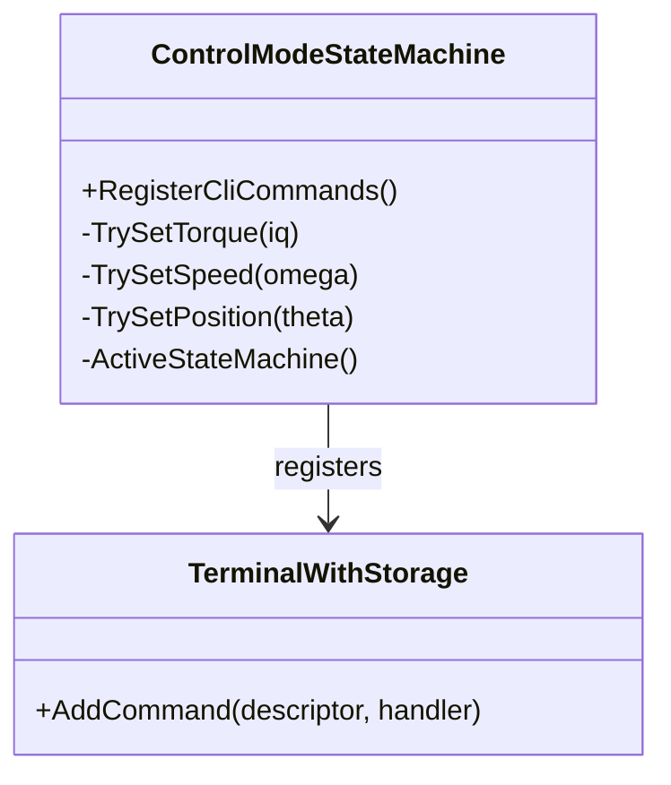
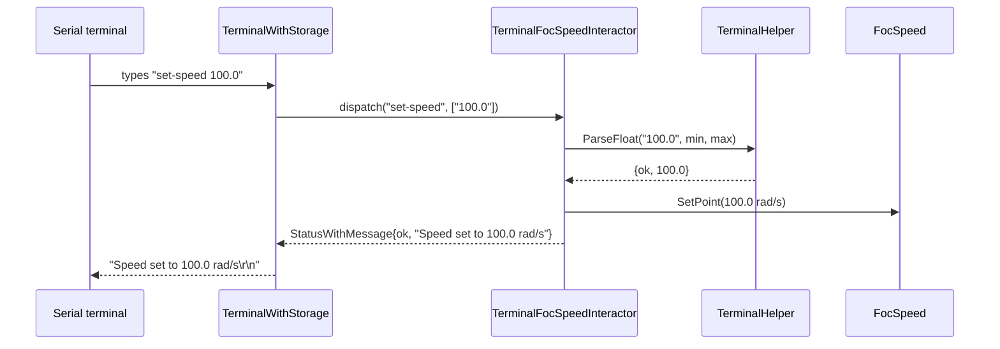
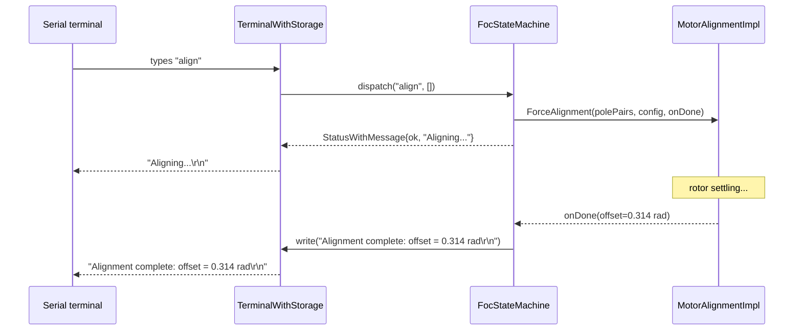

| Field     | Value                                 |
|-----------|---------------------------------------|
| Title     | Service: Command-Line Interface (CLI) |
| Type      | design                                |
| Status    | draft                                 |
| Version   | 0.1.0                                 |
| Component | service-cli                           |
| Date      | 2026-04-07                            |

> **IMPORTANT — Implementation-blind document**: This document describes *behavior, structure, and
> responsibilities* WITHOUT referencing code. **No code blocks using programming languages (C++, C,
> Python, CMake, shell, etc.) are allowed.** Use Mermaid diagrams to express behavior instead.
> Prose descriptions of algorithms are encouraged; source-level details are not.
>
> **Diagrams**: All visuals must be either a Mermaid fenced code block (` ```mermaid `) or ASCII art inline
> in the document. External image references using Markdown image syntax are **not allowed**.

---

## Responsibilities

**Is responsible for:**
- Providing a human-readable serial command-line interface for commissioning, diagnostics, and runtime control of the motor
- Parsing user-typed command strings into typed arguments (numeric values, enums) using `TerminalHelper`, and returning structured `StatusWithMessage` responses on success or failure
- Routing commands to the appropriate control mode interface (`FocTorque`, `FocSpeed`, `FocPosition`) based on which interactor is active
- Delegating motor lifecycle and calibration to the `FocStateMachine` when lifecycle commands such as `calibrate`, `enable`, `disable`, `clear_fault`, and `clear_cal` are issued
- Printing a welcome banner with version information and available commands when the terminal first connects
- Ensuring all string handling uses bounded-size containers — no heap allocation at any point

**Is NOT responsible for:**
- Physical serial framing, character echo, or byte-level UART management — those are handled by the `TerminalWithStorage` infrastructure component
- Choosing which control mode is active — the active interactor is configured at construction by the application
- Executing identification or alignment procedures itself — commands are forwarded to the relevant service; results are printed asynchronously when the service callback fires

---

## Component Details

### Command Registration

Every command is registered by the control-mode coordinator, which owns the only lifetime-safe
reference to the active control mode. There is no per-mode interactor object in production: the
active mode lives inside a `std::variant` that is replaced on a mode switch, so an object holding a
reference to it could outlive its target. The coordinator instead dispatches each command to
whichever mode is active and rejects the command when it does not apply.


```mermaid
classDiagram
    class ControlModeStateMachine {
        +RegisterCliCommands()
        -TrySetTorque(iq)
        -TrySetSpeed(omega)
        -TrySetPosition(theta)
        -ActiveStateMachine()
    }
    class TerminalWithStorage {
        +AddCommand(descriptor, handler)
    }
    ControlModeStateMachine --> TerminalWithStorage : registers
```

#### Lifecycle Commands

| Command             | Alias | Arguments | Action                                         |
|---------------------|-------|-----------|------------------------------------------------|
| `calibrate`         | `cal` | —         | Runs the calibration sequence                  |
| `enable`            | `en`  | —         | Enables the motor; rejected outside `Ready`    |
| `disable`           | `dis` | —         | Disables the motor                             |
| `clear_fault`       | `cf`  | —         | Clears a latched fault                         |
| `clear_calibration` | `cc`  | —         | Invalidates stored calibration                 |
| `active_mode`       | `am`  | —         | Prints the active control mode                 |
| `apply_estimates`   | `ae`  | —         | Applies the online estimates to the loop gains |
| `estimate_status`   | `es`  | —         | Prints the current online estimates            |

#### Algorithm Selection

| Command                     | Alias | Arguments                               | Action                                                                                                     |
|-----------------------------|-------|-----------------------------------------|------------------------------------------------------------------------------------------------------------|
| `select_current_algorithm`  | `sca` | pid \| decoupled \| deadbeat \| sliding | Selects the current-loop law; rejected while enabled or before the motor model is identified               |
| `select_speed_algorithm`    | `ssa` | pid \| lqi \| adrc \| twodof            | Selects the speed-loop law; speed and position modes only                                                  |
| `select_position_algorithm` | `spa` | pid \| cascadep \| lqr \| lqi \| twodof | Selects the position-loop law; position mode only. LQR and LQI are refused when their Riccati design fails |
| `active_algorithms`         | `aa`  | —                                       | Prints the active current, speed and position laws                                                         |

#### Setpoints

Each setpoint command applies to exactly one control mode and is rejected with a mode-mismatch
message in the others, and rejected when the lifecycle state does not accept setpoints.

| Command        | Alias | Arguments     | Accepted range | Mode     |
|----------------|-------|---------------|----------------|----------|
| `set_torque`   | `st`  | Iq (A)        | ±100           | Torque   |
| `set_speed`    | `ss`  | omega (rad/s) | ±1000          | Speed    |
| `set_position` | `sp`  | theta (rad)   | ±2π            | Position |

Ranges come from `foc::CommandLimits`, the same constants the CAN command path validates against, so
an operator cannot reach through the terminal a setpoint the bus would have refused. A value outside
the range is rejected with an out-of-range message and never reaches the control law.

The torque command takes the q-axis current only. The d-axis reference is held at zero by the
control law, so exposing it would let an operator command a flux reference the cascade immediately
overwrites.

#### Bandwidths

| Command                  | Alias  | Arguments         | Accepted range | Availability             |
|--------------------------|--------|-------------------|----------------|--------------------------|
| `set_current_bandwidth`  | `scbw` | bandwidth (rad/s) | 1 … 20000      | All modes                |
| `set_speed_bandwidth`    | `ssbw` | bandwidth (rad/s) | 1 … 2000       | Speed and position modes |
| `set_position_bandwidth` | `spbw` | bandwidth (rad/s) | 1 … 500        | Position mode            |

Retuning is refused while the motor is enabled, and refused when the active law cannot be redesigned
for the requested bandwidth. Bandwidths are bounded below at 1 rad/s: a zero or negative bandwidth
produces zero or sign-inverted gains, which inverts the sense of the loop's feedback on a motor that
may be spinning.

### Diagnostics Commands

Three commands expose what the control loop and the CAN bus have been doing. Each of these numbers
was previously either computed and discarded or never gathered at all.

| Command        | Alias | Reports                                                                              |
|----------------|-------|--------------------------------------------------------------------------------------|
| `loop_stats`   | `ls`  | Control-interrupt execution: sample count, budget, last/min/average/max cycles, overruns, deadline misses, re-entries |
| `can_stats`    | `cs`  | CAN error counters, total and per class, printing only the classes that have occurred |
| `clear_stats`  | `xs`  | Resets both sets of counters                                                          |

**Overrun versus deadline miss.** The two are distinct and both are reported. An overrun means the
interrupt exceeded the share of the period it is budgeted — the margin is gone, but the deadline was
still met. A deadline miss means it exceeded the period itself: the next conversion was already due
when it finished.

**Re-entry** is the same failure caught as it happens rather than measured afterwards. A conversion
arriving while the previous interrupt has not returned is recorded directly, which no measured
duration can reveal.

Counters saturate rather than wrap, so a long run cannot present itself as a healthy one.

### `TerminalWithBanner` — Decorator

`TerminalWithBanner` wraps any `TerminalWithStorage` instance and intercepts the first connection event. On first connect, it prints a formatted welcome message containing:

- Firmware version string
- Board/hardware identifier
- A list of available commands (derived from the registered interactor)

After the banner is printed, all subsequent inputs and outputs pass through to the underlying `TerminalWithStorage` unchanged. The banner is printed at most once per connection — reconnecting the serial terminal causes the banner to be printed again.

### `TerminalHelper` — Argument Parsing

`TerminalHelper` is a stateless utility that is invoked by each command handler to convert bounded-string tokens extracted from the command line into typed values. It handles:

- **Floating-point numbers** — parsed from a bounded-string token; out-of-range or malformed input produces a `StatusWithMessage` with a human-readable description and a non-ok status so that the interactor can return the error directly to the caller without further processing.
- **Enumerations** — matched case-insensitively against a compile-time list of valid string representations; unknown values produce an error with the list of valid options in the message.
- **Integer values** — parsed with range checking against a caller-supplied minimum and maximum.

`TerminalHelper` operates entirely on `infra::BoundedString` tokens — no dynamic string allocation occurs.

### Lifecycle Commands via `FocStateMachine`

The `FocStateMachine` registers additional commands on the same `TerminalWithStorage` instance that enforce the motor lifecycle state machine. These commands are always available regardless of which control mode is active:

| Command       | Alias | Action                                                                                               |
|---------------|-------|------------------------------------------------------------------------------------------------------|
| `calibrate`   | `cal` | Runs the full calibration sequence (pole pairs → R/L → alignment → mechanical ident for speed modes) |
| `enable`      | `en`  | Enables the FOC controller (only allowed from `Ready` state)                                         |
| `disable`     | `dis` | Disables the FOC controller and returns to `Ready`                                                   |
| `clear_fault` | `cf`  | Clears the active fault and returns to `Idle`                                                        |
| `clear_cal`   | `cc`  | Invalidates NVM calibration data and returns to `Idle`                                               |

### Response Model — `StatusWithMessage`

Every command handler returns a `StatusWithMessage`, which is a pair:

- **Status** — an enumeration value (`ok`, `badArgument`, `notAllowed`, `hardwareError`, …)
- **Message** — an `infra::BoundedString` containing a human-readable description of the outcome

The terminal writes the message to the serial output verbatim. For asynchronous commands (alignment, identification, NVM), the immediate return to the terminal is `{ok, "Operation started"}` and the final result is written by the service's completion callback.


```mermaid
sequenceDiagram
    participant User as Serial terminal
    participant TWS as TerminalWithStorage
    participant Interactor as TerminalFocSpeedInteractor
    participant Helper as TerminalHelper
    participant FocSpeed

    User->>TWS: types "set-speed 100.0"
    TWS->>Interactor: dispatch("set-speed", ["100.0"])
    Interactor->>Helper: ParseFloat("100.0", min, max)
    Helper-->>Interactor: {ok, 100.0}
    Interactor->>FocSpeed: SetPoint(100.0 rad/s)
    Interactor-->>TWS: StatusWithMessage{ok, "Speed set to 100.0 rad/s"}
    TWS-->>User: "Speed set to 100.0 rad/s\r\n"
```

### Asynchronous Command Flow

For commands that trigger asynchronous services, the interactor initiates the service and returns `{ok, "Operation started"}` immediately. The service's `onDone` callback captures a reference to the `TerminalWithStorage` and writes the final result:


```mermaid
sequenceDiagram
    participant User as Serial terminal
    participant TWS as TerminalWithStorage
    participant MSM as FocStateMachine
    participant Alignment as MotorAlignmentImpl

    User->>TWS: types "align"
    TWS->>MSM: dispatch("align", [])
    MSM->>Alignment: ForceAlignment(polePairs, config, onDone)
    MSM-->>TWS: StatusWithMessage{ok, "Aligning..."}
    TWS-->>User: "Aligning...\r\n"
    note over Alignment: rotor settling...
    Alignment-->>MSM: onDone(offset=0.314 rad)
    MSM->>TWS: write("Alignment complete: offset = 0.314 rad\r\n")
    TWS-->>User: "Alignment complete: offset = 0.314 rad\r\n"
```

### Memory Constraints

All string handling within the CLI layer uses `infra::BoundedString` with compile-time fixed capacities. Command names, argument tokens, and response messages are all bounded. The maximum response message length is enforced statically.

Registered command handlers are stored in a fixed-size look-up structure in the `TerminalWithStorage` infrastructure — no dynamic registration table is used.

---

## Interfaces

### Provided

| Interface                                    | Purpose                                                                                                                                                                               | Contract                                                                              |
|----------------------------------------------|---------------------------------------------------------------------------------------------------------------------------------------------------------------------------------------|---------------------------------------------------------------------------------------|
| `TerminalFocBaseInteractor` (and subclasses) | Registers the `set_current_bandwidth` command on `TerminalWithStorage`; exposes a `Terminal()` accessor for the `FocStateMachine` to register lifecycle commands on the same terminal | Constructed once per application; exactly one interactor subclass is active at a time |
| `TerminalWithBanner`                         | Decorates `TerminalWithStorage` to print a welcome banner on first connection                                                                                                         | Transparent to the underlying terminal after the banner has been printed              |

### Required

| Interface                                | Purpose                                                                                                | Contract                                                                             |
|------------------------------------------|--------------------------------------------------------------------------------------------------------|--------------------------------------------------------------------------------------|
| `TerminalWithStorage`                    | Receives and dispatches parsed command tokens; writes string responses to the serial output            | Must be connected to the physical serial driver before any interactor is constructed |
| `CurrentLoopTunable`                     | Provides `SetCurrentTunings()`, shared by all control modes                                            | Must remain valid for the lifetime of the interactor                                 |
| `FocTorque` / `FocSpeed` / `FocPosition` | Provides mode-specific setpoint and tuning methods                                                     | The concrete interface must match the constructed interactor subclass                |
| DC bus voltage (`Volts`)                 | Supplied to the interactor for normalising PID gain inputs before forwarding them to the FOC component | Must reflect the actual DC bus voltage at the time tunings are applied               |

---

## Hardware-Test EEPROM Commands

The hardware-test application registers three additional terminal commands that exercise the EEPROM hardware directly through the `hal::Eeprom` interface. These commands are available only in the hardware-test build target and are intended for commissioning, production testing, and EEPROM verification.

### Command Reference

| Command        | Alias | Arguments                | Action                                                                                                                                                             |
|----------------|-------|--------------------------|--------------------------------------------------------------------------------------------------------------------------------------------------------------------|
| `eeprom_write` | `ew`  | `<addr> <b0> [b1 … b63]` | Writes up to 64 bytes to the EEPROM starting at the given byte address. The callback fires when the hardware write completes.                                      |
| `eeprom_read`  | `er`  | `<addr> <size>`          | Reads `size` bytes (1–64) from the EEPROM starting at `addr` and traces each byte value to the serial output. The callback fires when the hardware read completes. |
| `eeprom_erase` | `ee`  | none                     | Erases the entire EEPROM to the all-0xFF state. The callback fires when the hardware erase completes.                                                              |

### Asynchronous Completion

All three commands are asynchronous. The terminal prompt (`>`) does not appear until the hardware operation completes and `ProcessResult` is called from the completion callback. This correctly models the interrupt-driven behaviour of the TM4C EEPROM peripheral.

### Argument Constraints

- `addr`: unsigned integer in the range 0 to 65535
- `b0 … b63`: unsigned integer byte values in the range 0 to 255
- `size`: unsigned integer in the range 1 to 64

Invalid argument count or out-of-range values return an error `StatusWithMessage` immediately without starting the EEPROM operation.
