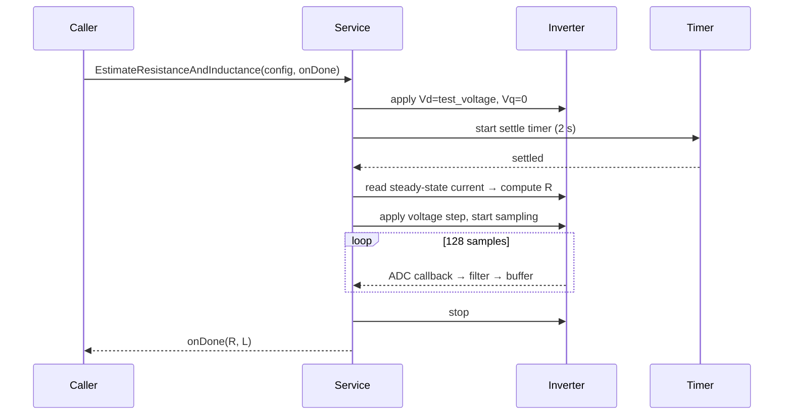
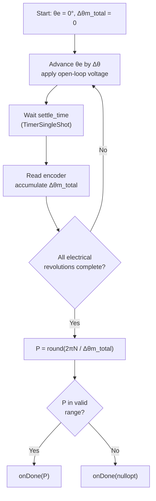
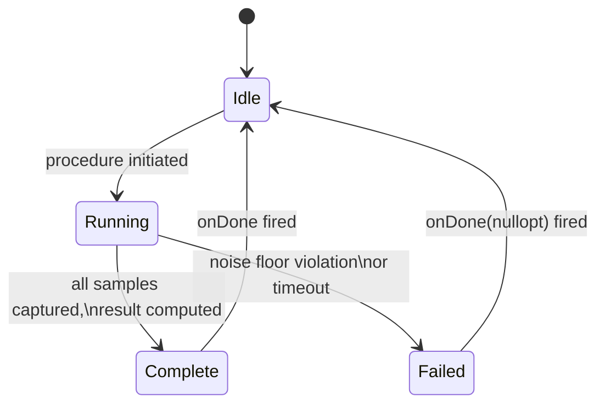

| Field     | Value                                       |
|-----------|---------------------------------------------|
| Title     | Service: Electrical Parameters Identification |
| Type      | design                                      |
| Status    | draft                                       |
| Version   | 0.1.0                                       |
| Component | service-electrical-ident                    |
| Date      | 2026-04-07                                  |

> **IMPORTANT — Implementation-blind document**: This document describes *behavior, structure, and
> responsibilities* WITHOUT referencing code. **No code blocks using programming languages (C++, C,
> Python, CMake, shell, etc.) are allowed.** Use Mermaid diagrams to express behavior instead.
> Prose descriptions of algorithms are encouraged; source-level details are not.
>
> **Diagrams**: All visuals must be either a Mermaid fenced code block (` ```mermaid `) or ASCII art inline
> in the document. External image references using Markdown image syntax are **not allowed**.

---

## Responsibilities

**Is responsible for:**
- Automatically measuring phase resistance (R), d-axis inductance (Ld), and q-axis inductance (Lq) without external instruments, using a DC voltage injection technique followed by a transient step response
- Estimating the motor's number of pole pairs by rotating an open-loop voltage vector through multiple full electrical revolutions and comparing the total electrical angle swept with the total encoder mechanical angle swept
- Protecting against heap allocation by using bounded containers for all internal buffers
- Delivering results exactly once per initiated procedure via a completion callback containing typed physical quantities (Ohm, MilliHenry, or size_t)
- Enforcing that the two procedures (resistance/inductance and pole pairs) cannot run concurrently
- Stopping the inverter cleanly before invoking any completion callback

**Is NOT responsible for:**
- Persisting the identified parameters — the caller decides what to do with the results
- Encoder zero-offset calibration — that is performed by the Motor Alignment service
- Performing any closed-loop current control — all voltage application is open-loop
- Running concurrently with the normal FOC loop — the FOC loop must be stopped before either procedure begins

---

## Component Details

### Procedure 1 — Resistance and Inductance Estimation

This procedure uses two distinct phases — a DC settle phase and a transient sampling phase — each triggered by ADC callbacks from the inverter without busy-waiting.

#### Phase 1a: DC Settle and Resistance Measurement

A known DC voltage is applied to the d-axis of the motor (q-axis voltage = 0, electrical angle = 0°) at a level configured by the caller. A `TimerSingleShot` fires after the configured settle time (default 2 s) to allow transients to decay and the phase current to reach its steady-state value.

At the end of the settle period, the steady-state phase current is captured from the ADC. Because the motor is stationary and the current is DC, the only impedance in the circuit is the winding resistance:

```
R = V_applied / I_steady_state
```

The result is stored internally. If the measured current is zero or below a noise floor, the procedure fails immediately and the callback is invoked with absent values.

#### Phase 1b: Inductance Estimation via Transient Step Response

Immediately after the DC settle phase, an additional voltage step is applied and the current transient is sampled. Each ADC callback appends one sample to an `infra::BoundedVector` (capacity 128). A 5-sample moving-average (using an `infra::BoundedDeque` of capacity 5) is applied in-flight to each incoming sample before storage, reducing high-frequency noise on the measurement.

Once the buffer is full, the inductance is derived from the first-order step-response approximation:

```
L = V_step × Δt / ΔI
```

where Δt is the total sampling interval and ΔI is the change in current over that interval. This single-time-constant model is accurate for unsaturated surface PMSM windings.

For surface PMSM, Lq ≈ Ld, so both values are reported as the same measured inductance. For interior PMSM, the approximation introduces an error that must be accepted or corrected by the caller.



#### Error Conditions

If the settle timer expires but the ADC current reading is below the noise floor, the procedure fails (both output values absent). If the sample buffer fills but the current change is too small to yield a sensible inductance (e.g., ΔI < noise floor), the inductance is reported absent while resistance may still be valid.

### Procedure 2 — Pole Pairs Estimation

This procedure determines the number of electrical pole pairs by sweeping a rotating open-loop voltage vector through a configurable number of full electrical revolutions and comparing the total electrical angle swept to the total mechanical angle measured by the encoder.

#### Rotation Sweep

Starting at electrical angle 0°, the service advances the voltage vector by a small angular increment each ADC callback. The step size and number of revolutions are derived from the caller-supplied configuration. After each step, the encoder is read and the mechanical displacement is accumulated.

Over N full electrical revolutions, the total electrical angle advanced is 2π × N. The total mechanical angle swept by the encoder is measured by summing the (wrap-compensated) angular increments over all steps.

The pole pairs are then:

```
P = round( total_electrical_angle / total_mechanical_angle )
```

Rounding to the nearest integer provides the final integer result. If the computed ratio is outside a plausible range (e.g., below 1 or above a configurable maximum), the result is absent.

#### Settlement Between Steps

A configurable settle time can be inserted between incremental voltage steps to allow the rotor to follow the stator field before the next encoder sample is taken. This prevents accumulated leading error due to inertia.



### Internal Buffer Constraints

All internal state is statically allocated:

| Buffer | Container | Capacity | Purpose |
|--------|-----------|----------|---------|
| Current samples | `infra::BoundedVector` | 128 entries | Stores filtered current transient for inductance estimation |
| Moving-average window | `infra::BoundedDeque` | 5 entries | Rolling window for in-flight noise reduction on ADC samples |

No heap allocation is used. Buffers are members of the service object and are reused across repeated procedure invocations.

### Concurrency Invariant

The two procedures are independent state machines. Neither may be started while the other is in the Running state. An attempt to start one while the other is already Running causes the new request to be rejected (callback invoked immediately with absent values). The two state machines share no mutable state beyond the inverter and encoder references.

### State Machine (Both Procedures)



---

## Interfaces

### Provided

| Interface | Purpose | Contract |
|-----------|---------|----------|
| `EstimateResistanceAndInductance(config, onDone)` | Runs the DC settle and transient-step procedure; delivers `(optional<Ohm>, optional<MilliHenry>)` | Rejected (immediate failure callback) if the pole-pairs procedure is already Running; inverter stopped before callback fires; fires exactly once |
| `EstimateNumberOfPolePairs(config, onDone)` | Sweeps an open-loop rotating vector and delivers `optional<size_t>` pole pairs | Rejected if the R/L procedure is already Running; inverter stopped before callback fires; fires exactly once |

### Required

| Interface | Purpose | Contract |
|-----------|---------|----------|
| `ThreePhaseInverter` | Open-loop voltage application during both procedures; source of ADC sampling callbacks | Must not be concurrently claimed by any other controller |
| `Encoder` | Reads mechanical angle during pole-pairs sweep to compute accumulated displacement | Must be initialised before `EstimateNumberOfPolePairs` is called |
| DC bus voltage (`Volts`) | Injected at construction; used to normalise applied voltage and interpret current readings in physical units | Must remain stable throughout any active procedure |
