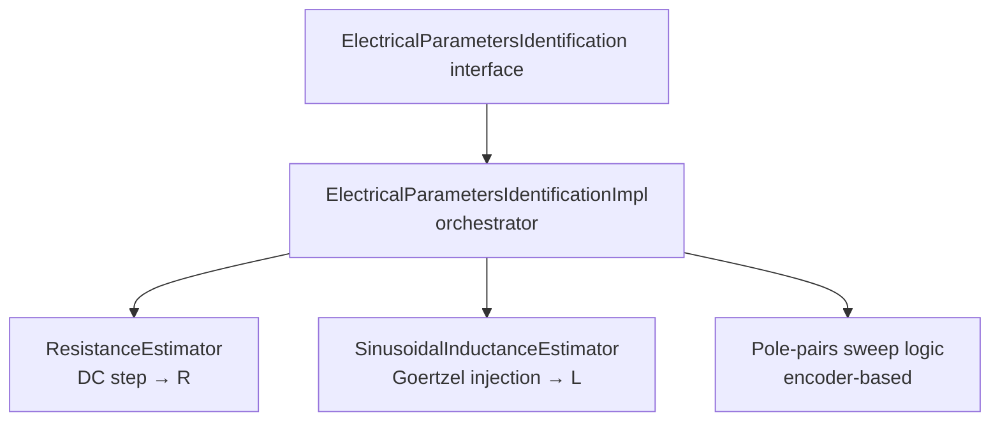
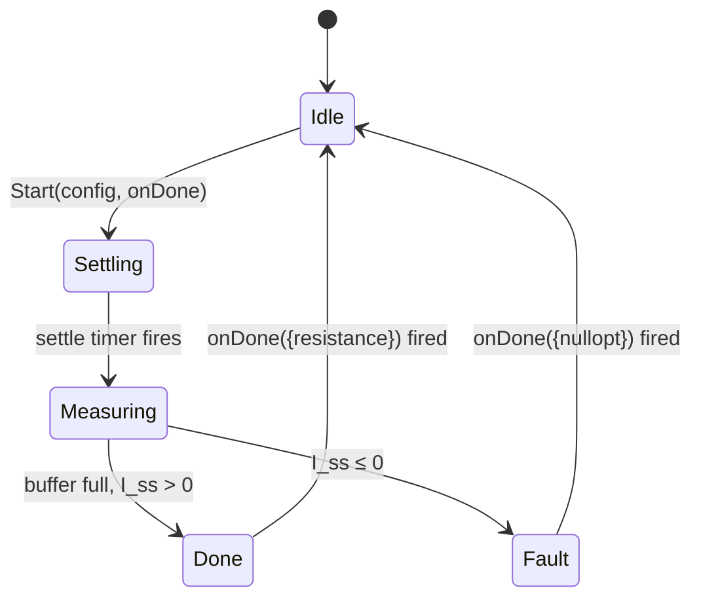
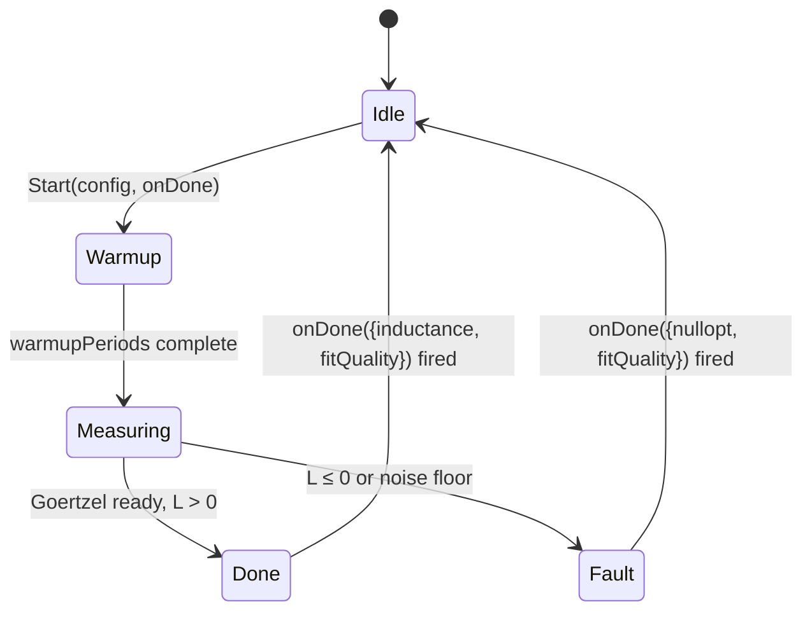
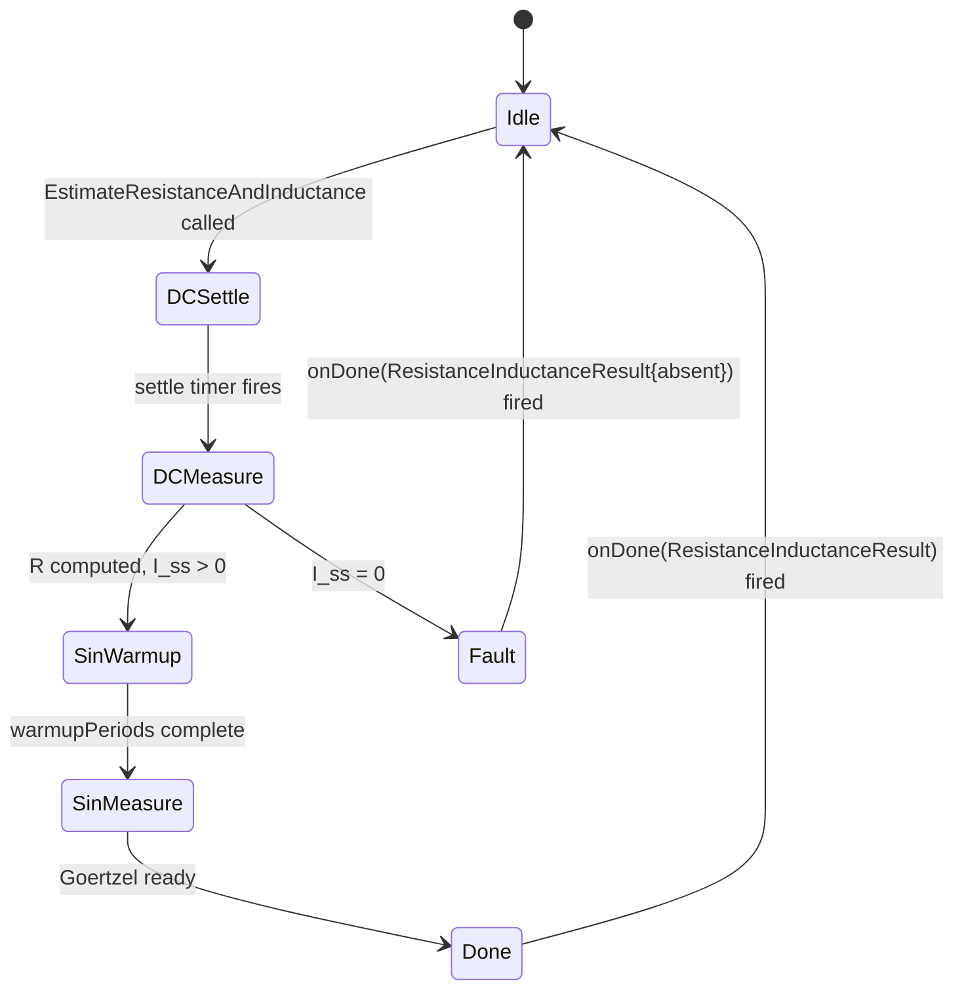
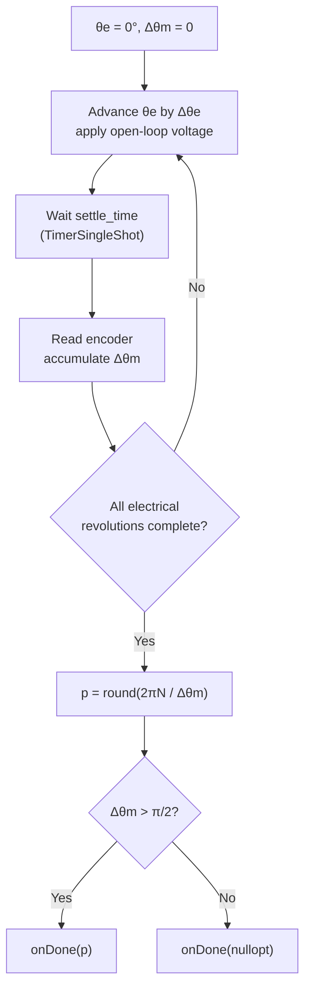

| Field     | Value                                         |
|-----------|-----------------------------------------------|
| Title     | Service: Electrical Parameters Identification |
| Type      | design                                        |
| Status    | draft                                         |
| Version   | 0.2.0                                         |
| Component | service-electrical-ident                      |
| Date      | 2026-08-30                                    |

> **IMPORTANT — Implementation-blind document**: This document describes *behavior, structure, and
> responsibilities* WITHOUT referencing code. **No code blocks using programming languages (C++, C,
> Python, CMake, shell, etc.) are allowed.** Use Mermaid diagrams to express behavior instead.
> Prose descriptions of algorithms are encouraged; source-level details are not.
>
> **Diagrams**: All visuals must be either a Mermaid fenced code block (` ```mermaid `) or ASCII art inline
> in the document. External image references using Markdown image syntax are **not allowed**.

---

## Responsibilities

**Is responsible for:**
- Measuring phase resistance ($R_s$) via DC voltage step using `ResistanceEstimator`
- Measuring d-axis inductance ($L_s$) via HF sinusoidal injection using `SinusoidalInductanceEstimator`
- Estimating the number of pole pairs by rotating an open-loop voltage vector and comparing electrical angle to mechanical encoder angle
- Delivering a combined `ResistanceInductanceResult` — resistance, inductance, and fit quality — via a single completion callback once both sub-estimators finish
- Enforcing that R/L identification and pole-pairs estimation cannot run concurrently
- Stopping the inverter cleanly before invoking any completion callback
- Rejecting calibration when `fitQuality < 0.5` (incoherent injection response)

**Is NOT responsible for:**
- Persisting identified parameters — the caller decides what to do with results
- Encoder zero-offset calibration — that is the Motor Alignment service
- Performing any closed-loop current control — all voltage application is open-loop
- Running concurrently with the normal FOC loop — the FOC loop must be stopped before either procedure begins

---

## Architecture

The R/L estimation is split across three cooperating components:


```mermaid
graph TD
    A[ElectricalParametersIdentification interface] --> B[ElectricalParametersIdentificationImpl\norchestrator]
    B --> C[ResistanceEstimator\nDC step → R]
    B --> D[SinusoidalInductanceEstimator\nGoertzel injection → L]
    B --> E[Pole-pairs sweep logic\nencoder-based]
```

`ResistanceEstimator` and `SinusoidalInductanceEstimator` are standalone components; the orchestrator
calls them sequentially and assembles their results into a single `ResistanceInductanceResult`.
Application code (hardware test terminal, etc.) may also call these components directly.

---

## Component Details

### ResistanceEstimator

Applies a DC differential voltage across phase A versus phases B and C held at neutral. A
`TimerSingleShot` fires after the configured settle time to allow the current to reach steady state.
A 5-sample moving-average filter (using a bounded deque of capacity 5) is applied in-flight to each
ADC sample before it is pushed to the measurement buffer (bounded vector, capacity 123).

When the buffer is full, the steady-state current is read from the mean of the last 10 % of the
buffer. Resistance is computed as $V_{step} / I_{ss}$ divided by the winding topology factor. If
$I_{ss} \leq 0$, the result is absent.


```mermaid
stateDiagram-v2
    [*] --> Idle
    Idle --> Settling : Start(config, onDone)
    Settling --> Measuring : settle timer fires
    Measuring --> Done : buffer full, I_ss > 0
    Measuring --> Fault : I_ss ≤ 0
    Done --> Idle : onDone({resistance}) fired
    Fault --> Idle : onDone({nullopt}) fired
```

**Internal buffers:**

| Buffer            | Capacity    | Purpose                                      |
|-------------------|-------------|----------------------------------------------|
| Moving-avg window | 5 samples   | In-flight noise reduction on ADC input       |
| Measurement store | 123 samples | Filtered step-response for steady-state read |

---

### SinusoidalInductanceEstimator

Injects a sinusoidal voltage on the alpha axis only (beta = 0), keeping net electromagnetic torque
at zero so the rotor remains stationary. The injection frequency is snapped to the nearest
integer-samples-per-period to align exactly with the Goertzel analysis bin, eliminating spectral
leakage.

Two phases run consecutively:

1. **Warmup** — voltage is injected but the Goertzel is not fed. Allows the current transient to
   decay and the steady-state sinusoidal response to establish. Duration: `warmupPeriods` full
   injection cycles.

2. **Measurement** — the Goertzel accumulates `measurementPeriods` full cycles of current samples
   (block size $N = N_{periods} \times N_{spp}$, bin $k = N_{periods}$). When `Ready()`, the
   complex result is delay-corrected (rotation by $e^{+j\omega d T_s}$ to cancel the $d$-sample
   ADC pipeline lag), then converted to $\text{Im}(Z)$ and finally to per-phase inductance.

The coherence metric `fitQuality = 2|I_{Goertzel}|² / (N · \Sigma i²)` is computed simultaneously
from the accumulated current power. It equals 1.0 for a pure sinusoid at $f_{inj}$ and falls toward
zero with increasing noise or rotor motion.

**Working memory (streaming — no sample buffer required):**

| Variable       | Size    | Purpose                                 |
|----------------|---------|-----------------------------------------|
| Goertzel state | 3 float | $s_1$, $s_2$, sample count              |
| sumSquared     | 1 float | Accumulates $\Sigma i^2$ for fitQuality |
| sampleCount    | 1 int   | Warmup/measurement gate                 |


```mermaid
stateDiagram-v2
    [*] --> Idle
    Idle --> Warmup : Start(config, onDone)
    Warmup --> Measuring : warmupPeriods complete
    Measuring --> Done : Goertzel ready, L > 0
    Measuring --> Fault : L ≤ 0 or noise floor
    Done --> Idle : onDone({inductance, fitQuality}) fired
    Fault --> Idle : onDone({nullopt, fitQuality}) fired
```

---

### ElectricalParametersIdentificationImpl (orchestrator)

Sequences `ResistanceEstimator` then `SinusoidalInductanceEstimator` and assembles their results
into a single `ResistanceInductanceResult`. If resistance estimation fails (absent result), the L
stage is skipped and the combined callback fires immediately with an absent result. If the L stage
yields `fitQuality < 0.5`, the orchestrator treats this as a fault and includes the low-quality
result so the caller can make its own policy decision.


```mermaid
stateDiagram-v2
    [*] --> Idle
    Idle --> DCSettle : EstimateResistanceAndInductance called
    DCSettle --> DCMeasure : settle timer fires
    DCMeasure --> SinWarmup : R computed, I_ss > 0
    DCMeasure --> Fault : I_ss = 0
    SinWarmup --> SinMeasure : warmupPeriods complete
    SinMeasure --> Done : Goertzel ready
    Done --> Idle : onDone(ResistanceInductanceResult) fired
    Fault --> Idle : onDone(ResistanceInductanceResult{absent}) fired
```

**Concurrent-call invariant:** a second call to `EstimateResistanceAndInductance` while any of the
five states above is active causes the new request to be rejected immediately (callback fires with an
absent result). The pole-pairs procedure shares this guard: neither procedure may start while the
other is active.

---

### Procedure 2 — Pole Pairs Estimation

Starting at electrical angle 0°, the service advances the voltage vector by a small angular
increment each settle-timer tick. After each step, the encoder is read and the mechanical
displacement is accumulated. Over $N_{rev}$ full electrical revolutions:

$$
p = \text{round}(2\pi N_{rev} / \Delta\theta_{mech,total})
$$

If the total mechanical rotation is below $\pi/2$ (rotor not following the field), the result is
absent.


```mermaid
flowchart TD
    START["θe = 0°, Δθm = 0"] --> STEP["Advance θe by Δθe\napply open-loop voltage"]
    STEP --> SETTLE["Wait settle_time\n(TimerSingleShot)"]
    SETTLE --> READ["Read encoder\naccumulate Δθm"]
    READ --> CHECK{"All electrical\nrevolutions complete?"}
    CHECK -->|No| STEP
    CHECK -->|Yes| CALC["p = round(2πN / Δθm)"]
    CALC --> VALID{"Δθm > π/2?"}
    VALID -->|Yes| CB_OK["onDone(p)"]
    VALID -->|No| CB_FAIL["onDone(nullopt)"]
```

---

## Interfaces

### Provided

| Interface                                         | Purpose                                                                                                                                | Contract                                                                                                                                   |
|---------------------------------------------------|----------------------------------------------------------------------------------------------------------------------------------------|--------------------------------------------------------------------------------------------------------------------------------------------|
| `EstimateResistanceAndInductance(config, onDone)` | Sequences DC-step R estimation then sinusoidal L estimation; delivers `ResistanceInductanceResult{resistance, inductance, fitQuality}` | Rejected (immediate empty callback) if pole-pairs procedure is already running; inverter stopped before callback fires; fires exactly once |
| `EstimateNumberOfPolePairs(config, onDone)`       | Sweeps an open-loop rotating vector and delivers `optional<size_t>` pole pairs                                                         | Rejected if R/L procedure is already running; inverter stopped before callback fires; fires exactly once                                   |

### Result Type

`ResistanceInductanceResult` carries:

| Field        | Type                   | Absent when                  |
|--------------|------------------------|------------------------------|
| `resistance` | `optional<Ohm>`        | DC step finds $I_{ss} = 0$   |
| `inductance` | `optional<MilliHenry>` | Goertzel yields $L \leq 0$   |
| `fitQuality` | `float` in $[0, 1]$    | Always present; 0 on failure |

### Required

| Interface                | Purpose                                                             | Contract                                                 |
|--------------------------|---------------------------------------------------------------------|----------------------------------------------------------|
| `ThreePhaseInverter`     | Voltage application and ADC sampling callbacks for both stages      | Must not be concurrently claimed by any other controller |
| `Encoder`                | Reads mechanical angle during pole-pairs sweep                      | Must be initialised before pole-pairs estimation begins  |
| DC bus voltage (`Volts`) | Normalises applied voltage and interprets current in physical units | Must remain stable throughout any active procedure       |

---

## Online Resistance and Inductance Estimation

In addition to the one-shot calibration procedures above, a continuous online estimator
(`RealTimeResistanceAndInductanceEstimator`) runs alongside the closed-loop speed/position
controller to track slow parameter drift. See the state machine design document for when online
estimates are applied.

### Model

The d-axis voltage equation for a non-salient PMSM is:

$$V_d = R \cdot I_d + L \cdot \left(\frac{dI_d}{dt} - \omega_e \cdot I_q\right)$$

The regressor vector is $\phi = [I_d,\ (dI_d/dt - \omega_e I_q)]^T$, and the parameter vector is
$\theta = [R,\ L]^T$. An RLS algorithm with forgetting factor 0.998 updates $\theta$ each
outer-loop period (1 kHz).

### Persistence-of-Excitation Gate

The RLS update is skipped when $|\phi|^2 < 10^{-6}$ to prevent covariance blow-up at standstill.

### Seeding

When calibration data is loaded (from NVM or after fresh calibration), the online estimator is
seeded with the identified values, avoiding a cold-start transient where estimates are physically
meaningless.
