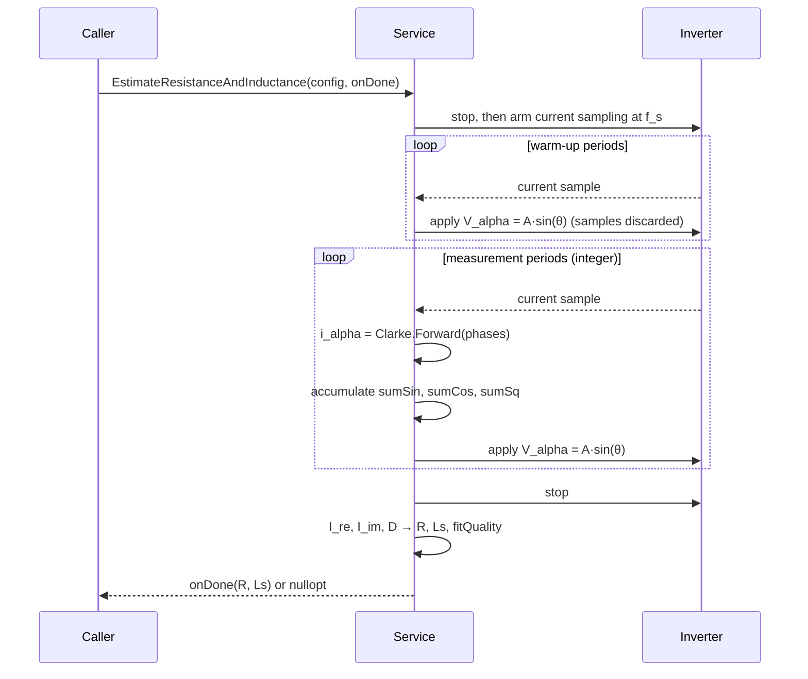
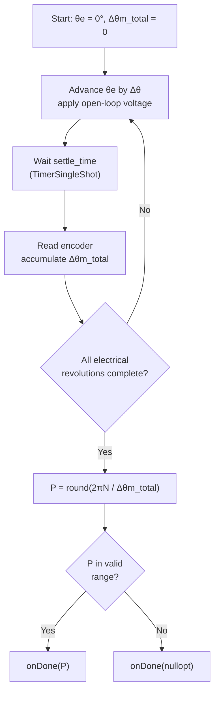
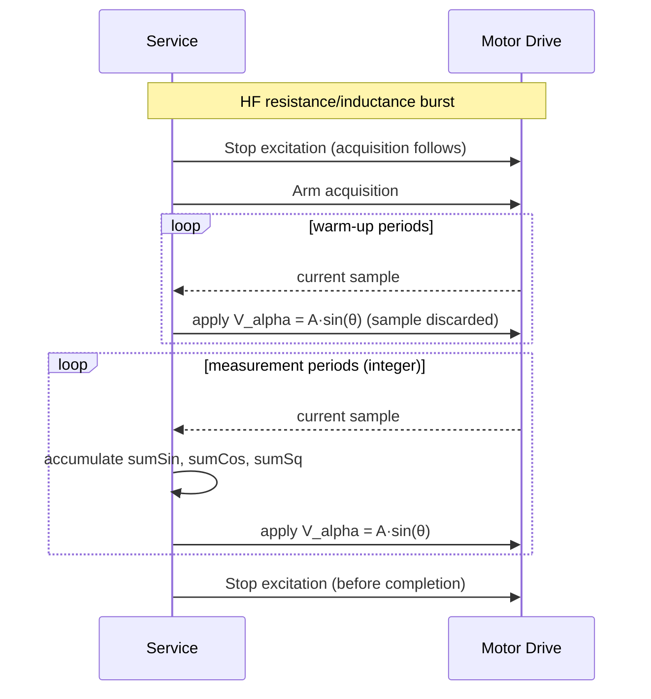
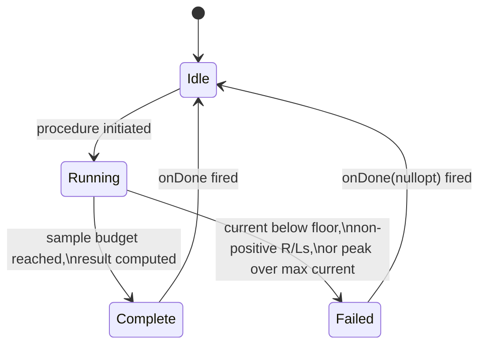

| Field     | Value                                         |
|-----------|-----------------------------------------------|
| Title     | Service: Electrical Parameters Identification |
| Type      | design                                        |
| Status    | draft                                         |
| Version   | 0.1.0                                         |
| Component | service-electrical-ident                      |
| Date      | 2026-04-07                                    |

> **IMPORTANT — Implementation-blind document**: This document describes *behavior, structure, and
> responsibilities* WITHOUT referencing code. **No code blocks using programming languages (C++, C,
> Python, CMake, shell, etc.) are allowed.** Use Mermaid diagrams to express behavior instead.
> Prose descriptions of algorithms are encouraged; source-level details are not.
>
> **Diagrams**: All visuals must be either a Mermaid fenced code block (` ```mermaid `) or ASCII art inline
> in the document. External image references using Markdown image syntax are **not allowed**.

---

## Responsibilities

**Is responsible for:**
- Automatically measuring phase resistance (R) and stator inductance (Ls) without external instruments, using a high-frequency (HF) sinusoidal impedance-injection technique on a fixed stator axis
- Estimating the motor's number of pole pairs by rotating an open-loop voltage vector through multiple full electrical revolutions and comparing the total electrical angle swept with the total encoder mechanical angle swept
- Recovering R and Ls online with O(1) memory (a small fixed set of running sums), requiring no per-sample data buffer
- Delivering results exactly once per initiated procedure via a completion callback containing typed physical quantities (Ohm, MilliHenry, or size_t)
- Enforcing that the two procedures (resistance/inductance and pole pairs) cannot run concurrently
- Stopping the inverter cleanly before invoking any completion callback

**Is NOT responsible for:**
- Persisting the identified parameters — the caller decides what to do with the results
- Encoder zero-offset calibration — that is performed by the Motor Alignment service
- Separating Ld from Lq on a salient (interior PMSM) rotor — the fixed-axis HF method reports a single Ls valid for non-salient surface PMSM; saliency separation is future work
- Performing any closed-loop current control — all voltage application is open-loop
- Running concurrently with the normal FOC loop — the FOC loop must be stopped before either procedure begins
- Aligning or clamping the rotor before measurement — the zero-mean HF injection exerts no net torque, so no rotor alignment is required

---

## Component Details

### Procedure 1 — Resistance and Inductance Estimation

This procedure injects a single high-frequency sinusoidal voltage on the stationary α-axis (β = 0) and recovers R and Ls from the amplitude and phase of the resulting current. It runs as one continuous burst driven by the ADC/PWM callbacks, with no busy-waiting and no per-sample data buffer.

#### Rationale — Why HF Injection Instead of a DC Step

A DC field on a single stator axis exerts a constant torque on the rotor magnet. If the rotor is free to move it swings and oscillates about the alignment point, and that motion induces a low-frequency back-EMF. The DC measurement model assumes zero back-EMF, so the estimate is corrupted whenever the rotor is not clamped.

A zero-mean sinusoid has no DC component, so it exerts **no net torque** and never pumps the rotor. On a surface PMSM (non-salient: Ld ≈ Lq = Ls) a fixed-axis injection sees a **constant** Ls independent of rotor angle, so **no alignment is required**. Any residual rotor oscillation is a low-frequency disturbance that synchronous demodulation at the injection frequency rejects.

#### Injection and Circuit Model

The service commands an α-axis voltage `V_alpha(t) = A · sin(ω t)` with `V_beta = 0`, where `ω = 2π · f_inj`. The command is produced by an inverse-Clarke transform of `(V_alpha, 0)` into three phase duties, all centered at 50 % duty so the low-side current shunts stay samplable and the bipolar current sense stays centered.

At AC steady state the excited-axis behaves as a series RL impedance (the low-frequency back-EMF `e_alpha` is treated as an out-of-band disturbance):

```
V_alpha = R · i_alpha + Ls · di_alpha/dt + e_alpha(t)
i_alpha(t) = I · sin(ω t − φ)
Z = A / I = sqrt(R² + (ω · Ls)²)
φ = atan2(ω · Ls, R)
```

#### Synchronous Demodulation and Closed-Form Recovery

The measured α-axis current (obtained by a forward Clarke transform of the three sampled phase currents) is correlated against sine and cosine references at the injection frequency. After a warm-up interval that lets the AC transient decay, the service accumulates, over an **integer** number of injection periods (N samples total), three running sums:

```
sumSin = Σ i_alpha[k] · sin(θ_k)
sumCos = Σ i_alpha[k] · cos(θ_k)
sumSq  = Σ i_alpha[k]²                  θ_k = ω · k / f_s (wrapped to [0, 2π))
```

Only three floats are retained regardless of burst length (O(1) memory). The in-phase and quadrature current components and the closed-form parameters follow directly:

```
I_re = 2 · sumSin / N = I · cos φ
I_im = 2 · sumCos / N = −I · sin φ
D    = I_re² + I_im² = I²

R  = A · I_re / D
Ls = −A · I_im / (ω · D)
```

**PWM→ADC pipeline lag.** The duty commanded in one callback drives the current sampled in the next, so the sampled current reflects a voltage commanded roughly one sample earlier. The applied voltage uses the live injection phase, but the demodulation reference uses that phase lagged by `voltageToCurrentDelaySamples` phase increments (default 1). This removes the `ε = 2π·f_inj/f_s` phase error that would otherwise bias R by `cos(φ+ε)/cos(φ)`. The delay is rig-calibrated: the operator tunes it until the measured R matches a multimeter DC-resistance reading.

**Back-EMF rejection.** Because the accumulation spans an integer number of injection periods, any component at a frequency other than `f_inj` (in particular the ~1–2 Hz rotor-oscillation back-EMF) integrates toward zero in both sums. A larger measurement window drives the residual leakage lower.

**Amplitude scaling.** For a center-aligned half-bridge the phase-to-midpoint voltage amplitude is `modIndex · Vdc / 2`, where `modIndex` is the α modulation index (`injectionVoltagePercent / 100`, internally clamped so every leg duty stays within a samplable window). The applied α voltage amplitude used in the closed form is therefore `A = modIndex · Vdc / 2`.

**Winding topology.** For a Delta connection the terminals measure ⅔ of the per-phase value for both R and Ls; the phase quantities are recovered with `R_phi = R_terminal · 1.5` and `Ls_phi = Ls_terminal · 1.5`.

**Injection-frequency selection.** `f_inj` must divide the sampling frequency (10 kHz) so that each measurement window is an exact integer number of samples; valid options are 200 / 250 / 500 Hz. Conditioning is best when `ω · Ls ≈ (1–3) · R` (phase 45°–70°), which keeps the current well above the shunt noise floor while separating R and Ls. For the reference rig (R ≈ 1.5 Ω, Ls ≈ 2 mH) the default is **250 Hz**, leaving a ~125× margin over the rotor-oscillation frequency.


```mermaid
sequenceDiagram
    participant Caller
    participant Service
    participant Inverter

    Caller->>Service: EstimateResistanceAndInductance(config, onDone)
    Service->>Inverter: stop, then arm current sampling at f_s
    loop warm-up periods
        Inverter-->>Service: current sample
        Service->>Inverter: apply V_alpha = A·sin(θ) (samples discarded)
    end
    loop measurement periods (integer)
        Inverter-->>Service: current sample
        Service->>Service: i_alpha = Clarke.Forward(phases)
        Service->>Service: accumulate sumSin, sumCos, sumSq
        Service->>Inverter: apply V_alpha = A·sin(θ)
    end
    Service->>Inverter: stop
    Service->>Service: I_re, I_im, D → R, Ls, fitQuality
    Service-->>Caller: onDone(R, Ls) or nullopt
```

#### Fit Quality and Error Conditions

A THD-like residual `fitQuality = |sumSq − N · I² / 2| / (N · I² / 2)` is reported (0 = perfect sinusoid). It is a **diagnostic only**: because demodulation already rejects out-of-band content from R and Ls, a raised residual flags a disturbance (e.g., rotor motion or distortion) without invalidating the recovered parameters. The inverter-voltage-offset field is not measured by the HF method and is reported as zero for API compatibility.

The procedure returns absent values when the demodulated current magnitude is below the minimum-current floor (sized to the shunt/ADC SNR, ~0.05 A; compared as a squared magnitude to avoid a square root), or when the recovered R or Ls is non-positive. The configured injection frequency is validated at start: if it is zero or does not divide the sampling frequency the completion callback fires immediately with an absent result (no division is attempted). As a safety guard, every incoming sample (warm-up and measurement) is checked against the driver's maximum supported current; if the peak measured phase current exceeds it, the drive is stopped and the procedure aborts once with an absent result.

### Procedure 2 — Pole Pairs Estimation

This procedure determines the number of electrical pole pairs by sweeping a rotating open-loop voltage vector through a configurable number of full electrical revolutions and comparing the total electrical angle swept to the total mechanical angle measured by the encoder.

#### Rotation Sweep

Starting at electrical angle 0°, the service advances the voltage vector by a small angular increment each ADC callback. The step size and number of revolutions are derived from the caller-supplied configuration. After each step, the encoder is read and the mechanical displacement is accumulated.

Over N full electrical revolutions, the total electrical angle advanced is 2π × N. The total mechanical angle swept by the encoder is measured by summing the (wrap-compensated) angular increments over all steps.

The pole pairs are then:

```
P = round( total_electrical_angle / total_mechanical_angle )
```

Rounding to the nearest integer provides the final integer result. If the computed ratio is outside a plausible range (e.g., below 1 or above a configurable maximum), the result is absent.

#### Settlement Between Steps

A configurable settle time can be inserted between incremental voltage steps to allow the rotor to follow the stator field before the next encoder sample is taken. This prevents accumulated leading error due to inertia.


```mermaid
flowchart TD
    START["Start: θe = 0°, Δθm_total = 0"] --> STEP["Advance θe by Δθ\napply open-loop voltage"]
    STEP --> SETTLE["Wait settle_time\n(TimerSingleShot)"]
    SETTLE --> READ["Read encoder\naccumulate Δθm_total"]
    READ --> CHECK{"All electrical\nrevolutions complete?"}
    CHECK -->|No| STEP
    CHECK -->|Yes| CALC["P = round(2πN / Δθm_total)"]
    CALC --> VALID{"P in valid\nrange?"}
    VALID -->|Yes| CB_OK["onDone(P)"]
    VALID -->|No| CB_FAIL["onDone(nullopt)"]
```

### Internal State Constraints

All internal state is statically allocated and O(1) in size. The HF resistance/inductance procedure keeps no per-sample data buffer at all — it retains only a fixed set of running accumulators:

| State                  | Type    | Purpose                                                              |
|------------------------|---------|----------------------------------------------------------------------|
| `sumSin`, `sumCos`     | float   | In-phase / quadrature synchronous-demodulation accumulators          |
| `sumSq`                | float   | Sum of squared current, used for the THD-like fit-quality diagnostic |
| phase, phase increment | float   | Injection-oscillator state advanced once per sample                  |
| sample / period counts | integer | Warm-up and measurement window bookkeeping                           |

No heap allocation is used, and memory usage is independent of the number of injection periods. The accumulators are members of the service object and are reset at the start of each procedure invocation.

### Concurrency Invariant

The two procedures are independent state machines. Neither may be started while the other is in the Running state. An attempt to start one while the other is already Running causes the new request to be rejected (callback invoked immediately with absent values). The two state machines share no mutable state beyond the inverter and encoder references.

### Acquisition / Actuation Sequencing Invariant

Each measurement phase of both procedures drives the motor through a strict ordering:

1. **Stop the drive.** Excitation is removed first. Because current acquisition is slaved to the drive excitation, stopping the drive also stops acquisition — no separate action is needed to silence sampling.
2. **Arm acquisition.** The service prepares to receive current samples for the upcoming phase. Acquisition is only ever re-armed while the drive is stopped.
3. **Apply excitation.** The drive is energised for the phase.

This ordering guarantees acquisition is ready before any current can flow, and that samples belonging to a previous phase can never be attributed to a new excitation.

For the HF resistance/inductance procedure the excitation is applied inside the sampling callback itself, so a warm-up window (an integer number of injection periods) precedes measurement: while the AC transient decays, incoming samples are demodulated-but-discarded; afterwards the accumulators integrate over an integer number of measurement periods. Once the total sample budget is reached the drive is stopped and any further samples are ignored, so completion happens exactly once and remains safe even if a sample arrives just after the drive has been stopped. (The pole-pairs procedure instead uses a per-step settle timer, described in Procedure 2.)


```mermaid
sequenceDiagram
    participant Service
    participant Drive as Motor Drive
    Note over Service,Drive: HF resistance/inductance burst
    Service->>Drive: Stop excitation (acquisition follows)
    Service->>Drive: Arm acquisition
    loop warm-up periods
        Drive-->>Service: current sample
        Service->>Drive: apply V_alpha = A·sin(θ) (sample discarded)
    end
    loop measurement periods (integer)
        Drive-->>Service: current sample
        Service->>Service: accumulate sumSin, sumCos, sumSq
        Service->>Drive: apply V_alpha = A·sin(θ)
    end
    Service->>Drive: Stop excitation (before completion)
```

### State Machine (Both Procedures)


```mermaid
stateDiagram-v2
    [*] --> Idle
    Idle --> Running : procedure initiated
    Running --> Complete : sample budget reached,\nresult computed
    Running --> Failed : current below floor,\nnon-positive R/Ls,\nor peak over max current
    Complete --> Idle : onDone fired
    Failed --> Idle : onDone(nullopt) fired
```

---

## Interfaces

### Provided

| Interface                                         | Purpose                                                                                           | Contract                                                                                                                                         |
|---------------------------------------------------|---------------------------------------------------------------------------------------------------|--------------------------------------------------------------------------------------------------------------------------------------------------|
| `EstimateResistanceAndInductance(config, onDone)` | Runs the HF sinusoidal impedance-injection procedure; delivers `optional<{Ohm, MilliHenry, ...}>` | Rejected (immediate failure callback) if the pole-pairs procedure is already Running; inverter stopped before callback fires; fires exactly once |
| `EstimateNumberOfPolePairs(config, onDone)`       | Sweeps an open-loop rotating vector and delivers `optional<size_t>` pole pairs                    | Rejected if the R/L procedure is already Running; inverter stopped before callback fires; fires exactly once                                     |

### Required

| Interface                | Purpose                                                                                                      | Contract                                                         |
|--------------------------|--------------------------------------------------------------------------------------------------------------|------------------------------------------------------------------|
| `ThreePhaseInverter`     | Open-loop voltage application during both procedures; source of ADC sampling callbacks                       | Must not be concurrently claimed by any other controller         |
| `Encoder`                | Reads mechanical angle during pole-pairs sweep to compute accumulated displacement                           | Must be initialised before `EstimateNumberOfPolePairs` is called |
| DC bus voltage (`Volts`) | Injected at construction; used to normalise applied voltage and interpret current readings in physical units | Must remain stable throughout any active procedure               |

---

## Online Resistance and Inductance Estimation

In addition to the one-shot calibration procedures above, a continuous online estimator (`RealTimeResistanceAndInductanceEstimator`) runs alongside the closed-loop speed/position controller to track slow parameter drift.

### Model

The d-axis voltage equation for a non-salient PMSM is:

$$V_d = R \cdot I_d + L \cdot \left(\frac{dI_d}{dt} - \omega_e \cdot I_q\right)$$

The regressor vector is $\phi = [I_d,\ (dI_d/dt - \omega_e I_q)]^T$, and the parameter vector is $\theta = [R,\ L]^T$. The scalar output is $V_d$. An RLS algorithm with a forgetting factor of 0.998 updates $\theta$ each outer-loop period (1 kHz by default).

**Non-saliency assumption:** The model equates $L_d = L_q = L$. For surface-mounted PMSM (SPMSM) this is accurate. For interior PMSM (IPMSM), separating $L_d$ and $L_q$ requires a 3-parameter model; this is a known limitation of the current design.

### Persistence-of-Excitation Gate

The RLS update is skipped when the squared regressor norm $|\phi|^2$ falls below $10^{-6}$. This prevents the covariance matrix from growing unbounded when the motor is at standstill or when d-axis excitation is negligible.

### Seeding and Warm Start

When calibration data is loaded (from NVM or after a fresh calibration run), the online estimator is seeded with the identified values $(R_{cal}, L_d^{cal})$. This initialises the RLS coefficient vector to the calibration point rather than zero, avoiding a cold-start transient where estimates are physically meaningless.

### Forgetting Factor

The forgetting factor $\lambda = 0.998$ applies an exponential weight decay to past observations. Older measurements contribute less to the current estimate, allowing the estimator to track gradual parameter changes over the motor lifetime (winding resistance increases with temperature; inductance changes with saturation level).

### Estimate Consumption

Estimates are not applied automatically. The operator or application explicitly triggers a PID retune via `ApplyOnlineEstimates()` on the state machine. See the State Machine design document for details.
