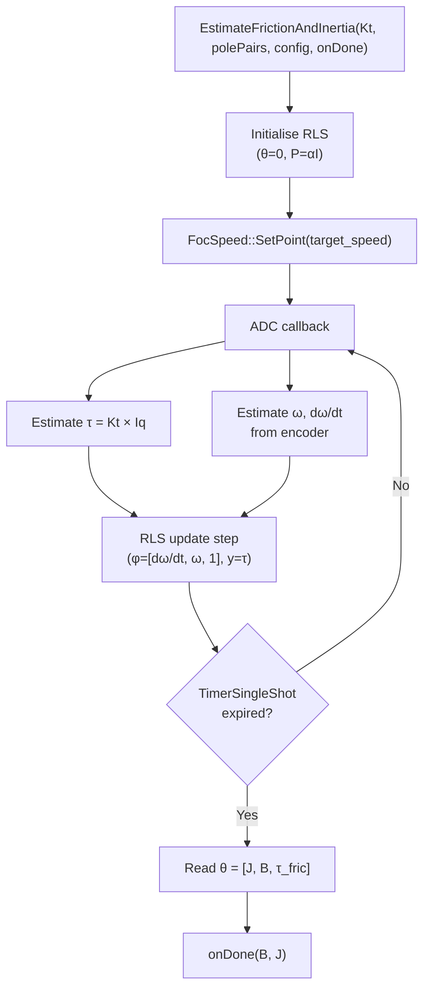
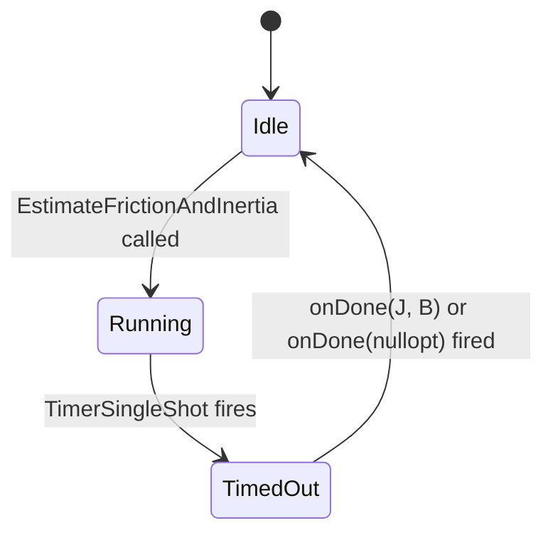

| Field     | Value                                         |
|-----------|-----------------------------------------------|
| Title     | Service: Mechanical Parameters Identification |
| Type      | design                                        |
| Status    | draft                                         |
| Version   | 0.1.0                                         |
| Component | service-mechanical-ident                      |
| Date      | 2026-04-07                                    |

> **IMPORTANT — Implementation-blind document**: This document describes *behavior, structure, and
> responsibilities* WITHOUT referencing code. **No code blocks using programming languages (C++, C,
> Python, CMake, shell, etc.) are allowed.** Use Mermaid diagrams to express behavior instead.
> Prose descriptions of algorithms are encouraged; source-level details are not.
>
> **Diagrams**: All visuals must be either a Mermaid fenced code block (` ```mermaid `) or ASCII art inline
> in the document. External image references using Markdown image syntax are **not allowed**.

---

## Responsibilities

**Is responsible for:**
- Estimating rotor moment of inertia (J) and viscous friction coefficient (B) while the motor runs in closed-loop speed control
- Computing instantaneous electromagnetic torque from the q-axis current and the caller-supplied torque constant
- Estimating angular acceleration by finite-differencing successive speed measurements obtained from the encoder
- Maintaining a real-time Recursive Least Squares (RLS) estimator that continuously refines the parameter vector [J, B, τ_friction] using each new observation
- Enforcing a configurable estimation timeout via a `TimerSingleShot`, after which the latest RLS estimates are reported and the procedure stops
- Delivering results via a single completion callback containing typed physical units (`NewtonMeterSecondPerRadian` for friction, `NewtonMeterSecondSquared` for inertia)

**Is NOT responsible for:**
- Starting or configuring the speed control loop — a `FocSpeed` interface must already be running when the procedure begins
- Persisting the returned parameters — the caller decides what to do with them
- Auto-tuning the speed PID — this service provides the plant parameters that a separate tuning step may consume
- Measuring electrical parameters (R, L, pole pairs) — those are handled by the Electrical Parameters Identification service

---

## Component Details

### Prerequisites and Motor Model

The mechanical dynamics of a PMSM rotor are governed by Newton's second law for rotation:

```
τ_motor = J · dω/dt + B · ω + τ_friction
```

where:

- **τ_motor** — electromagnetic torque produced by the motor (N·m)
- **J** — rotor moment of inertia (kg·m²)
- **B** — viscous friction coefficient (N·m·s/rad)
- **τ_friction** — Coulomb (constant) friction term (N·m)
- **ω** — rotor angular velocity (rad/s)
- **dω/dt** — rotor angular acceleration (rad/s²)

This is a linear model in the three unknowns [J, B, τ_friction]. The RLS estimator treats each measurement instant as one observation of this linear equation.

### Torque Estimation

At each sampling callback, the instantaneous electromagnetic torque is estimated from the q-axis current:

```
τ_motor = Kt × Iq
```

where `Kt` is the torque constant (N·m/A) provided by the caller. The q-axis current `Iq` is the measured value supplied by the `ThreePhaseInverter` ADC callback — the same current feedback path used by the FOC current controller.

The d-axis contribution to torque is zero for surface PMSM under the Id = 0 operating condition assumed during identification. For interior PMSM with reluctance torque, this approximation introduces a small systematic error in the torque estimate; the caller should account for this if Ld ≠ Lq.

### Speed and Acceleration Estimation

Angular velocity (ω) at each observation instant is obtained from two successive encoder angle samples using a finite difference with wrap-around compensation:

```
ω_k = (θ_k − θ_{k−1}) / Δt
```

where Δt is the sampling period and wrap-around compensation shifts the raw difference into the range (−π/Δt, +π/Δt) rad/s in exactly the same manner used by the speed control outer loop.

Angular acceleration (dω/dt) is obtained from two successive velocity estimates by a further finite difference:

```
α_k = (ω_k − ω_{k−1}) / Δt
```

The double finite difference amplifies noise; the quality of the acceleration estimate therefore depends on the encoder resolution and sampling rate. Low-resolution encoders or very low speeds produce noisy acceleration estimates and degrade identification accuracy. The caller is advised to command a non-zero target speed of sufficient magnitude to obtain a good signal-to-noise ratio.

### Recursive Least Squares Estimator

The RLS estimator maintains a 3×1 parameter vector θ = [J, B, τ_friction]ᵀ and a 3×3 covariance matrix P. At each observation k, a 1×3 regressor row vector is formed:

```
φ_k = [ dω/dt_k,  ω_k,  1 ]
```

and the scalar observation is:

```
y_k = τ_motor_k
```

The prediction error is:

```
e_k = y_k − φ_k · θ_{k−1}
```

The Kalman gain vector is:

```
K_k = P_{k−1} · φ_kᵀ · (λ + φ_k · P_{k−1} · φ_kᵀ)⁻¹
```

The parameter and covariance updates are:

```
θ_k = θ_{k−1} + K_k · e_k
P_k = (P_{k−1} − K_k · φ_k · P_{k−1}) / λ
```

The scalar λ (0 < λ ≤ 1) is the **forgetting factor** (default 0.998). Values less than 1 cause older observations to carry exponentially decreasing weight, which is important for tracking slowly time-varying loads. At λ = 1 the estimator is an ordinary batch least squares — it never forgets.

The RLS state (θ and P) is held in a statically allocated object (`std::optional<MotorRLS>`) that is emplaced in-place at the start of each procedure invocation and destroyed when the procedure ends. This avoids heap allocation while still permitting the state to be absent between procedures.



### Timeout and Result Delivery

A `TimerSingleShot` starts when the procedure begins. When it fires, the current RLS parameter vector is read and the results are extracted:

- **J** (inertia) is the first element of θ; reported as `NewtonMeterSecondSquared`.
- **B** (viscous friction) is the second element of θ; reported as `NewtonMeterSecondPerRadian`.
- **τ_friction** (Coulomb friction) is the third element of θ; it is observed internally but is not part of the output interface for this version.

If the estimation converges to physically implausible values (negative J, negative B), both outputs are reported as absent. No special "converged" criterion is enforced — the caller is responsible for treating results obtained at very low excitation or very short timeout as unreliable.

### State Machine



Only one estimation may be in progress at a time. A call to `EstimateFrictionAndInertia` while already Running is rejected immediately (callback invoked with absent values).

---

## Interfaces

### Provided

| Interface                                                               | Purpose                                                                                                                                                              | Contract                                                                                                                         |
|-------------------------------------------------------------------------|----------------------------------------------------------------------------------------------------------------------------------------------------------------------|----------------------------------------------------------------------------------------------------------------------------------|
| `EstimateFrictionAndInertia(torqueConstant, polePairs, config, onDone)` | Runs the RLS estimator under active speed control for a configurable duration; delivers `(optional<NewtonMeterSecondPerRadian>, optional<NewtonMeterSecondSquared>)` | Rejected (immediate failure callback) if already Running; fires exactly once; does not stop the speed control loop on completion |

### Required

| Interface            | Purpose                                                                                 | Contract                                                                       |
|----------------------|-----------------------------------------------------------------------------------------|--------------------------------------------------------------------------------|
| `FocSpeed`           | Commands a target speed setpoint to excite the mechanical dynamics                      | Must already be active and in control of the motor before the procedure begins |
| `ThreePhaseInverter` | Source of ADC current callbacks that supply the Iq measurement on each computation step | Must not be stopped during the estimation procedure                            |
| `Encoder`            | Supplies mechanical angle samples for speed and acceleration estimation                 | Must be tracking position at the configured sampling rate                      |
