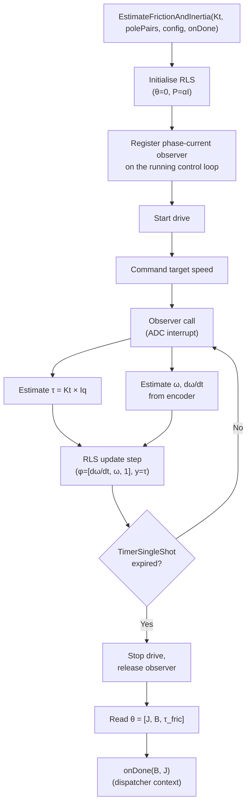
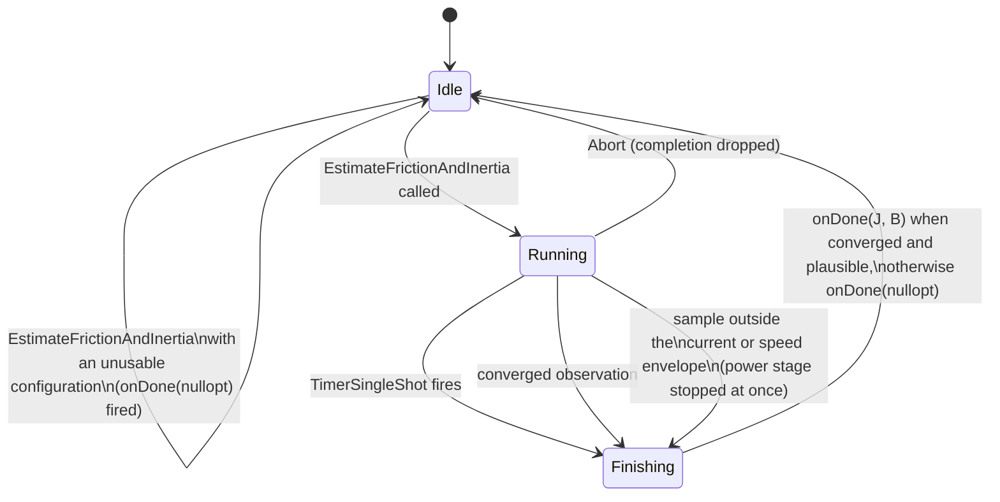

| Field     | Value                                         |
|-----------|-----------------------------------------------|
| Title     | Service: Mechanical Parameters Identification |
| Type      | design                                        |
| Status    | draft                                         |
| Version   | 0.2.0                                         |
| Component | service-mechanical-ident                      |
| Date      | 2026-09-21                                    |

> **IMPORTANT — Implementation-blind document**: This document describes *behavior, structure, and
> responsibilities* WITHOUT referencing code. **No code blocks using programming languages (C++, C,
> Python, CMake, shell, etc.) are allowed.** Use Mermaid diagrams to express behavior instead.
> Prose descriptions of algorithms are encouraged; source-level details are not.
>
> **Diagrams**: All visuals must be either a Mermaid fenced code block (` ```mermaid `) or ASCII art inline
> in the document. External image references using Markdown image syntax are **not allowed**.

---

## Responsibilities

**Is responsible for:**
- Estimating rotor moment of inertia (J) and viscous friction coefficient (B) while the motor runs in closed-loop speed control
- Starting and stopping the drive for the duration of the procedure, and driving the two-level speed trajectory that provides the excitation
- Refusing a request whose configuration does not describe a bounded trajectory, and ending a run that leaves the current or speed envelope it was given
- Reporting an estimate only when it is converged and physically plausible, and reporting absent values otherwise
- Releasing the drive and discarding the pending completion when the caller aborts, so that a fault is not overwritten by the result of the procedure it interrupted
- Computing instantaneous electromagnetic torque from the q-axis current and the caller-supplied torque constant
- Estimating angular acceleration by finite-differencing successive speed measurements obtained from the encoder
- Maintaining a real-time Recursive Least Squares (RLS) estimator that continuously refines the parameter vector [J, B, τ_friction] using each new observation
- Enforcing a configurable one-shot estimation timeout, after which the latest RLS estimates are reported and the procedure stops
- Delivering results through a single completion notification that reports friction and inertia using explicit physical units

**Is NOT responsible for:**
- Configuring the speed control loop — the loop's tunings and algorithm selection are established before the procedure begins, and the caller is responsible for the electrical model and provisional mechanics that make those loops able to move the rotor at all (see the State Machine design document)
- Persisting the returned parameters — the caller decides what to do with them
- Auto-tuning the speed controller — this service provides the plant parameters that a separate tuning step may consume
- Measuring electrical parameters (R, L, pole pairs) — those are handled by the Electrical Parameters Identification service

---

## Component Details

### Prerequisites and Motor Model

The mechanical dynamics of a PMSM rotor are governed by Newton's second law for rotation:

```text
τ_motor = J · dω/dt + B · ω + τ_friction
```

where:

- **τ_motor** — electromagnetic torque produced by the motor (N·m)
- **J** — rotor moment of inertia (kg·m²)
- **B** — viscous friction coefficient (N·m·s/rad)
- **τ_friction** — Coulomb (constant) friction term (N·m)
- **ω** — rotor angular velocity (rad/s)
- **dω/dt** — rotor angular acceleration (rad/s²)

This is a linear model in the three unknowns [J, B, τ_friction]. The RLS estimator treats each measurement instant as one observation of this linear equation.

### Torque Estimation

At each sampling callback, the instantaneous electromagnetic torque is estimated from the q-axis current:

```text
τ_motor = Kt × Iq
```

where `Kt` is the torque constant (N·m/A) provided by the caller. The q-axis current `Iq` is the measured value the control loop is already sampling — the same current feedback path used by the FOC current controller.

The d-axis contribution to torque is zero for surface PMSM under the Id = 0 operating condition assumed during identification. For interior PMSM with reluctance torque, this approximation introduces a small systematic error in the torque estimate; the caller should account for this if Ld ≠ Lq.

### Speed and Acceleration Estimation

Angular velocity (ω) at each observation instant is obtained from two successive encoder angle samples using a finite difference with wrap-around compensation:

```text
ω_k = (θ_k − θ_{k−1}) / Δt
```

where Δt is the sampling period and wrap-around compensation shifts the raw difference into the range (−π/Δt, +π/Δt) rad/s in exactly the same manner used by the speed control outer loop.

Δt must be the period of the callback that produced the two samples. Observations arrive with the control
loop's current samples, at the inverter's **base** frequency rather than the speed-command frequency, so Δt is
derived from `BaseFrequency()`. Deriving it from the outer-loop rate instead scales ω by the ratio of the two
frequencies and α by its square — at 20 kHz against 1 kHz that is 20× on speed and 400× on inertia, and the
inertia estimate becomes speed-loop PID gains.

### Obtaining the observations

The inverter carries a **single** phase-current callback slot, and that slot is the control loop's only path to
the PWM output. A procedure that claims it for itself evicts the control loop: no duty cycles are written, the
inverter is never started, the rotor stays where it is, and the regressor carries no excitation for the
estimator to converge on. The procedure then runs to its timeout and reports failure — on hardware only, since
a test double that publishes samples on demand hides the whole effect.

So this procedure does not claim the slot. It registers as an **observer** on the running control loop, which
publishes the phase currents it has just used, after the duty cycles are written. Starting and stopping the
drive is likewise done through the controller rather than by writing the inverter directly.

Two consequences follow from the observer running in the ADC interrupt:

- The procedure's completion is handed to the event dispatcher rather than invoked from the interrupt.
  Releasing the observer from inside its own invocation would destroy the closure being executed, and the
  completion reaches non-volatile memory through the state machine.
- An abort takes effect immediately — the drive is stopped and the observer released — but the pending
  completion is dropped rather than invoked. The caller that aborted owns the outcome.
- Because the completion is deferred, an abort and a new run can both happen before the dispatcher gets to
  it. Each run therefore carries a generation, and a queued completion finishes only the run that queued
  it; a terminal outcome belonging to an aborted run can never complete the run that followed it.

Each observation reads the encoder once. Reading it twice within a callback samples two different rotor positions and mixes them into a single difference.

Angular acceleration (dω/dt) is obtained from two successive velocity estimates by a further finite difference:

```text
α_k = (ω_k − ω_{k−1}) / Δt
```

The double finite difference amplifies noise; the quality of the acceleration estimate therefore depends on the encoder resolution and sampling rate. Low-resolution encoders or very low speeds produce noisy acceleration estimates and degrade identification accuracy. The caller is advised to command a non-zero target speed of sufficient magnitude to obtain a good signal-to-noise ratio.

### Excitation Trajectory

A single constant speed setpoint is not an excitation. Once the loop has settled on it the regressor reads
`[1, 0, ω]` with ω constant: the acceleration column is zero, so J is not identified at all, and the
intercept and speed columns are collinear, so B cannot be separated from the Coulomb term. Every sample
then adds information in no direction while the forgetting factor keeps inflating the covariance.

The procedure therefore drives a two-level trajectory. It commands the target speed, then alternates
between the target speed and a lower dwell speed every dwell period until the run ends. Each transition is
a commanded acceleration, and the rotor spends the whole run above the minimum speed the update gate
requires, so both the inertia and the friction directions are excited repeatedly.

```text
speed
  ω_target ─┐     ┌─────┐     ┌─────┐
            │     │     │     │     │
  ω_dwell   └─────┘     └─────┘     └───  …
            |<-T->|<-T->|<-T->|
```

### Bounded Envelope

The trajectory is given explicit limits and the run stays inside them:

| Limit    | Meaning                                                                                        |
|----------|------------------------------------------------------------------------------------------------|
| current  | The largest phase-current magnitude the run may produce, clamped to what the inverter supports |
| speed    | The largest rotor speed the run may reach, measured rather than commanded                      |
| duration | The timeout after which the run ends whether or not it has converged                           |

On the first sample whose phase current exceeds the current envelope in any phase and in either
direction, or whose measured speed exceeds the speed limit, the run ends and reports absent values.

The power stage is stopped **in the interrupt that observed the sample**, not with the rest of the
teardown. Deferring it would leave the inverter driving an out-of-envelope current for as long as the
dispatcher takes to run, which is the one thing the envelope exists to prevent; stopping the inverter
touches no callback slot, so it is safe from the interrupt, whereas releasing the observer there would
destroy the closure being executed. Releasing the observer, stopping the drive through the controller and
delivering the completion therefore stay deferred, as they are for every other way a run ends.

The envelope is evaluated on **every** sample for as long as the drive is live — including samples that
arrive after a converged one has queued its completion but before the dispatcher has run. A run is only
over once the drive has been released, so a sample that leaves the envelope in that window still
invalidates the estimate rather than letting a converged value through.

A configuration that does not describe a usable bounded trajectory — a dwell speed that is not below the
target speed, a non-positive envelope, a speed limit that is not finite and positive or that sits below
the target, a timeout that does not outlast one dwell period, a forgetting factor outside (0, 1] — is
refused through the completion rather than started, as is a request without a positive torque constant or
pole-pair count. The speed limit in particular must be finite: an infinite bound passes every comparison
against the target speed while making the run-time check unreachable, which is a bounded trajectory in
name only.

### Recursive Least Squares Estimator

The RLS estimator maintains a 3×1 parameter vector θ = [J, B, τ_friction]ᵀ and a 3×3 covariance matrix P. At each observation k, a 1×3 regressor row vector is formed:

```text
φ_k = [ dω/dt_k,  ω_k,  1 ]
```

and the scalar observation is:

```text
y_k = τ_motor_k
```

The prediction error is:

```text
e_k = y_k − φ_k · θ_{k−1}
```

The Kalman gain vector is:

```text
K_k = P_{k−1} · φ_kᵀ · (λ + φ_k · P_{k−1} · φ_kᵀ)⁻¹
```

The parameter and covariance updates are:

```text
θ_k = θ_{k−1} + K_k · e_k
P_k = (P_{k−1} − K_k · φ_k · P_{k−1}) / λ
```

The scalar λ (0 < λ <= 1) is the **forgetting factor** (default 0.998). Values less than 1 cause older observations to carry exponentially decreasing weight, which is important for tracking slowly time-varying loads. At λ = 1 the estimator is an ordinary batch least squares — it never forgets.

The RLS state (θ and P) is held in a statically allocated object (`std::optional<MotorRLS>`) that is emplaced in-place at the start of each procedure invocation and destroyed when the procedure ends. This avoids heap allocation while still permitting the state to be absent between procedures.


```mermaid
flowchart TD
    START["EstimateFrictionAndInertia(Kt, polePairs, config, onDone)"] --> INIT["Initialise RLS\n(θ=0, P=αI)"]
    INIT --> OBS["Register phase-current observer\non the running control loop"]
    OBS --> DRIVE["Start drive"]
    DRIVE --> CMD_SPEED["Command target speed"]
    CMD_SPEED --> CB["Observer call\n(ADC interrupt)"]
    CB --> TAU["Estimate τ = Kt × Iq"]
    CB --> VEL["Estimate ω, dω/dt\nfrom encoder"]
    TAU --> RLS["RLS update step\n(φ=[dω/dt, ω, 1], y=τ)"]
    VEL --> RLS
    RLS --> TIMEOUT{"TimerSingleShot\nexpired?"}
    TIMEOUT -->|No| CB
    TIMEOUT -->|Yes| REL["Stop drive,\nrelease observer"]
    REL --> REPORT["Read θ = [J, B, τ_fric]"]
    REPORT --> CB2["onDone(B, J)\n(dispatcher context)"]
```

### Timeout and Result Delivery

A `TimerSingleShot` starts when the procedure begins. When it fires, the current RLS parameter vector is read and the results are extracted:

- **J** (inertia) is the first element of θ; reported as `NewtonMeterSecondSquared`.
- **B** (viscous friction) is the second element of θ; reported as `NewtonMeterSecondPerRadian`.
- **τ_friction** (Coulomb friction) is the third element of θ; it is observed internally but is not part of the output interface for this version.

### Acceptance Policy

The procedure and the online estimator described below share one acceptance policy, so a value one of
them refuses is refused by the other:

| Gate              | Rule                                                                                                                                                        |
|-------------------|-------------------------------------------------------------------------------------------------------------------------------------------------------------|
| excitation        | An observation updates the estimator only when the rotor is both moving and accelerating: speed magnitude and acceleration magnitude are each above a floor |
| informed estimate | At least a minimum number of such observations must have been taken since the estimator was started or seeded                                               |
| convergence       | The innovation must be below a fixed bound and the covariance trace below a bound scaled to the forgetting factor                                           |
| plausibility      | J must be finite, strictly positive and below an upper bound; B must be finite, non-negative and below an upper bound                                       |

The covariance bound is expressed relative to the forgetting factor because an RLS that forgets cannot
drive its covariance below a floor proportional to (1 − λ). A single absolute bound would be structurally
unreachable for a tracking estimator with a short memory and trivially met by one that never forgets.

The one-shot procedure runs with a forgetting factor close to unity: the plant does not drift within a
five-second run, and a shorter memory would hold the steady-state covariance above the bound the run has
to reach.

A run that reaches its timeout without satisfying every gate, or whose final parameter vector falls
outside the plausibility band, reports both outputs as absent. The caller treats that as a failed
calibration step.

### State Machine


```mermaid
stateDiagram-v2
    [*] --> Idle
    Idle --> Idle : EstimateFrictionAndInertia\nwith an unusable configuration\n(onDone(nullopt) fired)
    Idle --> Running : EstimateFrictionAndInertia called
    Running --> Finishing : TimerSingleShot fires
    Running --> Finishing : converged observation
    Running --> Finishing : sample outside the\ncurrent or speed envelope\n(power stage stopped at once)
    Running --> Idle : Abort (completion dropped)
    Finishing --> Idle : onDone(J, B) when converged and plausible,\notherwise onDone(nullopt)
```

Only one estimation may be in progress at a time. A call to `EstimateFrictionAndInertia` while already Running is rejected immediately (callback invoked with absent values).

---

## Interfaces

### Provided

| Interface                                                               | Purpose                                                                                | Contract                                                                                                                                                  |
|-------------------------------------------------------------------------|----------------------------------------------------------------------------------------|-----------------------------------------------------------------------------------------------------------------------------------------------------------|
| `EstimateFrictionAndInertia(torqueConstant, polePairs, config, onDone)` | Runs the RLS estimator under active speed control along a bounded two-level trajectory | Delivers `(optional<NewtonMeterSecondPerRadian>, optional<NewtonMeterSecondSquared>)` exactly once; absent unless the estimate is converged and plausible |

A request is rejected through its own completion, with both values absent, when a run is already in
flight, when the configuration does not describe a usable bounded trajectory, or when the torque constant
or pole-pair count is not positive.

### Required

| Interface            | Purpose                                                                                 | Contract                                                                                                                                                                       |
|----------------------|-----------------------------------------------------------------------------------------|--------------------------------------------------------------------------------------------------------------------------------------------------------------------------------|
| `FocSpeed`           | Commands the two speed setpoints that excite the mechanical dynamics                    | Must already be active and in control of the motor before the procedure begins, with an electrical model and mechanics applied so its gains and current envelope are not inert |
| `ThreePhaseInverter` | Source of ADC current callbacks that supply the Iq measurement on each computation step | Must not be stopped during the estimation procedure                                                                                                                            |
| `Encoder`            | Supplies mechanical angle samples for speed and acceleration estimation                 | Must be tracking position at the configured sampling rate                                                                                                                      |

---

## Online Inertia and Friction Estimation

In addition to the one-shot timed procedure above, a continuous online estimator (`RealTimeFrictionAndInertiaEstimator`) runs alongside the closed-loop speed controller to track slow mechanical parameter drift.

### Model

The mechanical equation of motion for the motor shaft is:

$$T_e = J \cdot \dot{\omega} + B \cdot \omega + \tau_c$$

The electromagnetic torque is approximated as $T_e = I_q \cdot k_t$, where $k_t = \tfrac{3}{2} p \psi_f$ is derived from the calibration record's pole pairs and flux linkage. Angular acceleration $\dot{\omega}$ is derived from a finite difference of successive speed measurements scaled by the sampling frequency.

The regressor vector is $\phi = [1,\ \dot{\omega},\ \omega]^T$, and the parameter vector is $\theta = [\tau_c,\ J,\ B]^T$. The scalar output is $T_e$. An RLS algorithm with a forgetting factor of 0.995 updates $\theta$ each outer-loop period.

### Torque Constant Dependency

The torque constant $k_t$ must be provided before the estimator updates begin. In normal operation the state machine derives it from the calibration NVM record as $\tfrac{3}{2} p \psi_f$ (`core/foc/math/TorqueConstant.hpp`) and supplies it via `SetTorqueConstant()` during the `EnterEnabled` transition; the one-shot procedure receives the same value. A wrong $k_t$ scales every identified $J$ and $B$ by the same factor, which is why it is not a per-target constant. Updates run opportunistically while the FOC controller is active.

### Persistence of Excitation

At standstill the regressor degenerates to $\phi = [1,\ 0,\ 0]^T$: the constant intercept is excited but the
inertia and friction directions are not. The coefficients barely move, but the covariance $P$ is **not**
self-gating — an RLS update with a forgetting factor inflates $P$ by $\lambda^{-1}$ in every unexcited
direction on every sample, so $P$ grows as $\lambda^{-n}$. At $\lambda = 0.995$ and 20 kHz that reaches
roughly $5\times10^{21}$ after ten seconds of standstill, and the first sample of real excitation then
produces an enormous coefficient jump.

The estimator therefore applies an explicit gate: an observation updates the RLS only when $|\dot{\omega}|$
**and** $|\omega|$ both exceed a minimum. Requiring only one of the two admits a rotor held at a constant
speed, which excites neither the inertia direction (the acceleration column is zero) nor the friction
direction separately from the intercept (the two columns are collinear) while still inflating $P$ on every
sample. Unexcited observations are skipped entirely, so the covariance is frozen rather than inflated, and
the previous coefficients are reported unchanged.

### Plausibility Band and Update Rate

A finiteness test alone admits values such as $10^{30}$. Before an estimate is published to `CurrentInertia()`
/ `CurrentFriction()` — and therefore before it can become PID gains — it must pass every gate of the shared
acceptance policy above: enough exciting observations since the last seed, a converged innovation and
covariance, and a value inside the physical band. A publication is therefore rate-limited by construction —
no estimate reaches the accessors during the warm-up that follows a seed, and none reaches them while the
fit is still moving. An estimate that fails any gate is discarded and the last accepted pair is retained.

### Seeding and Warm Start

When calibration data is loaded (from NVM or after a fresh calibration run), the online estimator is seeded
with the calibration values $(J_{cal}, B_{cal})$. This initialises the RLS coefficient vector to $\theta =
[0,\ J_{cal},\ B_{cal}]^T$, setting the Coulomb-friction intercept to zero and warm-starting the inertia and
viscous-friction estimates at the identified operating point. This avoids a cold-start transient where
estimates are physically meaningless during the initial operating period.

### Forgetting Factor

The forgetting factor $\lambda = 0.995$ applies an exponential weight decay to past observations, enabling the estimator to track gradual mechanical changes over the motor lifetime (bearing wear increases friction; load changes affect effective inertia).

### Estimate Consumption

Estimates are not applied automatically. The operator or application explicitly triggers a speed-PID retune via `ApplyOnlineEstimates()` on the state machine. See the State Machine design document for details.
