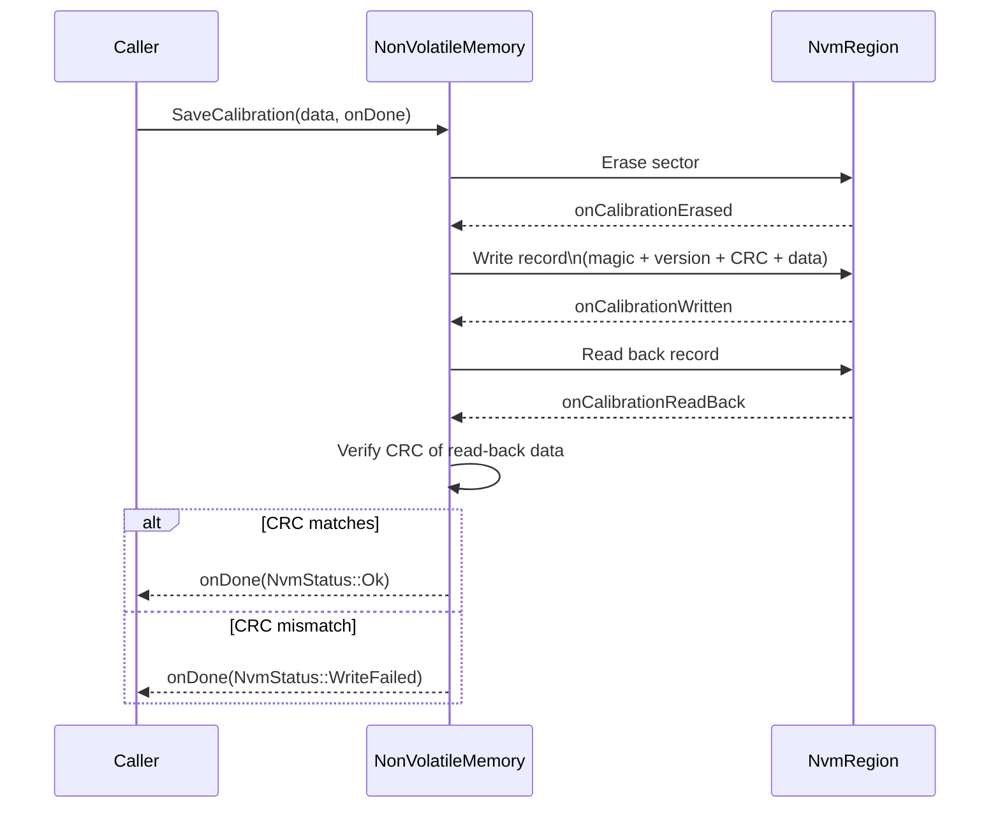
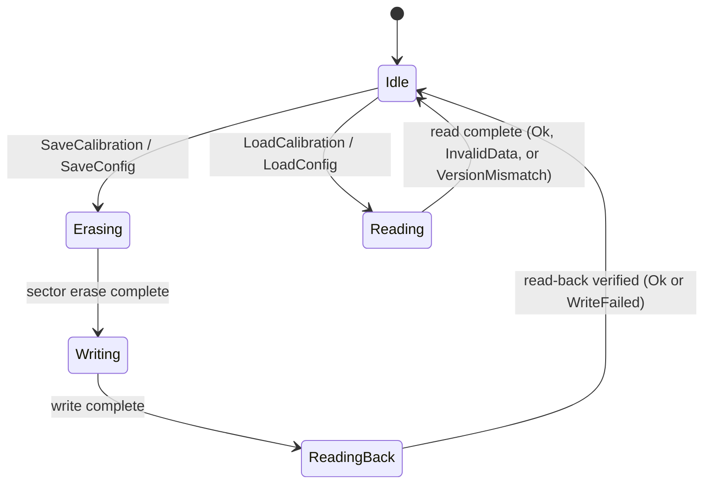

| Field     | Value                        |
|-----------|------------------------------|
| Title     | Service: Non-Volatile Memory |
| Type      | design                       |
| Status    | draft                        |
| Version   | 0.1.0                        |
| Component | service-nvm                  |
| Date      | 2026-04-07                   |

> **IMPORTANT — Implementation-blind document**: This document describes *behavior, structure, and
> responsibilities* WITHOUT referencing code. **No code blocks using programming languages (C++, C,
> Python, CMake, shell, etc.) are allowed.** Use Mermaid diagrams to express behavior instead.
> Prose descriptions of algorithms are encouraged; source-level details are not.
>
> **Diagrams**: All visuals must be either a Mermaid fenced code block (` ```mermaid `) or ASCII art inline
> in the document. External image references using Markdown image syntax are **not allowed**.

---

## Responsibilities

**Is responsible for:**
- Persisting motor calibration data (R, L, pole pairs, encoder offset, PID gains, inertia, friction) and system configuration (current limits, velocity limits, CAN parameters, telemetry rate, voltage thresholds) across power cycles using MCU internal flash
- Ensuring data integrity on every read through CRC-32 verification and on every write through read-back verification
- Detecting and signalling version mismatches when a stored record was written by a different firmware version
- Distinguishing the calibration and configuration regions by per-region magic numbers, preventing cross-region misinterpretation of data
- Providing non-blocking, callback-based operations — no operation may block the calling context
- Providing a `Format` operation that erases both regions to factory state

**Is NOT responsible for:**
- Raw flash hardware access — all sector erase, read, and write operations are delegated to injected `NvmRegion` instances
- Computing the calibration or configuration values themselves — those are produced by the identification services and the application
- Providing wear-levelling or journaling — a single record per region is maintained without historical versioning

---

## Component Details

### Logical Regions

The service manages two independent flash regions. Each region holds exactly one record at a time — the latest write replaces any previous record in that sector.

| Region | Magic | Data structure | Data size |
|--------|-------|----------------|-----------|
| Calibration | `0xCAFEF00D` | `CalibrationData` | 36 bytes |
| Configuration | `0xDEADBEEF` | `ConfigData` | 40 bytes |

The two regions use different `NvmRegion` instances (injected at construction) and can be read, written, and erased independently. An operation on the calibration region has no effect on the configuration region and vice versa.

### On-Media Record Format

Each region stores a single record consisting of a fixed-size header followed by the data payload. The header fields, in order, are:

| Field | Size | Description |
|-------|------|-------------|
| Magic | 4 bytes | Region identifier (`0xCAFEF00D` or `0xDEADBEEF`) |
| Version | 1 byte | Layout version constant baked into firmware |
| CRC-32 | 4 bytes | CRC-32 of the data bytes only (header excluded) |
| Data | N bytes | Serialised `CalibrationData` or `ConfigData` |

This layout ensures that a calibration record stored in flash cannot be silently misinterpreted as a configuration record (and vice versa) because any cross-region read will fail the magic check immediately.

### Integrity Checks on Read

When a region is read back, the following checks are applied in order:

1. **Magic check** — the four-byte magic field must match the expected value for that region. A mismatch yields `NvmStatus::InvalidData`.
2. **Version check** — the version byte must match the version constant compiled into the current firmware. A mismatch yields `NvmStatus::VersionMismatch`, allowing the application to handle firmware upgrades gracefully.
3. **CRC-32 check** — a CRC-32 is computed over the data bytes and compared to the stored CRC field. A mismatch yields `NvmStatus::InvalidData`.

Only if all three checks pass is the data considered valid and `NvmStatus::Ok` reported.

### Write Sequence

Every write operation follows a three-step sequence to protect against partial writes (e.g., due to unexpected power loss after the erase but before the write completes). Each step is driven by an asynchronous callback from the `NvmRegion` abstraction; no step blocks:



The read-back verification step catches flash hardware faults, programming errors, and marginal cells that pass the erase but corrupt the write. `NvmStatus::WriteFailed` is specifically reserved for this condition.

### Buffer Management — No Heap

Each region owns two statically allocated byte arrays:

- **Write buffer** — sized to hold one complete record (header + data); populated before the `NvmRegion::Write` call.
- **Read-back buffer** — same size; populated after the `NvmRegion::Read` call for post-write CRC verification.

Both buffers are `std::array<uint8_t, recordSize>` members of the service object. They are reused across invocations. No heap is used at any point.

### Concurrency — One Operation Per Region

Each region is governed by a state machine that enforces sequential access. A second write request for the calibration region while a write is already in progress (in the Erasing, Writing, or ReadingBack state) is rejected — the new request's callback is invoked immediately with an error.

The calibration and configuration regions are independent: a simultaneous calibration write and configuration read are permitted.

### State Machine (Per Region)



### Error Codes

| Status | Meaning |
|--------|---------|
| `Ok` | Operation completed successfully |
| `InvalidData` | Magic mismatch or CRC-32 mismatch on read |
| `VersionMismatch` | Version byte in stored record does not match firmware constant |
| `WriteFailed` | CRC-32 of read-back data does not match what was written |
| `HardwareFault` | `NvmRegion` reported a hardware-level error (e.g., erase or program failure) |

### Calibration and Configuration Data Fields

**CalibrationData** (36 bytes total):

| Field | Physical unit | Description |
|-------|--------------|-------------|
| rPhase | Ω | Measured phase resistance |
| lD | H | Measured d-axis inductance |
| lQ | H | Measured q-axis inductance |
| currentOffsetA/B/C | A | ADC current sensor zero offsets per phase |
| inertia | kg·m² | Estimated rotor inertia |
| frictionCoulomb | N·m | Coulomb (constant) friction |
| frictionViscous | N·m·s/rad | Viscous friction coefficient |
| encoderZeroOffset | rad | Encoder calibration offset (from alignment service) |
| kpCurrent, kiCurrent | — | Normalised current PID gains |
| kpVelocity, kiVelocity | — | Normalised velocity PID gains |
| encoderDirection | — | Polarity correction (+1 or −1) |
| polePairs | — | Number of motor pole pairs |

**ConfigData** (40 bytes total):

| Field | Physical unit | Description |
|-------|--------------|-------------|
| maxCurrent | A | Peak current limit |
| maxVelocity | rad/s | Peak speed limit |
| maxTorque | N·m | Peak torque limit |
| canNodeId | — | CAN bus node identifier |
| canBaudrate | bit/s | CAN bus baud rate |
| telemetryRateHz | Hz | Rate at which telemetry frames are sent |
| overTempThreshold | °C | Over-temperature trip threshold |
| underVoltageThreshold | V | DC bus under-voltage trip threshold |
| overVoltageThreshold | V | DC bus over-voltage trip threshold |
| defaultControlMode | — | Control mode selected on power-up |

---

## Interfaces

### Provided

| Interface | Purpose | Contract |
|-----------|---------|----------|
| `SaveCalibration(data, onDone)` | Erases calibration sector, writes record, verifies read-back | `onDone(NvmStatus)` fires exactly once; rejected if region is busy |
| `LoadCalibration(onDone)` | Reads and integrity-checks the calibration record | `onDone(NvmStatus, optional<CalibrationData>)` fires exactly once |
| `InvalidateCalibration(onDone)` | Erases the calibration sector without writing a new record | Makes `IsCalibrationValid` return false; `onDone(NvmStatus)` fires once |
| `IsCalibrationValid()` | Synchronously returns whether a valid calibration record is present | Based on last known read status; does not perform a flash read |
| `SaveConfig(data, onDone)` | Same write+verify sequence for the configuration region | `onDone(NvmStatus)` fires exactly once |
| `LoadConfig(onDone)` | Reads and integrity-checks the configuration record | `onDone(NvmStatus, optional<ConfigData>)` fires exactly once |
| `ResetConfigToDefaults(onDone)` | Writes a record containing factory-default values to the configuration region | Follows the same erase/write/verify sequence as `SaveConfig` |
| `Format(onDone)` | Erases both calibration and configuration regions | `onDone(NvmStatus)` fires once, after both regions are erased |

### Required

| Interface | Purpose | Contract |
|-----------|---------|----------|
| `NvmRegion` (calibration instance) | Abstracts raw flash erase, write, and read for the calibration sector | Must be backed by a dedicated flash sector; must not be shared with any other user |
| `NvmRegion` (configuration instance) | Abstracts raw flash erase, write, and read for the configuration sector | Must be backed by a dedicated flash sector separate from the calibration sector |
