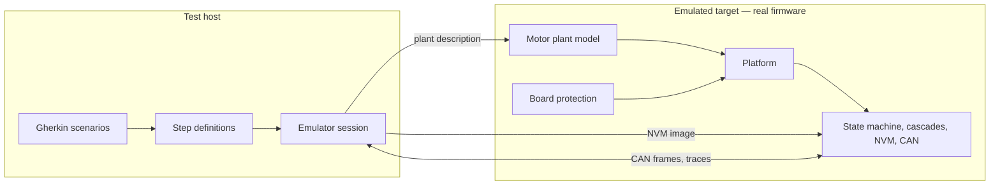
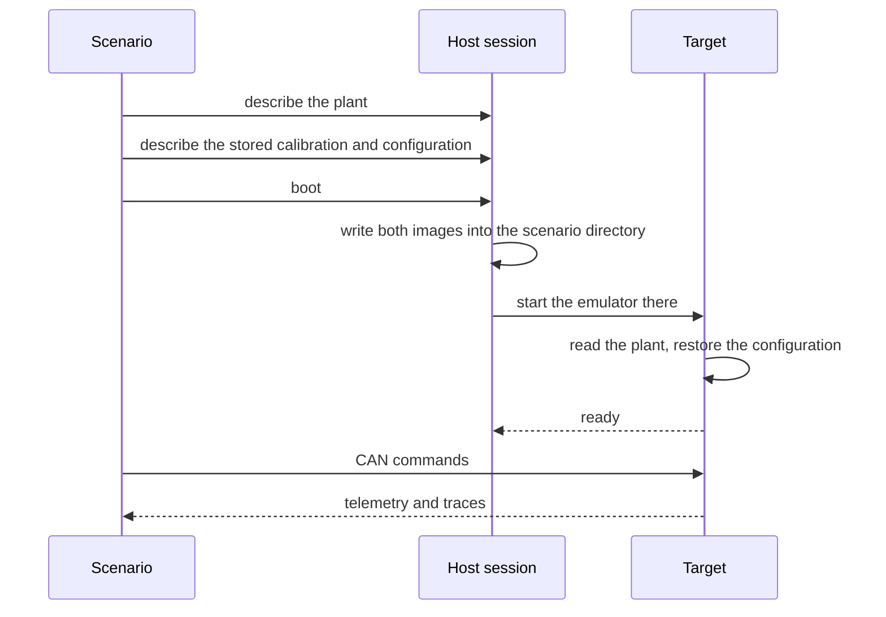
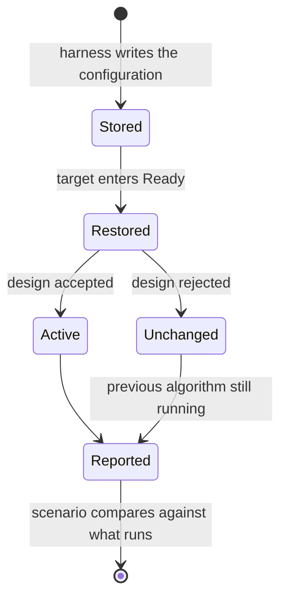

| Field     | Value                       |
|-----------|-----------------------------|
| Title     | Software-in-the-Loop Design |
| Type      | design                      |
| Status    | accepted                    |
| Version   | 1.0.0                       |
| Component | software-in-the-loop        |
| Date      | 2026-09-21                  |

> **IMPORTANT — Implementation-blind document**: This document describes *behavior, structure, and
> responsibilities* WITHOUT referencing code. **No code blocks using programming languages (C++, C,
> Python, CMake, shell, etc.) are allowed.** Use Mermaid diagrams to express behavior instead.
>
> **Diagrams**: All visuals must be Mermaid or ASCII art. External image references are **not allowed**.

---

## Overview

Software-in-the-loop runs the **real firmware** for the emulated Cortex-M4 target under an
emulator, against a simulated three-phase motor that the firmware itself owns. The test host
speaks to it only over the wire the product speaks: CAN frames carried as text lines on the
emulated UART, plus the firmware's own trace output.

Nothing is mocked on the target. The state machine, the control cascades, the calibration
services, the non-volatile memory stack and the CAN server are the shipping ones. Only the motor,
the power stage and the board protection are simulated, because there is no hardware.

---

## Responsibilities

**Is responsible for:**
- Describing the motor plant per scenario and delivering that description to the firmware at boot
- Pre-seeding non-volatile memory so a scenario starts from a chosen calibration and configuration
- Driving the target only through its CAN command set and observing only its telemetry and traces
- Simulating the board protection the hardware provides, and the wiring faults hardware can suffer
- Isolating scenarios from one another so neither files nor sockets nor captured output leak across

**Is NOT responsible for:**
- Verifying control algorithm correctness in the small — that is what the unit tests are for
- Testing CAN framing — that is covered by the wire contract tests
- Standing in for hardware-in-the-loop, which alone exercises real silicon, timing and analogue paths

---

## Component Details

### Part A — The plant is an input, not a constant

The motor the firmware drives is described per scenario and handed to it at boot as a small
binary record placed in the emulator's working directory. The record carries a magic number, a
layout version and a checksum over its payload, exactly as the non-volatile memory records do, so
a truncated or stale description is rejected rather than half-read.

The description covers everything the plant needs:

| Group             | Contents                                                                      |
|-------------------|-------------------------------------------------------------------------------|
| Winding and rotor | Resistance, both axis inductances, flux linkage, pole pairs, inertia, damping |
| Drive             | Supply voltage, control frequency, peak current, load torque                  |
| Measurement       | Current noise deviation and per-phase bias, encoder noise deviation and bias  |
| Thermal           | Ambient, thermal resistance and capacitance, copper and iron coefficients     |
| Protection        | Over-current, over-voltage, under-voltage and over-temperature trips          |
| Fault injection   | Open phase per phase, stuck encoder, supply voltage scaling                   |
| Reproducibility   | The seed both noise generators start from                                     |

When no description is present the firmware falls back to the motor it is built with, so the
target still boots standalone. A trip threshold of zero disables that protection, which is how a
scenario opts out of one it is not testing.

The seed matters more than it looks: the emulated target cannot obtain entropy, so without an
explicit seed the noise generators are not merely unpredictable, they are unreliable.

### Part B — Reaching the target

The emulator runs from a directory created for the scenario, so the firmware opens its plant
description and its memory image by plain relative name and knows nothing about the host's paths.
The directory, and the socket carrying CAN frames, are unique per session; scenarios ran into each
other when either was shared.

### Part C — Starting from a chosen calibration

Reaching a mode that regulates speed or position requires a complete calibration, including the
mechanical parameters. Rather than run identification in every scenario, the harness writes a
memory image whose calibration record already satisfies every completeness check. The target then
boots straight to Ready, and one alignment command establishes the rotor reference the state
machine requires before enabling.

This cuts a scenario from the better part of a minute to a few seconds, and it is also what makes
the damaged-record scenarios possible: the same builder can produce a record with a wrong magic
number, a stale layout version or a broken checksum, and the scenario asserts what the firmware
does with it.

### Part D — Selecting controller algorithms

Algorithm selection is deliberately not exposed over CAN. The harness therefore does not ask for
an algorithm; it writes the stored configuration that the firmware restores on entry to Ready, and
then asks the firmware which algorithm is actually running.

That last step is not ceremony. A state feedback design that does not converge for a given motor
leaves the previously active algorithm in place. A scenario that only asserted what it requested
would pass while testing something else entirely, so the firmware reports the algorithm each loop
ended up with and the scenario compares against that.

### Part E — Board protection

Real boards compare bus voltage and phase current against thresholds in hardware and feed the
result to the power stage's fault input. The simulation mirrors that arrangement in three ways
that matter:

- It is **armed with the inverter**, because comparators guard a stage that is switching. A
  standing condition does not fault a motor that was never enabled.
- It is **evaluated every control tick**, against the live plant state, so a trip follows from the
  physics of the scenario rather than being poked in by the test.
- It is **delivered from the event loop**, not from the control interrupt. The handler stops the
  drive and walks the state machine, which is far more than belongs in a 20 kHz interrupt; on
  hardware the equivalent work is done from a dedicated fault interrupt.

A condition already standing when the state machine registers its handler is still reported. An
edge that passes before anyone is listening would otherwise be lost, and the motor would enable
into a fault the board had already detected.

> **Known defect.** Delivering a board protection fault to a running drive currently locks the
> firmware up: the fault path takes an unaligned-access exception, which faults again and
> escalates. The path had never been exercised, because the emulated platform ignored protection
> registration entirely and reported its state as unknown, and no other platform raises it under
> test. The scenarios that reproduce it are kept, tagged apart from the default run.

### Part F — Wiring faults

The plant can be told that a phase carries no current, that the encoder is stuck, or that the
supply sags. These are configuration, not a separate model, and they compose with everything else.

Two results are worth recording because they are not obvious:

- A **fully disconnected** motor produces no torque and does not turn, however it is commanded.
  Its torque follows the currents that actually flow, so masking the phases is enough.
- A motor with **one open phase** still turns. Two phases can produce torque, so this is a
  degraded running condition rather than a dead motor, and nothing in the firmware detects it.

Alignment also cannot converge once encoder noise reaches the threshold below which it declares
the rotor settled, which bounds how noisy an encoder the current calibration tolerates.

---

## Scenario Taxonomy

| Area                  | What it establishes                                                        |
|-----------------------|----------------------------------------------------------------------------|
| Control modes         | Torque, speed and position each align, enable, take a setpoint, disable    |
| Controller algorithms | Every algorithm of every loop runs, plus combinations across the loops     |
| Plant characteristics | Control holds up across noise, temperature, load and a different winding   |
| Wiring faults         | A dead motor does not turn; a degraded one does                            |
| Memory integrity      | Damaged calibration is distrusted; damaged configuration falls to defaults |
| Board protection      | Trips reach the state machine and are reported                             |

Controller coverage sweeps each loop's algorithms with the other loops held at the baseline, and
adds a handful of combinations chosen to exercise both kinds of position law: those that produce a
speed reference and run through the speed loop, and those that produce a current reference and
bypass it. The full cross product is an order of magnitude more scenarios for coverage the sweep
already provides.

---

## Interfaces

**Provided to scenarios:** a named plant or one described field by field, a stored calibration and
configuration to boot from, a boot step, the CAN command set, and assertions over telemetry,
reported algorithms, fault codes and rotor movement.

**Required from the target:** that it read its plant description at boot, expose its state, fault
code, measured speed and position over telemetry, and trace the algorithm each loop is running.

**Not required:** any test-only command. The target's CAN surface is the product's.
