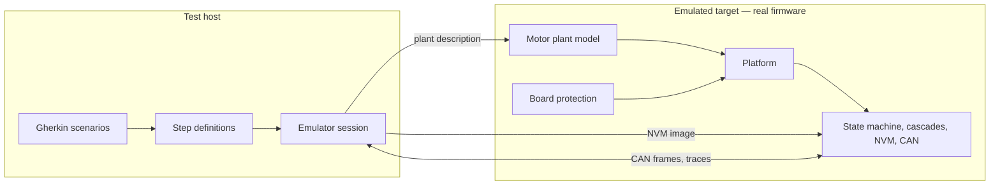
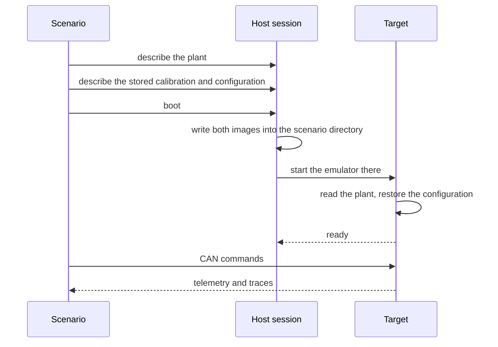
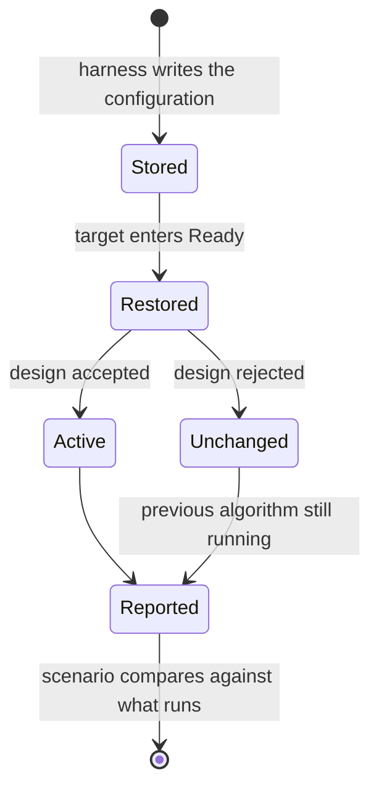
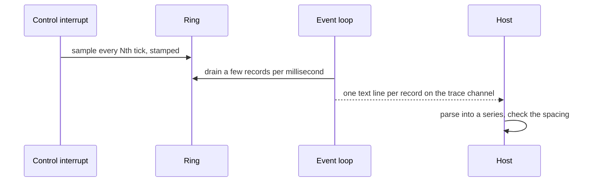

| Field     | Value                       |
|-----------|-----------------------------|
| Title     | Software-in-the-Loop Design |
| Type      | design                      |
| Status    | accepted                    |
| Version   | 1.3.0                       |
| Component | software-in-the-loop        |
| Date      | 2026-09-22                  |

> **IMPORTANT — Implementation-blind document**: This document describes *behavior, structure, and
> responsibilities* WITHOUT referencing code. **No code blocks using programming languages (C++, C,
> Python, CMake, shell, etc.) are allowed.** Use Mermaid diagrams to express behavior instead.
>
> **Diagrams**: All visuals must be Mermaid or ASCII art. External image references are **not allowed**.

---

## Overview

Software-in-the-loop runs the **real firmware** for the emulated Cortex-M4 target under an
emulator, against a simulated three-phase motor that the firmware itself owns. The test host
speaks to it only over the wire the product speaks: CAN frames carried as text lines on the
emulated UART, plus the firmware's own trace output.

Nothing is mocked on the target. The state machine, the control cascades, the calibration
services, the non-volatile memory stack and the CAN server are the shipping ones. Only the motor,
the power stage and the board protection are simulated, because there is no hardware.

---

## Responsibilities

**Is responsible for:**
- Describing the motor plant per scenario and delivering that description to the firmware at boot
- Pre-seeding non-volatile memory so a scenario starts from a chosen calibration and configuration
- Driving the target only through its CAN command set and observing only its telemetry and traces
- Simulating the board protection the hardware provides, and the wiring faults hardware can suffer
- Isolating scenarios from one another so neither files nor sockets nor captured output leak across

**Is NOT responsible for:**
- Verifying control algorithm correctness in the small — that is what the unit tests are for
- Testing CAN framing — that is covered by the wire contract tests
- Standing in for hardware-in-the-loop, which alone exercises real silicon, timing and analogue paths

---

## Component Details

### Part A — The plant is an input, not a constant

The motor the firmware drives is described per scenario and handed to it at boot as a small
binary record placed in the emulator's working directory. The record carries a magic number, a
layout version and a checksum over its payload, exactly as the non-volatile memory records do, so
a truncated or stale description is rejected rather than half-read.

The description covers everything the plant needs:

| Group             | Contents                                                                      |
|-------------------|-------------------------------------------------------------------------------|
| Winding and rotor | Resistance, both axis inductances, flux linkage, pole pairs, inertia, damping |
| Drive             | Supply voltage, control frequency, peak current, load torque                  |
| Measurement       | Current noise deviation and per-phase bias, encoder noise deviation and bias  |
| Thermal           | Ambient, thermal resistance and capacitance, copper and iron coefficients     |
| Protection        | Over-current, over-voltage, under-voltage and over-temperature trips          |
| Fault injection   | Open phase per phase, stuck encoder, supply voltage scaling                   |
| Reproducibility   | The seed both noise generators start from                                     |
| Disturbance       | A signed shaft torque and the delay after enabling at which it steps in       |
| Recording         | The rate at which the plant reports its trajectory, and how many samples      |

When no description is present the firmware falls back to the motor it is built with, so the
target still boots standalone. A trip threshold of zero disables that protection, which is how a
scenario opts out of one it is not testing.

The winding and rotor group is filled from one of the two reference motors in `motor_parameters/`
(the Teknic M-2310P-LN-04K on its 40 V bus is the nominal plant, the Anaheim BLY172S-24V-4000 on
24 V the other), whose parameters and sources are in the plant theory document. A scenario names
the motor as a preset; every other preset is a variation on the nominal one. The stored calibration
a scenario boots from is derived from the same description, so "already calibrated" means
calibrated to the plant, and a scenario that wants a wrong seed says by how much.

The seed matters more than it looks: the emulated target cannot obtain entropy, so without an
explicit seed the noise generators are not merely unpredictable, they are unreliable.

### Part B — Reaching the target

The emulator runs from a directory created for the scenario, so the firmware opens its plant
description and its memory image by plain relative name and knows nothing about the host's paths.
The directory, and the socket carrying CAN frames, are unique per session; scenarios ran into each
other when either was shared.

### Part B2 — Emulated time, and why it has to be instruction-counted

By default the emulator's guest clock follows host wall-clock while the guest's instruction
throughput follows whatever CPU the host happens to give it. The firmware's timers therefore keep
real time regardless of how much work the emulated core actually completed.

That breaks the control system's own supervision. The control interrupt runs at 20 kHz, and on
this machine it carries the whole motor plant as well as the control loop, which no emulated core
of this class completes in a 50 microsecond period. The interrupt then crowds out the 1 kHz outer
loop, which runs at the lowest priority. The supervisor samples both loops and refuses to feed the
watchdog when the outer one has not progressed; four consecutive refusals expire the deadline and
emergency-stop a motor that was running perfectly well.

This is the supervision working correctly on a target that genuinely cannot keep up. It was
measured, not inferred: every refusal reported the inner loop progressing and the outer loop not,
in speed and position modes only — the two modes whose supervision requires the outer loop.

The emulator is therefore run with its virtual clock tied to instructions retired rather than to
host time, at 8 nanoseconds per instruction. That models a core of roughly 125 MHz, at least as
fast as the slowest target the firmware ships on, so work that fits in the emulator fits on
hardware. It also makes a run's timing independent of host load, which is what removes the
flakiness rather than merely reducing it.

> The emulated machine's own clock is 25 MHz and the platform must declare exactly that. The
> declaration is a divisor used to program the timers, not a statement of capability: declaring a
> faster core does not execute more instructions, it just makes every firmware timer run
> proportionally slower than the firmware believes. Declaring 50 MHz, for instance, was measured
> to halve the rate of the firmware's own clock. Capacity comes from the instruction-counted
> clock above; the declared value must stay matched to the machine.

### Part C — Starting from a chosen calibration

Reaching a mode that regulates speed or position requires a complete calibration, including the
mechanical parameters. Rather than run identification in every scenario, the harness writes a
memory image whose calibration record already satisfies every completeness check. The target then
boots straight to Ready, and one alignment command establishes the rotor reference the state
machine requires before enabling.

This cuts a scenario from the better part of a minute to a few seconds, and it is also what makes
the damaged-record scenarios possible: the same builder can produce a record with a wrong magic
number, a stale layout version or a broken checksum, and the scenario asserts what the firmware
does with it.

### Part D — Selecting controller algorithms

Algorithm selection is deliberately not exposed over CAN. The harness therefore does not ask for
an algorithm; it writes the stored configuration that the firmware restores on entry to Ready, and
then asks the firmware which algorithm is actually running.

That last step is not ceremony. A state feedback design that does not converge for a given motor
leaves the previously active algorithm in place. A scenario that only asserted what it requested
would pass while testing something else entirely, so the firmware reports the algorithm each loop
ended up with and the scenario compares against that.

### Part E — Board protection

Real boards compare bus voltage and phase current against thresholds in hardware and feed the
result to the power stage's fault input. The simulation mirrors that arrangement in three ways
that matter:

- It is **armed with the inverter**, because comparators guard a stage that is switching. A
  standing condition does not fault a motor that was never enabled.
- It is **evaluated every control tick**, against the live plant state, so a trip follows from the
  physics of the scenario rather than being poked in by the test.
- It is **delivered from the event loop**, not from the control interrupt. The handler stops the
  drive and walks the state machine, which is far more than belongs in a 20 kHz interrupt; on
  hardware the equivalent work is done from a dedicated fault interrupt.

A condition already standing when the state machine registers its handler is still reported. An
edge that passes before anyone is listening would otherwise be lost, and the motor would enable
into a fault the board had already detected.

> **Known defect.** Delivering a board protection fault to a running drive currently locks the
> firmware up: the fault path takes an unaligned-access exception, which faults again and
> escalates. The path had never been exercised, because the emulated platform ignored protection
> registration entirely and reported its state as unknown, and no other platform raises it under
> test. The scenarios that reproduce it are kept, tagged apart from the default run.

### Part F — Wiring faults

The plant can be told that a phase carries no current, that the encoder is stuck, or that the
supply sags. These are configuration, not a separate model, and they compose with everything else.

Two results are worth recording because they are not obvious:

- A **fully disconnected** motor produces no torque and does not turn, however it is commanded.
  Its torque follows the currents that actually flow, so masking the phases is enough.
- A motor with **one open phase** still turns. Two phases can produce torque, so this is a
  degraded running condition rather than a dead motor, and nothing in the firmware detects it.
- A **stuck encoder** passes alignment rather than failing it. Alignment declares the rotor
  settled once its reading stops changing for a run of samples, and a reading frozen at one
  value satisfies that on the first run it sees, more convincingly than a real rotor ever
  does. The drive therefore takes its reference from a reading that means nothing and enables
  on it. Nothing afterwards compares the reading against the current being pushed into the
  winding, so a loop regulating that reading holds a position that cannot move while the
  rotor is free to turn. The scenario pair in the wiring-fault feature records both halves:
  the default-run scenario asserts what the product does today, that the drive runs and
  reports a rotor which never moves, and the held-out scenario carries what it should do,
  which is to report a sensor fault. The fault code for that already exists and is carried on
  the wire; nothing raises it.

Alignment also cannot converge once encoder noise reaches the threshold below which it declares
the rotor settled, which bounds how noisy an encoder the current calibration tolerates. A frozen
reading and a noisy one therefore fail in opposite directions: the noisy encoder never settles
and refuses to align, the frozen one settles at once and aligns against nothing.

### Part G — The plant reports its trajectory

Telemetry cannot time a transient. The status frame is answered on request, so the host samples
at whatever cadence its round trips allow, tens of milliseconds apart; the speed it carries is
quantised to whole radians per second; and the host's own clock says nothing about the guest's,
because the emulated clock counts instructions rather than seconds. A speed loop that settles in
a few tens of milliseconds is invisible through that window.

The plant therefore reports what it did, itself. Every control tick, once the motor is enabled,
the plant samples its mechanical speed, its mechanical angle, its d- and q-axis currents and the
external torque acting on the shaft, decimated to the rate the plant description asks for, and
stamps each sample with the control-tick count. The tick count is the only time base that means
anything on this target: it advances exactly once per control period whatever the host is doing.

Two rules keep this honest. Nothing is printed from the interrupt: samples go into a ring the
interrupt alone writes, and the event loop alone drains, so the trace channel is written from one
context as it always was. And the ring never blocks: when it is full the sample is dropped and
counted, the count is reported when recording stops, and the host also checks that consecutive
samples are exactly one decimation apart. A gap fails the scenario rather than skewing a metric.

Recording begins on enable, which resets the rotor to rest, and stops when the sample budget in
the plant description is spent or the motor is disabled. The budget bounds the output so a
scenario that never reads it cannot fill the pipe and stall the guest; a scenario that measures
drains continuously while it waits. Marker lines bracket the run: one when recording begins with
the tick it began on, one when a scheduled torque step fires, one when recording stops. Every
command frame the target takes from the wire is stamped with the tick it was delivered on, so a
setpoint changed while running has an onset the host can look up rather than guess.

The measurements themselves are the classical ones and are computed on the host with the
numerical toolbox's step-response metrics: rise time, settling time into a two-percent band,
percent overshoot, peak time and steady-state error over the tail of the window. A step is
normalised before measuring, so a reversal or a step down is the same unit step as a step up.
Settling time, overshoot, steady-state error, rise time and the band the tail still ripples in
are each bounded by the row the scenario carries. Peak time is printed and not asserted: a law
that does not overshoot has its largest sample wherever the tail ripple happened to peak, so a
bound on it would measure the duty quantisation rather than the law. A
disturbance is measured as the largest excursion from the setpoint and the time of the last
excursion outside a band around it, which is the same settling computation applied to the
recovery. Every measurement is also printed as a labelled line, which is how limits are found:
a scenario is run first with permissive limits, the printed numbers are read, and the limits are
pinned with a margin. Design intent says where to expect them, roughly two over the loop
bandwidth for settling with a few percent of overshoot, but the pinned numbers come from the run.

### Part H — Disturbances are described, not poked

The load torque the plant has always carried opposes motion, so it flips sign with the speed and
vanishes at rest, like friction. That is the right model for a loaded shaft and the wrong one for
a disturbance: a position loop holding still against it sees only a dither around zero. The
plant therefore also carries a signed shaft torque, which keeps its sign whatever the rotor does,
like gravity on an arm.

A scenario schedules that torque in the plant description: a magnitude and a delay after
enabling. The control tick applies it on the exact tick, notes the tick on the trace, and the
loop under test has to hold its setpoint against it. Re-enabling re-arms the schedule and
disabling clears the torque, so every enable starts from the same plant.

Setpoint changes need no such machinery. The product accepts a setpoint while running and while
ready, and every cascade re-applies its last setpoint on enable. A scenario that applies the
setpoint before enabling makes enabling the step, with the onset on the tick recording began and
the rotor known to be at rest. A scenario that applies one while running reads the onset from the
delivery stamp. The target's command surface is still the product's: nothing was added to it.

### Part I — What the measurements found

The first characterisation run measured the product against the parameter set that stood in
for a motor at the time and reported four findings. Re-measured on the reference motors, after
the harness faults recorded in Part J were fixed, two of them were artefacts, one stands, and one
was a real defect that has since been fixed. A scenario that exposes a standing defect is kept,
with the limits the law should meet, under a tag held out of the default run in the same way as
the protection scenarios; the scenarios in the default run carry the envelope the product holds
today, so a regression is still caught while the defect is open.

- **Whole-percent duty resolution.** The duty cycles the modulator hands the inverter are three
  whole-percent values, and the conversion rounds to the nearest percent. On a 40 V bus into a
  0.36 Ω, 0.20 mH winding one step is 0.4 V and about a tenth of an ampere of ripple per control
  period, so the current loop holds a half-ampere setpoint inside a band of about 30 % of it and
  cannot settle into a 10 % one. The speed loops above it no longer show a limit cycle worth the
  name: their tail band is 1–3 % of a 20 rad/s setpoint, and they settle into a 10 % band within
  10–25 ms with 1–5 % overshoot. The quarter-setpoint limit cycle of the first run was the
  73 mΩ winding's doing, and the harness's inductance seed. Every loop is affected on every
  platform, because the type is the product interface's, and a tight current-loop band cannot be
  required until the duty carries more resolution.
- **Two current laws command nothing — retracted.** With the inductance seeded correctly the
  deadbeat law rises within a sample and overshoots 9 %, the sliding-mode law overshoots 50 %
  into its boundary layer, and the decoupled law 25 %. The zero output was the deadbeat and
  sliding designs computed for a winding of half a microhenry.
- **The LQI position law is unstable — retracted.** Same cause. It settles into a 10 % band
  within 30 ms with 27–40 % overshoot, and holds 1.5 rad against a torque step within 0.011 rad,
  the tightest of the position laws.
- **The LQI speed law was erratic — fixed.** From rest to 20 rad/s it overshot 121 % and never
  settled; stepped to 40 rad/s while running it overshot 66 % and kept swinging for the rest of
  the window; a 0.002 N·m torque step pushed it 26 rad/s off a 20 rad/s setpoint, where the other
  laws move less than 2 rad/s. The cause was `LqiSpeedController` never scaling its LQR effort
  weight to the plant's own input gain: the fixed weight sized a design with no margin against a
  real current loop's one-sample delay (`documentation/theory/speed-loop-lqi.md`). Rescaled to the
  plant's input gain and the requested bandwidth, it settles into a 10 % band within 16–19 ms with
  2–4 % overshoot in both step scenarios, and the same torque step moves it about 1.2 rad/s off
  setpoint. Its rows carry the same envelope as the other speed laws now.

The run also found a harness fault: a line cut by a read timeout was dropped and its tail
parsed as a line of its own, which showed up as a gap in the sample spacing. The reader now
keeps a partial line for the next read.

Two runs of the same scenario do not measure exactly the same numbers. The guest is
deterministic, but the host decides when each command frame reaches it, so the tick on which a
setpoint or an enable lands relative to the outer loop's phase moves from run to run and the
transient with it: the same step measured a 40 % overshoot in one run and 43 % in the next.
The pinned limits carry a margin for that, and a limit that sits on a measured value is wrong.

### Part J — The estimators against a known plant

A simulated plant is the one place where an estimator can be marked against the truth: the
scenario wrote the resistance, inductance, flux linkage, inertia and friction the plant runs
with, so whatever the firmware identifies can be compared with them, and the comparison is
made on both reference motors so that a tolerance is not tuned to one winding.

Three product channels carry what the firmware believes, and all three are the product's own:

- The **electrical parameters response** the CAN identification command broadcasts before it
  acknowledges: resistance, inductance and pole pairs at the wire's resolution of 1 mΩ and 1 µH.
- The **calibration record** the state machine traces whenever it stores one, `[SM] Calibration
  record:`. This is the only way the mechanical identification's result is visible on this target:
  the CAN mechanical command is not wired, and the full sequence that includes it runs from the
  terminal's `calibrate`, which in the emulator travels on the socket the CAN frames use.
- The **online estimates** the terminal prints on `estimate_status`, `[EST] Mech:` and
  `[EST] Elec:`, seeded from the record and updated at the outer-loop rate while the motor runs.

Inertia and friction are traced in micro-units on both trace lines; the tracer prints three
decimals, and the rotors here weigh a few micro-newton-metre-seconds-squared.

The scenarios cover the offline procedures from a blank calibration and from one deliberately
wrong by given factors, the online estimators from a wrong seed under a speed reference that
alternates between two levels (the same shape the identification service uses, because a constant
speed excites neither inertia nor friction), the same with a constant shaft torque applied while
the estimators run, and a winding that heats while running. The excitation is paced on the plant's
own clock, read from its trajectory samples, so it lasts the same guest time on every host.

What the first characterisation found, in the order it was found:

- **The emulated inverter delivered current samples at the control rate whatever rate a
  procedure asked for.** The identification procedures ask for 10 kHz and demodulate on that
  assumption, so every sample arriving twice as often made the injection twice the frequency it
  was analysed at, and the inductance came out doubled on both motors (0.36 mH for a 0.20 mH
  winding, 1.22 mH for 0.64 mH). The platform now delivers samples at the requested rate, as an
  ADC trigger divider would, while the plant keeps stepping at the control rate. With that, the
  resistance identifies within 2 % and the inductance within 15.5 % (Teknic) and 6.5 % (Anaheim),
  reading low in both cases, which is the ZOH bias the electrical theory document predicts made
  larger by the whole-percent duty quantising the injection. Pole pairs identify exactly. None of
  these numbers move under current and encoder noise.
- **The mechanical identification could never complete on the emulated target.** Its completion
  is deferred to the event loop against a weak pointer, so that an identification torn down
  before the completion runs is dropped rather than executed on a dead object. The emulated
  platform registered only the plain dispatcher, and the weak-pointer dispatcher is a second
  singleton next to it; scheduling through it dereferenced nothing and hard-faulted inside the
  control interrupt on the first sample the identification observed. The fault handler then
  faulted again, so nothing was traced and the target simply went silent. The deferred fault
  notifications take the same path. The platform now registers a cortex dispatcher that serves
  both singletons. The hardware platforms should be checked for the same omission. With the
  dispatcher in place the full calibration from the terminal reaches Ready on both motors and
  its record is within 0.05 % of the plant's inertia and 2 % of its viscous friction, from a
  seed that was off by a factor of two and a half; the offline procedure, sampling at the control
  rate, is as good as the plant it measures.
- **The stored calibration the scenarios booted from carried the inductance in henry where the
  record holds millihenry**, so every "already calibrated" run since the plant description was
  introduced configured its current loop with an inductance a thousand times too small. Part I's
  numbers were measured that way and are re-measured below.
- **The torque constant was a per-target constant of 0.1 N·m/A**, two and a half to three times
  the true value of either reference motor, used by the mechanical identification, the online
  inertia estimator and the speed-loop gain design alike. It is now derived from the calibration
  record (REQ-SM-027).
- **Small mechanical values did not survive the product's own outputs.** The mechanical
  parameters response on the wire carries inertia and friction as fixed-point with a resolution
  of 1e-4, so the rotors here (5e-6 to 7e-6 kg·m², 1e-5 N·m·s/rad) encode as zero; that
  response is not used by the scenarios and changing its scale is a wire-contract change left
  open. The tracer prints three decimals, so the same values traced as zero; the traces now
  carry them in micro-units.
- **The online mechanical estimator does not track.** Seeded with twice the inertia and half the
  friction and excited for six seconds by a speed reference alternating between 26 and 52 rad/s
  every quarter second, it published an inertia 26–33 % low and a friction near zero on the
  Teknic (0.7–1.4 for 15 µN·m·s/rad), and nothing at all on the Anaheim, whose estimates were
  still the seed at the end. It shares its acceptance policy with the offline procedure, which
  is accurate to a fraction of a percent, but runs at the 1 kHz outer-loop rate instead of the
  control rate: there a torque sample and the acceleration it produced sit in different
  samples on rotors this light, the two-level trajectory leaves viscous friction collinear with
  the intercept, and the convergence gate (an innovation below 0.1 mN·m) sits under the torque
  ripple the whole-percent duty produces, so it is met by chance or not at all. A constant shaft
  torque changes none of this.
- **The online electrical estimator cannot see the resistance.** Its regressor's resistance
  column is the d-axis current, which the product regulates to zero, so that direction is
  never excited and the recursion drifts: after six seconds the resistance read −0.68 Ω for a
  0.36 Ω winding, −1.63 Ω for 0.405 Ω, and −0.63 Ω on the heated plant it was meant to track.
  The inductance, driven by the cross-coupling term, moved from its seed toward the plant and
  past it (+39 % and −17 %). The state machine refuses non-physical estimates when asked to
  apply them, so none of this reaches the gains, but tracking a warming winding is impossible
  by construction until the estimator gets a d-axis excitation of its own.

The identification scenarios therefore run the offline procedures in the default set, on both
motors, and hold the online scenarios out under the known-defect tag with the envelope the
estimators should meet (REQ-CAL-014).

---

---

## Scenario Taxonomy

| Area                     | What it establishes                                                                                               |
|--------------------------|-------------------------------------------------------------------------------------------------------------------|
| Control modes            | Torque, speed and position each align, enable, take a setpoint, disable                                           |
| Controller algorithms    | Every algorithm of every loop runs, plus combinations across the loops                                            |
| Plant characteristics    | Control holds up across noise, temperature, load and a different winding                                          |
| Wiring faults            | A dead motor does not turn; a degraded one does                                                                   |
| Memory integrity         | Damaged calibration is distrusted; damaged configuration falls to defaults                                        |
| Board protection         | Trips reach the state machine and are reported                                                                    |
| Control performance      | Each loop's step response stays inside its settling, overshoot and error envelope, from rest and while running    |
| Control robustness       | The same response measured on a noisy, hot, loaded or differently wound plant, and the law reported still running |
| Disturbance rejection    | A shaft torque step while regulating is bounded in excursion and recovered from                                   |
| Parameter identification | What the firmware identifies offline, and tracks online, matches the plant it was given, on both reference motors |

Controller coverage sweeps each loop's algorithms with the other loops held at the baseline, and
adds a handful of combinations chosen to exercise both kinds of position law: those that produce a
speed reference and run through the speed loop, and those that produce a current reference and
bypass it. The full cross product is an order of magnitude more scenarios for coverage the sweep
already provides.

---

## Interfaces

**Provided to scenarios:** a named plant (one of the reference motors, or a variation on the
nominal one) or one described field by field, a stored calibration and configuration to boot
from, a calibration deliberately off by given factors, a scheduled shaft torque, a recording rate
and budget, a boot step, the CAN command set, the product's terminal commands, a capture step that
waits on the plant's own clock, and assertions over telemetry, reported algorithms, fault codes,
rotor movement, step-response metrics, disturbance recovery and identified or tracked parameters.

**Required from the target:** that it read its plant description at boot, expose its state, fault
code, measured speed and position over telemetry, trace the algorithm each loop is running, trace
every calibration record it stores and its online estimates on request, and, when asked to, report
the plant's trajectory and the tick each command frame was delivered on.

**How a terminal command reaches the emulated target:** on the same socket as the CAN frames. The
firmware reads that socket line by line; a line with the `CAN_RX` prefix is a frame, any other line
is handed to the terminal exactly as a serial port would hand it. The terminal answers through the
tracer, so a step that needs the outcome drains the trace for the line it expects instead of waiting
for a prompt.

**Not required:** any test-only command. The target's CAN and terminal surfaces are the product's.
