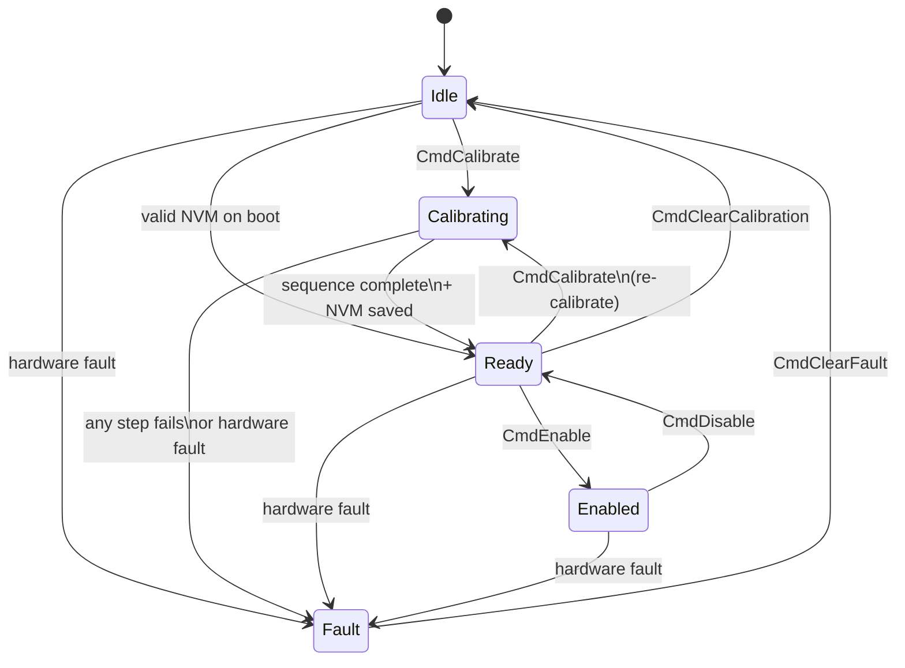
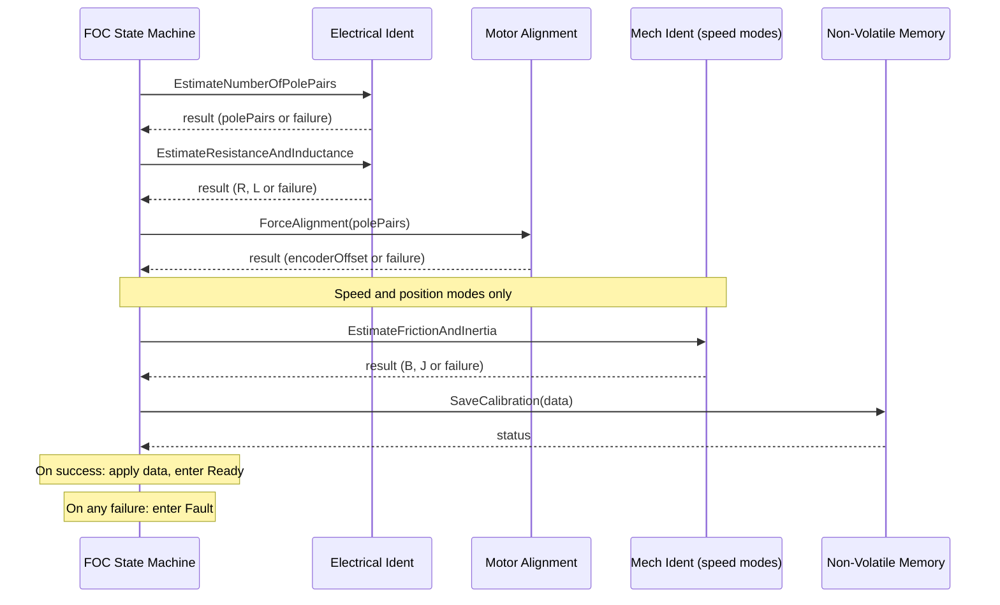
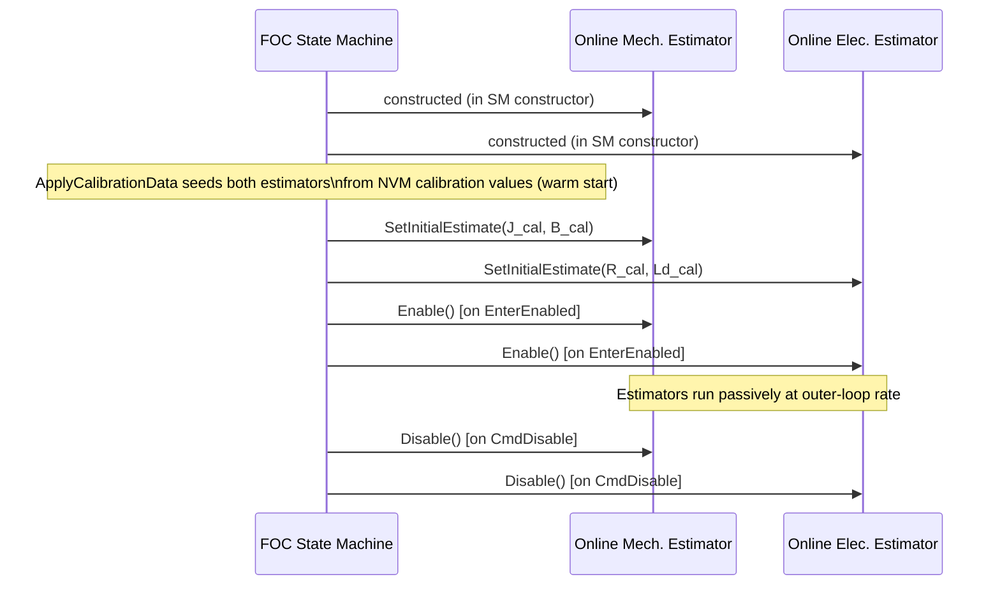

| Field     | Value                      |
|-----------|----------------------------|
| Title     | Service: FOC State Machine |
| Type      | design                     |
| Status    | draft                      |
| Version   | 0.1.0                      |
| Component | state-machine              |
| Date      | 2026-04-10                 |

> **IMPORTANT — Implementation-blind document**: This document describes *behavior, structure, and
> responsibilities* WITHOUT referencing code. **No code blocks using programming languages (C++, C,
> Python, CMake, shell, etc.) are allowed.** Use Mermaid diagrams to express behavior instead.
> Prose descriptions of algorithms are encouraged; source-level details are not.
>
> **Diagrams**: All visuals must be either a Mermaid fenced code block (` ```mermaid `) or ASCII art inline
> in the document. External image references (``) are **not allowed**.

---

## Responsibilities

**Is responsible for:**
- Owning the complete motor lifecycle: `Idle → Calibrating → Ready ⇄ Enabled`, and `Fault` as an escape state reachable from any active state
- Enforcing all transition guards so that the FOC controller can only be enabled after a successful calibration, and calibration can only be started from `Idle` or `Ready`
- Orchestrating the sequential calibration chain: pole-pair identification → resistance and inductance estimation → alignment → (mechanical parameter identification for speed/position modes) → NVM persistence
- On successful boot with valid NVM data, automatically loading calibration and transitioning to `Ready` without requiring user action
- Registering lifecycle commands on the terminal in CLI-driven mode (`calibrate`, `enable`, `disable`, `clear_fault`, `clear_cal`)
- Intercepting hardware fault notifications from the fault notifier and immediately transitioning to `Fault`, stopping the inverter if it was active

**Is NOT responsible for:**
- Executing FOC calculations — those remain the responsibility of the control-mode implementation (Torque, Speed, Position)
- Directly driving hardware peripherals — all hardware interaction is delegated to the calibration services and the FOC controller
- Storing persistent calibration data itself — that is the responsibility of the Non-Volatile Memory service
- Implementing the identification algorithms — those are encapsulated in the Electrical and Mechanical Parameters Identification services

---

## Component Details

### Motor Lifecycle States

The state machine has five named states:

| State         | Motor condition                                                              | Allowed transitions                                                                                                         |
|---------------|------------------------------------------------------------------------------|-----------------------------------------------------------------------------------------------------------------------------|
| `Idle`        | No calibration data; motor cannot be enabled                                 | → `Calibrating` (CmdCalibrate), → `Ready` (valid NVM on boot), → `Fault` (hardware fault)                                   |
| `Calibrating` | Calibration sequence in progress; motor is driven by identification services | → `Ready` (sequence complete + NVM saved), → `Fault` (any step fails or hardware fault)                                     |
| `Ready`       | Calibration data valid and applied; motor can be enabled at any time         | → `Enabled` (CmdEnable), → `Calibrating` (CmdCalibrate re-runs), → `Idle` (CmdClearCalibration), → `Fault` (hardware fault) |
| `Enabled`     | FOC controller active; motor under closed-loop control                       | → `Ready` (CmdDisable), → `Fault` (hardware fault)                                                                          |
| `Fault`       | Safe state; inverter stopped; fault code recorded                            | → `Idle` (CmdClearFault)                                                                                                    |

### State Diagram



### Calibration Sequence

When `CmdCalibrate` is issued from `Idle` or `Ready`, the state machine enters `Calibrating` and executes a sequential chain of identification steps. Each step is asynchronous: the state machine calls a service and awaits a callback before proceeding to the next step. If any step returns a failure result, the machine immediately enters `Fault`.



**Steps and data produced:**

| Step                                           | Service             | Data stored                                              |
|------------------------------------------------|---------------------|----------------------------------------------------------|
| 1. Pole pairs                                  | Electrical Ident    | `polePairs`                                              |
| 2. Resistance and inductance                   | Electrical Ident    | `rPhase`, `lD`, `lQ`                                     |
| 3. Alignment                                   | Motor Alignment     | `encoderZeroOffset`                                      |
| 4. Mechanical parameters (speed/position only) | Mechanical Ident    | `inertia`, `frictionViscous`, `kpVelocity`, `kiVelocity` |
| 5. NVM persist                                 | Non-Volatile Memory | All of the above written to EEPROM                       |

After saving, calibration data is applied to the FOC controller (current PID gains computed from R/L/bandwidth, encoder zero offset applied, velocity PID gains applied for speed modes), and the state machine transitions to `Ready`.

### Fault Safety

Entering `Fault` always stops the inverter when the machine was in `Enabled` or `Calibrating` state. This ensures that any active PWM output (from normal operation or from identification test signals) is immediately cut, regardless of which state caused the fault.

The last fault code is preserved in `LastFaultCode()` and remains readable even after the fault is cleared via `CmdClearFault`.

### Transition Policies

The state machine supports two transition policies, selected at build time via the `E_FOC_AUTO_TRANSITION_POLICY` CMake cache variable:

- **CLI policy (default, `E_FOC_AUTO_TRANSITION_POLICY=OFF`)**: The state machine registers the commands `calibrate`, `enable`, `disable`, `clear_fault`, and `clear_cal` on the connected terminal. Users interact via a serial console. Suitable for development, commissioning, and diagnostics.
- **Automatic policy (`E_FOC_AUTO_TRANSITION_POLICY=ON`)**: No terminal commands are registered. The caller drives transitions programmatically by invoking `CmdCalibrate()`, `CmdEnable()`, `CmdDisable()`, `CmdClearFault()`, and `CmdClearCalibration()` directly — for example, from CAN message handlers or automated production sequences.

The policy is enforced for all application targets at once: setting `E_FOC_AUTO_TRANSITION_POLICY=ON` in a CMake preset or on the command line applies to the torque, speed, and position targets simultaneously. Both policies share identical state transition logic; they differ only in whether lifecycle commands appear on the terminal.

### Mechanical Identification and Control Mode

The calibration sequence extends with a mechanical identification step for speed and position control modes. This step estimates rotor inertia and viscous friction, then computes initial velocity-loop PID gains.

For **speed mode**, the mechanical identification service can be automatically constructed if no external override is provided in `CalibrationServices`.

For **position mode**, `MechanicalParametersIdentification` requires an explicit override supplied via `CalibrationServices.mechIdentOverride`. If no override is provided and position mode is active, the calibration sequence enters `Fault` with `calibrationFailed`. This is a configuration error that must be resolved before calibration can succeed.

### Boot-Time NVM Check

On construction, the state machine asynchronously checks whether valid calibration data exists in NVM. If data is found and loads successfully, calibration is applied and the machine transitions directly to `Ready` — no user action required. If the check fails or the data is absent, the machine starts in `Idle`.

### Online Parameter Estimation (Speed/Position Modes)

For speed and position control modes, the state machine creates and manages two online parameter estimators alongside the main control loop:

- **Online Mechanical Estimator** — continuously refines rotor inertia (J) and viscous friction (B) using a Recursive Least Squares estimator that runs at the outer-loop rate (1 kHz).
- **Online Electrical Estimator** — continuously refines phase resistance (R) and d-axis inductance (Ld) using a d-axis voltage-model RLS estimator running at the same rate.

**Lifecycle of online estimators:**



**Seeding from calibration data:** When `ApplyCalibrationData` is called (either after calibration completes or on NVM boot load), both estimators are seeded with the values from `CalibrationData`. This warm-starts the RLS theta vector at the known-good calibration values rather than zero, ensuring the estimators produce physically meaningful outputs from the first update.

The electrical estimator is seeded using `lD` (d-axis inductance), as the underlying model assumes a non-salient motor ($L_d \approx L_q$). For interior PMSMs, a 3-parameter model with separate Ld and Lq would be required; this is a known limitation.

**Estimate consumption is explicit:** Estimates are NOT applied to PID gains continuously. The operator (or application logic) explicitly triggers a PID retune by calling `ApplyOnlineEstimates()`. This prevents gain oscillation before the estimators have converged and guards against applying poorly-conditioned estimates at runtime.

When `ApplyOnlineEstimates()` is called while in `Enabled` state:
1. Current inertia and friction estimates are read from the mechanical estimator
2. Speed PID gains are recomputed: $k_p = J \cdot \omega_{bw}$, $k_i = B \cdot \omega_{bw}$
3. Current resistance and inductance estimates are read from the electrical estimator
4. Current PID gains are recomputed from the bandwidth-based tuning rule

If called from any state other than `Enabled`, the call is silently ignored.

**Runtime control commands (CLI policy, speed/position modes only):**

| Command           | Short | Description                                           |
|-------------------|-------|-------------------------------------------------------|
| `apply_estimates` | `ae`  | Apply online estimates to speed and current PID gains |
| `estimate_status` | `es`  | Print current J, B, R, Ld values to the tracer        |

---

## Interfaces

### Provided

| Interface               | Purpose                                                          | Contract                                                                                                                         |
|-------------------------|------------------------------------------------------------------|----------------------------------------------------------------------------------------------------------------------------------|
| `FocStateMachineBase`   | Abstract lifecycle controller — state query and command dispatch | Constructed once per application; all command methods are safe to call from any state (invalid transitions are silently ignored) |
| `CurrentState()`        | Returns the current `State` variant for inspection               | Returns a const reference; valid for the lifetime of the state machine                                                           |
| `LastFaultCode()`       | Returns the most recent fault code                               | Value is only meaningful when in `Fault` state or just after clearing a fault                                                    |
| `CmdCalibrate()`        | Requests start of calibration                                    | Only effective from `Idle` or `Ready`; ignored from all other states                                                             |
| `CmdEnable()`           | Requests enabling the FOC controller                             | Only effective from `Ready`; ignored from all other states                                                                       |
| `CmdDisable()`          | Requests disabling the FOC controller                            | Only effective from `Enabled`; ignored from all other states                                                                     |
| `CmdClearFault()`       | Clears the fault and returns to `Idle`                           | Only effective from `Fault`; ignored from all other states                                                                       |
| `CmdClearCalibration()` | Invalidates NVM calibration and returns to `Idle`                | Ignored when in `Enabled`; effective from all other states                                                                       |
| `ApplyOnlineEstimates()`| Retunes speed and current PID gains from online estimators       | Only effective from `Enabled`; silently ignored from all other states. Speed/position modes only.                                |

### Required

| Interface                            | Purpose                                                                  | Contract                                                                       |
|--------------------------------------|--------------------------------------------------------------------------|--------------------------------------------------------------------------------|
| `NonVolatileMemory`                  | Persists and retrieves calibration data across power cycles              | Must remain valid for the lifetime of the state machine                        |
| `ElectricalParametersIdentification` | Estimates pole pairs, phase resistance, and dq inductances               | Operations are asynchronous; callback fires on the same event loop             |
| `MotorAlignment`                     | Forces rotor to a known angle and returns the encoder zero offset        | Operation is asynchronous; result is optional (nullopt = failure)              |
| `MechanicalParametersIdentification` | Estimates rotor inertia and viscous friction (speed/position modes only) | Operation is asynchronous; result is optional (nullopt = failure)              |
| `FaultNotifier`                      | Delivers hardware fault notifications to the state machine               | `Register()` must be called during construction; callback may fire at any time |
| `ThreePhaseInverter`                 | Used by the FOC controller to issue PWM and read phase currents          | Stopped immediately on any fault from `Enabled` or `Calibrating` state         |
| `Encoder`                            | Rotor position sensor; zero offset applied after alignment               | `Set()` called during `ApplyCalibrationData` to configure the zero point       |
| `TerminalWithStorage`                | Serial command interface for CLI-mode transition policy                  | Commands registered in constructor; terminal must outlive the state machine    |
| `Tracer`                             | Debug trace output for lifecycle events                                  | All state transitions and calibration steps are traced                         |
| `RealTimeFrictionAndInertiaEstimator`   | Online RLS estimator for rotor inertia and viscous friction (speed/position only) | Seeded from calibration data; enabled on `EnterEnabled`; disabled on `CmdDisable` |
| `RealTimeResistanceAndInductanceEstimator` | Online RLS estimator for phase resistance and d-axis inductance (speed/position only) | Assumes non-salient motor (Ld ≈ Lq); seeded using `lD` from calibration        |

---

## Data Model

| Entity            | Field                     | Type / Unit                    | Range    | Notes                                                                                                                   |
|-------------------|---------------------------|--------------------------------|----------|-------------------------------------------------------------------------------------------------------------------------|
| `CalibrationData` | `polePairs`               | count (uint8)                  | 1–255    | Number of electrical pole pairs                                                                                         |
| `CalibrationData` | `rPhase`                  | Ohm (float)                    | > 0      | Phase resistance identified by electrical ident                                                                         |
| `CalibrationData` | `lD` / `lQ`               | mH (float)                     | > 0      | D/Q inductances (set equal; anisotropy not estimated)                                                                   |
| `CalibrationData` | `encoderZeroOffset`       | int32 (bit-cast float Radians) | any      | Quantised electrical angle at encoder zero; applied via `Encoder::Set()`                                                |
| `CalibrationData` | `inertia`                 | N·m·s² (float)                 | ≥ 0      | Rotor inertia; populated only for speed/position modes                                                                  |
| `CalibrationData` | `frictionViscous`         | N·m·s/rad (float)              | ≥ 0      | Viscous friction coefficient; populated only for speed/position modes                                                   |
| `CalibrationData` | `frictionCoulomb`         | N·m (float)                    | ≥ 0      | Coulomb friction; currently 0 (not identified)                                                                          |
| `CalibrationData` | `kpVelocity`              | (float)                        | ≥ 0      | Velocity PID proportional gain; computed as J × ω_bw                                                                    |
| `CalibrationData` | `kiVelocity`              | (float)                        | ≥ 0      | Velocity PID integral gain; computed as B × ω_bw                                                                        |
| `CalibrationData` | `kpCurrent` / `kiCurrent` | (float)                        | any      | Current PID gains; computed from R/L/bandwidth by auto-tuner, not stored by the state machine                           |
| `FaultCode`       | —                         | enum (uint8)                   | 7 values | `overcurrent`, `overvoltage`, `overtemperature`, `encoderLoss`, `watchdogTimeout`, `hardwareFault`, `calibrationFailed` |

---

## Error Handling

All calibration steps produce `std::optional` results. A `nullopt` from any step immediately enters `Fault` with code `calibrationFailed`. The entire calibration sequence is safe to retry by issuing `CmdCalibrate` after `CmdClearFault`.

NVM operations (save, load, invalidate) are also asynchronous and report a `NvmStatus`. On any non-`Ok` status during save or load, the machine enters `Fault` or remains in `Idle`, respectively, without corrupting application state.
