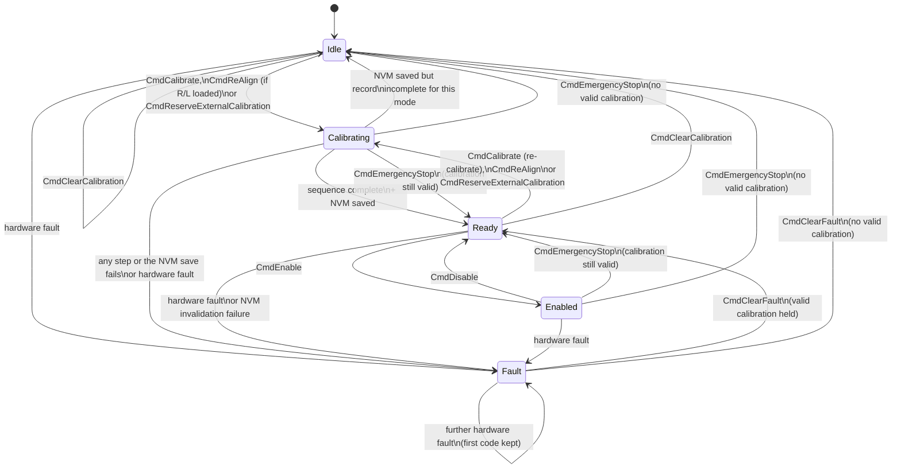
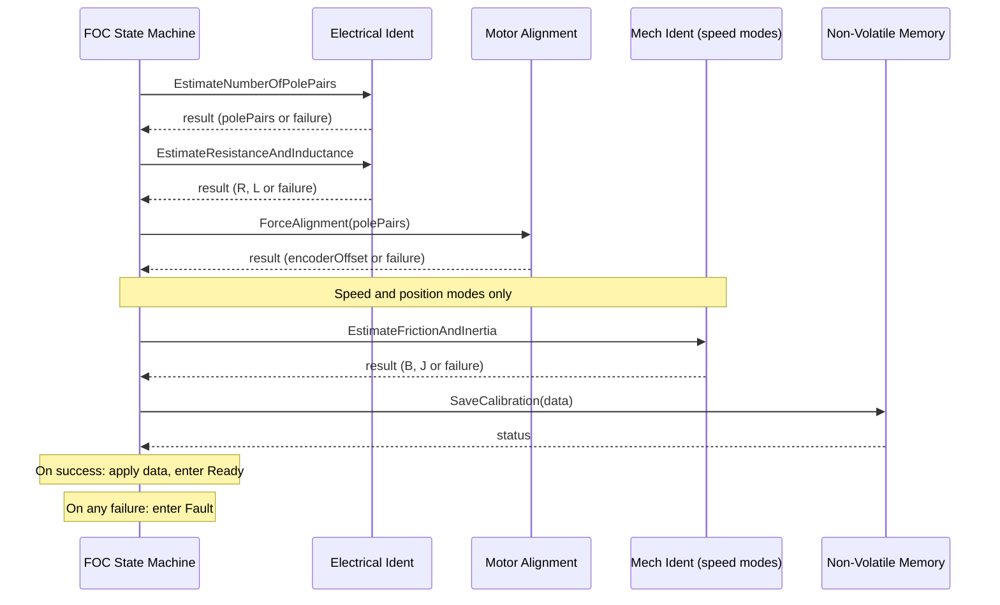
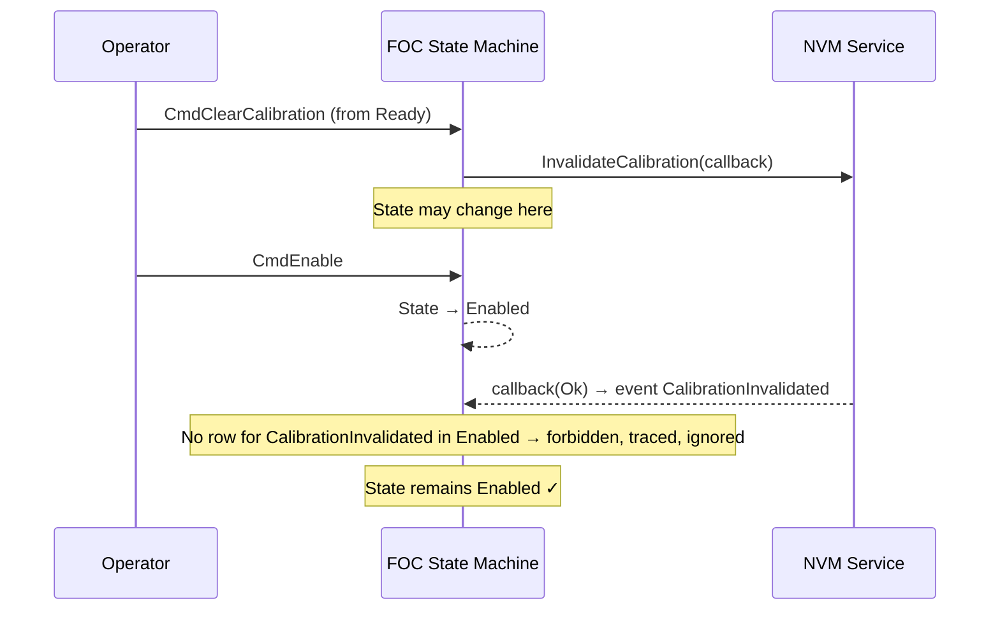
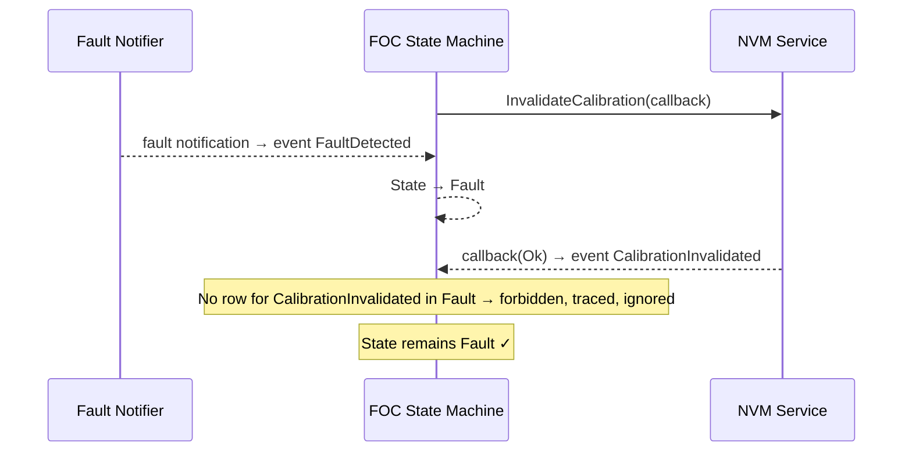
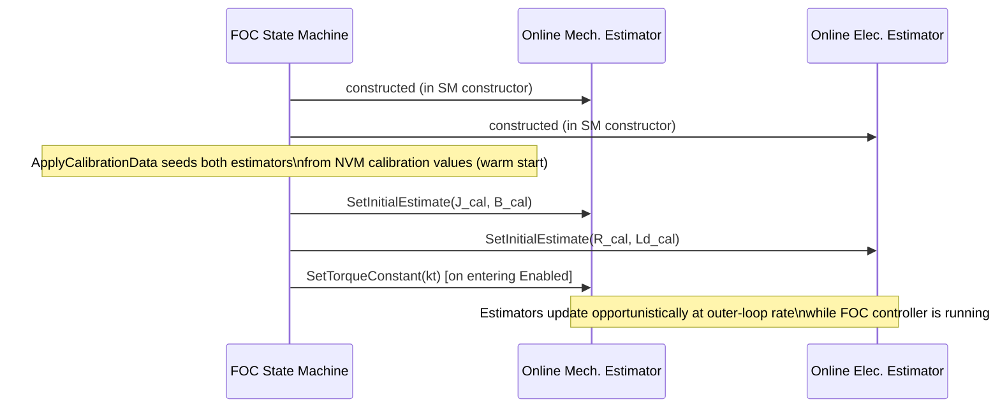
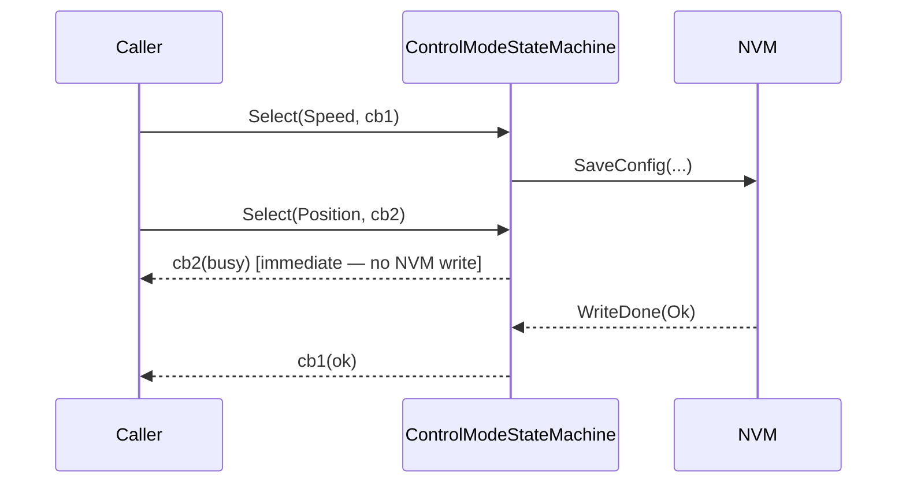
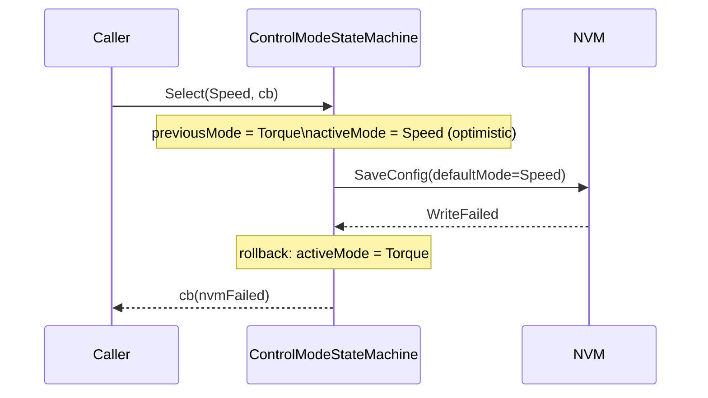

| Field     | Value                      |
|-----------|----------------------------|
| Title     | Service: FOC State Machine |
| Type      | design                     |
| Status    | draft                      |
| Version   | 0.2.0                      |
| Component | state-machine              |
| Date      | 2026-09-20                 |

> **IMPORTANT — Implementation-blind document**: This document describes *behavior, structure, and
> responsibilities* WITHOUT referencing code. **No code blocks using programming languages (C++, C,
> Python, CMake, shell, etc.) are allowed.** Use Mermaid diagrams to express behavior instead.
> Prose descriptions of algorithms are encouraged; source-level details are not.
>
> **Diagrams**: All visuals must be either a Mermaid fenced code block (` ```mermaid `) or ASCII art inline
> in the document. External image references (``) are **not allowed**.

---

## Responsibilities

**Is responsible for:**
- Owning the complete motor lifecycle: `Idle → Calibrating → Ready ⇄ Enabled`, and `Fault` as an escape state reachable from any active state
- Enforcing all transition guards so that the FOC controller can only be enabled after a successful calibration, and calibration can only be started from `Idle` or `Ready`
- Orchestrating the sequential calibration chain: pole-pair identification → resistance and inductance estimation → alignment → (mechanical parameter identification for speed/position modes) → NVM persistence
- On successful boot with valid NVM data, loading electrical parameters (R, L, pole pairs) and remaining in `Idle` until a live alignment re-establishes the rotor reference; the motor cannot be enabled until `CmdReAlign()` or `CmdCalibrate()` succeeds
- Registering lifecycle commands on the terminal in CLI-driven mode (`calibrate`, `align`, `enable`, `disable`, `clear_fault`, `clear_cal`)
- Intercepting hardware fault notifications from the fault notifier: stopping the inverter in the delivering context, then transitioning to `Fault` on the event dispatcher (see Fault Safety)

**Is NOT responsible for:**
- Executing FOC calculations — those remain the responsibility of the control-mode implementation (Torque, Speed, Position)
- Directly driving hardware peripherals — all hardware interaction is delegated to the calibration services and the FOC controller
- Storing persistent calibration data itself — that is the responsibility of the Non-Volatile Memory service
- Implementing the identification algorithms — those are encapsulated in the Electrical and Mechanical Parameters Identification services

---

## Component Details

### Motor Lifecycle States

The state machine has five named states:

| State         | Motor condition                                                                                                       | Allowed transitions                                                                                                                                                                                                                                                  |
|---------------|-----------------------------------------------------------------------------------------------------------------------|----------------------------------------------------------------------------------------------------------------------------------------------------------------------------------------------------------------------------------------------------------------------|
| `Idle`        | No calibration data, or electrical parameters loaded but rotor reference not yet established; motor cannot be enabled | → `Calibrating` (CmdCalibrate, CmdReAlign with loaded parameters, or CmdReserveExternalCalibration), → `Idle` (CmdClearCalibration), → `Fault` (hardware fault)                                                                                                      |
| `Calibrating` | Calibration sequence in progress; motor is driven by identification services                                          | → `Ready` (sequence complete + NVM saved, or CmdEmergencyStop with previously valid calibration), → `Idle` (record saved but incomplete for this mode, or CmdEmergencyStop without valid calibration), → `Fault` (any step or the NVM save fails, or hardware fault) |
| `Ready`       | Calibration data valid, rotor reference established; motor can be enabled                                             | → `Enabled` (CmdEnable, only when `rotorReferenceValid` is true), → `Calibrating` (CmdCalibrate re-runs, CmdReAlign, or CmdReserveExternalCalibration), → `Idle` (CmdClearCalibration), → `Fault` (hardware fault, or the NVM invalidation failing)                  |
| `Enabled`     | FOC controller active; motor under closed-loop control                                                                | → `Ready` (CmdDisable, or CmdEmergencyStop with valid calibration), → `Idle` (CmdEmergencyStop without valid calibration), → `Fault` (hardware fault)                                                                                                                |
| `Fault`       | Safe state; inverter stopped; fault code recorded and latched                                                         | → `Ready` (CmdClearFault with valid calibration held), → `Idle` (CmdClearFault without it); at most 3 consecutive times. A further fault re-enters `Fault` but keeps the code that first tripped the drive                                                           |

### State Diagram


```mermaid
stateDiagram-v2
    [*] --> Idle

    Idle --> Calibrating : CmdCalibrate,\nCmdReAlign (if R/L loaded)\nor CmdReserveExternalCalibration
    Idle --> Idle : CmdClearCalibration
    Idle --> Fault : hardware fault

    Calibrating --> Ready : sequence complete\n+ NVM saved
    Calibrating --> Idle : NVM saved but record\nincomplete for this mode
    Calibrating --> Ready : CmdEmergencyStop\n(calibration still valid)
    Calibrating --> Idle : CmdEmergencyStop\n(no valid calibration)
    Calibrating --> Fault : any step or the NVM save fails\nor hardware fault

    Ready --> Enabled : CmdEnable
    Ready --> Calibrating : CmdCalibrate (re-calibrate),\nCmdReAlign\nor CmdReserveExternalCalibration
    Ready --> Idle : CmdClearCalibration
    Ready --> Fault : hardware fault\nor NVM invalidation failure

    Enabled --> Ready : CmdDisable
    Enabled --> Ready : CmdEmergencyStop\n(calibration still valid)
    Enabled --> Idle : CmdEmergencyStop\n(no valid calibration)
    Enabled --> Fault : hardware fault

    Fault --> Ready : CmdClearFault\n(valid calibration held)
    Fault --> Idle : CmdClearFault\n(no valid calibration)
    Fault --> Fault : further hardware fault\n(first code kept)
```

### Transition Table

The graph above is not a description of hand-written command handlers; it is the
transition table the FOC state machine is built from. Every operator command, every
service completion and every fault notification is an **event**, and every arrow in the
diagram is a **row** of the table: source state, event, target state, an optional guard and
the action that builds the target state. Rows that must be accepted in a state without
leaving it (a calibration sub-step changing, a flux-linkage save completing) are declared
as internal rows.

The table is a compile-time constant. Its rows are `constexpr` values whose guards and
actions are captureless functions receiving the state machine as their context, so the
whole table lives in flash; the machine itself only holds the current state and a bounded
queue of events. That is what keeps the lifecycle within the RAM of the 32 KB targets.

The queue depth is budgeted, not rounded up: each slot costs a whole `Event`, and overflowing
it is an assertion failure rather than a dropped event. The deepest run of nested dispatches is
a calibration sequence whose identification services report inline — the three steps the
orchestrator announces plus the alignment result that follows the last one — which peaks at four.
The friction-and-inertia step is not among them, because the control mode sets that step directly
instead of announcing it, and the events that follow the alignment are pushed only once the queue
has drained again. The remaining slots absorb a command chained from a completion callback, giving
the six the machine reserves. Adding a calibration step that announces itself therefore costs a
slot, and on the 32 KB targets a slot has to be paid for out of a RAM budget the linker now guards.

The table is the single source of truth for what the machine accepts:

- An event that arrives in a state with no row for it is **forbidden**: nothing changes, the
  command reports `rejected`, and the trace shows which event was refused in which state.
- An event whose rows exist but whose guards all refuse it is **rejected** in the same way;
  the guard is where conditions such as "asynchronous work is outstanding" or "the rotor
  reference is not established" live.
- Before the machine starts, the table is checked for consistency: duplicate rows, rows
  that can never be selected because an unguarded row precedes them, and states that no
  sequence of rows reaches from `Idle` all refuse to start the machine. A malformed
  lifecycle therefore fails at boot on the host, in the unit tests, rather than on the
  motor.

Events are handled to completion. An event dispatched while another is being handled, for
instance a service that completes synchronously inside the action that started it, or a
fault raised while the drive is being started, is queued and handled once the current
transition has been committed and announced. Actions therefore always observe a consistent
state, and the target state is committed before its side effects (starting the drive,
completing the pending command, notifying the ready handler) run, in that order.

Every operator command that starts asynchronous work (`Calibrate`, `ReAlign`,
`ReserveExternalCalibration`, `ClearCalibration`, `SetFluxLinkage`) and `Enable` are guarded by
`HasPendingAsyncWork()`: they are rejected while a command is pending, while any NVM operation
is in flight, including the boot-time check and load, while an identification service is
running, or while a fault latched in an interrupt still owes its transition. One request therefore owns the machine at a time. A save still outstanding after an
emergency stop cannot be overlapped by the save of a new run, a clear or a flux-linkage change
in progress cannot be interrupted by `Enable`, whose transition would discard the completion
and leave the command pending forever, and the boot-time load cannot overwrite the record of a
calibration that started before it answered. The command is completed with `rejected` and the
client retries once the outstanding work has completed.

A command issued from inside a completion callback is such a queued event, and it reports
`CommandResult::queued`, which is distinct from `ok`: the event was accepted for processing,
the table has not yet decided it, and the caller must not read it as "applied". Callers that
translate a command outcome onward — the CAN bridge turns it into `busy` — therefore never
report success for work whose outcome is still unknown. A command that carries a callback is
not left dangling when the table then refuses it: `CommandRejections` observes every forbidden
or rejected event and completes that command's callback with `rejected`, whether the event was
dispatched directly or from the queue.

The transition table is observable: a tracer prints every transition as
`fsm: <from> --<event>--> <to>` next to the existing `[SM]` lines, and every forbidden,
rejected or discarded event with its state.

### Structure

`FocStateMachineCommon` is a composition root, not the place where the lifecycle logic lives.
It owns the table-driven machine and hands the rows a `LifecycleContext`: references to the
collaborators that carry out the work, each with one responsibility.

| Collaborator         | Responsibility                                                                                                                     |
|----------------------|------------------------------------------------------------------------------------------------------------------------------------|
| `FocLifecycleTable`  | The 45 `constexpr` rows and the entered hooks; the only place that knows which event is legal in which state                       |
| `CalibrationFlow`    | Full calibration, re-alignment and external calibration: running the orchestrator, saving the record and completing the command    |
| `MaintenanceFlow`    | Clearing the stored calibration and changing the flux linkage                                                                      |
| `BootSequence`       | The boot-time validity check and load of the stored record                                                                         |
| `OperationFlow`      | Enable and disable, faults and emergency stop, and the post-commit work of every state                                             |
| `PendingCommand`     | The one outstanding operator command, and the result held back until the target state has been committed                           |
| `CommandRejections`  | The observer that completes a queued command's callback with `rejected` when the table refuses it, so no callback is left dangling |
| `NvmActivity`        | The count of NVM operations whose callbacks still capture the machine; part of `HasPendingAsyncWork()`                             |
| `CalibrationContext` | The calibration record in RAM and its application to the controller                                                                |
| `ModeHooks`          | The interface through which the flows reach the control mode: the controller, its tunables and the mode-specific calibration steps |

`TorqueStateMachine`, `SpeedStateMachine` and `PositionStateMachine` derive from
`FocStateMachineCommon` and implement `ModeHooks`; nothing else in the lifecycle depends on the
concrete control mode.

### Emergency Stop

`CmdEmergencyStop` is the unconditional safety command: it is accepted from **every** state and always returns `CommandResult::ok`. Its first action is to stop the FOC controller and therefore the PWM output, before any state evaluation takes place. The stop is not left to that entry point alone: every `EmergencyStop` row stops the controller in its own action as well, so the PWM output is cut by the table itself and an `EmergencyStop` reaching the machine by any other route cannot transition out of `Enabled` with the bridge still switching. Stopping twice is harmless because the call is idempotent. Any command callback still outstanding (a running calibration or a pending `CmdClearCalibration`) is completed with `CommandResult::abortedByFault`.

The resulting state depends on the state the command was issued from:

| Issued from                | Resulting state | Rationale                                                                          |
|----------------------------|-----------------|------------------------------------------------------------------------------------|
| `Enabled` or `Calibrating` | `Ready`         | Calibration data in memory and NVM is still valid; the motor stays enableable      |
| `Enabled` or `Calibrating` | `Idle`          | No valid calibration data is held, so the motor must be calibrated before enabling |
| `Idle`, `Ready`            | unchanged       | The machine is already stopped; only the inverter stop is (re)issued               |
| `Fault`                    | `Fault`         | The fault state is safe and must be cleared explicitly with `CmdClearFault`        |

`CmdClearFault` returns to `Ready` when valid calibration is held and to `Idle` when it is not — it
does not unconditionally return to `Idle`. Clearing releases the latch, so the following `CmdEnable`
is accepted rather than refused.

Calibration data is considered valid when the applied record's `stage` is `CalibrationStage::complete`, it
holds a non-zero pole-pair count and a positive phase resistance, and the active mode's own requirements are
met: torque mode adds no further requirement, while speed and position modes additionally require a finite,
positive rotor inertia and a finite, non-negative viscous friction (`HasValidModeSpecificCalibration`,
overridden by `OuterLoopStateMachine`). This mode-aware check is why a torque-only calibration record cannot
silently be reused to reach `Ready` in speed or position mode. An aborted calibration run never commits its
results — the in-progress values live in `Calibrating::pendingData` and are only copied out after the NVM
save succeeds — so a previously valid calibration survives an emergency stop during a re-calibration and the
machine returns to `Ready`.

Dropping to `Idle` on every emergency stop would force a full recalibration after each safety intervention, which is why the transition is conditional on calibration validity rather than unconditional.

### Calibration Sequence

When `CmdCalibrate` is issued from `Idle` or `Ready`, the state machine enters `Calibrating` and executes a sequential chain of identification steps. Each step is asynchronous: the state machine calls a service and awaits a callback before proceeding to the next step. If any step returns a failure result, the machine immediately enters `Fault`.


```mermaid
sequenceDiagram
    participant SM as FOC State Machine
    participant EI as Electrical Ident
    participant MA as Motor Alignment
    participant MI as Mech Ident (speed modes)
    participant NVM as Non-Volatile Memory

    SM->>EI: EstimateNumberOfPolePairs
    EI-->>SM: result (polePairs or failure)
    SM->>EI: EstimateResistanceAndInductance
    EI-->>SM: result (R, L or failure)
    SM->>MA: ForceAlignment(polePairs)
    MA-->>SM: result (encoderOffset or failure)
    note over SM,MI: Speed and position modes only
    SM->>MI: EstimateFrictionAndInertia
    MI-->>SM: result (B, J or failure)
    SM->>NVM: SaveCalibration(data)
    NVM-->>SM: status
    note over SM: On success: apply data, enter Ready
    note over SM: On any failure: enter Fault
```

**Steps and data produced:**

| Step                                           | Service             | Data stored                                        |
|------------------------------------------------|---------------------|----------------------------------------------------|
| 1. Pole pairs                                  | Electrical Ident    | `polePairs`                                        |
| 2. Resistance and inductance                   | Electrical Ident    | `rPhase`, `lD`, `lQ`                               |
| 3. Alignment                                   | Motor Alignment     | `encoderZeroOffset`                                |
| 4. Mechanical parameters (speed/position only) | Mechanical Ident    | `inertia`, `frictionViscous`, `speedLoopBandwidth` |
| 5. NVM persist                                 | Non-Volatile Memory | All of the above written to EEPROM                 |

After saving, calibration data is applied to the FOC controller (current PID gains computed from R/L/bandwidth, velocity PID gains applied for speed modes), and the state machine transitions to `Ready`. The encoder zero offset is not written back to the encoder at this point; it is established only by the alignment step itself during the calibration sequence.

### External Calibration (CAN-driven)

An external client (e.g. the CAN bridge) can supply pre-measured calibration data without running the internal identification chain. This uses a two-command protocol to ensure the FSM state is correct before any inverter interaction begins:

1. **`CmdReserveExternalCalibration()`** — synchronous. Checks that the machine is in `Idle` or `Ready` with no pending async work, like every command that starts asynchronous work, then transitions to `Calibrating` and returns `CommandResult::ok`. Returns `CommandResult::rejected` in any other state. The `Calibrating` state prevents a second request from being accepted concurrently.

2. **`CmdCompleteExternalCalibration(data, onDone)`** — async. Called by the external client after its own estimation is finished. Stores `data` in the pending `Calibrating` slot and runs the alignment step, so an externally supplied record still gets a live rotor frame before it can be used. Its guard refuses the command while another command is still pending, so a second completion sent while the first is aligning is rejected instead of overwriting the pending record. If a fault occurred between the two calls, the machine is in `Fault`, where the completion command has no row and is rejected; the client observes the failure through its own estimation callback.

The two-command split ensures the FSM enters `Calibrating` before any open-loop PWM is applied, and that the state guard lives entirely inside the state machine rather than in the calling layer.

The external path stops after alignment; it does not chain into mechanical identification. `OnIdentifyElectrical` and `OnIdentifyMechanical` are separate CAN commands (REQ-INT-011), so the electrical command must not drive the mechanical estimator. The NVM save therefore stamps `stage = complete` only when the record satisfies the active mode's own validity requirements. Torque mode is satisfied by electrical parameters plus alignment and transitions to `Ready`. Speed and position still lack inertia and friction, so their record is persisted with `stage = none` and the machine returns to `Idle` holding a partial record, reported over CAN as `FocMotorState::partialCalibration`. Completing those modes requires the internal `CmdCalibrate` chain, which runs mechanical identification.

### Fault Safety

**Event-dispatcher path.** The `FaultDetected` event has a row from every state to `Fault`. Its action
records the code, latches the fault controller, stops the inverter if the machine was in `Enabled` or
`Calibrating`, and aborts the calibration services; only then is `Fault` committed. Any event raised while
that happens, a further fault from inside the stop or a calibration completion the abort could not
suppress, is queued and handled only after `Fault` has been committed, so it cannot observe the state
being left. A further fault does re-enter `Fault`, but the recorded code is the one that first tripped the
drive: the fault raised while shutting down is a consequence, and overwriting the root cause with it would
lose the only diagnostic the operator has. The new code is recorded again once the fault has been cleared.

The clear budget is spent where the transition commits, not where the command is issued. `CmdClearFault`
only reads whether a clear is still allowed; the row action is what consumes one of the three attempts and
releases the latch, so a `ClearFault` that is queued and then refused does not silently cost an attempt.

**Interrupt path (board protection, CAN bus-off).** When a fault is delivered in interrupt context, the
platform stops the FOC controller bridge immediately within that interrupt — before any state mutation or
tracing. The `FaultDetected` event, its trace output and any pending-command completion are posted to the event
dispatcher and execute on the next dispatcher turn. This ensures no multi-word state write, tracing call or
non-volatile-memory access runs from an interrupt context (see REQ-SM-021).

Stopping the inverter is not on its own enough to cut the PWM output. The identification services drive the
bridge through their own timers and phase-current callbacks, and one left running writes duty cycles on its
next tick — `ThreePhasePwmOutput` re-arms the peripheral that `Stop()` just disabled. So the transition to
`Fault` and `CmdEmergencyStop` both call `Abort()` on the electrical identification, the alignment and (in speed and
position modes) the mechanical identification. `Abort()` stops injection, cancels the service's timers, and
drops the pending completion **without invoking it**: the state machine owns the outcome, and a late
calibration result must not overwrite the fault that interrupted it. A service that has been aborted or has
completed ignores any further phase-current sample it is handed, rather than reclaiming the inverter's
callback slot — reassigning that slot from inside its own invocation would destroy the closure being executed.

The `Runner` releases the inverter's phase-current callback in `Disable()` for the same reason: a callback left
pointing at a stopped control loop is another path back to `ThreePhasePwmOutput`.

The transition to `Enabled` commits the state **before** the FOC controller is started: the start runs as a
post-commit effect of the transition, and a fault raised while it runs is queued behind it. A fault raised in the window where current first flows would otherwise observe `Ready`, skip the
stop, and then be overwritten by the pending assignment to `Enabled` — leaving an energised bridge on faulted
hardware with the machine reporting `Enabled`. Because the state is committed first, such a fault stops the
drive.

Committing the state first is not on its own enough for a fault delivered from an interrupt, because that path
dispatches `FaultDetected` on the event dispatcher, not in the interrupt: reading the lifecycle state around
the start would still see `Enabled`. The latch is therefore set **in the interrupt**, and the `Enabled` entry
hook consults the latch rather than the state — before `Start()`, so the cutoff the interrupt performed is not
undone, and again after it, for a fault raised while `Start()` ran. Either check turns the latched fault into a
`FaultDetected` dispatch, which the table queues and drains before the `Enable` dispatch returns; the whole
enable sequence is therefore atomic with respect to the fault and `CmdEnable` reports `abortedByFault`.

The same reasoning applies one level down, inside `Runner::Enable()`. Its steps — take the phase-current slot,
enable the control law, start the inverter, set the `enabled` flag — are individually interruptible, and a
`Stop()` from the faulting context between any two of them would be undone by the steps that follow it,
re-arming the bridge on hardware that has just faulted, with no control loop attached to update it. `Enable()`
therefore clears a `stopRequested` flag that `Disable()` sets, re-checks it after every step, and unwinds
through `Disable()` once it is set. A stop landing after the last check needs no unwinding: it runs after
every write the sequence makes. The flag is written from the faulting context as well as the mainline, so it
is set and cleared outright rather than counted — a read-modify-write shared with an interrupt is exactly what
REQ-SM-021 excludes.

#### Fault Latching

A fault is latched. `CmdEnable` is refused while the latch is set, so the only path out of `Fault` is an explicit `CmdClearFault`.

Clearing is bounded. Each `CmdClearFault` increments a counter; once `maxConsecutiveFaultClears` (3) clears
have happened without an intervening clean run, further clears are refused and a reset is required. The
counter is reset by `CmdDisable` from `Enabled`, which is the only evidence the state machine has that the
drive ran and was stopped deliberately rather than by the same condition re-tripping. Without this bound, a
condition that is still asserted can be cleared and re-enabled indefinitely, re-energising faulted hardware on
every cycle.

The last fault code is preserved in `LastFaultCode()` and remains readable even after the fault is cleared via `CmdClearFault`. Before any fault has occurred it reads `FaultCode::none`, so a client can distinguish "no fault yet" from a real hardware fault.

#### Faults raised in interrupt context

`PlatformFaultNotifier`'s primary path runs in the PWM fault interrupt (board protection) or the CAN interrupt
(bus-off). Neither is a context in which the transition itself can be taken: the transition to `Fault` traces,
writes a multi-word `std::variant` that the CLI and the CAN bridge read concurrently, and completes a pending
command that reaches non-volatile memory.

The split is therefore: **latch and cut the bridge in the interrupt, record the fault in the dispatcher.** The
registered handler latches the fault and calls `Stop()` on the FOC controller synchronously — unconditionally,
without consulting the state, because hardware saying "fault" outranks the state machine's belief about what
it was doing — and then hands the `FaultDetected` event to `infra::EventDispatcher`. The secondary handler,
which broadcasts the fault over CAN, already worked this way.

Latching is three single-word writes (`pendingCode`, `faultPending`, `faultLatched`), which is all an interrupt
may do here: the tracing, the multi-word `std::variant` write and the pending-command completion stay on the
dispatcher. `faultLatched` says a fault is in force and is what commands consult; `faultPending` says the
`FaultDetected` transition it owes has not been taken yet, and is consumed by whichever context takes it.
`FaultController` keeps a third, dispatcher-only flag, `faultRecorded`, for "the transition has been taken" —
the distinction `faultLatched` carried before latching moved into the interrupt, and what decides whether an
arriving fault is the one that tripped the drive or a further one whose code is kept out of `LastFaultCode()`.

`TakePendingFault()` claims the flag and the code together and hands back the code, so a second interrupt
landing mid-claim cannot leave the taker dispatching one fault's transition under another's code. Claiming is
the *only* thing that clears `faultPending`: taking the transition does not, or a fault latched while that
transition ran would be wiped before its own dispatcher turn reached it and would never be recorded at all.
For the same reason `CmdClearFault` is refused while a fault is pending — clearing there would drop the latch
of a fault that has already tripped the drive, and spend one of the three permitted clears on a state the
next dispatcher turn immediately undoes. A fault whose
transition is still owed also counts as pending asynchronous work, which is what stops a control-mode switch
from destroying the state machine — and with it the latch and the queued `FaultDetected` — in that window.

A consequence worth knowing when reading the code or the tests: between the interrupt and the dispatcher turn,
the bridge is off and the latch is set, but `CurrentState()` still reports the pre-fault state. Commands
consult the latch, not the state, so an enable arriving in that window is refused rather than acted on. The
transition is taken exactly once — whichever of the dispatcher turn or the enable sequence reaches it first
takes the pending fault, and the other finds nothing left to record.

#### Registration lifetime

A `FaultNotifier` outlives the state machines that register with it — a control-mode switch destroys one state
machine and constructs the next in the same `std::variant` — so each state machine releases its registration
and aborts its calibration services in its destructor. Without that, the notifier's `infra::Function` and the
services' pending callbacks both point into freed storage.

Hardware protection events reach the state machine through `PlatformFaultNotifier`, the production `FaultNotifier`. It registers a callback with `PlatformFactory::RegisterBoardProtection()` during construction and translates each `BoardProtectionReason` into the matching `FaultCode`:

| `BoardProtectionReason` | `FaultCode`       |
|-------------------------|-------------------|
| `overCurrent`           | `overcurrent`     |
| `overVoltage`           | `overvoltage`     |
| `overTemperature`       | `overtemperature` |

A protection event raised before the state machine has registered its handler is discarded.

### Async-Callback State Invariant

A hardware fault, an operator command, or a second calibration attempt may move the state
machine between the moment a service call is issued and the moment its callback fires. The
invariant is: **a callback may only apply its result if the state machine is still in the
state that issued the service call.**

This invariant is no longer a convention that every callback re-implements. Each callback
translates its result into an event and dispatches it; whether the result is applied is
decided by the transition table:

- Results from calibration steps (`EstimateNumberOfPolePairs`, `EstimateResistanceAndInductance`,
  `ForceAlignment`, `EstimateFrictionAndInertia`) become the events `CalibrationStepChanged`,
  `AlignmentSucceeded`, `MechanicalParametersIdentified` and `CalibrationStepFailed`, which only
  have rows in `Calibrating`. The mechanical result additionally carries a guard on the active
  sub-step. The calibration orchestrator also drops results of a run that was aborted.
- The `SaveCalibration` completion becomes `CalibrationSaved`, which only has rows in
  `Calibrating`. The callback also carries the epoch of the transition that issued the save,
  so a save completing after an emergency stop and a fresh `CmdCalibrate` is discarded
  instead of being consumed by the new run.
- The boot-time NVM completions become `BootValidityChecked` and `BootCalibrationLoaded`, which
  only have rows in `Idle`.
- The `InvalidateCalibration` completion becomes `CalibrationInvalidated`, with rows in `Idle`
  and `Ready`, leading to `Idle` on success, to `Fault` on failure, and completing the command
  with `rejected` when the NVM is busy. It needs no request identity: the guard on every
  command that starts NVM work means one invalidation at most is outstanding.
- The flux-linkage save completion becomes `FluxLinkageSaved`, handled in `Idle` and `Ready`
  and completing the pending command without a transition.
- Both NVM completions also have rows in `Fault`, because a fault or an emergency stop while
  the operation is in flight aborts the command but not the erase or the write. The RAM record
  follows the NVM outcome whatever happened to the command: a successful invalidation drops the
  record, so a later `CmdClearFault` returns to `Idle` rather than restoring a calibration that
  no longer exists in NVM, and a stored flux linkage is applied. An invalidation that fails
  while already in `Fault` is ignored; the fault is already latched.

Any of these events arriving in a state without a row for it is **forbidden**, and the save
completion arriving after a transition is **discarded** before it reaches the table. Either
way it is traced, and it never overwrites a later state such as `Enabled` or `Fault` with a
stale result.


```mermaid
sequenceDiagram
    participant Op as Operator
    participant SM as FOC State Machine
    participant NVM as NVM Service

    Op->>SM: CmdClearCalibration (from Ready)
    SM->>NVM: InvalidateCalibration(callback)
    note over SM: State may change here

    Op->>SM: CmdEnable
    SM-->>SM: State → Enabled

    NVM-->>SM: callback(Ok) → event CalibrationInvalidated
    note over SM: No row for CalibrationInvalidated in Enabled → forbidden, traced, ignored
    note over SM: State remains Enabled ✓
```

A matching race with a hardware fault that arrives between the `CmdClearCalibration` call and the `InvalidateCalibration` callback:


```mermaid
sequenceDiagram
    participant HW as Fault Notifier
    participant SM as FOC State Machine
    participant NVM as NVM Service

    SM->>NVM: InvalidateCalibration(callback)
    HW-->>SM: fault notification → event FaultDetected
    SM-->>SM: State → Fault

    NVM-->>SM: callback(Ok) → event CalibrationInvalidated
    note over SM: No row for CalibrationInvalidated in Fault → forbidden, traced, ignored
    note over SM: State remains Fault ✓
```

### Transition Policies

Each state machine instance is constructed with a transition policy that only decides
whether the lifecycle commands appear on the terminal:

- **CLI policy**: the commands `calibrate`, `align`, `enable`, `disable`, `clear_fault`
  and `clear_cal` are registered on the connected terminal. Used by the state machine unit
  tests and for commissioning over a serial console.
- **Automatic policy**: no terminal commands are registered. The caller drives transitions
  programmatically, for example from CAN message handlers. This is the policy the
  `ControlModeStateMachine` uses for the torque, speed and position machines it owns.

Both policies share the same transition table; they differ only in whether lifecycle
commands appear on the terminal.

### Mechanical Identification and Control Mode

The calibration sequence extends with a mechanical identification step for speed and position control modes. This step estimates rotor inertia and viscous friction, then computes initial velocity-loop PID gains.

For **both speed and position mode**, the mechanical identification service is constructed by
`OuterLoopStateMachine::ResolveMechIdent` when no external override is supplied in
`CalibrationServices`. The two modes share that path; position mode does not require an override and
does not fail calibration for the lack of one. An override is a test and integration seam, not a
configuration requirement.

### Boot-Time NVM Check

On construction, the state machine asynchronously checks whether valid calibration data exists in NVM. If data is found and loads successfully, the electrical parameters (R, L, pole pairs, current-loop bandwidth) are applied to the FOC controller, but the machine **remains in `Idle`** — the rotor-reference (encoder zero offset) is RAM-only and is lost on every reset, so it must be re-established by a live alignment before the motor can be enabled. If the check fails or the data is absent, the machine starts in `Idle` with no parameters applied.

### Alignment-Only Recovery

`CmdReAlign()` re-establishes the rotor reference without re-running the full identification chain. It requires the machine to be in `Idle` or `Ready` with valid electrical calibration already loaded (non-zero pole pairs and positive phase resistance). The procedure:

1. Enters `Calibrating` at the alignment sub-step, copying the stored electrical parameters into `pendingData`.
2. Calls the Motor Alignment service using the stored pole pairs.
3. On success: marks `rotorReferenceValid`, saves the updated offset to NVM through the same completion path as a full calibration, applies mode-specific calibration from the stored parameters, and transitions to `Ready`.
4. On failure: enters `Fault` with code `calibrationFailed`.

The CLI command is `align` (short form `aln`). Because the same completion path is used, the speed and position loop parameters are also re-applied from the stored calibration, so mechanical identification does not need to be re-run after an alignment-only recovery.

### Online Parameter Estimation (Speed/Position Modes)

For speed and position control modes, the state machine creates and manages two online parameter estimators alongside the main control loop:

- **Online Mechanical Estimator** — continuously refines rotor inertia (J) and viscous friction (B) using a Recursive Least Squares estimator that runs at the outer-loop rate (1 kHz).
- **Online Electrical Estimator** — continuously refines phase resistance (R) and d-axis inductance (Ld) using a d-axis voltage-model RLS estimator running at the same rate.

**Lifecycle of online estimators:**


```mermaid
sequenceDiagram
    participant SM as FOC State Machine
    participant ME as Online Mech. Estimator
    participant EE as Online Elec. Estimator

    SM->>ME: constructed (in SM constructor)
    SM->>EE: constructed (in SM constructor)
    note over SM: ApplyCalibrationData seeds both estimators\nfrom NVM calibration values (warm start)
    SM->>ME: SetInitialEstimate(J_cal, B_cal)
    SM->>EE: SetInitialEstimate(R_cal, Ld_cal)

    SM->>ME: SetTorqueConstant(kt) [on entering Enabled]
    note over ME,EE: Estimators update opportunistically at outer-loop rate\nwhile FOC controller is running
```

**Seeding from calibration data:** When `ApplyCalibrationData` is called (either after calibration completes or on NVM boot load), both estimators are seeded with the values from `CalibrationData`. This warm-starts the RLS theta vector at the known-good calibration values rather than zero, ensuring the estimators produce physically meaningful outputs from the first update.

The electrical estimator is seeded using `lD` (d-axis inductance), as the underlying model assumes a non-salient motor ($L_d \approx L_q$). For interior PMSMs, a 3-parameter model with separate Ld and Lq would be required; this is a known limitation.

**Estimate consumption is explicit:** Estimates are NOT applied to PID gains continuously. The operator (or application logic) explicitly triggers a PID retune by calling `ApplyOnlineEstimates()`. This prevents gain oscillation before the estimators have converged and guards against applying poorly-conditioned estimates at runtime.

When `ApplyOnlineEstimates()` is called while in `Enabled` state:
1. Current inertia and friction estimates are read from the mechanical estimator
2. Speed PID gains are recomputed using the bandwidth-based derivation from `speed-loop-controllers.md`: $k_p = 2 J \omega_{bw} / K_t$, $k_i = B_f \omega_{bw} / K_t$, where $J$ is the estimated inertia, $B_f$ the viscous friction, and $K_t$ the torque constant
3. Current resistance and inductance estimates are read from the electrical estimator
4. Current PID gains are recomputed from the bandwidth-based tuning rule

If called from any state other than `Enabled`, the call is silently ignored.

**Runtime control commands (CLI policy, speed/position modes only):**

| Command           | Short | Description                                           |
|-------------------|-------|-------------------------------------------------------|
| `apply_estimates` | `ae`  | Apply online estimates to speed and current PID gains |
| `estimate_status` | `es`  | Print current J, B, R, Ld values to the tracer        |

### Control Mode Selection (`ControlModeStateMachine`)

`ControlModeStateMachine` is a higher-level coordinator that owns one `FocStateMachineCommon` subclass per
supported control mode (`TorqueStateMachine`, `SpeedStateMachine`, `PositionStateMachine`), held in a
`std::variant`. At any given time exactly one mode's state machine is the **active** instance; the others are
idle. This section documents three behavioral invariants introduced to make runtime mode switching safe and
predictable.

#### C1 — CAN Wire-Scale Convention

All setpoint and telemetry values exchanged over CAN use signed 16-bit integers. The physical value is recovered by dividing the wire integer by a mode-specific scale factor. The authoritative scale constants are defined once in `FocMotorDefinitions` (in the `services` namespace) and shared by every consumer:

| Physical Quantity | Scale Factor | Resolution | Wire Range (int16) | Physical Range   |
|-------------------|--------------|------------|--------------------|------------------|
| Phase current     | 100          | 10 mA      | −32 768 … +32 767  | ≈ ±327.67 A      |
| Angular velocity  | 10           | 0.1 rad/s  | −32 768 … +32 767  | ≈ ±3 276.7 rad/s |
| Angular position  | 1 000        | 1 mrad     | −32 768 … +32 767  | ≈ ±32.767 rad    |
| Bus voltage       | 10           | 0.1 V      | 0 … +32 767        | 0 … 3 276.7 V    |

Encoding: `wire_int16 = clamp(trunc(physical × scale), INT16_MIN, INT16_MAX)`, where `trunc` means truncation toward zero (matching `static_cast<int32_t>(physical * scale)` in C++).  
Decoding: `physical = wire_int16 / scale` (using floating-point division).

Clamping the truncated intermediate value before the cast to `int16_t` is mandatory to prevent signed integer overflow (undefined behaviour in C++).

#### C2 — Re-entrancy Guard for In-Flight Selection

Switching control mode involves an asynchronous NVM write to persist the new default. A second `Select()` call issued while this write is still outstanding must not be applied until the first operation completes, since the NVM driver does not support concurrent write requests.

Behavioral rule: if a `Select()` is called while a previous `Select()` callback has not yet fired, the call returns `SelectResult::busy` immediately and takes no other action. The caller is responsible for retrying.

The same guard covers the active mode's own asynchronous work. Applying a selection destroys the active
`FocStateMachineCommon` instance, while its outstanding NVM and identification callbacks still capture that
instance. `Select()` therefore also returns `SelectResult::busy` when
`ActiveStateMachine().HasPendingAsyncWork()` is true — that is, while a command callback is pending, any
NVM operation is in flight, a calibration step is running, or a fault latched in an interrupt still owes its
transition — in addition to the existing check that the active machine is stopped. Without that last
condition the machine, its latch and the queued transition would all be destroyed in the window between the
interrupt and the dispatcher turn, and the machine built in its place would start unlatched. `NvmActivity` counts every NVM operation from the call until its callback, so a
save or invalidation still outstanding after an emergency stop keeps the machine alive until it completes.


```mermaid
sequenceDiagram
    participant Caller
    participant CSM as ControlModeStateMachine
    participant NVM

    Caller->>CSM: Select(Speed, cb1)
    CSM->>NVM: SaveConfig(...)
    Caller->>CSM: Select(Position, cb2)
    CSM-->>Caller: cb2(busy)  [immediate — no NVM write]
    NVM-->>CSM: WriteDone(Ok)
    CSM-->>Caller: cb1(ok)
```

#### C3 — NVM Failure Rollback

If `SaveConfig` returns a write failure after a `Select()` call, the active mode is **rolled back** to the mode that was active before the `Select()`. This ensures that:

1. The in-memory active mode always agrees with what is persisted in NVM.
2. A transient NVM error does not silently leave the active mode in an inconsistent state across a power cycle.

Rollback does not trigger a new NVM write; the NVM already holds the previous (still-valid) default.

Behavioral rule: `Select(newMode, cb)` → if `SaveConfig` fails → restore previous mode → invoke `cb(nvmFailed)`.


```mermaid
sequenceDiagram
    participant Caller
    participant CSM as ControlModeStateMachine
    participant NVM

    Caller->>CSM: Select(Speed, cb)
    note over CSM: previousMode = Torque\nactiveMode  = Speed (optimistic)
    CSM->>NVM: SaveConfig(defaultMode=Speed)
    NVM-->>CSM: WriteFailed
    note over CSM: rollback: activeMode = Torque
    CSM-->>Caller: cb(nvmFailed)
```

---

## Interfaces

### Provided

| Interface                 | Purpose                                                                                | Contract                                                                                                                                                                                                                                                     |
|---------------------------|----------------------------------------------------------------------------------------|--------------------------------------------------------------------------------------------------------------------------------------------------------------------------------------------------------------------------------------------------------------|
| `FocStateMachineBase`     | Abstract lifecycle controller — state query and command dispatch                       | Constructed once per application; all command methods are safe to call from any state (a command without a row in the current state is rejected with a status and traced, never applied)                                                                     |
| `CurrentState()`          | Returns the current `State` variant for inspection                                     | Returns a const reference; valid for the lifetime of the state machine                                                                                                                                                                                       |
| `LastFaultCode()`         | Returns the most recent fault code                                                     | Returns `FaultCode::none` until the first fault occurs; afterwards it retains the last fault code, also after the fault is cleared                                                                                                                           |
| `CmdCalibrate()`          | Requests start of full calibration sequence                                            | Only effective from `Idle` or `Ready`; ignored from all other states                                                                                                                                                                                         |
| `CmdReAlign()`            | Re-establishes the rotor reference without re-running R/L or mechanical identification | Only effective from `Idle` or `Ready` with valid electrical calibration loaded; enters `Calibrating` (alignment sub-step only), then `Ready` with `rotorReferenceValid` on success, or `Fault` on failure                                                    |
| `CmdEnable()`             | Requests enabling the FOC controller                                                   | Only effective from `Ready` when `rotorReferenceValid` is true; rejected when the rotor reference has not been established since the last reset                                                                                                              |
| `CmdDisable()`            | Requests disabling the FOC controller                                                  | Only effective from `Enabled`; ignored from all other states                                                                                                                                                                                                 |
| `CmdClearFault()`         | Clears the fault and returns to `Ready` if valid calibration is held, otherwise `Idle` | Only effective from `Fault`; ignored from all other states                                                                                                                                                                                                   |
| `CmdClearCalibration()`   | Invalidates NVM calibration and returns to `Idle`                                      | Only effective from `Idle` or `Ready`; ignored from `Calibrating`, `Enabled`, and `Fault`. On NVM failure transitions to `Fault`.                                                                                                                            |
| `CmdEmergencyStop()`      | Stops PWM immediately and leaves the active states                                     | Accepted from every state and always returns `ok`. From `Enabled` or `Calibrating` it goes to `Ready` when calibration data is valid, otherwise to `Idle`. `Idle`, `Ready` and `Fault` are left unchanged. Aborts any pending command with `abortedByFault`. |
| `HasPendingAsyncWork()`   | Reports whether a service callback capturing the machine is outstanding                | True while a command callback is pending, any NVM operation is in flight, a calibration step is running, or a fault latched in an interrupt still owes its transition. Used by `ControlModeStateMachine` to refuse destroying the machine.                    |
| `HasPartialCalibration()` | Reports whether `Idle` holds a non-empty but incomplete NVM record                     | True only in `Idle`, when `stage != complete` but pole pairs or resistance are non-zero (an old-schema or interrupted record). Used by the CAN bridge to broadcast `FocMotorState::partialCalibration` instead of `idle`.                                    |
| `ApplyOnlineEstimates()`  | Retunes speed and current PID gains from online estimators                             | Only effective from `Enabled`; silently ignored from all other states. Skips non-physical estimates (non-finite or <= 0). Speed/position modes only.                                                                                                         |

### Required

| Interface                                  | Purpose                                                                               | Contract                                                                                                                                        |
|--------------------------------------------|---------------------------------------------------------------------------------------|-------------------------------------------------------------------------------------------------------------------------------------------------|
| `NonVolatileMemory`                        | Persists and retrieves calibration data across power cycles                           | Must remain valid for the lifetime of the state machine                                                                                         |
| `ElectricalParametersIdentification`       | Estimates pole pairs, phase resistance, and dq inductances                            | Operations are asynchronous; callback fires on the same event loop                                                                              |
| `MotorAlignment`                           | Forces rotor to a known angle and returns the encoder zero offset                     | Operation is asynchronous; result is optional (nullopt = failure)                                                                               |
| `MechanicalParametersIdentification`       | Estimates rotor inertia and viscous friction (speed/position modes only)              | Operation is asynchronous; result is optional (nullopt = failure)                                                                               |
| `FaultNotifier`                            | Delivers hardware fault notifications to the state machine                            | `Register()` must be called during construction; callback may fire at any time. Production implementation is `PlatformFaultNotifier`.           |
| `ThreePhaseInverter`                       | Used by the FOC controller to issue PWM and read phase currents                       | Stopped immediately on any fault from `Enabled` or `Calibrating` state                                                                          |
| `Encoder`                                  | Rotor position sensor; zero point established by the alignment step                   | Read-only from the state machine's perspective; `SetZero()` is called by `MotorAlignment` during calibration, never by the state machine itself |
| `TerminalWithStorage`                      | Serial command interface for CLI-mode transition policy                               | Commands registered in constructor; terminal must outlive the state machine                                                                     |
| `Tracer`                                   | Debug trace output for lifecycle events                                               | All state transitions and calibration steps are traced                                                                                          |
| `RealTimeFrictionAndInertiaEstimator`      | Online RLS estimator for rotor inertia and viscous friction (speed/position only)     | Seeded from calibration data; torque constant set on entering `Enabled`; updates run while FOC outer loop is active                             |
| `RealTimeResistanceAndInductanceEstimator` | Online RLS estimator for phase resistance and d-axis inductance (speed/position only) | Assumes non-salient motor (Ld ≈ Lq); seeded using `lD` from calibration                                                                         |

---

## Data Model

| Entity            | Field                  | Type / Unit                    | Range    | Notes                                                                                                                   |
|-------------------|------------------------|--------------------------------|----------|-------------------------------------------------------------------------------------------------------------------------|
| `CalibrationData` | `polePairs`            | count (uint8)                  | 1–255    | Number of electrical pole pairs                                                                                         |
| `CalibrationData` | `rPhase`               | Ohm (float)                    | > 0      | Phase resistance identified by electrical ident                                                                         |
| `CalibrationData` | `lD` / `lQ`            | mH (float)                     | > 0      | D/Q inductances (set equal; anisotropy not estimated)                                                                   |
| `CalibrationData` | `encoderZeroOffset`    | int32 (bit-cast float Radians) | any      | Mechanical angle at encoder zero when rotor settled during alignment; stored for reference only — not re-applied to the encoder at boot or after calibration (see REQ-SM-019) |
| `CalibrationData` | `inertia`              | N·m·s² (float)                 | ≥ 0      | Rotor inertia; populated only for speed/position modes                                                                  |
| `CalibrationData` | `frictionViscous`      | N·m·s/rad (float)              | ≥ 0      | Viscous friction coefficient; populated only for speed/position modes                                                   |
| `CalibrationData` | `frictionCoulomb`      | N·m (float)                    | ≥ 0      | Coulomb friction; currently 0 (not identified)                                                                          |
| `CalibrationData` | `speedLoopBandwidth`   | rad/s (float)                  | ≥ 0      | Speed loop closed-loop bandwidth; populated only for speed/position modes                                               |
| `CalibrationData` | `currentLoopBandwidth` | rad/s (float)                  | ≥ 0      | Current loop closed-loop bandwidth; defaults to 2π·fs/nyquistFactor when zero                                           |
| `FaultCode`       | —                      | enum (uint8)                   | 7 values | `overcurrent`, `overvoltage`, `overtemperature`, `encoderLoss`, `watchdogTimeout`, `hardwareFault`, `calibrationFailed` |

`watchdogTimeout` is reserved and not raised by the state machine. A watchdog expiry resets the target
immediately, so there is no dispatcher turn in which a latched fault code could be read or broadcast; the
expiry is reported after reboot through `ResetCause::watchdog` instead. The watchdog's miss handler reaches
the state machine only through `CmdEmergencyStop()`, which stops the drive without latching a fault. See
[Watchdog Design](watchdog.md).

---

## Error Handling

All calibration steps produce `std::optional` results. A `nullopt` from any step immediately enters `Fault` with code `calibrationFailed`. The entire calibration sequence is safe to retry by issuing `CmdCalibrate` after `CmdClearFault`.

NVM operations (save, load, invalidate) are also asynchronous and report a `NvmStatus`. On any non-`Ok` status during save or load, the machine enters `Fault` or remains in `Idle`, respectively, without corrupting application state.
