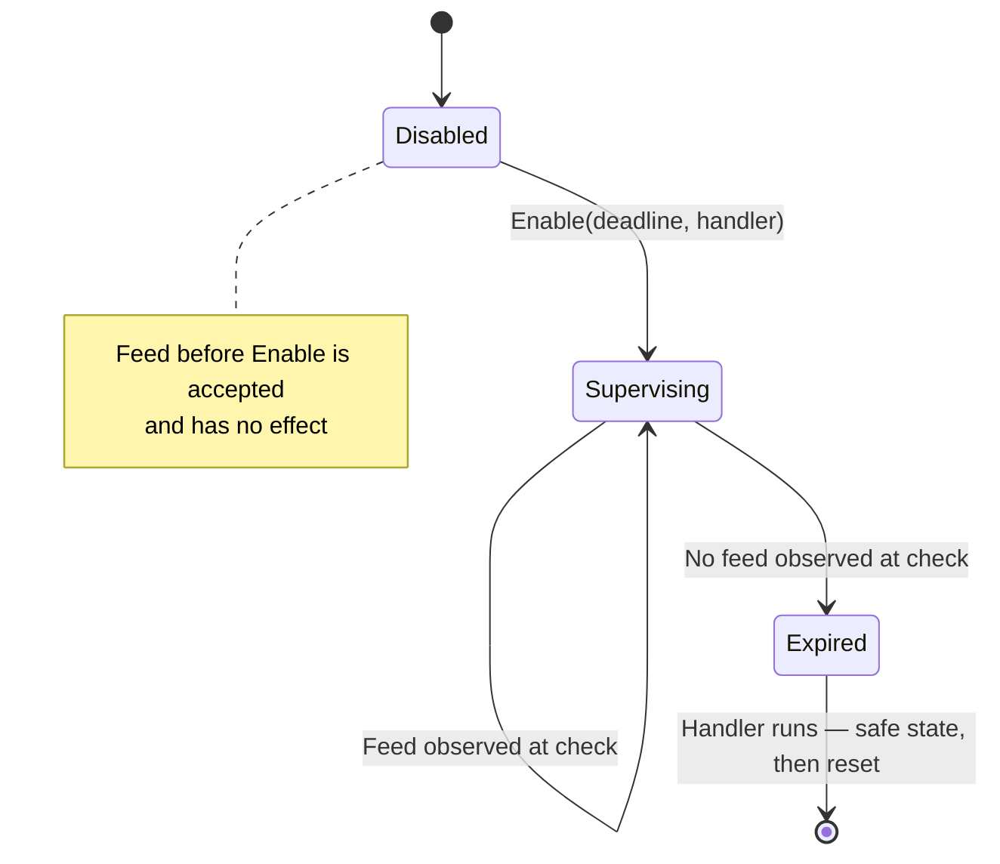
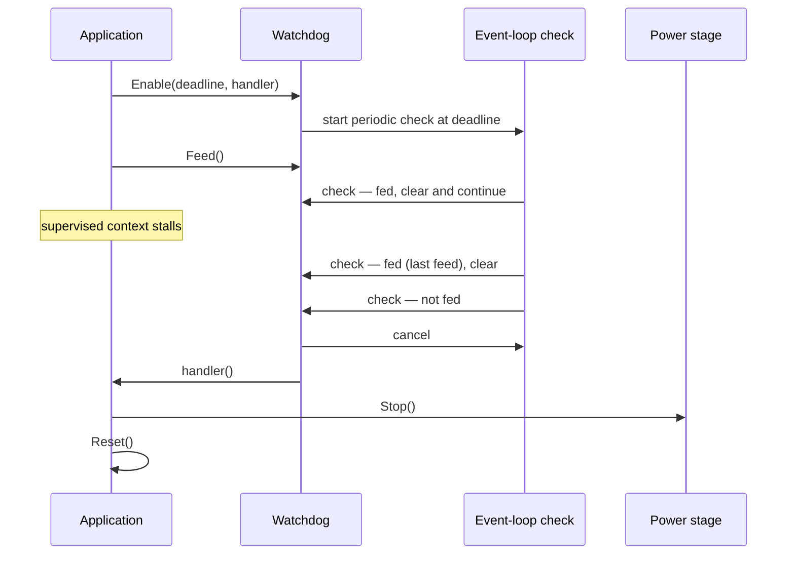
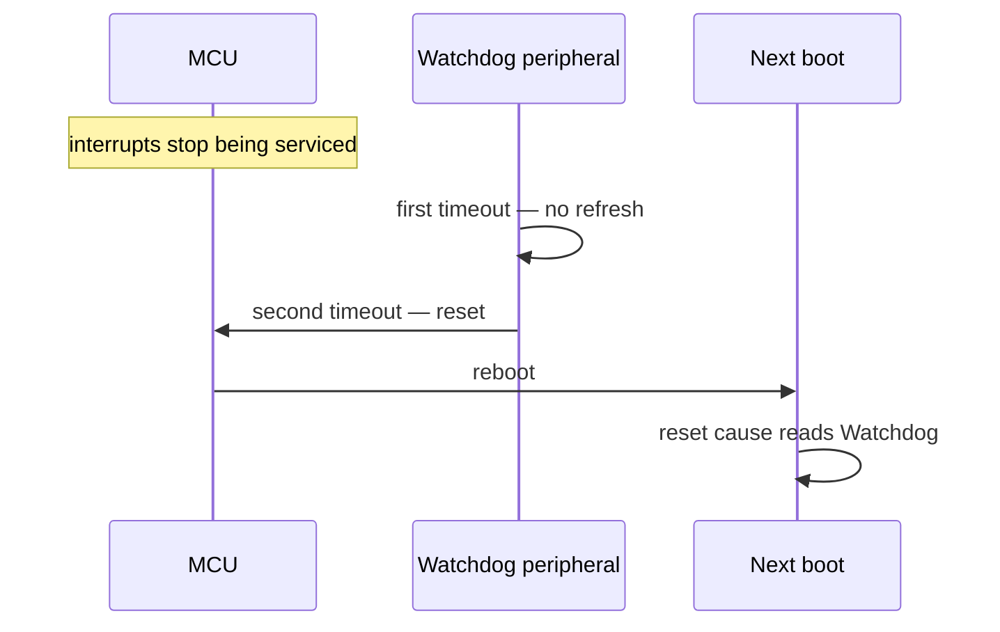
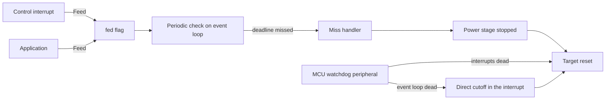

| Field     | Value           |
|-----------|-----------------|
| Title     | Watchdog Design |
| Type      | design          |
| Status    | draft           |
| Version   | 0.2.0           |
| Component | watchdog        |
| Date      | 2026-09-19      |

---

## Responsibilities

**Is responsible for:**
- Defining one platform-level watchdog port that every platform implementation must provide, so a target
  cannot be built without a watchdog.
- Supervising application progress against a deadline the application states when it enables supervision.
- Accepting a progress signal from any execution context, including the control interrupt.
- Reporting a missed deadline to the application within a bounded time, so the application can bring the
  power stage to a safe state.
- Backing that software supervision with hardware on targets whose hardware abstraction provides a watchdog
  driver, so that a stall which also kills the interrupt or the event loop resets the target from hardware.
- Reporting whether supervision is active and which deadline is being held, so a target that cannot
  supervise says so rather than pretending to.

- Deciding which execution contexts must make progress in which lifecycle state and control mode, and
  feeding the port only when every one of them has made progress since the previous evaluation.
- Holding a bounded grace for the startup phase, during which no control loop is expected yet, without ever
  suspending supervision.

**Is NOT responsible for:**
- Deciding what happens after a missed deadline. The port reports; the application chooses the safe state
  and whether to reset.
- Detecting the reset cause after a watchdog reset. That is the error-handling component's work, reached
  through the reset-cause port.
- Enabling supervision on its own. Supervision is off until the application asks for it.

---

## Component Details

### Part A — the platform watchdog port

The port is part of the driver vocabulary the platform abstraction publishes, alongside the inverter, the
encoder and the hall sensor. It is a required member of the platform factory, not an optional one, so every
platform — the two production MCU families, the emulated target and the host build — has to answer for it.

It offers four operations:

- **Enable** — start supervision with a deadline and a handler to call when the deadline is missed. It is
  accepted once; asking twice is a programming error.
- **Feed** — signal that the supervised work made progress. This is the only operation that may be called
  from interrupt context, so it does no more than set a flag.
- **IsEnabled** — whether supervision is running.
- **Deadline** — the deadline currently held.

There is deliberately no *disable*. A watchdog that can be switched off from application code is a watchdog
that gets switched off. Startup and calibration are covered by enabling supervision late and by choosing a
deadline wide enough for the phase, not by suspending protection.

### Part B — the software progress watchdog

Targets that run on real hardware get software supervision, which is what makes the port behave alike
across them.

It keeps a single *fed* flag and a repeating check that runs on the event loop at the deadline period. Each
check reads the flag and clears it: if the flag was set, the supervised work made progress since the previous
check and supervision continues; if it was not, the deadline was missed. On a miss the check stops and the
handler is called once — expiry is terminal, and feeding afterwards does not restart supervision, because a
watchdog that recovers by itself hides the failure it exists to expose.

Splitting the work this way is what makes the progress signal safe to call from the control interrupt: the
interrupt only writes a flag, and all timer bookkeeping stays on the event loop.

The cost is latency. A miss is noticed at the first check after the last feed that a check observed, so the
worst case from last feed to handler is **two deadline periods**, and the best case is one. The deadline is
therefore chosen as half the time the application is willing to leave the power stage driven.

### Part C — hardware backing

Software supervision running on the event loop cannot detect a stall of that same event loop, and nothing
running on the CPU can detect the CPU locking up. That is what MCU watchdog hardware is for.

On the TI target the port composes the software watchdog with the vendor watchdog driver. The two cover
different failures:

| Failure                                        | Detected by                      | Outcome                                      |
|------------------------------------------------|----------------------------------|----------------------------------------------|
| A supervised context stops signalling progress | Software check on the event loop | Handler called, application decides          |
| The event loop stalls but interrupts still run | Vendor driver's own feed timer   | Power stage cut in the interrupt, then reset |
| Interrupts stop running — CPU lockup           | Second hardware timeout          | MCU reset, reset cause reports Watchdog      |

The two paths end differently, and they have to. The software check runs on the event loop, so it can hand
the miss to the application and let it choose the safe state. The hardware path runs in the watchdog
interrupt precisely *because* the event loop has stopped, so there is nobody to hand it to: scheduling work
on a dead dispatcher would never run, and calling an application handler there would run event-loop code —
timers, tracing — from interrupt context. It instead does the one thing that is safe in an interrupt and
needs no driver state: the same direct power-stage cutoff the hard fault handler uses, then a reset.

ST and the emulated target get software supervision only. Both have a watchdog peripheral that could back
it — ST's window watchdog, and the CMSDK watchdog that the emulated machine models at 0x40008000 off a
25 MHz clock — but neither hardware abstraction carries a driver for one yet. Wiring either is tracked in
Open Questions; the emulated one is the more valuable of the two, because it is the only one a
continuous-integration job can exercise.

### Part D — the host build

The host build implements the port with a placeholder: it accepts a progress signal, does nothing with it,
and reports supervision as disabled whatever the application asks for. It is not a target that can be
reset, so supervising there would mean running machinery that proves nothing while reporting a protection
the build does not have.

Reporting *disabled* rather than accepting the enable request is the whole point of the placeholder: code
that asks whether supervision is running gets a truthful answer on every platform.

### Part E — validation surface

The bring-up application exposes supervision over its CLI, so the behaviour can be exercised on real
hardware rather than only reasoned about:

- **watchdog** — reports whether supervision is enabled, and the deadline when it is.
- **watchdog** *deadline_ms* — enables supervision with that deadline and starts feeding it from a repeating
  timer at a quarter of the deadline, then reports the new state.
- **watchdog_stall** — stops that feed timer, which is a deliberate stall of a supervised context.

The expiry handler in the bring-up application stops the power stage, says so on the trace, and resets the
target. The reset is observable, and the target comes back reporting supervision as disabled, because
supervision does not survive a reset and has to be asked for again.

### Part F — supervised contexts and the progress policy

Parts A to E give the drive a watchdog. They do not say *what* has to be alive for it to be fed. A watchdog
fed by whichever context happens still to be running proves only that something is running; the point of
this part is that the feed is earned by the whole control system, not by one healthy interrupt.

The production application therefore owns a **health aggregator**. It holds one progress flag per supervised
context, and a periodic evaluation on the event loop that reads and clears every flag, works out which
contexts the *current* lifecycle state and control mode expect, and feeds the port only when every expected
context has made progress since the previous evaluation. A context that is not expected is not consulted,
and a context that is expected and silent withholds the feed.

Three execution contexts exist, and they are supervised differently because they fail differently:

| Context               | Runs in                                           | Signals progress by                                     |
|-----------------------|---------------------------------------------------|----------------------------------------------------------|
| Inner control loop    | The phase-current interrupt, at the control rate  | Writing the phase duty cycles                            |
| Outer loop            | The low-priority interrupt, at a divided rate     | Completing one outer-loop pass                           |
| Event loop            | The main dispatcher                               | The evaluation itself running at all                     |

The event loop needs no flag: the evaluation runs on it, so an evaluation that happens is proof it is alive.
That is also its limit — a stalled event loop stops the evaluation rather than reporting it, which is why
Part C's hardware backing exists and why a target without it detects an application stall but not an
event-loop one.

#### What each state and mode expects

| Lifecycle state | Torque mode              | Speed and position modes             |
|-----------------|--------------------------|---------------------------------------|
| Startup         | nothing (graced, bounded)| nothing (graced, bounded)             |
| Idle            | nothing                  | nothing                               |
| Ready           | nothing                  | nothing                               |
| Calibrating     | nothing                  | nothing                               |
| Enabled         | inner loop               | inner loop **and** outer loop         |
| Fault           | nothing                  | nothing                               |

Two rows carry most of the safety argument.

*Enabled in speed or position mode requires both loops.* Inner-loop progress on its own is not enough, so a
control system whose outer loop has stopped while the current loop still runs — the drive holding a stale
torque reference forever — withholds the feed and is brought down. This is the rule that stops an unrelated
healthy interrupt from servicing the watchdog on the rest of the system's behalf.

*A stopped drive expects nothing.* `Idle` and `Ready` are healthy states in which no PWM is being written on
purpose, and torque mode has no outer loop at all. Demanding a heartbeat that the current state cannot
produce would reset a perfectly healthy drive, so the policy asks only for what the state can give.

`Calibrating` is in the same group, for a reason worth stating: the identification services drive the bridge
through their own timers and phase-current callbacks rather than through the control loop, so control-loop
progress is not the right evidence there. Calibration is bounded by those services' own no-sample timeouts,
not by the watchdog.

#### Startup

Supervision is enabled as the application is constructed, before the asynchronous configuration load that
brings the rest of the system up — not afterwards. Until a control mode has been attached, the evaluation
expects no control loop and feeds the port, but it does so for a **bounded** number of evaluations. If
startup has not completed within that grace, the feed stops and the deadline expires like any other stall.
A boot that hangs is therefore caught by the same mechanism as a running system that hangs, and nothing
anywhere disables supervision to get through startup.

#### Timing

The evaluation runs several times per deadline, so a healthy system feeds well inside it, and the deadline
is the quantity that bounds how long a stall can leave the bridge driven. The worst case from a context
falling silent to the power stage being stopped is one evaluation period plus two deadline periods — the
evaluation period to notice, and Part B's two-period detection latency to act.

#### After a missed deadline

The handler stops the drive through the lifecycle machine's emergency stop, stops the power stage directly,
traces the event, and resets. The reset is recorded where it survives, so the next boot reports the reset
cause as *watchdog* rather than *software* and the operator can tell a supervision failure from an operator
reset. Nothing is broadcast outward first: the deferred work that a fault notification would schedule cannot
run once the reset is taken, and delaying the reset to let a message flush would leave a stalled system
running for exactly as long as the delay.

---

## Interfaces

### Provided

| Interface                      | Purpose                                              | Contract                                                                   |
|--------------------------------|------------------------------------------------------|----------------------------------------------------------------------------|
| Watchdog enable                | Start supervision with a deadline and a miss handler | Called once, from the event loop; a second call is a programming error     |
| Watchdog feed                  | Signal that supervised work made progress            | Callable from any context including interrupts; bounded, allocation-free   |
| Watchdog enabled query         | Whether supervision is running                       | Event loop only                                                            |
| Watchdog deadline query        | The deadline being held                              | Event loop only; zero before supervision is enabled                        |
| Platform factory watchdog port | Reach the platform's watchdog                        | Required on every platform; the reference is valid for the platform's life |
| Watchdog placeholder           | Satisfy the port on a target that has no watchdog    | Reports disabled always; feeding and enabling have no effect               |
| Progress signal                | Record that one supervised context made progress     | Callable from any context; read and cleared by the evaluation              |
| Health aggregation             | Decide whether the port may be fed this evaluation   | Event loop only; consumes every signal, consults only the expected ones    |
| Supervision enable             | Start supervision with a deadline and startup grace  | Called once as the application is constructed                              |
| Control mode attachment        | End the startup grace once the lifecycle machine exists | Event loop only; until then no control loop is expected                 |

### Required

| Interface                    | Purpose                                            | Contract                                                                  |
|------------------------------|----------------------------------------------------|---------------------------------------------------------------------------|
| Event-loop timer service     | Run the periodic progress check                    | Must be running before supervision is enabled                             |
| MCU watchdog peripheral (TI) | Reset the target when interrupts stop running      | Configured when supervision is enabled; reset enabled on missed refresh   |
| Power stage stop             | Reach a safe state after a missed deadline         | Called from the miss handler before the reset                             |
| Direct power-stage cutoff    | Reach a safe state from the watchdog interrupt     | Interrupt-safe, depends on no driver state; shared with the fault handler |
| Platform reset               | Restart the target after the safe state is reached | Does not return                                                           |
| Lifecycle state and mode     | Decide what the current state and mode expect      | Event loop only; read once per evaluation                                 |
| Lifecycle emergency stop     | Stop the drive when the deadline is missed         | Accepted from every state; synchronous                                    |
| Reset with a watchdog record | Reset so the next boot reports the watchdog cause  | Records the expiry where it survives the reset, then does not return      |

---

## Data Model

| Entity   | Field    | Type / Unit  | Range                | Notes                                                   |
|----------|----------|--------------|----------------------|---------------------------------------------------------|
| Watchdog | deadline | microseconds | > 0; 0 when disabled | Stated by the application when supervision is enabled   |
| Watchdog | fed      | flag         | set / clear          | Written from any context, read and cleared by the check |
| Watchdog | enabled  | flag         | set / clear          | Set once, never cleared                                 |
| Watchdog | expired  | flag         | set / clear          | Set on the miss; supervision does not restart           |
| Health   | inner loop progress | flag | set / clear      | Set by the control interrupt, read and cleared by the evaluation |
| Health   | outer loop progress | flag | set / clear      | Set by the outer loop, read and cleared by the evaluation        |
| Health   | startup evaluations left | count | >= 0        | The bounded startup grace, in evaluations; not replenished       |

---

## State Machine

---

## Sequence Diagrams

### A supervised context stops making progress

### The CPU locks up on a hardware-backed target

---

## Block Diagram

---

## Constraints & Limitations

| Constraint                         | Value / Description                                                                                        |
|------------------------------------|------------------------------------------------------------------------------------------------------------|
| Detection latency                  | Between one and two deadline periods from the last feed; size the deadline at half the tolerable stall     |
| Feed cost                          | One flag write; safe from the control interrupt, no allocation, no timer work                              |
| Supervision cannot be stopped      | No disable operation, and expiry is terminal — feeding after a miss does not restart supervision           |
| Supervision does not survive reset | The application enables it again on each boot                                                              |
| Hardware backing                   | TI targets only; ST and the emulated target detect an application stall but no CPU lockup                  |
| ST target                          | No MCU watchdog is configured, consistent with a platform whose peripherals are stubs and drives no bridge |
| Emulated target                    | The machine models a CMSDK watchdog, but no driver exists for it, so supervision is software only          |
| Host build                         | No watchdog at all — the port is a placeholder that always reports supervision as disabled                 |
| Progress sources                   | Inner loop and outer loop are accounted separately; the event loop is proven by the evaluation running     |
| Stall-to-safe-state bound          | One evaluation period plus two deadline periods, from the last progress of an expected context            |
| Startup grace                      | Bounded in evaluations and never replenished; a boot that does not complete expires the deadline          |
| Calibration                        | Expects no control-loop progress; bounded by the identification services' own no-sample timeouts          |
| Hardware-path notification         | A stall the hardware catches resets without calling the application handler; the software path reports it  |
| Software-path reset cause          | Recorded across the reset on Cortex-M targets only; the host and emulated builds cannot report it         |

---

## Open Questions

| # | Question                                                                        | Answer or options                                                                                   | Status   |
|---|---------------------------------------------------------------------------------|-----------------------------------------------------------------------------------------------------|----------|
| 1 | Which execution contexts must make progress in each lifecycle state and mode?   | A health aggregator owned by the application, with the per-state and per-mode table in Part F       | answered |
| 2 | Who enables supervision in the production application, and with which deadline? | The application, as it is constructed, with a bounded startup grace rather than a wider deadline    | answered |
| 3 | Should the ST target configure its MCU watchdog?                                | Wire the vendor driver; leave it software-only until the platform drives a bridge                   | open     |
| 4 | Should a missed deadline be a fault code before the reset?                      | No — it is recorded as the reset cause, because deferred reporting cannot outrun the reset          | answered |
| 5 | Should the emulated target drive the CMSDK watchdog the machine already models? | Write a driver and compose it as on TI, which would let a SIL job assert a watchdog reset; leave it | open     |

Question 5 is the prerequisite for any continuous-integration coverage of a watchdog reset. The emulated
target's reset is a no-op today and its reset cause is fixed at power-up, so the reset path cannot be
asserted there; until that changes, the stall scenarios are bench work.
