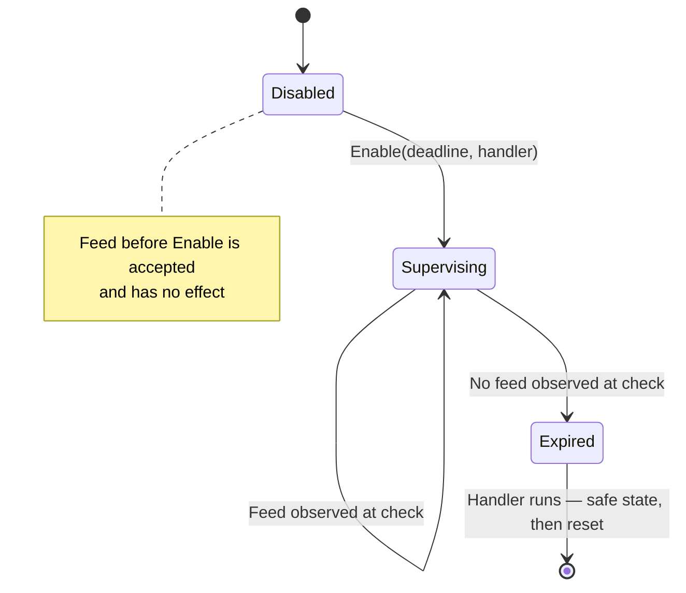
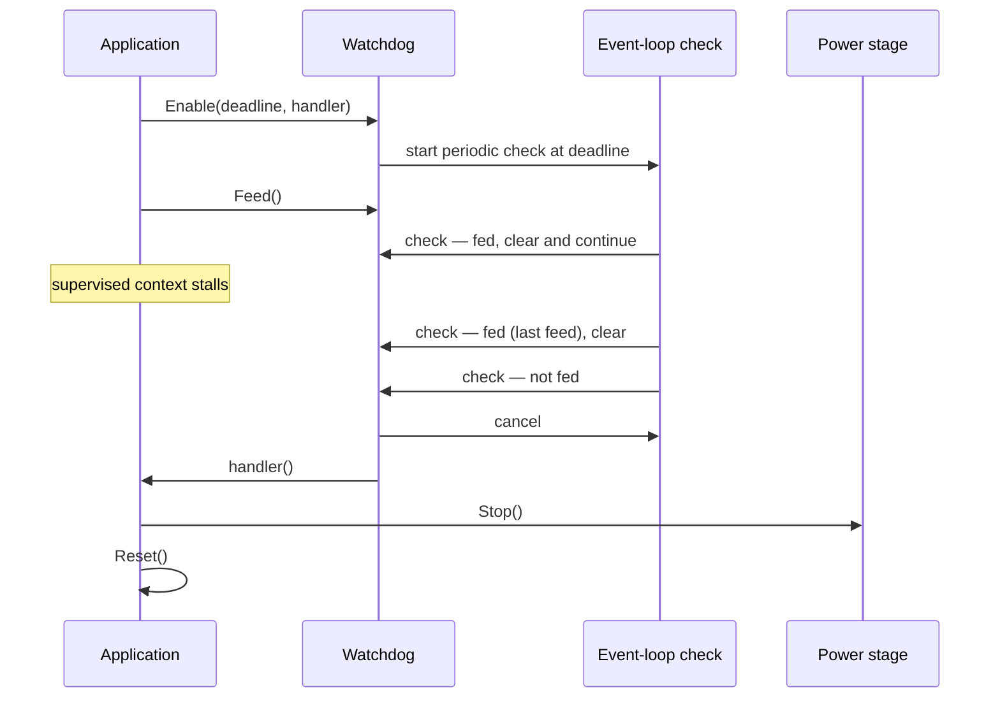
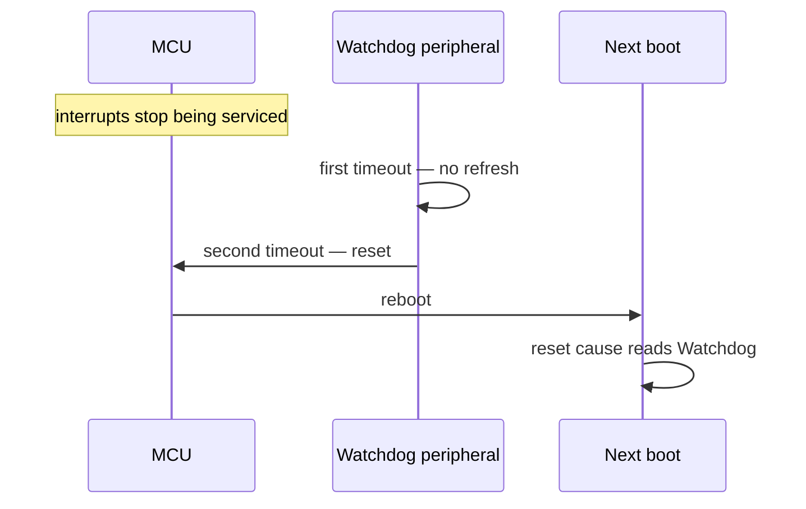
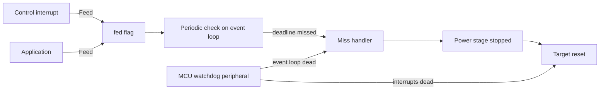

| Field     | Value           |
|-----------|-----------------|
| Title     | Watchdog Design |
| Type      | design          |
| Status    | draft           |
| Version   | 0.1.0           |
| Component | watchdog        |
| Date      | 2026-09-19      |

---

## Responsibilities

**Is responsible for:**
- Defining one platform-level watchdog port that every platform implementation must provide, so a target
  cannot be built without a watchdog.
- Supervising application progress against a deadline the application states when it enables supervision.
- Accepting a progress signal from any execution context, including the control interrupt.
- Reporting a missed deadline to the application within a bounded time, so the application can bring the
  power stage to a safe state.
- Backing that software supervision with MCU hardware on targets whose vendor layer provides a watchdog, so
  that a stall which also kills the interrupt or the event loop resets the target from hardware.
- Reporting whether supervision is active and which deadline is being held, so a target that cannot
  supervise says so rather than pretending to.

**Is NOT responsible for:**
- Deciding which execution contexts must make progress in which lifecycle state or control mode. The port
  takes one progress signal; aggregating several supervised contexts into it is the application's work and
  is not yet implemented (see Open Questions).
- Deciding what happens after a missed deadline. The port reports; the application chooses the safe state
  and whether to reset.
- Detecting the reset cause after a watchdog reset. That is the error-handling component's work, reached
  through the reset-cause port.
- Enabling supervision on its own. Supervision is off until the application asks for it.

---

## Component Details

### Part A — the platform watchdog port

The port is part of the driver vocabulary the platform abstraction publishes, alongside the inverter, the
encoder and the hall sensor. It is a required member of the platform factory, not an optional one, so every
platform — the two production MCU families, the emulated target and the host build — has to answer for it.

It offers four operations:

- **Enable** — start supervision with a deadline and a handler to call when the deadline is missed. It is
  accepted once; asking twice is a programming error.
- **Feed** — signal that the supervised work made progress. This is the only operation that may be called
  from interrupt context, so it does no more than set a flag.
- **IsEnabled** — whether supervision is running.
- **Deadline** — the deadline currently held.

There is deliberately no *disable*. A watchdog that can be switched off from application code is a watchdog
that gets switched off. Startup and calibration are covered by enabling supervision late and by choosing a
deadline wide enough for the phase, not by suspending protection.

### Part B — the software progress watchdog

Targets that run on real hardware get software supervision, which is what makes the port behave alike
across them.

It keeps a single *fed* flag and a repeating check that runs on the event loop at the deadline period. Each
check reads the flag and clears it: if the flag was set, the supervised work made progress since the previous
check and supervision continues; if it was not, the deadline was missed. On a miss the check stops and the
handler is called once — expiry is terminal, and feeding afterwards does not restart supervision, because a
watchdog that recovers by itself hides the failure it exists to expose.

Splitting the work this way is what makes the progress signal safe to call from the control interrupt: the
interrupt only writes a flag, and all timer bookkeeping stays on the event loop.

The cost is latency. A miss is noticed at the first check after the last feed that a check observed, so the
worst case from last feed to handler is **two deadline periods**, and the best case is one. The deadline is
therefore chosen as half the time the application is willing to leave the power stage driven.

### Part C — hardware backing

Software supervision running on the event loop cannot detect a stall of that same event loop, and nothing
running on the CPU can detect the CPU locking up. That is what MCU watchdog hardware is for.

On the TI target the port composes the software watchdog with the vendor watchdog driver. The two cover
different failures:

| Failure                                        | Detected by                      | Outcome                                 |
|------------------------------------------------|----------------------------------|-----------------------------------------|
| A supervised context stops signalling progress | Software check on the event loop | Handler called, application decides     |
| The event loop stalls but interrupts still run | Vendor driver's own feed timer   | Handler called, application decides     |
| Interrupts stop running — CPU lockup           | Second hardware timeout          | MCU reset, reset cause reports Watchdog |

Both detection paths call the same handler, so the application sees one event regardless of which layer
noticed.

ST gets software supervision only. Wiring its MCU watchdog is consistent work for whenever that platform
stops being a set of stubs; see Constraints and Open Questions.

### Part D — targets that have no watchdog

The emulated target and the host build implement the port with a placeholder: it accepts a progress signal,
does nothing with it, and reports supervision as disabled whatever the application asks for. Neither target
has a watchdog to drive — the emulator's hardware abstraction provides no watchdog driver, and the host
build is not a target that can be reset — so supervising there would mean running machinery that proves
nothing while reporting a protection the target does not have.

Reporting *disabled* rather than accepting the enable request is the whole point of the placeholder: code
that asks whether supervision is running gets a truthful answer on every platform.

### Part E — validation surface

The bring-up application exposes supervision over its CLI, so the behaviour can be exercised on real
hardware rather than only reasoned about:

- **watchdog** — reports whether supervision is enabled, and the deadline when it is.
- **watchdog** *deadline_ms* — enables supervision with that deadline and starts feeding it from a repeating
  timer at a quarter of the deadline, then reports the new state.
- **watchdog_stall** — stops that feed timer, which is a deliberate stall of a supervised context.

The expiry handler in the bring-up application stops the power stage, says so on the trace, and resets the
target. The reset is observable, and the target comes back reporting supervision as disabled, because
supervision does not survive a reset and has to be asked for again.

---

## Interfaces

### Provided

| Interface                      | Purpose                                              | Contract                                                                   |
|--------------------------------|------------------------------------------------------|----------------------------------------------------------------------------|
| Watchdog enable                | Start supervision with a deadline and a miss handler | Called once, from the event loop; a second call is a programming error     |
| Watchdog feed                  | Signal that supervised work made progress            | Callable from any context including interrupts; bounded, allocation-free   |
| Watchdog enabled query         | Whether supervision is running                       | Event loop only                                                            |
| Watchdog deadline query        | The deadline being held                              | Event loop only; zero before supervision is enabled                        |
| Platform factory watchdog port | Reach the platform's watchdog                        | Required on every platform; the reference is valid for the platform's life |
| Watchdog placeholder           | Satisfy the port on a target that has no watchdog    | Reports disabled always; feeding and enabling have no effect               |

### Required

| Interface                    | Purpose                                            | Contract                                                                |
|------------------------------|----------------------------------------------------|-------------------------------------------------------------------------|
| Event-loop timer service     | Run the periodic progress check                    | Must be running before supervision is enabled                           |
| MCU watchdog peripheral (TI) | Reset the target when interrupts stop running      | Configured when supervision is enabled; reset enabled on missed refresh |
| Power stage stop             | Reach a safe state after a missed deadline         | Called from the miss handler before the reset                           |
| Platform reset               | Restart the target after the safe state is reached | Does not return                                                         |

---

## Data Model

| Entity   | Field    | Type / Unit  | Range                | Notes                                                   |
|----------|----------|--------------|----------------------|---------------------------------------------------------|
| Watchdog | deadline | microseconds | > 0; 0 when disabled | Stated by the application when supervision is enabled   |
| Watchdog | fed      | flag         | set / clear          | Written from any context, read and cleared by the check |
| Watchdog | enabled  | flag         | set / clear          | Set once, never cleared                                 |
| Watchdog | expired  | flag         | set / clear          | Set on the miss; supervision does not restart           |

---

## State Machine

---

## Sequence Diagrams

### A supervised context stops making progress

### The CPU locks up on a hardware-backed target

---

## Block Diagram

---

## Constraints & Limitations

| Constraint                         | Value / Description                                                                                        |
|------------------------------------|------------------------------------------------------------------------------------------------------------|
| Detection latency                  | Between one and two deadline periods from the last feed; size the deadline at half the tolerable stall     |
| Feed cost                          | One flag write; safe from the control interrupt, no allocation, no timer work                              |
| Supervision cannot be stopped      | No disable operation, and expiry is terminal — feeding after a miss does not restart supervision           |
| Supervision does not survive reset | The application enables it again on each boot                                                              |
| Hardware backing                   | TI targets only; ST gets software supervision, so it detects an application stall but no CPU lockup        |
| ST target                          | No MCU watchdog is configured, consistent with a platform whose peripherals are stubs and drives no bridge |
| Emulated and host targets          | No watchdog at all — the port is a placeholder that always reports supervision as disabled                 |
| Progress sources                   | One aggregate progress signal; per-context progress accounting is not implemented yet                      |

---

## Open Questions

| # | Question                                                                        | Options                                                                                             | Status |
|---|---------------------------------------------------------------------------------|-----------------------------------------------------------------------------------------------------|--------|
| 1 | Which execution contexts must make progress in each lifecycle state and mode?   | Per-state progress table; per-mode table; a health aggregator owned by the state machine            | open   |
| 2 | Who enables supervision in the production application, and with which deadline? | The state machine on leaving startup; the application at boot with a wide startup grace             | open   |
| 3 | Should the ST target configure its MCU watchdog?                                | Wire the vendor driver; leave it software-only until the platform drives a bridge                   | open   |
| 4 | Should a missed deadline be a fault code before the reset?                      | Raise the watchdog-timeout fault code and broadcast it; reset immediately without reporting outward | open   |
