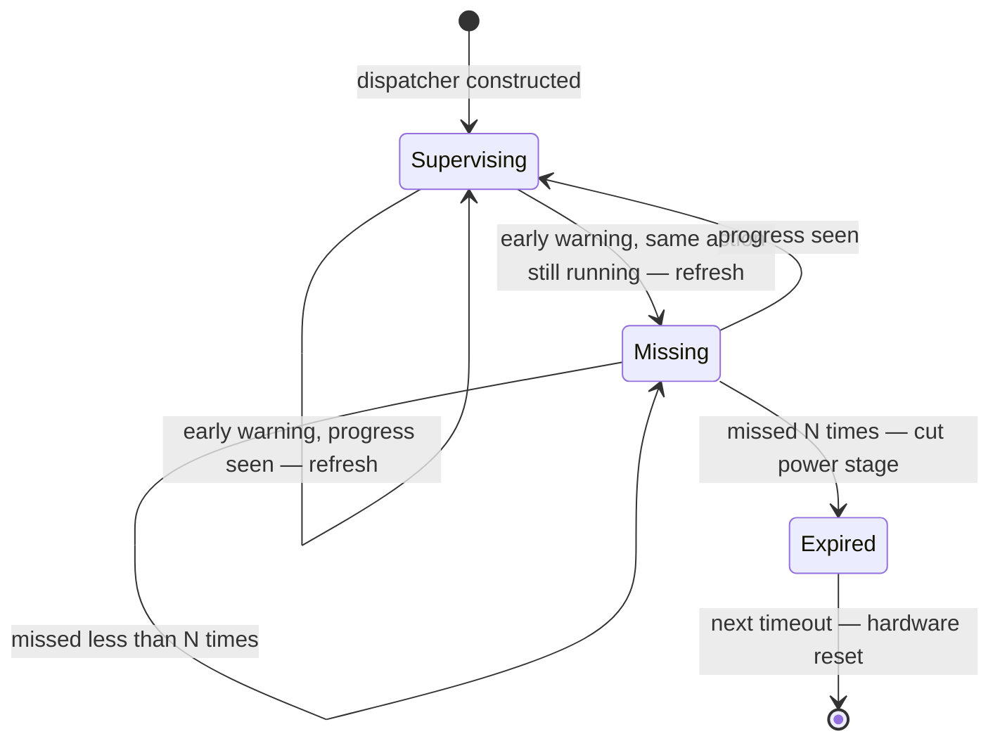
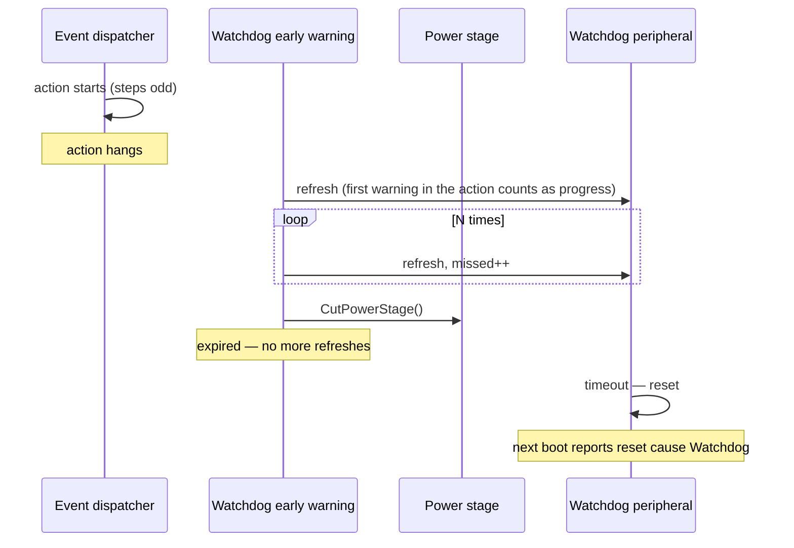
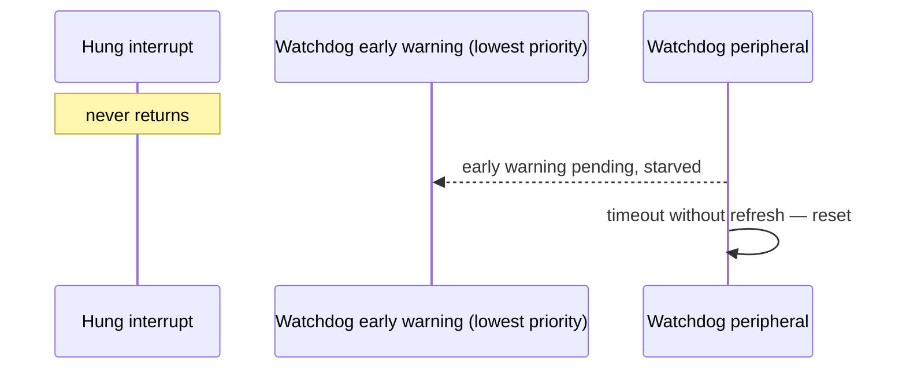
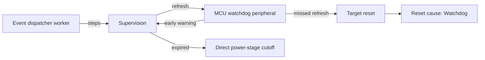

| Field     | Value           |
|-----------|-----------------|
| Title     | Watchdog Design |
| Type      | design          |
| Status    | draft           |
| Version   | 0.3.0           |
| Component | watchdog        |
| Date      | 2026-09-26      |

---

## Responsibilities

**Is responsible for:**
- Proving that the software is running. Every MCU platform supervises its event dispatcher with the MCU
  watchdog peripheral from the moment the dispatcher is constructed until the next reset.
- Bringing the power stage to a safe state from interrupt context when the dispatcher has stopped making
  progress, before the hardware resets the target.
- Resetting the target from hardware, so that the next boot reports the reset cause as *watchdog*.

**Is NOT responsible for:**
- Proving that the control loops are running. A current loop or outer loop that stops while the dispatcher
  keeps running is not a watchdog failure. It is left to the protections that watch the bridge itself:
  the hardware overcurrent and overvoltage comparators, board protection and the fault state machine.
- Being switched on, off or reconfigured by the application. There is no watchdog port in the platform
  factory. The platform owns the watchdog, and supervision is always on.
- Detecting the reset cause after a watchdog reset. That is the error-handling component's work, reached
  through the reset-cause port.

---

## Component Details

### Part A — supervision lives in the event dispatcher

The mechanism is EMIL's, not e-foc's. EMIL provides:
- a hardware watchdog interface, `hal::Watchdog`, implemented by the ST, TI and emulated-target drivers;
- an event dispatcher worker that supervises it, `services::EventDispatcherWatchdogWorker`.

Each MCU platform builds its dispatcher from that worker and hands it the platform's watchdog. The
dispatcher then does three things:

- **Counts progress.** The worker counts one step when an action starts and one when it finishes, so an
  odd count means an action is executing.
- **Refreshes on every early warning.** The hardware raises an early-warning interrupt once per
  early-warning period. The handler always refreshes the hardware.
- **Counts missed early warnings.** An early warning counts as missed when an action is executing and the
  count has not changed since the previous early warning. Early warnings that find the dispatcher idle or
  moving do not count, and they reset the tally.

After enough consecutive misses to cover the expiration timeout, the worker calls the platform's expiry
handler once and stops refreshing. The hardware then resets the target at its next timeout.

Supervision is always on. It starts in the dispatcher's constructor, and nothing can disable it. The
application needs no feed, no health check and no startup grace.

### Part B — what happens on expiry

The expiry handler runs inside the watchdog's early-warning interrupt. It runs there *because* the event
loop is stuck, so nothing can be scheduled and no application code can run.

The handler does only what is safe in an interrupt and needs no driver state:
1. It calls the direct power-stage cutoff, which the hard-fault handler also uses. On TI this clears the
   PWM output enables, so every gate is driven inactive and the motor coasts.
2. It returns.

The handler does not reset by software. The watchdog is no longer refreshed, so the hardware resets the
target one early-warning period later. That reset shows as *watchdog* in the MCU's own reset-cause
register, with no record to write before the reset.

This is the most graceful stop that is possible at this point. A torque ramp-down would need the event loop
that has just been proven stuck, and the time left before the hardware reset is only one early-warning
period.

### Part C — interrupt priority of the early warning

Progress is counted only inside actions. A dispatcher that is idle, or frozen between actions because an
interrupt never returns, looks like it is making progress. Because of that, the early-warning interrupt
must not be able to preempt any interrupt that could hang:

- The early-warning interrupt runs at the **lowest** priority the NVIC implements, no higher than the outer
  loop's PendSV.
- A hung interrupt at any priority then starves the early warning, so the hardware resets the target
  without the handler running.
- A hung action in the event loop leaves the early warning free to run, so the handler cuts the power stage
  first and the hardware resets the target afterwards.

| Failure                                             | Early warning runs? | Outcome                                    |
|-----------------------------------------------------|---------------------|--------------------------------------------|
| An event-loop action never returns                  | yes                 | Power stage cut, then hardware reset       |
| An interrupt never returns (control, outer loop, …) | no, starved         | Hardware reset; pins return to reset state |
| Interrupts disabled / CPU lockup                    | no                  | Hardware reset; pins return to reset state |
| The control loop stops while the event loop runs    | yes, sees progress  | Not detected, by design                    |

### Part D — platforms

| Platform         | Hardware                            | Early-warning period               | Expiration timeout         |
|------------------|-------------------------------------|------------------------------------|----------------------------|
| TI (TM4C123/129) | Watchdog 0, reset on second timeout | 25 ms                              | 100 ms                     |
| ST (STM32)       | Window watchdog, prescaler 8        | Fixed by PCLK1 (≈129 ms at 16 MHz) | 100 ms (one early warning) |
| Emulated target  | CMSDK watchdog of the MPS2 machine  | 25 ms                              | 100 ms                     |
| Host             | none                                | —                                  | —                          |

- **ST:** the vendor driver pins the window watchdog to the highest priority when it starts. The platform
  lowers it to the lowest NVIC level straight after the dispatcher is constructed, for the reason given in
  Part C. That level is set with the CMSIS encoding, because EMIL's priority enum assumes three priority
  bits and the STM32 parts implement four. The
  cutoff is empty while the ST platform drives no bridge.
- **Emulated target:** the MPS2 machine wires its watchdog to NMI, which cannot be lowered. So on the
  emulated target a hung interrupt is caught only when the event loop is inside an action. That is
  acceptable for a target that drives a simulated plant.

  The machine has no reset-cause register, and its reset reloads RAM. So the expiry handler writes a marker
  file through semihosting before the reset, and the next boot reads the marker, clears it and reports
  *watchdog*. The simulated bridge has no gate to cut.
- **Host:** the host build keeps a plain dispatcher. It is not a target that can be reset.

### Part E — validation surface

The bring-up application keeps one command:

- **watchdog_stall** — schedules an action that never returns. The expiry handler cuts the power stage,
  the hardware resets the target, and the target comes back reporting the reset cause as *watchdog*.

There is no command to enable or query the watchdog, because it has no state the application can change.

---

## Interfaces

### Provided

| Interface                   | Purpose                                         | Contract                                                               |
|-----------------------------|-------------------------------------------------|------------------------------------------------------------------------|
| Supervised event dispatcher | Run the application and prove it makes progress | Every MCU platform; supervision starts in the constructor, never stops |

### Required

| Interface                 | Purpose                                                     | Contract                                                                                             |
|---------------------------|-------------------------------------------------------------|------------------------------------------------------------------------------------------------------|
| `hal::Watchdog`           | Early-warning interrupt, refresh, reset on a missed refresh | Constructed before the dispatcher; early warning at the lowest priority where the hardware allows it |
| Direct power-stage cutoff | Safe state from the early-warning interrupt                 | Interrupt-safe, depends on no driver state; shared with the fault handler                            |
| Reset-cause register      | Report the watchdog reset on the next boot                  | Read and cleared once at boot by the error-handling component                                        |

---

## Data Model

| Entity      | Field                 | Type / Unit | Range    | Notes                                                         |
|-------------|-----------------------|-------------|----------|---------------------------------------------------------------|
| Supervision | steps                 | count       | wraps    | Incremented before and after each action; odd while executing |
| Supervision | missed early warnings | count       | 0 … N    | Reset whenever progress is seen                               |
| Supervision | N                     | count       | ≥ 1      | ⌈expiration timeout / early-warning period⌉                   |
| Supervision | expired               | flag        | set once | Refreshing stops; the hardware reset follows                  |

---

## State Machine

---

## Sequence Diagrams

### An event-loop action never returns

### An interrupt never returns

---

## Block Diagram

---

## Timing

With early-warning period *P* and *N* = ⌈timeout / *P*⌉:

- The first early warning after an action starts always counts as progress. A hung action is therefore
  detected between *N·P* and *(N+1)·P* after it started, and the power stage is cut at that point.
- The hardware reset follows one period later, at most *(N+2)·P* after the action started.
- With TI at *P* = 25 ms and *N* = 4, that is 100–125 ms to the cutoff and at most 150 ms to the reset.

A legitimate action must finish well inside *N·P*. Long work is already split across actions:
- the TI EEPROM mass erase is polled from a timer rather than waited for;
- EEPROM writes wait only word by word;
- identification sequences run from timers and phase-current callbacks.

New work that could block for longer than the expiration timeout has to be split across actions the same way.

---

## Constraints & Limitations

| Constraint                      | Value / Description                                                                                    |
|---------------------------------|--------------------------------------------------------------------------------------------------------|
| Scope                           | Proves the software is running; does not prove the control loops are running                           |
| Always on                       | Starts with the dispatcher; there is no enable, disable or query                                       |
| Boot before the dispatcher runs | Construction outside an action looks like progress; a hang there is caught only if interrupts stop too |
| Expiry handler                  | Interrupt context; power-stage cutoff only, then returns                                               |
| Early-warning priority          | Lowest on TI and ST, so a hung interrupt starves it; NMI on the emulated target                        |
| ST target                       | Cutoff is empty while the platform drives no bridge                                                    |
| Host build                      | No watchdog                                                                                            |
| Reset cause                     | Read from the MCU's reset-cause register; the emulated target reads a semihosting marker file instead  |

---

## Open Questions

| # | Question                                                                        | Answer or options                                                                                                      | Status   |
|---|---------------------------------------------------------------------------------|------------------------------------------------------------------------------------------------------------------------|----------|
| 1 | Should the watchdog also prove the control loops are running?                   | No. It proves the software is running; bridge protection covers the power stage                                        | answered |
| 2 | Should a missed deadline be a fault code before the reset?                      | No — it is reported as the reset cause, because deferred reporting cannot outrun the reset                             | answered |
| 3 | Should the ST window-watchdog driver take the early-warning priority as config? | Yes, as the Tiva driver does; today the platform overrides the driver after start, which depends on construction order | open     |
| 4 | Can the emulated target's reset be asserted by a SIL job?                       | Yes: the CMSDK watchdog resets the machine and the semihosting marker reports the cause as *watchdog*                  | answered |
