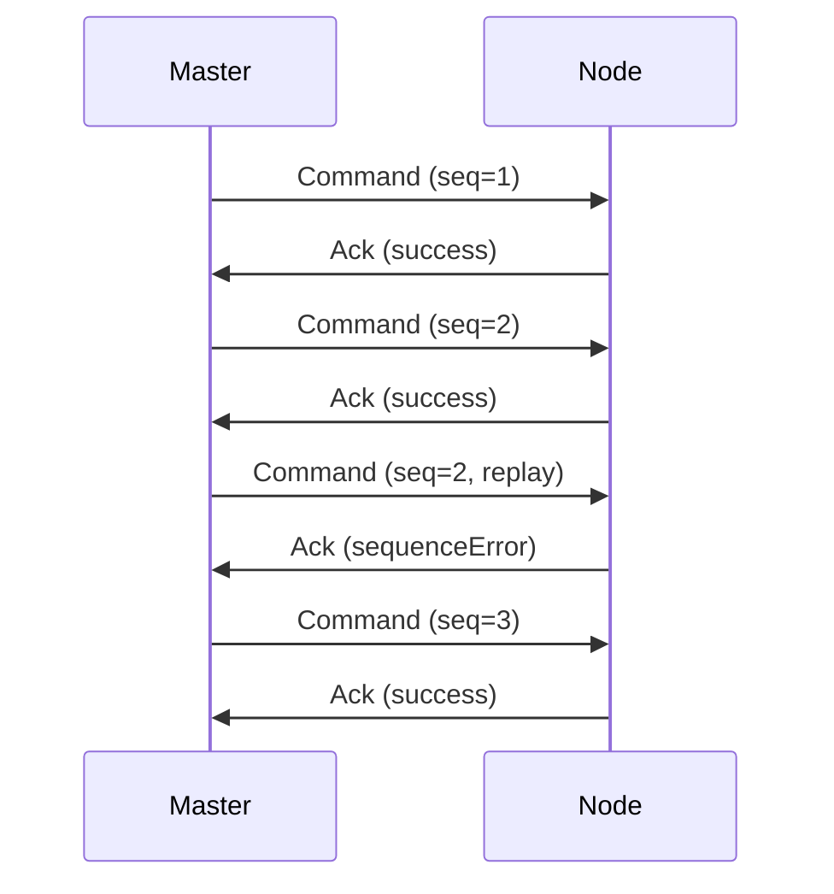
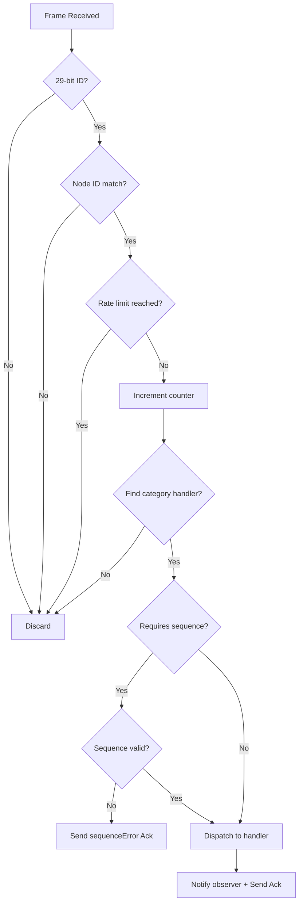
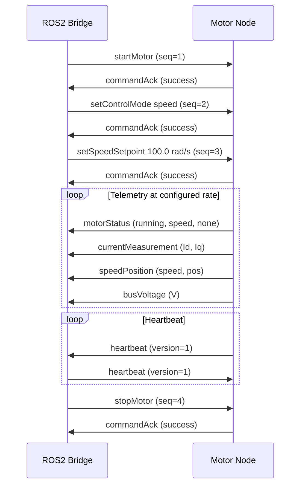

# e-foc CAN Protocol Specification

**Version:** 1.0  
**Protocol Version Byte:** 1  
**Status:** Draft  
**Date:** 2025

## 1. Abstract

This document specifies the CAN bus protocol used by e-foc motor controllers
for command reception, telemetry transmission, and system management. The
protocol operates over standard CAN 2.0B (29-bit extended identifiers) at
up to 1 Mbit/s and is designed for deterministic, low-latency motor control
with a host-side ROS2 bridge.

## 2. Terminology

| Term            | Definition                                                          |
|-----------------|---------------------------------------------------------------------|
| Node            | A single e-foc motor controller on the CAN bus                      |
| Master          | The host system issuing commands (e.g., ROS2 bridge)                |
| Broadcast       | A message addressed to all nodes (node ID 0x000)                    |
| Sequence Number | An 8-bit counter in byte[0] of command frames for replay protection |
| Scale Factor    | Integer multiplier used to convert floats to fixed-point integers   |

## 3. Transport

- Physical layer: CAN 2.0B
- Bit rate: up to 1 Mbit/s (configurable)
- Identifier format: 29-bit extended only; 11-bit frames are silently discarded
- Maximum payload: 8 bytes per frame (CAN 2.0 standard)

## 4. CAN Identifier Layout

All 29 bits of the extended CAN ID are structured as follows:

```
Bit:  28  27  26  25  24  23  22  21  20  19  18  17  16  15  14  13  12  11  10  9   8   7   6   5   4   3   2   1   0
     |----  Priority  ----|-- Category --|------  Message Type  ------|----------------- Node ID -------------------|
     |     5 bits (0-31)  |  4 bits (0-F)|       8 bits (0-FF)        |             12 bits (0-FFF)                 |
```


**Field Encoding:**

```
raw_id = (priority << 24) | (category << 20) | (message_type << 12) | node_id
```

## 5. Priority Levels

| Value | Name      | Usage                            |
|-------|-----------|----------------------------------|
| 0     | Emergency | Emergency stop, fault events     |
| 4     | Command   | Motor commands, parameter writes |
| 8     | Response  | Command acknowledgements         |
| 12    | Telemetry | Periodic measurements            |
| 16    | Heartbeat | Node liveness                    |

Lower numerical values have higher CAN bus arbitration priority.

## 6. Message Categories

| Value | Name              | Description                                      |
|-------|-------------------|--------------------------------------------------|
| 0x0   | Motor Control     | Start, stop, e-stop, mode, setpoints             |
| 0x1   | PID Tuning        | Current/speed/position loop gains                |
| 0x2   | Motor Parameters  | Pole pairs, R, L, flux linkage                   |
| 0x3   | System Parameters | Supply voltage, max current                      |
| 0x4   | Telemetry         | Status, measurements, faults                     |
| 0x5   | System            | Heartbeat, command acknowledgement, status query |

## 7. Message Catalog

### 7.1 Motor Control (Category 0x0)

All motor control command frames carry a sequence number in byte[0].

#### 7.1.1 Start Motor (Type 0x01)

| Byte | Field    | Type  | Description              |
|------|----------|-------|--------------------------|
| 0    | Sequence | uint8 | Rolling sequence counter |

Response: commandAck with success.

#### 7.1.2 Stop Motor (Type 0x02)

| Byte | Field    | Type  | Description              |
|------|----------|-------|--------------------------|
| 0    | Sequence | uint8 | Rolling sequence counter |

Response: commandAck with success.

#### 7.1.3 Emergency Stop (Type 0x03)

| Byte | Field | Type  | Description                       |
|------|-------|-------|-----------------------------------|
| 0    | (any) | uint8 | Not validated (no sequence check) |

Sent at CanPriority::emergency. Bypasses sequence validation.
Response: commandAck with success.

#### 7.1.4 Set Control Mode (Type 0x04)

| Byte | Field    | Type  | Description                   |
|------|----------|-------|-------------------------------|
| 0    | Sequence | uint8 | Rolling sequence counter      |
| 1    | Mode     | uint8 | 0=torque, 1=speed, 2=position |

Response: commandAck with success, or invalidPayload if mode > 2.

#### 7.1.5 Set Torque Setpoint (Type 0x05)

| Byte | Field      | Type     | Description                  |
|------|------------|----------|------------------------------|
| 0    | Sequence   | uint8    | Rolling sequence counter     |
| 1-2  | Id Current | int16 BE | Id setpoint × 1000 (amperes) |
| 3-4  | Iq Current | int16 BE | Iq setpoint × 1000 (amperes) |

Minimum payload: 5 bytes.

#### 7.1.6 Set Speed Setpoint (Type 0x06)

| Byte | Field    | Type     | Description              |
|------|----------|----------|--------------------------|
| 0    | Sequence | uint8    | Rolling sequence counter |
| 1-4  | Speed    | int32 BE | Speed × 1000 (rad/s)     |

Minimum payload: 5 bytes.

#### 7.1.7 Set Position Setpoint (Type 0x07)

| Byte | Field    | Type     | Description                |
|------|----------|----------|----------------------------|
| 0    | Sequence | uint8    | Rolling sequence counter   |
| 1-4  | Position | int32 BE | Position × 10000 (radians) |

Minimum payload: 5 bytes.

### 7.2 PID Tuning (Category 0x1)

All PID frames share the same payload layout.

| Byte | Field    | Type     | Description              |
|------|----------|----------|--------------------------|
| 0    | Sequence | uint8    | Rolling sequence counter |
| 1-2  | Kp       | int16 BE | Proportional gain × 1000 |
| 3-4  | Ki       | int16 BE | Integral gain × 1000     |
| 5-6  | Kd       | int16 BE | Derivative gain × 1000   |

Minimum payload: 7 bytes.

| Type | Loop       |
|------|------------|
| 0x01 | Current Id |
| 0x02 | Current Iq |
| 0x03 | Speed      |
| 0x04 | Position   |

### 7.3 Motor Parameters (Category 0x2)

#### 7.3.1 Set Pole Pairs (Type 0x01)

| Byte | Field      | Type  | Description              |
|------|------------|-------|--------------------------|
| 0    | Sequence   | uint8 | Rolling sequence counter |
| 1    | Pole Pairs | uint8 | Number of pole pairs     |

Minimum payload: 2 bytes.

#### 7.3.2 Set Resistance (Type 0x02)

| Byte | Field      | Type     | Description                |
|------|------------|----------|----------------------------|
| 0    | Sequence   | uint8    | Rolling sequence counter   |
| 1-4  | Resistance | int32 BE | Resistance × 100000 (ohms) |

Minimum payload: 5 bytes.

#### 7.3.3 Set Inductance (Type 0x03)

| Byte | Field      | Type     | Description                     |
|------|------------|----------|---------------------------------|
| 0    | Sequence   | uint8    | Rolling sequence counter        |
| 1-4  | Inductance | int32 BE | Inductance × 10000000 (henries) |

Minimum payload: 5 bytes.

#### 7.3.4 Set Flux Linkage (Type 0x04)

| Byte | Field    | Type     | Description                     |
|------|----------|----------|---------------------------------|
| 0    | Sequence | uint8    | Rolling sequence counter        |
| 1-4  | Flux     | int32 BE | Flux linkage × 1000000 (webers) |

Minimum payload: 5 bytes.

### 7.4 System Parameters (Category 0x3)

#### 7.4.1 Set Supply Voltage (Type 0x01)

| Byte | Field    | Type     | Description              |
|------|----------|----------|--------------------------|
| 0    | Sequence | uint8    | Rolling sequence counter |
| 1-2  | Voltage  | int16 BE | Voltage × 100 (volts)    |

Minimum payload: 3 bytes.

#### 7.4.2 Set Max Current (Type 0x02)

| Byte | Field    | Type     | Description              |
|------|----------|----------|--------------------------|
| 0    | Sequence | uint8    | Rolling sequence counter |
| 1-2  | Current  | int16 BE | Current × 1000 (amperes) |

Minimum payload: 3 bytes.

### 7.5 Telemetry (Category 0x4)

Telemetry frames are sent by the node at CanPriority::telemetry.

#### 7.5.1 Motor Status (Type 0x01)

| Byte | Field      | Type  | Description                            |
|------|------------|-------|----------------------------------------|
| 0    | State      | uint8 | 0=idle, 1=running, 2=fault, 3=aligning |
| 1    | Mode       | uint8 | 0=torque, 1=speed, 2=position          |
| 2    | Fault Code | uint8 | See fault codes table                  |

#### 7.5.2 Current Measurement (Type 0x02)

| Byte | Field      | Type     | Description                  |
|------|------------|----------|------------------------------|
| 0-1  | Id Current | int16 BE | Measured Id × 1000 (amperes) |
| 2-3  | Iq Current | int16 BE | Measured Iq × 1000 (amperes) |

#### 7.5.3 Speed and Position (Type 0x03)

| Byte | Field    | Type     | Description                |
|------|----------|----------|----------------------------|
| 0-1  | Speed    | int16 BE | Speed × 1000 (rad/s)       |
| 2-3  | Position | int16 BE | Position × 10000 (radians) |

#### 7.5.4 Bus Voltage (Type 0x04)

| Byte | Field   | Type     | Description           |
|------|---------|----------|-----------------------|
| 0-1  | Voltage | int16 BE | Voltage × 100 (volts) |

#### 7.5.5 Fault Event (Type 0x05)

Sent at CanPriority::emergency.

| Byte | Field      | Type  | Description           |
|------|------------|-------|-----------------------|
| 0    | Fault Code | uint8 | See fault codes table |

### 7.6 System (Category 0x5)

#### 7.6.1 Heartbeat (Type 0x01)

Sent at CanPriority::heartbeat. No sequence validation.

| Byte | Field   | Type  | Description                    |
|------|---------|-------|--------------------------------|
| 0    | Version | uint8 | Protocol version (currently 1) |

#### 7.6.2 Command Acknowledgement (Type 0x02)

Sent at CanPriority::response.

| Byte | Field    | Type  | Description                                |
|------|----------|-------|--------------------------------------------|
| 0    | Category | uint8 | CanCategory of the acknowledged command    |
| 1    | Command  | uint8 | CanMessageType of the acknowledged command |
| 2    | Status   | uint8 | See acknowledgement status table           |

The category byte ensures the receiver can uniquely identify which command
is being acknowledged, since message type values are reused across categories.

#### 7.6.3 Request Status (Type 0x03)

Sent at CanPriority::command. No sequence validation. Empty payload.

When received, the node notifies the application observer via `OnStatusRequested()`.
The observer is expected to respond by calling `SendMotorStatus()`, which sends a
telemetry frame (Category 0x4, Type 0x01) containing the current motor state,
active control mode, and fault code.

This message is used by the CAN Commander tool to query the active control mode
on connection and adapt the GUI accordingly.

## 8. Data Encoding

All multi-byte integers are encoded **big-endian** (network byte order).

### 8.1 Scale Factors

| Quantity       | Type        | Scale Factor | Resolution  | Range                         |
|----------------|-------------|--------------|-------------|-------------------------------|
| Current (A)    | int16       | 1000         | 0.001 A     | ±32.767 A                     |
| Voltage (V)    | int16       | 100          | 0.01 V      | ±327.67 V                     |
| Speed (rad/s)  | int16/int32 | 1000         | 0.001 rad/s | ±32.767 or ±2147483.647 rad/s |
| Position (rad) | int16/int32 | 10000        | 0.0001 rad  | ±3.2767 or ±214748.3647 rad   |
| PID Gain       | int16       | 1000         | 0.001       | ±32.767                       |
| Resistance (Ω) | int32       | 100000       | 0.00001 Ω   | ±21474.83647 Ω                |
| Inductance (H) | int32       | 10000000     | 0.0000001 H | ±214.7483647 H                |
| Flux (Wb)      | int32       | 1000000      | 0.000001 Wb | ±2147.483647 Wb               |

### 8.2 Encoding Algorithm

```
fixed_value = clamp(round(float_value × scale_factor), INT_MIN, INT_MAX)
float_value = fixed_value / scale_factor
```

Values are saturated (clamped) to the target integer range to prevent overflow.

## 9. Enumeration Tables

### 9.1 Control Modes

| Value | Mode                     |
|-------|--------------------------|
| 0     | Torque (current control) |
| 1     | Speed                    |
| 2     | Position                 |

### 9.2 Motor States

| Value | State    |
|-------|----------|
| 0     | Idle     |
| 1     | Running  |
| 2     | Fault    |
| 3     | Aligning |

### 9.3 Fault Codes

| Value | Fault                 |
|-------|-----------------------|
| 0     | None                  |
| 1     | Over-current          |
| 2     | Over-voltage          |
| 3     | Over-temperature      |
| 4     | Sensor fault          |
| 5     | Communication timeout |

### 9.4 Acknowledgement Status

| Value | Status          | Description                                |
|-------|-----------------|--------------------------------------------|
| 0     | Success         | Command accepted and processed             |
| 1     | Unknown Command | Message type not recognized for category   |
| 2     | Invalid Payload | Payload too short or field out of range    |
| 3     | Invalid State   | Command not valid in current motor state   |
| 4     | Sequence Error  | Sequence number not (previous + 1) mod 256 |
| 5     | Rate Limited    | Message rate limit exceeded                |

## 10. Sequence Number Protocol



- For most command frames that carry a payload, Byte[0] is an unsigned 8-bit sequence counter used for best-effort in-order processing.
- The node accepts the first sequenced command received regardless of sequence value and records it as the reference.
- For commands where sequence validation is enabled, each subsequent command should have sequence = (previous + 1) mod 256.
- When sequence validation is enabled and a command is out-of-order or duplicated, the node may reject it and send a `sequenceError` acknowledgement.
- Emergency stop (category motorControl, type 0x03) bypasses sequence validation entirely by design. The bypass is keyed on both category and message type to avoid false matches with types reusing value 0x03 in other categories.
- When sequence validation is required and the payload is empty (no sequence byte present), the frame is rejected with `invalidPayload`.
- Heartbeat and telemetry frames do not use sequence numbers and are never subject to sequence validation.
- Unrecognized message types within a supported category are rejected with an `unknownCommand` acknowledgement.
- Sequence numbers are not an authentication or security mechanism and MUST NOT be relied upon to prevent malicious replay on an untrusted CAN bus.

## 11. Rate Limiting

The node enforces a configurable maximum message rate (default: 500 messages
per period). Messages received after the limit is reached are silently
discarded. The counter is reset by calling ResetRateCounter(), typically
driven by a periodic timer.



## 12. Node Addressing

- Each node has a unique 12-bit node ID (1-4095) set at configuration time.
- Node ID 0x000 is reserved as the broadcast address.
- Frames addressed to the broadcast ID are accepted by all nodes.
- Frames addressed to a different node ID are silently discarded.

## 13. Typical Command Flow



## 14. Security Considerations

- **Replay protection:** Sequence number validation prevents replayed commands.
- **Bus flooding protection:** Configurable rate limiting discards excess messages.
- **Input validation:** All payloads are length-checked before parsing; out-of-range
  enum values are rejected with invalidPayload.
- **No heap allocation:** Fixed-size buffers prevent memory exhaustion.
- **Node isolation:** Strict node ID filtering prevents cross-node interference.
- **Emergency stop:** Always processed regardless of sequence state, preventing
  a stuck sequence counter from blocking safety actions.

## 15. Implementation Notes

- The protocol is implemented by the external `can-lite` library (https://github.com/embedded-pro/can-lite).
- Observer pattern uses `infra::SingleObserver` / `infra::Subject` from embedded-infra-lib.
- Category-based dispatch uses `FocMotorCategoryClient`, which routes decoded frames to `FocMotorCategoryClientObserver` callbacks.
- All encoding and saturation clamping is handled internally by can-lite.
- The implementation is fully covered by 67 GoogleTest unit tests.
