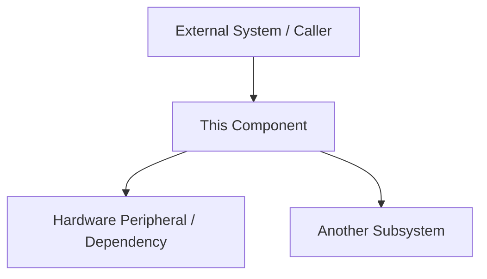
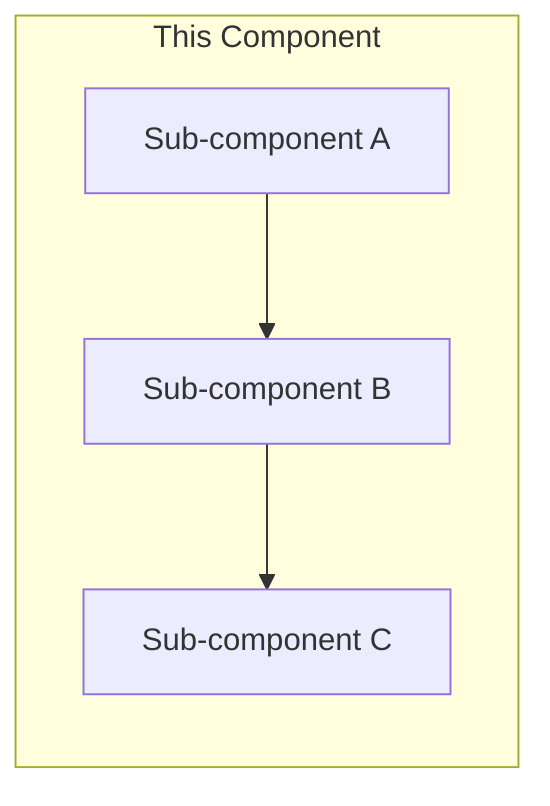
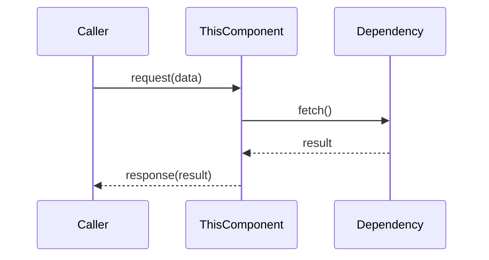

| Field     | Value            |
|-----------|------------------|
| Title     | Component Architecture |
| Type      | architecture     |
| Status    | draft            |
| Version   | 0.1.0            |
| Component | component-name   |
| Date      | YYYY-MM-DD       |

> **Note — Implementation-blind document**: This document describes *what exists and why*, not how it is coded.
> Code must follow architecture, not the opposite. Do not reference source files, class names, or implementation
> details here. Diagrams (Mermaid block diagrams, component diagrams, sequence diagrams, state machines) are
> allowed and encouraged.

---

## Assumptions & Constraints

> List the assumptions that were true when this architecture was designed, and the hard constraints that shaped
> the decisions (e.g., no dynamic memory, 20 kHz control loop, single-core MCU, fixed bus topology).
> Use a bulleted list or table. Be explicit — an unstated assumption is a hidden risk.

- **Assumption**: …
- **Constraint**: …

---

## System Overview

> Provide a high-level narrative of the component's place in the system. Answer: what problem does it solve,
> what are its main responsibilities, and what are its primary interactions with surrounding components?
> A block diagram is required here.

---

## Component Decomposition

> Decompose the component into its sub-components or modules. Explain the responsibility of each.
> Show structural relationships (containment, aggregation, association) with a component diagram.
> Do NOT enumerate classes — describe logical units of responsibility.

| Sub-component | Responsibility |
|---------------|----------------|
| …             | …              |

---

## Interfaces & Contracts

> Describe every interface that external callers use to interact with this component, and every interface
> this component depends on. For each interface, state: its direction (provided / required), its purpose,
> and its invariants (pre/post-conditions, timing requirements, error semantics).
> Use a table or numbered list. No code — describe behavior only.

### Provided Interfaces

| Interface | Direction | Purpose | Invariants |
|-----------|-----------|---------|------------|
| …         | provided  | …       | …          |

### Required Interfaces

| Interface | Direction | Purpose | Invariants |
|-----------|-----------|---------|------------|
| …         | required  | …       | …          |

---

<!-- OPTIONAL SECTIONS — include only when relevant; remove this comment in final documents -->

## Data Flow

> Trace the flow of data through the component from input to output. A sequence diagram or data-flow
> diagram is preferred over prose for complex flows.

---

## Cross-Cutting Concerns

> Document concerns that span multiple sub-components: error handling strategy, logging/tracing policy,
> timing and scheduling guarantees, power management, safety / fault-tolerance requirements.

| Concern       | Policy / Approach |
|---------------|-------------------|
| Error handling | …               |
| Timing budget  | …               |
| Safety         | …               |

---

## Open Questions & Decisions

> Track unresolved design questions and key architectural decisions already made. For each decision,
> record the options considered and the rationale for the chosen option.

| # | Question / Decision | Status | Options Considered | Rationale |
|---|---------------------|--------|--------------------|-----------|
| 1 | …                   | open   | …                  | …         |
