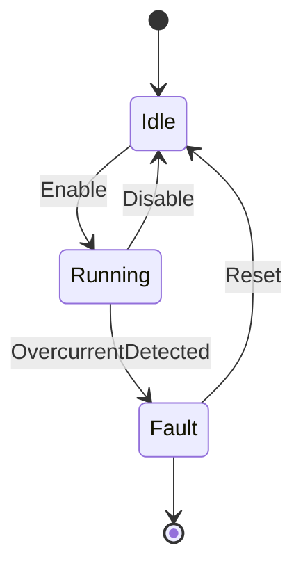
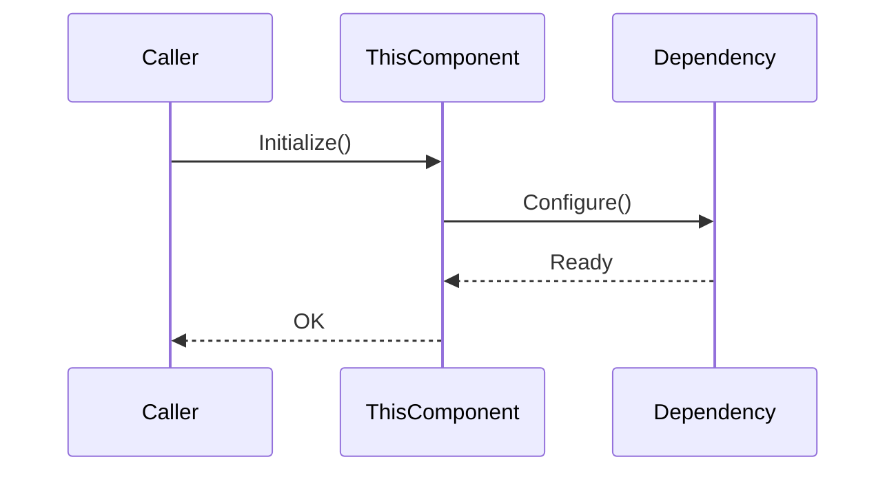
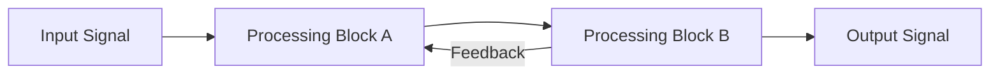

| Field     | Value            |
|-----------|------------------|
| Title     | Component Design |
| Type      | design           |
| Status    | draft            |
| Version   | 0.1.0            |
| Component | component-name   |
| Date      | YYYY-MM-DD       |

> **IMPORTANT — Implementation-blind document**: This document describes *behavior, structure, and
> responsibilities* WITHOUT referencing code. **No code blocks using programming languages (C++, C,
> Python, CMake, shell, etc.) are allowed.** Use Mermaid diagrams to express behavior instead.
> Prose descriptions of algorithms are encouraged; source-level details are not.
>
> **Diagrams**: All visuals must be either a Mermaid fenced code block (` ```mermaid `) or ASCII art inline
> in the document. External image references (``) are **not allowed**.

---

## Responsibilities

> State precisely what this component is responsible for and what it is explicitly NOT responsible for.
> A well-scoped responsibility statement prevents scope creep and clarifies ownership boundaries.
> Use a short bulleted list for each category.

**Is responsible for:**
- …

**Is NOT responsible for:**
- …

---

## Component Details

> Describe each logical part of the component: its purpose, its internal structure (if relevant), the
> decisions it makes, and its behavioral invariants. Focus on *what* and *why*, not *how it is coded*.
> One sub-section per major part.

### Part A — name

> Describe the purpose and behavior of this part.

### Part B — name

> Describe the purpose and behavior of this part.

---

## Interfaces

> Document every interface this component exposes (provided) and every interface it consumes (required).
> For each entry: name, direction, brief purpose, and any behavioral contract (ordering constraints,
> timing, error cases). No source-code signatures — describe in natural language or a table.

### Provided

| Interface | Purpose | Contract |
|-----------|---------|----------|
| …         | …       | …        |

### Required

| Interface | Purpose | Contract |
|-----------|---------|----------|
| …         | …       | …        |

---

<!-- OPTIONAL SECTIONS — include only when relevant; remove this comment in final documents -->

## Data Model

> Describe the logical data structures the component operates on: their fields, units, valid ranges,
> and relationships. Use tables or entity-relationship notation. No code.

| Entity | Field | Type / Unit | Range | Notes |
|--------|-------|-------------|-------|-------|
| …      | …     | …           | …     | …     |

---

## State Machine

> If the component has explicit states and transitions, model them here with a Mermaid state diagram.
> Label transitions with triggering events and guard conditions.



---

## Sequence Diagrams

> Show the temporal ordering of interactions for the most important scenarios (normal operation,
> initialization, fault handling). One diagram per scenario.



---

## Block Diagram

> Show the internal structure and data paths of the component using a block diagram.
> Label arrows with signal names and directions.



---

## Constraints & Limitations

> List known constraints, limitations, and edge cases that consumers of this component must be
> aware of. Include timing budgets, numerical precision limits, and capacity constraints.

| Constraint | Value / Description |
|------------|---------------------|
| …          | …                   |

---

## Open Questions

> Track unresolved design questions. For each, state the question, the options being considered,
> and any leaning or blockers.

| # | Question | Options | Status |
|---|----------|---------|--------|
| 1 | …        | …       | open   |
