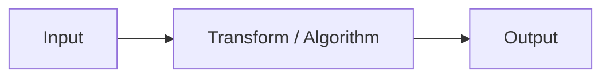

| Field     | Value           |
|-----------|-----------------|
| Title     | Theory Topic    |
| Type      | theory          |
| Status    | draft           |
| Version   | 0.1.0           |
| Component | component-name  |
| Date      | YYYY-MM-DD      |

> **Theory document**: Explains the mathematical and engineering principles behind a component or algorithm.
> This document is descriptive — it records the *why* and *how* at a scientific level, independent of any
> specific implementation. Equations use KaTeX ($inline$ and $$block$$). Block diagrams use Mermaid or
> ASCII art. Rendered plots may be generated by `documentation/tools/` scripts and referenced here.
>
> **Diagrams**: Prefer Mermaid (` ```mermaid `) and ASCII art for structural diagrams. For mathematical
> curves and waveforms, use generated images from `documentation/tools/` or ASCII approximations.

---

## Overview

> Briefly state: what physical or mathematical problem this document addresses, why it is needed in the
> context of motor control, and what the main result is (the key equation or algorithm).

---

## Prerequisites

> List the concepts, notation, and prior theory the reader must know to follow this document.
> Provide brief definitions or forward-references for any non-obvious symbols.

| Symbol | Meaning | Unit |
|--------|---------|------|
| …      | …       | …    |

---

## Mathematical Foundation

> Present the fundamental equations and models. Derive key results step-by-step. Use numbered equations
> and explain every variable. Distinguish assumptions from derived facts.

### Model / Setup

> Describe the physical or mathematical model (e.g. circuit model, coordinate frame, differential equation).

### Derivation

> Show the derivation of the key result. Each step should be justified.

### Key Results

> Summarise the final equations in a dedicated block for easy reference.

$$
\text{Key equation here}
$$

---

## Block Diagrams

> Show signal flow and system structure using Mermaid or ASCII art. At minimum provide one diagram.



---

## Numerical Properties

> Characterise the algorithm's numerical behaviour: stability, precision, complexity, convergence.

| Property    | Value / Condition |
|-------------|------------------|
| Complexity  | …                |
| Precision   | …                |
| Stability   | …                |
| Range       | …                |

> Describe sensitivities: what inputs or parameters most affect accuracy and how.

---

<!-- OPTIONAL SECTIONS — include only when relevant -->

## Worked Example

> Walk through one concrete numerical example from input to output. Use real motor parameters where
> possible (e.g. R = 1.2 Ω, L = 0.5 mH, p = 4 pole pairs).

## Limitations & Assumptions

> List explicitly what assumptions the theory makes and what scenarios it does NOT cover.

- **Assumes**: …
- **Does not handle**: …

## References

> Cite external sources (textbooks, papers, standards) that underpin this document.

1. …
