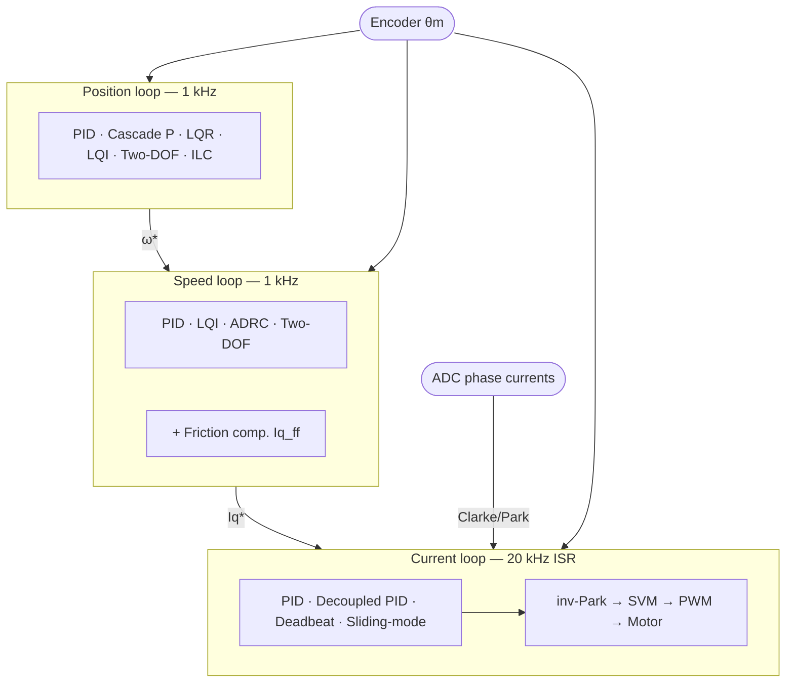

| Field     | Value                          |
|-----------|--------------------------------|
| Title     | Advanced FOC Controllers — Index |
| Type      | theory                         |
| Status    | draft                          |
| Version   | 0.2.0                          |
| Component | foc-controllers                |
| Date      | 2026-08-10                     |

---

## Overview

This index covers the state-of-the-art controller algorithms available for the three nested FOC
loops. Each loop has its own document. A shared plant-models document contains the mathematical
foundations (dq plant, mechanical plant, position plant, discretization) referenced by all three.

### Document Map

| Document | Content |
|----------|---------|
| [`foc-plant-models.md`](foc-plant-models.md) | PMSM current, speed, and position plant derivations; ZOH discretization |
| [`current-loop-controllers.md`](current-loop-controllers.md) | A1 Decoupled PID, A2 Deadbeat, A3 Sliding-mode |
| [`speed-loop-controllers.md`](speed-loop-controllers.md) | S1 LQI, S2 ADRC, S3 Two-DOF |
| [`position-loop-controllers.md`](position-loop-controllers.md) | P1 LQR/LQI, P2 Cascade P, P3 Two-DOF, P4 ILC, Friction compensation |

The runtime selection mechanism, heap-free storage, `std::visit` dispatch, state gating, CLI/CAN
interface, and NVM persistence are described in `documentation/design/controller-selection.md`.

---

## Mathematical Foundation

All controllers in this booklet derive from three plant models established in
`documentation/theory/foc-plant-models.md`:

| Plant | States | Input | Loop rate |
|-------|--------|-------|-----------|
| PMSM current (per axis, decoupled) | $i_d$, $i_q$ | normalised voltage $v'$ | 20 kHz |
| Mechanical speed | $\omega_m$ | $i_q^*$ | 1 kHz |
| Position (double integrator) | $\theta_m$, $\omega_m$ | $i_q^*$ | 1 kHz |

The RLS estimators provide $R_s$, $L_s$, $J$, $B_f$ that populate the discrete matrices
$A_d$, $B_d$ of each plant. Model-based controllers (LQR, LQI, Deadbeat, ADRC) are
reconfigured from the latest RLS snapshot each time they are selected, so gains track the
actual motor parameters without manual re-tuning.

---

## Algorithm Map

<!-- tikz:diagrams/algorithm-map.tex -->

<!-- /tikz -->

---

## Numerical Properties

**Current loop** — 20 kHz ISR, valid only for this loop:

| ID | Name | Key property | Requires |
|----|------|-------------|---------|
| — | PID (baseline) | Standard incremental PI | — |
| A1 | Decoupled PID | Cross-coupling + back-EMF feedforward | Rs, Ls, ψf |
| A2 | Deadbeat | 1–2 sample settling; maximum stiffness | Rs, Ls (tight RLS) |
| A3 | Sliding-mode | Robust to Rs/Ls mismatch | Rs, Ls |

**Speed loop** — 1 kHz handler, valid only for this loop:

| ID | Name | Key property | Requires |
|----|------|-------------|---------|
| — | PID (baseline) | Standard incremental PI | — |
| S1 | LQI | DARE-optimal gains from J, Bf | J, Bf (mech. RLS) |
| S2 | ADRC | Explicit load-disturbance cancellation | Kt, J |
| S3 | Two-DOF | Decoupled tracking / stiffness tuning | — |

**Position loop** — 1 kHz handler, valid only for this loop:

| ID | Name | Key property | Requires |
|----|------|-------------|---------|
| — | PID (baseline) | Standard incremental PD | — |
| P1 | LQR / LQI | DARE-optimal simultaneous θ, ω regulation | J, Bf (mech. RLS) |
| P2 | Cascade P→PI | Industry-standard; single Kv parameter | — |
| P3 | Two-DOF | Decoupled tracking / stiffness | — |
| P4 | ILC | Near-zero error on repetitive tasks | Trial length N |

**Augmentation** — independent of loop algorithm selection:

| Name | Applied to | Key property | Requires |
|------|-----------|-------------|---------|
| Friction compensation | Iq* (speed or position output) | Cancels Coulomb + Stribeck; eliminates hunting at rest | Friction ID (Tc, Ts, ωst) |

---

## Parameter Sources

| Source | Parameters | Available after |
|--------|-----------|-----------------|
| Motor datasheet | Pole pairs $p$, flux linkage $\psi_f$, peak current $I_{q,max}$ | Before first run |
| Electrical RLS | $R_s$, $L_s$, $V_{dc}$ | After electrical identification |
| Mechanical RLS | $J$, $B_f$, $K_t$ | After mechanical identification |
| Friction identification | $T_c$, $T_s$, $\omega_{st}$ | After dedicated friction sweep |

Current-loop algorithms A1–A3 become selectable after electrical identification. Speed and position
algorithms S1, S2, P1 additionally require mechanical identification. P2, P3, P4, and S3 require
neither and are always available once the motor is calibrated.

---

## References

Full reference lists are in each loop-specific document. Foundational references:

1. Krishnan, R. — *Permanent Magnet Synchronous and Brushless DC Motor Drives*, CRC Press, 2010.
2. Åström, K.J. & Wittenmark, B. — *Computer-Controlled Systems*, 3rd ed., Prentice Hall, 1997.
3. Han, J. — "From PID to Active Disturbance Rejection Control", *IEEE Trans. Ind. Electron.*,
   56(3):900–906, 2009.
4. Bristow, D.A. et al. — "A Survey of Iterative Learning Control",
   *IEEE Control Systems Magazine*, 26(3):96–114, 2006.
5. Armstrong-Hélouvry, B. et al. — "A Survey of Models … for Machines with Friction",
   *Automatica*, 30(7):1083–1138, 1994.
