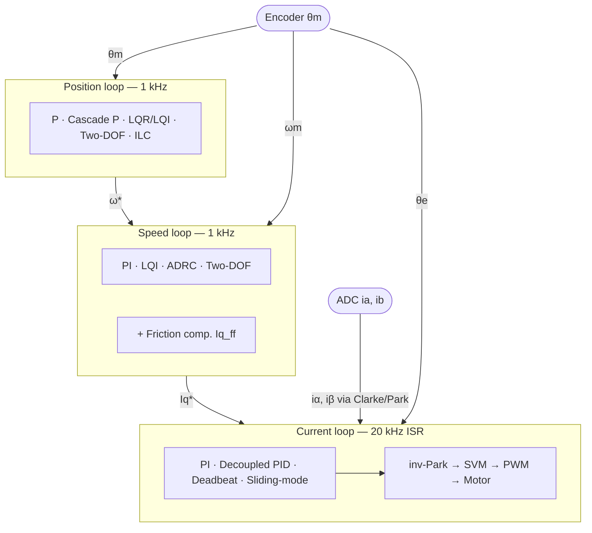

| Field     | Value                            |
|-----------|----------------------------------|
| Title     | Advanced FOC Controllers — Index |
| Type      | theory                           |
| Status    | draft                            |
| Version   | 0.3.0                            |
| Component | foc-controllers                  |
| Date      | 2026-08-31                       |

---

## Overview

This index covers the controller algorithms available for the three nested FOC loops. Each loop
exposes a runtime-selectable controller slot configured via CLI or CAN without a firmware rebuild.
Per-algorithm chapters contain the full mathematical foundation and design equations.

The shared plant models (dq current, mechanical speed, position) and discretisation are in
`documentation/theory/foc-plant-models.md`.

The runtime selection mechanism — heap-free variant storage, type-aware dispatch, state gating,
NVM persistence, and CLI/CAN interface — is in `documentation/design/controller-selection.md`.

---

## Algorithm Map

---

## Mathematical Foundation

All controllers derive from three plant models established in
`documentation/theory/foc-plant-models.md`:

| Plant                              | States                 | Input                   | Loop rate |
|------------------------------------|------------------------|-------------------------|-----------|
| PMSM current (per axis, decoupled) | $i_d$, $i_q$           | normalised voltage $v'$ | 20 kHz    |
| Mechanical speed                   | $\omega_m$             | $i_q^*$                 | 1 kHz     |
| Position (double integrator)       | $\theta_m$, $\omega_m$ | $i_q^*$                 | 1 kHz     |

Full derivations, ZOH discretisation, and parameter sources are in
`documentation/theory/foc-plant-models.md`. Per-algorithm design equations are in the
individual chapters listed in *Algorithm Index* below.

---

## Numerical Properties

Summary comparison across all loops — see each per-algorithm chapter for full detail.

**Current loop** — 20 kHz ISR:

| ID | Algorithm     | ISR cost | Robustness          | Requires RLS |
|----|---------------|----------|---------------------|--------------|
| —  | PI (baseline) | ~6 MACs  | High (integral)     | No           |
| A1 | Decoupled PID | ~10 MACs | Low (model-dep.)    | Partial      |
| A2 | Deadbeat      | ~4 MACs  | Low (exact model)   | Yes (tight)  |
| A3 | Sliding-mode  | ~12 MACs | High (gain-bounded) | Partial      |

**Speed loop** — 1 kHz handler:

| ID | Algorithm     | Ops/cycle | Disturbance rejection | Requires RLS |
|----|---------------|-----------|-----------------------|--------------|
| —  | PI (baseline) | ~6 MACs   | Integral quality      | No           |
| S1 | LQI           | 2 MACs    | Integral quality      | Yes (J, Bf)  |
| S2 | ADRC          | 6 MACs    | Explicit cancellation | Yes (Kt, J)  |
| S3 | Two-DOF       | ~8 MACs   | Integral quality      | No           |

**Position loop** — 1 kHz handler:

| ID | Algorithm    | Ops/cycle      | Steady-state error  | Requires RLS |
|----|--------------|----------------|---------------------|--------------|
| —  | P (baseline) | 2 MACs         | Zero at rest        | No           |
| P1 | LQR / LQI    | 4 MACs         | Zero (LQI)          | Yes (J, Bf)  |
| P2 | Cascade P    | 2 MACs         | Speed-loop dep.     | No           |
| P3 | Two-DOF      | ~8 MACs        | Configurable        | No           |
| P4 | ILC          | 2 MACs + array | Near-zero (learned) | No           |

---

## Algorithm Index

| Loop     | ID | Algorithm                   | File                                                           |
|----------|----|-----------------------------|----------------------------------------------------------------|
| Current  | —  | PI (baseline)               | [current-loop-pi.md](current-loop-pi.md)                       |
| Current  | A1 | Decoupled PID + Feedforward | [current-loop-decoupled-pid.md](current-loop-decoupled-pid.md) |
| Current  | A2 | Deadbeat                    | [current-loop-deadbeat.md](current-loop-deadbeat.md)           |
| Current  | A3 | Sliding-Mode                | [current-loop-sliding-mode.md](current-loop-sliding-mode.md)   |
| Speed    | —  | PI (baseline)               | [speed-loop-pi.md](speed-loop-pi.md)                           |
| Speed    | S1 | LQI                         | [speed-loop-lqi.md](speed-loop-lqi.md)                         |
| Speed    | S2 | ADRC                        | [speed-loop-adrc.md](speed-loop-adrc.md)                       |
| Speed    | S3 | Two-DOF                     | [speed-loop-two-dof.md](speed-loop-two-dof.md)                 |
| Position | —  | P (baseline)                | [position-loop-pid.md](position-loop-pid.md)                   |
| Position | P1 | LQR / LQI                   | [position-loop-lqr-lqi.md](position-loop-lqr-lqi.md)           |
| Position | P2 | Cascade P→PI                | [position-loop-cascade-p.md](position-loop-cascade-p.md)       |
| Position | P3 | Two-DOF                     | [position-loop-two-dof.md](position-loop-two-dof.md)           |
| Position | P4 | Iterative Learning Control  | [position-loop-ilc.md](position-loop-ilc.md)                   |
| Any      | —  | Friction Compensation       | [position-loop-friction.md](position-loop-friction.md)         |

---

## Parameter Sources

| Source                  | Parameters                                                      | Available after                 |
|-------------------------|-----------------------------------------------------------------|---------------------------------|
| Motor datasheet         | Pole pairs $p$, flux linkage $\psi_f$, peak current $I_{q,max}$ | Before first run                |
| Electrical RLS          | $R_s$, $L_s$, $V_{dc}$                                          | After electrical identification |
| Mechanical RLS          | $J$, $B_f$, $K_t$                                               | After mechanical identification |
| Friction identification | $T_c$, $T_s$, $\omega_{st}$                                     | After dedicated friction sweep  |

Current-loop algorithms A1–A3 become selectable after electrical identification. Speed and position
algorithms S1, S2, P1 additionally require mechanical identification. P2, P3, P4, and S3 require
neither and are always available once the motor is calibrated.

---

## References

Full reference lists are in each per-algorithm chapter. Foundational references:

1. Krishnan, R. — *Permanent Magnet Synchronous and Brushless DC Motor Drives*, CRC Press, 2010.
2. Åström, K.J. & Wittenmark, B. — *Computer-Controlled Systems*, 3rd ed., Prentice Hall, 1997.
3. Han, J. — "From PID to Active Disturbance Rejection Control", *IEEE Trans. Ind. Electron.*,
   56(3):900–906, 2009.
4. Bristow, D.A. et al. — "A Survey of Iterative Learning Control",
   *IEEE Control Systems Magazine*, 26(3):96–114, 2006.
5. Armstrong-Hélouvry, B. et al. — "A Survey of Models … for Machines with Friction",
   *Automatica*, 30(7):1083–1138, 1994.
