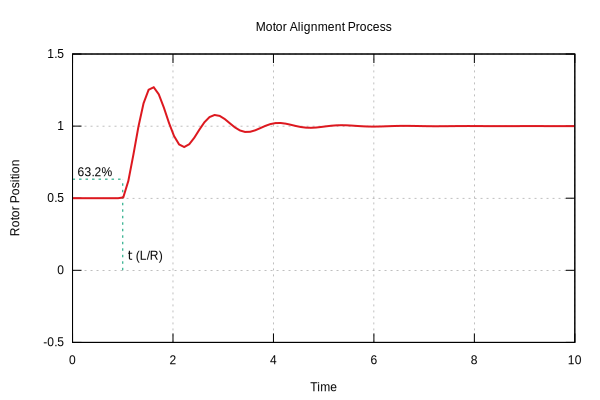

# Motor Alignment

This document explains the theory and implementation of the motor alignment process in `e-foc`. Correct alignment is crucial for Field-Oriented Control (FOC) to ensure the electrical angle matches the mechanical rotor position.

## Theory

Field-Oriented Control requires precise knowledge of the rotor's magnetic flux angle (electrical angle). However, incremental encoders or relative position sensors do not provide absolute position at startup.

### The Alignment Principle
To find the zero angle offset, we force the motor to a known electrical position. By applying a fixed DC voltage vector to the stator (typically aligned with Phase A, i.e., electrical angle $0$), the rotor's magnetic field will naturally align itself with the stator's magnetic field.

Once the rotor settles at this "forced" position, we know that the current **electrical angle is 0** (or the specific angle we applied). Reading the encoder at this moment gives us the **offset** current mechanical reading that corresponds to electrical zero.



$$ \theta_{electrical} = (\theta_{mechanical} - \theta_{offset}) \times N_{polepairs} $$

## Implementation Details

The implementation is found in [source/services/alignment/MotorAlignmentImpl.cpp](../../source/services/alignment/MotorAlignmentImpl.cpp).

### Algorithm

```mermaid
graph TD
    A[Start ForceAlignment] -->|Check Re-entrancy| B{Busy?}
    B -->|Yes| C[Return]
    B -->|No| D[Set Voltage Vector Limit]
    D --> E[Apply Vector at Angle 0]
    E --> F{Control Loop}
    F -->|Sample Position| G[Calc Delta]
    G -->|Delta < Threshold| H[Increment Stable Counter]
    G -->|Delta > Threshold| I[Reset Stable Counter]
    H --> J{Stable Count reached?}
    J -->|No| F
    J -->|Yes| K[Capture Offset]
    K --> L[Callback(Offset)]
```

1.  **Configuration**: Accepts a target voltage percentage and a settlement criteria.
2.  **Force Voltage**:
    *   The SVM (Space Vector Modulation) is used to generate a voltage vector at `alignmentAngle` (typically 0.0 radians).
    *   Uses `Inverse` Park/Clarke transforms to generate PWM duty cycles for this static vector.
3.  **Wait for Settlement**:
    *   The encoder position is monitored periodically.
    *   The system checks if the change in position between samples is less than `settledThreshold`.
    *   It requires `consecutiveSettledSamples` to confirm the rotor has stopped moving.
4.  **Capture Offset**:
    *   Once settled, the current encoder value is recorded as the `alignedPosition`.
    *   Verify the direction/pole-pairs multiplication to convert this mechanical position to the correct electrical offset.

### Re-entrancy Protection
The service includes protection against multiple calls. If `ForceAlignment` is called while an alignment is already in progress, the new request is ignored to ensure the callback for the original request is honored correctly.
