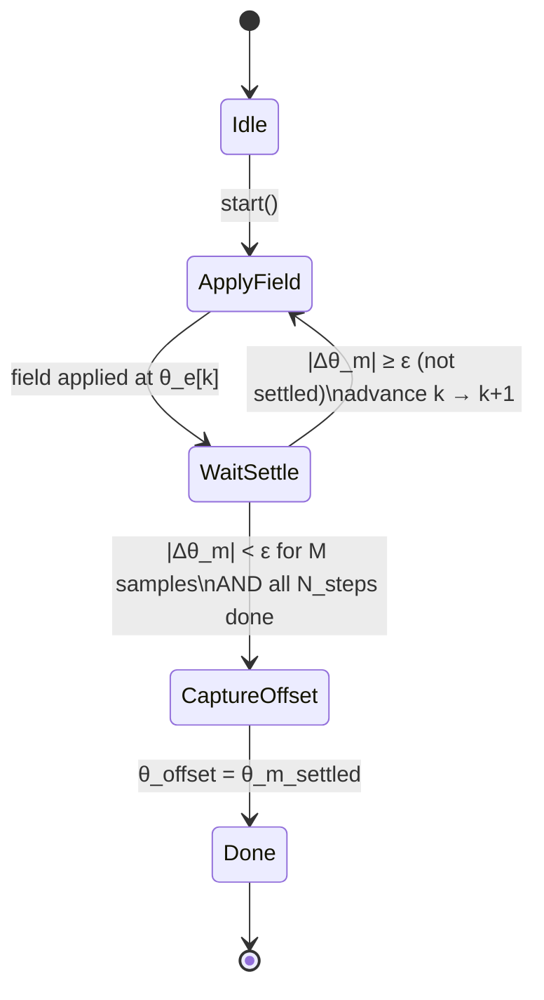

| Field     | Value                                            |
|-----------|--------------------------------------------------|
| Title     | Motor Alignment — Encoder Zero-Point Calibration |
| Type      | theory                                           |
| Status    | approved                                         |
| Version   | 1.0.0                                            |
| Component | service-alignment                                |
| Date      | 2025-01-01                                       |

## Overview

Motor alignment establishes the correspondence between the incremental encoder position and the
electrical rotor angle $\theta_e$. An incremental encoder measures mechanical shaft rotation from a
relative zero point that is arbitrary at power-on. FOC requires the absolute electrical angle to compute
the Clarke–Park transform correctly. Without calibration, the angle error $\Delta\theta$ between the
assumed and actual rotor position causes cross-coupling between the d and q axes, degrading torque
production and potentially causing instability.

The alignment procedure forces the rotor to a known electrical position by applying a stator field at
a fixed electrical angle (typically $\theta_e = 0$). The encoder reading at the settled position becomes
the **alignment offset** $\theta_{offset}$. All subsequent angle calculations subtract this offset:

$$
\theta_e = p \cdot (\theta_m - \theta_{offset})
$$

---

## Prerequisites

| Symbol            | Meaning                                                     | Unit      |
|-------------------|-------------------------------------------------------------|-----------|
| $p$               | Number of pole pairs                                        | —         |
| $\theta_m$        | Mechanical angle from encoder (raw counts / 2π or rad)      | rad       |
| $\theta_e$        | Electrical angle used by FOC                                | rad       |
| $\theta_{offset}$ | Encoder reading when rotor is at $\theta_e = 0$             | rad       |
| $\delta$          | Misalignment angle = $\theta_e - \theta_r$ (field vs rotor) | rad       |
| $K_T$             | Motor torque constant ($\tau = K_T \cdot i_q$)              | N·m/A     |
| $J$               | Rotor moment of inertia                                     | kg·m²     |
| $B$               | Viscous friction coefficient                                | N·m·s/rad |
| $N_{steps}$       | Number of alignment steps per revolution                    | —         |

---

## Mathematical Foundation

### 1. Physical Principle — Reluctance Torque at Start

A PMSM permanent magnet rotor experiences a torque whenever the stator magnetic field is not aligned
with the rotor d-axis. Applying a constant stator current at electrical angle $\theta_e^{field}$ produces a
stator MMF (magnetomotive force) at that electrical angle in the air gap. The interaction with the rotor's
permanent magnet flux creates a synchronising torque:

$$
\tau_{sync} = -K_T \cdot I_d^{field} \cdot \sin(\theta_e^{field} - \theta_r)
= -K_{mag} \cdot \sin(\delta)
$$

where $\delta = \theta_e^{field} - \theta_r$ is the angle between the stator field and the rotor d-axis
(the north pole of the permanent magnet), and $K_{mag} > 0$ is a motor-dependent constant.

This is the classical restoring torque of a synchronous machine: $\tau = -K_{mag}\sin(\delta)$.

**Equilibrium**: $\tau_{sync} = 0$ when $\delta = 0$ or $\delta = \pi$. The stable equilibrium is $\delta = 0$,
i.e. the rotor d-axis aligns with the applied stator field. The $\delta = \pi$ equilibrium is unstable.

### 2. Rotor Settling Dynamics

The rotor motion during alignment is governed by the Newton-Euler equation:

$$
J \ddot{\theta}_r + B \dot{\theta}_r = \tau_{sync} = -K_{mag} \sin(\theta_e^{field} - \theta_r)
$$

Linearising around the equilibrium $\theta_r \rightarrow \theta_e^{field}$ (small $\delta$, $\sin\delta \approx \delta$):

$$
J \ddot{\delta} + B \dot{\delta} + K_{mag}\, \delta = 0
$$

This is a damped second-order system with:

$$
\omega_n = \sqrt{\frac{K_{mag}}{J}}, \qquad \zeta = \frac{B}{2\sqrt{K_{mag} J}}
$$

Typical PMSM rotor assemblies are underdamped ($\zeta < 1$), so the rotor overshoots and oscillates
before settling. The free response is:

$$
\delta(t) = \delta_0 \cdot e^{-\zeta\omega_n t}
\left[\cos(\omega_d t) + \frac{\zeta}{\sqrt{1-\zeta^2}}\sin(\omega_d t)\right],
\qquad \omega_d = \omega_n\sqrt{1-\zeta^2}
$$

See: `documentation/theory/images/alignment_settling.svg` (generated by `documentation/tools/generate_plots.gp`)

### 3. Multi-Step Alignment Sweep

A single-step alignment (apply field at $\theta_e = 0$ from any starting position) may land in the
wrong stable equilibrium for interior PMSM motors with magnetic saliency, or may expose the rotor to
high impulsive currents. The multi-step procedure sweeps the field through a full electrical revolution
in $N_{steps}$ increments:

$$
\theta_e^{step}[k] = k \cdot \frac{2\pi}{N_{steps}}, \qquad k = 0, 1, \ldots, N_{steps}-1, N_{steps}
$$

For $N_{steps} = 12$:

$$
\Delta\theta_{step} = \frac{2\pi}{12} = 30°
$$

The sweep covers exactly one full electrical revolution (360° electrical), which corresponds to
$360°/p$ mechanical. With 12 steps the rotor is dragged in 30° increments, limiting the magnetic
energy per step and ensuring the rotor follows the field rather than jumping to a remote equilibrium.

**Total alignment angle traversed**: $2\pi$ electrical = $2\pi/p$ mechanical.

### 4. Settlement Detection

After applying each field step (and after the final step at $\theta_e = 0$), the controller waits for
the rotor to settle. Settlement is detected by a **position-change threshold window**:

> "The rotor is considered settled when the absolute change in encoder position over the last
> $N_{window}$ samples is smaller than $\epsilon_{threshold}$."

Formally, let $\theta_m[n]$ be the encoder reading at sample $n$. Settlement at step $k$ occurs when:

$$
\left|\theta_m[n] - \theta_m[n - N_{window}]\right| < \epsilon_{threshold}
$$

for $M$ consecutive checks. If the condition is not met, the counter resets.

This is equivalent to monitoring the first difference of the encoder signal and waiting for it to
remain within a dead-band. The window length $N_{window}$ must be selected to be longer than the
half-period of the damped oscillation: $N_{window} > T_d / T_s = 2\pi / (\omega_d T_s)$.

### 5. Alignment Offset Calculation

Once the motor has settled with the stator field at $\theta_e^{field} = 0$, the encoder reading
$\theta_m^{settled}$ corresponds to the rotor d-axis being at mechanical angle $\theta_m^{settled}$.
This reading is recorded as the alignment offset:

$$
\theta_{offset} = \theta_m^{settled}
$$

During normal FOC operation the corrected electrical angle is:

$$
\theta_e = p \cdot (\theta_m - \theta_{offset}) \pmod{2\pi}
$$

This ensures $\theta_e = 0$ when the rotor is at its original settled position.

### 6. Torque Production with Angle Error

If the alignment offset is incorrect by $\Delta\theta$ (in mechanical radians), then the electrical
angle error is $p \cdot \Delta\theta$. The effective torque is reduced:

$$
\tau_{actual} = K_T \cdot i_q \cdot \cos(p \cdot \Delta\theta)
$$

For example, a $10°$ mechanical offset with $p = 4$ gives a $40°$ electrical error, reducing torque
to $\cos(40°) \approx 77\%$ of its potential. The d-axis also receives unwanted excitation,
potentially demagnetising the permanent magnets under sustained high current.

---

## Block Diagrams

### Alignment State Machine


```mermaid
stateDiagram-v2
    [*] --> Idle
    Idle --> ApplyField : start()
    ApplyField --> WaitSettle : field applied at θ_e[k]
    WaitSettle --> ApplyField : |Δθ_m| ≥ ε (not settled)\nadvance k → k+1
    WaitSettle --> CaptureOffset : |Δθ_m| < ε for M samples\nAND all N_steps done
    CaptureOffset --> Done : θ_offset = θ_m_settled
    Done --> [*]
```

### Multi-Step Sweep (12 steps, p = 4)

```
Electrical angle steps (30° each):
  0°  →  30°  →  60°  →  90°  →  120°  →  150°  →  180°
  ↓
  210°  →  240°  →  270°  →  300°  →  330°  →  360° (= 0°)

Each step: apply i_d field, wait for rotor to settle, advance.
Final step (360°=0°): rotor at θ_m_settled → θ_offset := θ_m_settled.
```

### Settling Signal (ASCII representation)

```
  │
1.0├──────────────────────────────── target (aligned position)
   │          ╭──────╮
 0.9│         ╱       ╲    ╭──────╮
   │        ╱           ╲ ╱       ╲_______________
 0.5│       ╱             ╳
   │      ╱
 0.0├─────╱
   └──────────────────────────────────────────→ time
          ↑            settlement window
          step applied
```

---

## Numerical Properties

| Property             | Value / Condition                                                          |
|----------------------|----------------------------------------------------------------------------|
| Steps per revolution | 12 (30° electrical per step)                                               |
| Angular step size    | $2\pi/12 \approx 0.524\ \text{rad}$ electrical                             |
| Detection threshold  | Position change $< \epsilon_{threshold}$ per check                         |
| Consecutive checks   | $M$ samples below threshold before declaring settled                       |
| Offset precision     | Limited by encoder resolution (e.g. ±0.5 count)                            |
| Torque cost          | Alignment uses $i_d$ only → zero torque, no motion intended                |
| Worst-case duration  | $N_{steps} \times T_{settle}$ where $T_{settle} \approx 5/(\zeta\omega_n)$ |

---

## Limitations & Assumptions

- **Assumes**: The stator field is strong enough to overcome static friction and drag the rotor.
  For very low currents, the rotor may not follow.
- **Assumes**: The rotor reaches the stable equilibrium ($\delta = 0$), not the unstable one ($\delta = \pi$).
  Large initial misalignment or very low damping can cause incorrect convergence.
- **Assumes**: Negligible cogging torque relative to $K_{mag} \cdot I_{align}$. High cogging torque
  motors may require a higher alignment current.
- **Does not handle**: Repeated alignment without re-energising (thermal state must be considered).
- **Does not handle**: Distribution of alignment offset across multiple electrical periods for motors
  where $p > 1$ and the mechanical step may span more than one electrical revolution.

## References

1. Mohan, N. — *Advanced Electric Drives: Analysis, Control and Modeling using MATLAB/Simulink*, Wiley, 2014.
2. Schroedl, M. — "Sensorless control of AC machines at low speed and standstill based on the INFORM method",
   *Industry Applications Conference*, 1996.
