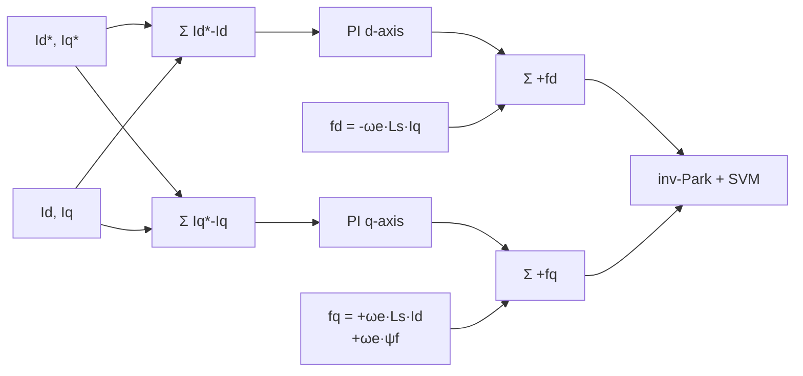

| Field     | Value                    |
|-----------|--------------------------|
| Title     | Current Loop Controllers |
| Type      | theory                   |
| Status    | draft                    |
| Version   | 0.6.0                    |
| Component | current-loop-controllers |
| Date      | 2026-08-17               |

> **Theory document**: Explains the mathematical and engineering principles behind a component or algorithm.
> This document is descriptive — it records the *why* and *how* at a scientific level, independent of any
> specific implementation. Equations use KaTeX ($inline$ and $$block$$). Block diagrams use Mermaid or
> ASCII art.

---

## Overview

This document covers the three advanced current-loop controller algorithms that replace or augment
the standard PI current regulator described in `documentation/theory/foc.md` Section 6.

**Plant model prerequisite**: All controllers in this document operate on the discrete per-axis
decoupled RL plant derived in `documentation/theory/foc-plant-models.md` Section 1:

$$
i[k+1] = A_d^i \cdot i[k] + B_d^i \cdot v'[k]
$$

with $A_d^i = e^{-R_s T_s^i / L_s}$ and $B_d^i = (1 - A_d^i)/R_s$.

| Algorithm                        | Key Advantage                                                 |
|----------------------------------|---------------------------------------------------------------|
| A1 — Decoupled PID + feedforward | Removes cross-axis coupling at high speed; reuses existing PI |
| A2 — Deadbeat                    | Minimum settling time (1–2 samples); maximum servo stiffness  |
| A3 — Sliding-mode                | Robust to Rs/Ls mismatch; suitable before RLS has converged   |

All three operate exclusively in the **20 kHz FOC ISR**. They are not valid for the speed or
position loops.

---

## Prerequisites

| Symbol               | Meaning                                | Unit       |
|----------------------|----------------------------------------|------------|
| $A_d^i, B_d^i$       | Discrete current plant matrices        | —          |
| $v_d^{PI}, v_q^{PI}$ | PI controller outputs (decoupled axes) | normalised |
| $\phi$               | Sliding-mode boundary layer width      | A          |
| $K_{sw}$             | Sliding-mode switching gain            | A          |

See `documentation/theory/foc-plant-models.md` for all base symbols.

---

## Mathematical Foundation

All three algorithms in this document operate on the **decoupled per-axis RL plant** derived in
`documentation/theory/foc-plant-models.md` Section 1. After feedforward decoupling the d- and
q-axis current dynamics each reduce to an independent first-order system:

$$
i[k+1] = A_d^i \cdot i[k] + B_d^i \cdot v'[k]
$$

with the discrete matrices obtained by exact zero-order-hold discretisation of the RL plant:

$$
A_d^i = e^{-R_s T_s^i / L_s}, \qquad B_d^i = \frac{1 - A_d^i}{R_s}
$$

which reduce to the familiar first-order approximations $A_d^i \approx 1 - R_s T_s^i / L_s$ and
$B_d^i \approx T_s^i / L_s$ when $R_s T_s^i \ll L_s$. The exact form is the one implemented, because
it stays accurate for the high $R_s T_s / L_s$ ratios that small-inductance motors produce.

A1 derives the feedforward law that recovers this decoupled plant from the coupled PMSM voltage
equations and then applies a standard PI. A2 (Deadbeat) inverts this plant model directly and
therefore applies the **same A1 feedforward** to its inversion result — an exact plant inversion is
only exact once the coupling it does not model has been cancelled. A3 (Sliding-mode) deliberately
omits the feedforward and treats the residual coupling and noise as a bounded disturbance covered by
the switching gain $K_{sw}$; that robustness is the reason to select it before RLS has converged.

---

## A1 — Decoupled PID + Feedforward

**Motivation**: Plain PI controllers treat the cross-coupling terms $\omega_e L_s i_q$ and
$-\omega_e L_s i_d$ as disturbances. At high electrical speed $\omega_e$, the coupling voltage
becomes large relative to the RL drive voltage, reducing effective PI bandwidth and introducing
cross-axis torque ripple. Explicit cancellation restores full PI bandwidth independently of speed.

**Feedforward law**: The total applied voltage cancels coupling before presenting the decoupled RL
plant to the PI regulator:

$$
\boxed{v_d = v_d^{PI} - \omega_e L_s i_q}
$$
$$
\boxed{v_q = v_q^{PI} + \omega_e L_s i_d + \omega_e \psi_f}
$$

After applying these voltages, both axes reduce to the independent RL plant and the PI controllers
are designed identically to the standard case.

**Normalisation**: Feedforward terms are scaled to the same normalised unit as the PI output
(normalisation scale $\sqrt{3}/V_{dc}$):

$$
f_d = -\omega_e L_s i_q \cdot \frac{\sqrt{3}}{V_{dc}}, \qquad
f_q = (\omega_e L_s i_d + \omega_e \psi_f) \cdot \frac{\sqrt{3}}{V_{dc}}
$$

**Gain design**: PI gains are identical to the pole-zero cancellation design in
`documentation/theory/foc.md` Section 6. The feedforward is additive and does not change the
closed-loop transfer function.

**RLS dependency**: $L_s$ from the electrical RLS estimator. $\psi_f$ is a motor constant calibrated
during alignment. $V_{dc}$ is measured dynamically.

**Performance**: At $\omega_e = 1000$ rad/s with $L_s = 0.5$ mH and $i_q = 5$ A, the uncorrected
coupling is $\omega_e L_s i_q = 2.5$ V — 10% of a 24 V bus. This is the dominant current control
error at speed for an uncompensated PI.

<!-- tikz:diagrams/current-loop-a1-feedforward.tex -->

<!-- /tikz -->

---

## A2 — Deadbeat Current Control

**Motivation**: Deadbeat control inverts the discrete plant model to compute the exact voltage that
drives the current to its reference in one sampling step — the minimum physically achievable settling
time (50 µs at 20 kHz). This maximises servo stiffness: the torque response is instantaneous relative
to any outer loop, so load disturbances are rejected before position error can accumulate.

**One-step control law**: Setting $i[k+1] = i^*$ and solving for $v'$:

$$
\boxed{v'[k] = \frac{i^* - A_d^i\, i[k]}{B_d^i}}
$$

The result is clamped to $[-1,\,1]$ (normalised). When the step demand exceeds available voltage,
settling takes more than one sample but remains optimal for the available headroom.

**Two-step variant** (noise robustness): The one-step law amplifies measurement noise by
$1/B_d^i = L_s/T_s^i$, which is large for small inductances. The two-step law solves for the
**minimum-norm input sequence** over a two-sample horizon and applies its first element, with the
reference gain corrected so that the closed loop retains unity DC gain:

$$
v'[k] = \frac{\left((A_d^i)^2 - A_d^i + 1\right) i^* - (A_d^i)^3\, i[k]}{B_d^i\left((A_d^i)^2 + 1\right)}
$$

This reduces the state gain — and hence noise amplification — by roughly half.

**Receding-horizon behaviour**: because only the first element of the sequence is applied and the
solution is recomputed every sample, the two-step law does *not* settle in exactly two samples. The
closed-loop pole is $A_d^i/\left((A_d^i)^2+1\right)$, giving a geometric rather than deadbeat
response. Tracking is nonetheless exact in steady state: the reference gain is obtained by solving

$$
B_d^i\, g_{ref} = 1 - A_d^i + B_d^i\, g_{state}
$$

which forces unity DC gain. Taking the raw minimum-norm reference gain instead leaves a static error
of $A_d^i/\left((A_d^i)^2 - A_d^i + 1\right)$ — around 1% at $A_d^i = 0.90$ and 20% at $0.61$ —
which is worst in the small-$L_s$ regime the variant targets.

The one-step law is unaffected — it places the closed-loop pole at the origin and tracks exactly.

**Model accuracy requirement**: A 10% $L_s$ error leaves a 10% residual error after one step.
Deadbeat is the natural progression after Decoupled PID has validated RLS convergence.

**Decoupling**: the inversion above solves the decoupled plant, so the A1 feedforward terms are
added to $v'$ before the modulation-circle limit. Without them $\omega_e L_s i_q$ enters as an
unmodelled disturbance and the one-step settling property is lost at speed.

**Normalisation**: $v'[k]$ (physical volts) normalised identically to the PI output:
$v'_{norm}[k] = v'[k] \cdot \sqrt{3}/V_{dc}$.

**Tuning**: None — fully determined by $A_d^i, B_d^i$ from RLS. Only design choice: one-step vs.
two-step variant.

---

## A3 — Sliding-Mode Current Control

**Motivation**: The sliding-mode controller (SMC) is robust to model uncertainty — the most critical
early in operation before RLS has converged and during thermal transients that shift $R_s$. The SMC
drives the current error onto a stable sliding surface regardless of parameter mismatch, within a
defined gain margin.

**Sliding surface**: For each axis independently, defined on the tracking error
$e = i - i^*$:

$$
s_d = i_d - i_d^*, \qquad s_q = i_q - i_q^*
$$

The surface $s = 0$ is the desired zero-error manifold. This is the sign convention the toolbox
`SlidingModeControl` uses, and it is the one implemented.

**Discrete equivalent control**: The voltage that would maintain $s[k+1] = 0$. With the plant
$i[k+1] = A_d^i i[k] + B_d^i u[k]$ the error propagates as
$e[k+1] = A_d^i e[k] + B_d^i u[k] + (A_d^i - 1) i^*[k]$, so holding the surface needs the error term
*and* the voltage that sustains the reference itself:

$$
\boxed{u_{eq}[k] = -\frac{A_d^i}{B_d^i} \cdot e[k] + \frac{1 - A_d^i}{B_d^i} \cdot i^*[k]}
$$

Because $B_d^i = (1 - A_d^i)/R_s$, the second term is exactly $R_s i^*[k]$ — the resistive drop the
reference current requires. Omitting it leaves a standing error
$e_\infty = (A_d^i - 1) i^* / (1 + K_{sw}/\phi)$, which this controller has no integral action to
remove.

**Switching control**: Drives the state onto the surface:

$$
u_{sw}[k] = -\frac{K_{sw}}{B_d^i} \cdot \mathrm{sat}\!\left(\frac{e[k]}{\phi}\right)
$$

where $\mathrm{sat}(x) = \mathrm{clamp}(x,-1,1)$. The boundary layer $\phi > 0$ replaces the
discontinuous sign function with saturation to prevent chattering. Both terms carry a leading minus
sign because the error is measured as $i - i^*$: a current below its reference gives $e < 0$ and
must command a *positive* voltage.

**Total control law**:

$$
u[k] = u_{eq}[k] + u_{sw}[k]
$$

**Parameter choices**:
- $K_{sw}$: must exceed the worst-case disturbance. Because $u_{sw}$ is obtained by dividing by
  $B_d^i$, the gain carries the same unit as the sliding surface (A). Sizing it so the switching
  term commands at most 30% of the maximum phase voltage $V_{dc}/\sqrt{3}$ gives the starting point:
  $K_{sw} = 0.3 \cdot B_d^i \cdot V_{dc} / \sqrt{3}$.
- $\phi$: boundary layer width (A). Typical: $0.1$–$0.5$ A. Smaller gives tighter tracking but
  more high-frequency actuation.

**Discrete stability constraint** — this bounds both parameters together and is not optional. Inside
the boundary layer $\mathrm{sat}(e/\phi) = e/\phi$, so the equivalent term cancels the plant pole and
the closed-loop error obeys

$$
e[k+1] = -\frac{K_{sw}}{\phi}\, e[k]
$$

The error therefore contracts **only if $K_{sw} < \phi$**. A ratio at or above unity makes the
discrete loop diverge no matter how the equivalent term is computed, so the sizing rule above must be
capped by this constraint. The shipped defaults are $K_{sw} = 0.2$ A and $\phi = 0.5$ A, a ratio of
$0.4$.

**Robustness**: Insensitive to $R_s/L_s$ mismatch as long as mismatch is bounded by $K_{sw}$.
Covers $\pm 50\%$ thermal variation in $R_s$ and the initial RLS convergence transient.

**Relation to toolbox**: `SlidingModeControl<float,1,1>` implements equivalent + switching with
boundary-layer saturation on the error alone; the equilibrium term $R_s i^*$ is added by
`SlidingModeCurrentController`. Plant matrices $A_d^i, B_d^i$ are constructed from RLS estimates.

---

## Numerical Properties

| Property                  | PID (baseline)  | Dec-PID (A1)        | Deadbeat (A2)          | SMC (A3)            |
|---------------------------|:---------------:|:-------------------:|:----------------------:|:-------------------:|
| ISR cost (ops)            | ~6 MACs         | ~10 MACs            | ~4 MACs                | ~12 MACs            |
| Settling time             | ~1/ωbw          | ~1/ωbw              | 1–2 samples            | ~1/ωbw              |
| Robustness to Rs/Ls error | High (integral) | Low (FF model-dep.) | Low (exact model req.) | High (gain-bounded) |
| Requires ψf               | No              | Yes                 | No                     | No                  |
| Requires RLS convergence  | No              | Partial             | Yes (tight)            | Partial             |
| Tuning knobs              | 3               | 1 (ωbw)             | 0 (variant choice)     | 2 (Ksw, φ)          |

### Cycle Budget

The 20 kHz inner-loop budget is 4 500 cycles at 120 MHz for the full `Calculate()`
path (Clarke + Park + controller + inv-Park + SVM).

- A1 feedforward additions: ~8–12 MAC cycles — fits comfortably.
- A2 deadbeat: ~4 MAC cycles — cheapest of the advanced controllers.
- A3 SMC equivalent + switching: ~12–15 MAC cycles — fits within budget.

---

## Output Voltage Limit

Every controller in this document emits a normalised dq voltage pair that is handed to inverse Park
and then to SVM. The modulator stays linear only inside the circle inscribed in the voltage hexagon
(`documentation/theory/foc.md` Section 8):

$$
\sqrt{(v_d')^2 + (v_q')^2} \leq 1
\qquad \Longleftrightarrow \qquad
\sqrt{v_d^2 + v_q^2} \leq \frac{V_{dc}}{\sqrt{3}}
$$

This is a **circular** constraint on the vector, not an independent bound per axis. Clamping $v_d'$
and $v_q'$ separately to $[-1, 1]$ admits vectors of magnitude up to $\sqrt{2}$; at that corner the
duty cycles saturate over roughly three-quarters of the electrical period, distorting both the
magnitude and the angle of the applied voltage.

When the demand exceeds the circle, both components are scaled by $1/\lVert v' \rVert$. This
preserves the voltage **angle** and therefore the direction of the resulting current vector,
sacrificing only magnitude. The alternative — d-axis priority, granting the q-axis the residual
$\sqrt{1 - (v_d')^2}$ — preserves flux at the expense of the angle and is the preferred scheme once
field weakening is introduced.

**Interaction with integral action**: scaling the output below what the PI computed leaves the
integrator holding an unrealisable value. The incremental PI form bounds this inherently — its
accumulated output is itself clamped to $[-1, 1]$ per axis — so the windup is limited to the
difference between the box and the circle, and unwinds as soon as the demand returns inside the
circle. Controllers without integral action (Deadbeat, Sliding-mode) are unaffected.

---

## Limitations & Assumptions

**All current controllers**:
- Assume electrical angle $\theta_e$ is accurate. Angle errors couple directly into the dq frame.
- Assume balanced three-phase operation ($i_a + i_b + i_c = 0$).
- Require the current loop bandwidth $\omega_{bw}^{current} \geq 10 \times \omega_{bw}^{speed}$
  (cascade separation principle).
- Output the normalised voltage vector subject to the SVM linear-region constraint
  $\sqrt{(v_d')^2 + (v_q')^2} \leq 1$ — see *Output Voltage Limit* above. A per-axis clamp is **not**
  equivalent and permits up to $\sqrt{2}$, driving the modulator deep into over-modulation.

**A1 — Decoupled PID**:
- Feedforward accuracy proportional to $L_s$ accuracy: 20% $L_s$ error leaves 20% residual coupling.
- Requires $\psi_f$ for back-EMF cancellation on q-axis. $\psi_f$ is set at alignment and not
  updated online.

**A2 — Deadbeat**:
- Most sensitive to $L_s$ error of all current controllers. Do not activate until electrical RLS has
  converged (typically after the first few seconds of operation under load).
- The two-step variant halves noise amplification and still tracks exactly, but gives up deadbeat
  settling for a geometric response with pole $A_d^i/\left((A_d^i)^2+1\right)$. Prefer it for noisy
  current measurement or small $L_s$; prefer one-step for maximum servo stiffness.

**A3 — Sliding-mode**:
- Boundary layer $\phi$ introduces a steady-state band proportional to $\phi / K_{sw}$. Set $\phi$
  small enough that this band is below ADC resolution.
- $K_{sw}$ must exceed the worst-case disturbance; undersizing prevents reaching the sliding surface.

---

## References

1. Krishnan, R. — *Permanent Magnet Synchronous and Brushless DC Motor Drives*, CRC Press, 2010.
2. Utkin, V. — *Sliding Modes in Control and Optimization*, Springer, 1992.
   (Equivalent control; boundary-layer chattering suppression.)
3. Åström, K.J. & Wittenmark, B. — *Computer-Controlled Systems*, 3rd ed., Prentice Hall, 1997.
