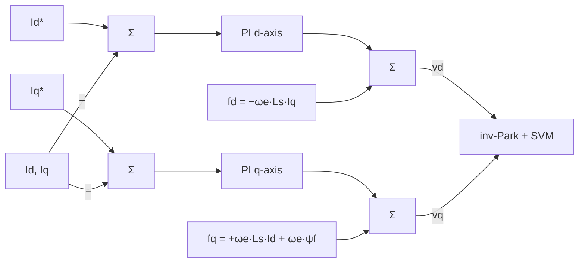

| Field     | Value                                     |
|-----------|-------------------------------------------|
| Title     | Current Loop — A1: Decoupled PID + Feedforward |
| Type      | theory                                    |
| Status    | draft                                     |
| Version   | 1.0.0                                     |
| Component | current-loop-decoupled-pid                |
| Date      | 2026-08-31                                |

> **Theory document**: Explains the mathematical and engineering principles behind a component or algorithm.
> This document is descriptive — it records the *why* and *how* at a scientific level, independent of any
> specific implementation. Equations use KaTeX ($inline$ and $$block$$). Block diagrams use Mermaid or
> ASCII art.

---

## Overview

A1 augments the baseline PI current controller with an explicit feedforward that cancels the
cross-axis coupling terms $\omega_e L_s i_q$ and $\omega_e L_s i_d$ and the back-EMF disturbance
$\omega_e \psi_f$. At high electrical speed $\omega_e$, these coupling voltages become large relative
to the RL drive voltage, reducing effective PI bandwidth and introducing cross-axis torque ripple.
Explicit cancellation restores full PI bandwidth independently of speed.

Operates exclusively in the **20 kHz FOC ISR**. Requires electrical RLS estimates ($L_s$, $R_s$)
and the motor constant $\psi_f$.

---

## Prerequisites

| Symbol               | Meaning                                       | Unit       |
|----------------------|-----------------------------------------------|------------|
| $A_d^i, B_d^i$       | Discrete current plant matrices               | —          |
| $v_d^{PI}, v_q^{PI}$ | PI controller outputs (decoupled axes)        | normalised |
| $\omega_e$           | Electrical angular velocity                   | rad/s      |
| $L_s$                | Stator inductance                             | H          |
| $\psi_f$             | Permanent magnet flux linkage                 | Wb         |
| $V_{dc}$             | DC bus voltage                                | V          |

See `documentation/theory/foc-plant-models.md` for all base symbols.
See `documentation/theory/current-loop-pi.md` for the baseline PI design and gain normalisation.

---

## Mathematical Foundation

All current controllers operate on the **decoupled per-axis RL plant** derived in
`documentation/theory/foc-plant-models.md` §1. After feedforward decoupling, each axis reduces
to an independent first-order system:

$$
i[k+1] = A_d^i \cdot i[k] + B_d^i \cdot v'[k], \qquad
A_d^i = e^{-R_s T_s^i / L_s},\quad B_d^i = \frac{1 - A_d^i}{R_s}
$$

A1 derives the feedforward law that recovers this decoupled plant from the coupled PMSM voltage
equations and then applies a standard PI.

---

## A1 — Decoupled PID + Feedforward

**Motivation**: Plain PI controllers treat the cross-coupling terms $\omega_e L_s i_q$ and
$-\omega_e L_s i_d$ as disturbances. At high electrical speed $\omega_e$, the coupling voltage
becomes large relative to the RL drive voltage, reducing effective PI bandwidth and introducing
cross-axis torque ripple. Explicit cancellation restores full PI bandwidth independently of speed.

**Feedforward law**: The total applied voltage cancels coupling before presenting the decoupled RL
plant to the PI regulator:

$$
\boxed{v_d = v_d^{PI} - \omega_e L_s i_q}
$$
$$
\boxed{v_q = v_q^{PI} + \omega_e L_s i_d + \omega_e \psi_f}
$$

After applying these voltages, both axes reduce to the independent RL plant and the PI controllers
are designed identically to the standard case.

**Normalisation**: Feedforward terms are scaled to the same normalised unit as the PI output
(normalisation scale $\sqrt{3}/V_{dc}$):

$$
f_d = -\omega_e L_s i_q \cdot \frac{\sqrt{3}}{V_{dc}}, \qquad
f_q = (\omega_e L_s i_d + \omega_e \psi_f) \cdot \frac{\sqrt{3}}{V_{dc}}
$$

**Gain design**: PI gains are identical to the pole-zero cancellation design in
`documentation/theory/current-loop-pi.md`. The feedforward is additive and does not change the
closed-loop transfer function.

**RLS dependency**: $L_s$ from the electrical RLS estimator. $\psi_f$ is a motor constant calibrated
during alignment. $V_{dc}$ is measured dynamically.

**Performance**: At $\omega_e = 1000$ rad/s with $L_s = 0.5$ mH and $i_q = 5$ A, the uncorrected
coupling is $\omega_e L_s i_q = 2.5$ V — 10% of a 24 V bus. This is the dominant current control
error at speed for an uncompensated PI.

---

## Output Voltage Limit

The output voltage vector is subject to the circular SVM constraint:

$$
\sqrt{(v_d')^2 + (v_q')^2} \leq 1
$$

See `documentation/theory/current-loop-pi.md` — *Output Voltage Limit* — for the full derivation
and the interaction with integral anti-windup.

---

## Numerical Properties

| Property                 | Value                                             |
|--------------------------|---------------------------------------------------|
| ISR cost                 | ~10 MACs (PI + feedforward additions)             |
| Settling time            | ~$1/\omega_{bw}$                                  |
| Robustness to Rs/Ls error| Low — feedforward is model-dependent              |
| Requires $\psi_f$        | Yes (q-axis back-EMF cancellation)                |
| Requires RLS convergence | Partial ($L_s$ for feedforward; $R_s$ for PI)     |
| Tuning knobs             | 1 ($\omega_{bw}$)                                 |

---

## Limitations & Assumptions

- Feedforward accuracy is proportional to $L_s$ accuracy: 20% $L_s$ error leaves 20% residual
  coupling.
- Requires $\psi_f$ for back-EMF cancellation on the q-axis. $\psi_f$ is set at alignment and not
  updated online.
- Assumes balanced three-phase operation ($i_a + i_b + i_c = 0$).
- Requires accurate electrical angle $\theta_e$. Angle errors couple directly into the dq frame.
- Output subject to the circular SVM constraint — see *Output Voltage Limit* above.

---

## References

1. Krishnan, R. — *Permanent Magnet Synchronous and Brushless DC Motor Drives*, CRC Press, 2010.
2. Åström, K.J. & Wittenmark, B. — *Computer-Controlled Systems*, 3rd ed., Prentice Hall, 1997.
