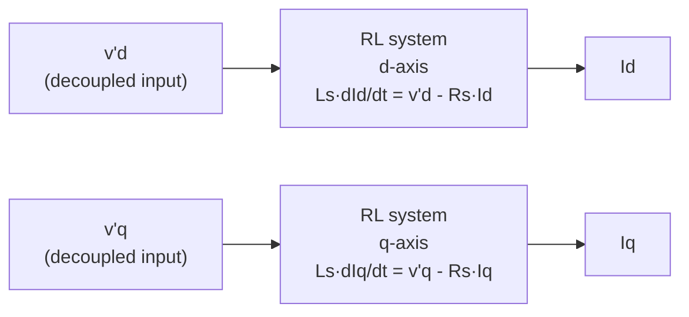
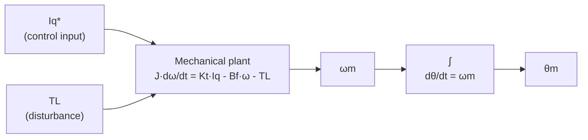

| Field     | Value                                                         |
|-----------|---------------------------------------------------------------|
| Title     | FOC Plant Models — Discretization and State-Space Foundations |
| Type      | theory                                                        |
| Status    | draft                                                         |
| Version   | 0.2.0                                                         |
| Component | foc-plant-models                                              |
| Date      | 2026-09-21                                                    |

> **Theory document**: Explains the mathematical and engineering principles behind a component or algorithm.
> This document is descriptive — it records the *why* and *how* at a scientific level, independent of any
> specific implementation. Equations use KaTeX ($inline$ and $$block$$). Block diagrams use Mermaid or
> ASCII art.

---

## Overview

This document derives the discrete-time state-space plant models used by all advanced FOC controllers.
It is a shared prerequisite for:
- `documentation/theory/current-loop-controllers.md`
- `documentation/theory/speed-loop-controllers.md`
- `documentation/theory/position-loop-controllers.md`

The reader is assumed familiar with Clarke/Park transforms, SVM, and PI current control as described
in `documentation/theory/foc.md`.

---

## Prerequisites

| Symbol     | Meaning                                        | Unit      |
|------------|------------------------------------------------|-----------|
| $R_s$      | Stator resistance per phase                    | Ω         |
| $L_s$      | Stator inductance ($L_d = L_q$, surface PMSM)  | H         |
| $\psi_f$   | Permanent magnet flux linkage                  | Wb        |
| $p$        | Number of pole pairs                           | —         |
| $\omega_e$ | Electrical angular velocity                    | rad/s     |
| $K_t$      | Torque constant $= \tfrac{3}{2} p \psi_f$      | N·m/A     |
| $J$        | Rotor moment of inertia                        | kg·m²     |
| $B_f$      | Viscous friction coefficient                   | N·m·s/rad |
| $T_L$      | Load torque (disturbance), see the split below | N·m       |
| $\omega_m$ | Mechanical angular velocity                    | rad/s     |
| $\theta_m$ | Mechanical rotor angle                         | rad       |
| $T_s^i$    | Current loop sample period $= 1/20000$ s       | s         |
| $T_s^o$    | Outer loop sample period $= 1/1000$ s          | s         |
| $A_d, B_d$ | Discrete-time plant matrices                   | —         |

---

## Mathematical Foundation

### 1. PMSM Current Loop Plant (dq Frame)

The PMSM voltage equations in the rotor-synchronous dq frame (from `documentation/theory/foc.md`
Section 4), assuming a surface-mounted motor with $L_d = L_q = L_s$:

$$
v_d = R_s i_d + L_s \frac{di_d}{dt} - \omega_e L_s i_q
$$
$$
v_q = R_s i_q + L_s \frac{di_q}{dt} + \omega_e L_s i_d + \omega_e \psi_f
$$

Rearranged as explicit state equations:

$$
\frac{di_d}{dt} = -\frac{R_s}{L_s} i_d + \omega_e i_q + \frac{1}{L_s} v_d
$$
$$
\frac{di_q}{dt} = -\frac{R_s}{L_s} i_q - \omega_e i_d - \frac{\psi_f \omega_e}{L_s} + \frac{1}{L_s} v_q
$$

The cross-coupling terms $+\omega_e i_q$ (on d) and $-\omega_e i_d$ (on q), and the back-EMF
disturbance $-\psi_f \omega_e / L_s$ (on q), prevent the two axes from being treated as independent
RL plants. Advanced current controllers either cancel these terms via feedforward or treat them as
bounded disturbances.

#### Decoupled Per-Axis Plant

After applying the feedforward voltages defined in the current-loop controllers document, each axis
reduces to an independent first-order RL system with decoupled input $v'$:

$$
\frac{di}{dt} = -\frac{R_s}{L_s}\, i + \frac{1}{L_s}\, v'
$$

#### Discrete-Time Current Plant

ZOH discretization at $T_s^i$ gives per-axis matrices:

$$
A_d^i = e^{-R_s T_s^i / L_s}, \qquad B_d^i = \frac{1 - A_d^i}{R_s}
$$

**This exact pair is what the implementation uses**, evaluated with a real exponential — not the
Euler approximation below.

For $R_s T_s^i / L_s \ll 1$ (typical: $< 0.1$), the Euler approximation is accurate:

$$
A_d^i \approx 1 - \frac{R_s T_s^i}{L_s}, \qquad B_d^i \approx \frac{T_s^i}{L_s}
$$

Note that $B_d^i$ must be taken from the same discretization as $A_d^i$. Pairing the exact
$A_d^i = e^{-R_s T_s^i/L_s}$ with the Euler $B_d^i = T_s^i/L_s$ is not a ZOH model of anything; the
matching exact input matrix is $(1 - A_d^i)/R_s$.

The per-axis discrete plant:

$$
i[k+1] = A_d^i \cdot i[k] + B_d^i \cdot v'[k]
$$

RLS estimates $\hat{R}_s$ and $\hat{L}_s$ are substituted at configuration time.

---

### 2. Mechanical (Speed) Plant

The mechanical rotor dynamics driven by electromagnetic torque:

$$
J \frac{d\omega_m}{dt} = K_t i_q - B_f \omega_m - T_L
$$

The simulated plant splits $T_L$ into two terms. A *load* opposes motion whatever its direction, so it
changes sign with $\omega_m$ and vanishes at rest, like friction. An *external torque* keeps its sign
whatever the rotor does, like gravity on an arm or a step applied by a test to disturb the loop, and it
is the term a position controller has to hold against. Both are additive on the right-hand side:

$$
T_L = T_{load} \cdot \operatorname{sgn}(\omega_m) + T_{ext}
$$

Treating the current loop as ideal ($i_q \approx i_q^*$), the outer-loop control input is $u = i_q^*$:

$$
\frac{d\omega_m}{dt} = -\frac{B_f}{J} \omega_m + \frac{K_t}{J} u - \frac{T_L}{J}
$$

This is a first-order plant (state: $\omega_m$, input: $i_q^*$, disturbance: $T_L/J$).

Discretization at $T_s^o$. The exact ZOH pair is:

$$
A_d^o = e^{-B_f T_s^o / J}, \qquad B_d^o = \frac{K_t}{B_f}\left(1 - A_d^o\right)
$$

**The implementation uses the forward-Euler pair instead:**

$$
\boxed{A_d^o = 1 - \frac{B_f T_s^o}{J}, \qquad B_d^o = \frac{K_t T_s^o}{J}}
$$

Both matrices come from the same approximation, which is the part that matters: the exact $A_d^o$
paired with the Euler $B_d^o$ would be a model of no system at all. The Euler pair is valid while
$B_f T_s^o / J \ll 1$, which holds comfortably at 1 kHz for the inertias and frictions the
mechanical identification returns, and unlike the exact pair it stays defined for a frictionless
load, where $K_t (1 - A_d^o) / B_f$ is $0/0$.

$$
\omega_m[k+1] = A_d^o \cdot \omega_m[k] + B_d^o \cdot u[k]
$$

RLS estimates $\hat{J}$ and $\hat{B}_f$ from `documentation/theory/friction-inertia-estimation.md`
are substituted at configuration time.

---

### 3. Position Plant (Double Integrator)

Adding the kinematic relation $\dot{\theta}_m = \omega_m$ yields a two-state plant:

$$
\begin{pmatrix} \dot{\theta}_m \\ \dot{\omega}_m \end{pmatrix}
=
\begin{pmatrix} 0 & 1 \\ 0 & -B_f/J \end{pmatrix}
\begin{pmatrix} \theta_m \\ \omega_m \end{pmatrix}
+
\begin{pmatrix} 0 \\ K_t/J \end{pmatrix}
u
$$

Discretized at $T_s^o$ with the same forward-Euler $A_d^o$ and $B_d^o$ as the speed plant:

$$
A_d^p =
\begin{pmatrix} 1 & T_s^o \\ 0 & A_d^o \end{pmatrix},
\qquad
B_d^p =
\begin{pmatrix} 0 \\ B_d^o \end{pmatrix}
$$

The $[1,\, T_s^o]$ row approximation holds when $B_f T_s^o / J \ll 1$. For high-friction systems,
the exact matrix exponential should be used.

---

## Block Diagrams

### Current Loop Plant Structure

### Speed and Position Plant Cascade

---

## Numerical Properties

| Property             |           Current plant           |           Speed plant           |      Position plant       |
|----------------------|:---------------------------------:|:-------------------------------:|:-------------------------:|
| States               |        1 per axis (Id, Iq)        |             1 (ωm)              |        2 (θm, ωm)         |
| Inputs               |       1 per axis (v'd, v'q)       |             1 (Iq*)             |          1 (Iq*)          |
| Time constant        |      $L_s/R_s$ (typ. 0.4 ms)      |     $J/B_f$ (typ. 0.1–2 s)      |        Integrating        |
| Discretization error | $< 1\%$ for $R_s T_s / L_s < 0.1$ | $< 1\%$ for $B_f T_s / J < 0.1$ | Row approx valid at 1 kHz |
| Parameter source     |          Electrical RLS           |         Mechanical RLS          |      Mechanical RLS       |

---

## Reference Motors

The plant model is exercised, in the unit tests, the simulator and the software-in-the-loop suite,
with two motors whose parameters are published by their vendors and by the evaluation kits built
around them. The values below are per phase for a wye winding, which is what the model and the
identification services use. The headers under `motor_parameters/` carry exactly these numbers.

| Parameter                         | Symbol                        | Anaheim Automation BLY172S-24V-4000 | Teknic M-2310P-LN-04K      |
|-----------------------------------|-------------------------------|-------------------------------------|----------------------------|
| Rated bus voltage                 | $V_{dc}$                      | 24 V                                | 40 V                       |
| Rated speed, power, torque        |                               | 4000 rpm, 53 W, 0.127 N·m           | 6000 rpm, 170 W, 0.274 N·m |
| Phase resistance                  | $R_s$                         | 0.405 Ω                             | 0.36 Ω                     |
| Phase inductance                  | $L_d = L_q$                   | 0.64 mH                             | 0.20 mH                    |
| Flux linkage                      | $\psi_f$                      | 5.44 mWb                            | 6.40 mWb                   |
| Pole pairs                        | $p$                           | 4                                   | 4                          |
| Rotor inertia                     | $J$                           | 4.8e-6 kg·m²                        | 7.06e-6 kg·m²              |
| Viscous friction                  | $B_f$                         | 1.0e-5 N·m·s/rad (assumed)          | 1.5e-5 N·m·s/rad (assumed) |
| Torque constant                   | $K_t = \tfrac{3}{2} p \psi_f$ | 32.6 mN·m/A                         | 38.4 mN·m/A                |
| Electrical time constant          | $L_s / R_s$                   | 1.58 ms                             | 0.56 ms                    |
| Drive current rating in the model | $I_{max}$                     | 10 A                                | 20 A                       |
| Header                            |                               | `AnaheimBly172s24v4000.hpp`         | `TeknicM2310pLn04k.hpp`    |

How the numbers were obtained:

- **Line-to-line to per-phase.** Datasheets quote terminal values; for a wye winding
  $R_s = R_{LL}/2$ and $L_s = L_{LL}/2$. The Teknic sheet gives 0.72 Ω and 0.40 mH line-to-line.
  The Anaheim sheet gives 1.20 mH line-to-line (0.60 mH per phase); the 0.64 mH and 0.405 Ω in the
  header are TI's InstaSPIN identification of the same motor, which agrees with the sheet to within
  the spread expected between a six-step datasheet rating and a sinusoidal measurement.
- **Flux linkage from back-EMF.** With a line-to-line peak constant $K_{e}$ per 1000 rpm
  ($\omega_m = 104.7$ rad/s, $\omega_e = p\,\omega_m$):
  $\psi_f = K_e / (\sqrt{3}\,\omega_e)$. Teknic: $4.64 / (\sqrt{3} \cdot 418.9) = 6.40$ mWb.
  TI reports the Anaheim flux as $0.03416$ V/Hz, a peak phase voltage per electrical hertz, so
  $\psi_f = 0.03416 / 2\pi = 5.44$ mWb.
- **Inertia.** $1\ \text{oz·in·s}^2 = 7.0616 \times 10^{-3}\ \text{kg·m}^2$: 0.00068 oz·in·s²
  (Anaheim) and 0.001 oz·in·s² (Teknic).
- **Viscous friction.** Neither vendor publishes a viscous term or a no-load current to derive one
  from. The values are chosen so that friction torque at rated speed is about 3 % of rated torque
  (4.2 mN·m at 419 rad/s for the Anaheim, 9.4 mN·m at 628 rad/s for the Teknic), and the
  identification scenarios treat them as plant truth, not as a claim about the real machines.
- **Drive rating.** `maxSupportedCurrent` is the inverter's limit, not the motor's: 10 A and 20 A
  are what a small drive for each class supports and what the injection-limit check in every
  calibration procedure compares against. The 15 % DC resistance test draws about 5.5 A
  (Anaheim, 24 V) and 10 A (Teknic, 40 V), inside both ratings.

The two motors bracket the plant in the directions that matter to the estimators: the Teknic has
the shorter electrical time constant (11 control ticks at 20 kHz, still well inside the Euler
stability region), and its $R_s T_s / L_s$ of 0.18 at the 10 kHz identification rate makes the ZOH
bias of the inductance estimator visible (see `resistance-inductance-estimation.md`), where the
Anaheim's 0.063 keeps it small.

Sources:

- Anaheim Automation, *BLY17 Series Product Sheet* (L010228) and the
  [BLY172S-24V-4000 product page](https://anaheimautomation.com/bly172s-24v-4000.html):
  24 V, 4000 rpm, 53 W, 18 oz·in, 1.20 mH line-to-line, 3.35 V/krpm, 0.00068 oz·in·s².
- Texas Instruments MotorWare `user.h`, motor `Anaheim_BLY172S`: $R_s = 0.4051$ Ω,
  $L_s = 0.6399$ mH, rated flux 0.03416 V/Hz, 4 pole pairs.
- Teknic, *Industrial-Grade NEMA 23 Motors* datasheet
  ([N23_Industrial_Grade_Motors_v6.3.pdf](https://www.teknic.com/files/product_info/N23_Industrial_Grade_Motors_v6.3.pdf)):
  M-2310P-LN-04K, 40 V, 6000 rpm, 0.72 Ω and 0.40 mH line-to-line, 4.64 Vpk/krpm, 0.001 oz·in·s².
- NXP, *MCUXpresso SDK FOC user guide*,
  [Teknic motor](https://docs.nxp.com/bundle/UG10297/page/HW/Motors/teknic_m2310p_motor.html),
  which restates the same electrical values for the FRDM-MC kits, and the TI
  [LVSERVOMTR](https://www.ti.com/tool/LVSERVOMTR) page for the 2MTR-DYNO.

---

## References

1. Krishnan, R. — *Permanent Magnet Synchronous and Brushless DC Motor Drives*, CRC Press, 2010.
2. Åström, K.J. & Wittenmark, B. — *Computer-Controlled Systems: Theory and Design*, 3rd ed.,
   Prentice Hall, 1997. (Chapter 3: ZOH discretization.)
