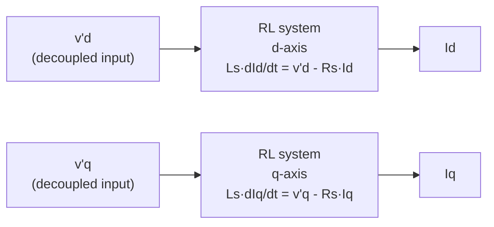
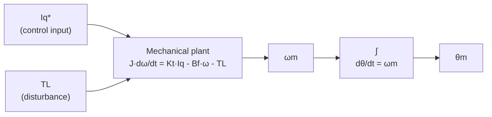

| Field     | Value                                                         |
|-----------|---------------------------------------------------------------|
| Title     | FOC Plant Models — Discretization and State-Space Foundations |
| Type      | theory                                                        |
| Status    | draft                                                         |
| Version   | 0.1.0                                                         |
| Component | foc-plant-models                                              |
| Date      | 2026-08-10                                                    |

> **Theory document**: Explains the mathematical and engineering principles behind a component or algorithm.
> This document is descriptive — it records the *why* and *how* at a scientific level, independent of any
> specific implementation. Equations use KaTeX ($inline$ and $$block$$). Block diagrams use Mermaid or
> ASCII art.

---

## Overview

This document derives the discrete-time state-space plant models used by all advanced FOC controllers.
It is a shared prerequisite for:
- `documentation/theory/current-loop-controllers.md`
- `documentation/theory/speed-loop-controllers.md`
- `documentation/theory/position-loop-controllers.md`

The reader is assumed familiar with Clarke/Park transforms, SVM, and PI current control as described
in `documentation/theory/foc.md`.

---

## Prerequisites

| Symbol     | Meaning                                       | Unit      |
|------------|-----------------------------------------------|-----------|
| $R_s$      | Stator resistance per phase                   | Ω         |
| $L_s$      | Stator inductance ($L_d = L_q$, surface PMSM) | H         |
| $\psi_f$   | Permanent magnet flux linkage                 | Wb        |
| $p$        | Number of pole pairs                          | —         |
| $\omega_e$ | Electrical angular velocity                   | rad/s     |
| $K_t$      | Torque constant $= \tfrac{3}{2} p \psi_f$     | N·m/A     |
| $J$        | Rotor moment of inertia                       | kg·m²     |
| $B_f$      | Viscous friction coefficient                  | N·m·s/rad |
| $T_L$      | External load torque (disturbance)            | N·m       |
| $\omega_m$ | Mechanical angular velocity                   | rad/s     |
| $\theta_m$ | Mechanical rotor angle                        | rad       |
| $T_s^i$    | Current loop sample period $= 1/20000$ s      | s         |
| $T_s^o$    | Outer loop sample period $= 1/1000$ s         | s         |
| $A_d, B_d$ | Discrete-time plant matrices                  | —         |

---

## Mathematical Foundation

### 1. PMSM Current Loop Plant (dq Frame)

The PMSM voltage equations in the rotor-synchronous dq frame (from `documentation/theory/foc.md`
Section 4), assuming a surface-mounted motor with $L_d = L_q = L_s$:

$$
v_d = R_s i_d + L_s \frac{di_d}{dt} - \omega_e L_s i_q
$$
$$
v_q = R_s i_q + L_s \frac{di_q}{dt} + \omega_e L_s i_d + \omega_e \psi_f
$$

Rearranged as explicit state equations:

$$
\frac{di_d}{dt} = -\frac{R_s}{L_s} i_d + \omega_e i_q + \frac{1}{L_s} v_d
$$
$$
\frac{di_q}{dt} = -\frac{R_s}{L_s} i_q - \omega_e i_d - \frac{\psi_f \omega_e}{L_s} + \frac{1}{L_s} v_q
$$

The cross-coupling terms $+\omega_e i_q$ (on d) and $-\omega_e i_d$ (on q), and the back-EMF
disturbance $-\psi_f \omega_e / L_s$ (on q), prevent the two axes from being treated as independent
RL plants. Advanced current controllers either cancel these terms via feedforward or treat them as
bounded disturbances.

#### Decoupled Per-Axis Plant

After applying the feedforward voltages defined in the current-loop controllers document, each axis
reduces to an independent first-order RL system with decoupled input $v'$:

$$
\frac{di}{dt} = -\frac{R_s}{L_s}\, i + \frac{1}{L_s}\, v'
$$

#### Discrete-Time Current Plant

ZOH discretization at $T_s^i$ gives per-axis matrices:

$$
A_d^i = e^{-R_s T_s^i / L_s}, \qquad B_d^i = \frac{1 - A_d^i}{R_s}
$$

For $R_s T_s^i / L_s \ll 1$ (typical: $< 0.1$), the Euler approximation is accurate:

$$
A_d^i \approx 1 - \frac{R_s T_s^i}{L_s}, \qquad B_d^i \approx \frac{T_s^i}{L_s}
$$

The per-axis discrete plant:

$$
i[k+1] = A_d^i \cdot i[k] + B_d^i \cdot v'[k]
$$

RLS estimates $\hat{R}_s$ and $\hat{L}_s$ are substituted at configuration time.

---

### 2. Mechanical (Speed) Plant

The mechanical rotor dynamics driven by electromagnetic torque:

$$
J \frac{d\omega_m}{dt} = K_t i_q - B_f \omega_m - T_L
$$

Treating the current loop as ideal ($i_q \approx i_q^*$), the outer-loop control input is $u = i_q^*$:

$$
\frac{d\omega_m}{dt} = -\frac{B_f}{J} \omega_m + \frac{K_t}{J} u - \frac{T_L}{J}
$$

This is a first-order plant (state: $\omega_m$, input: $i_q^*$, disturbance: $T_L/J$).

ZOH discretization at $T_s^o$:

$$
A_d^o = e^{-B_f T_s^o / J} \approx 1 - \frac{B_f T_s^o}{J}, \qquad B_d^o = \frac{K_t T_s^o}{J}
$$

$$
\omega_m[k+1] = A_d^o \cdot \omega_m[k] + B_d^o \cdot u[k]
$$

RLS estimates $\hat{J}$ and $\hat{B}_f$ from `documentation/theory/friction-inertia-estimation.md`
are substituted at configuration time.

---

### 3. Position Plant (Double Integrator)

Adding the kinematic relation $\dot{\theta}_m = \omega_m$ yields a two-state plant:

$$
\begin{pmatrix} \dot{\theta}_m \\ \dot{\omega}_m \end{pmatrix}
=
\begin{pmatrix} 0 & 1 \\ 0 & -B_f/J \end{pmatrix}
\begin{pmatrix} \theta_m \\ \omega_m \end{pmatrix}
+
\begin{pmatrix} 0 \\ K_t/J \end{pmatrix}
u
$$

ZOH-discretized at $T_s^o$:

$$
A_d^p =
\begin{pmatrix} 1 & T_s^o \\ 0 & A_d^o \end{pmatrix},
\qquad
B_d^p =
\begin{pmatrix} 0 \\ B_d^o \end{pmatrix}
$$

The $[1,\, T_s^o]$ row approximation holds when $B_f T_s^o / J \ll 1$. For high-friction systems,
the exact matrix exponential should be used.

---

## Block Diagrams

### Current Loop Plant Structure

### Speed and Position Plant Cascade

---

## Numerical Properties

| Property             | Current plant                     | Speed plant                     | Position plant            |
|----------------------|:---------------------------------:|:-------------------------------:|:-------------------------:|
| States               | 1 per axis (Id, Iq)               | 1 (ωm)                          | 2 (θm, ωm)                |
| Inputs               | 1 per axis (v'd, v'q)             | 1 (Iq*)                         | 1 (Iq*)                   |
| Time constant        | $L_s/R_s$ (typ. 0.4 ms)           | $J/B_f$ (typ. 0.1–2 s)          | Integrating               |
| Discretization error | $< 1\%$ for $R_s T_s / L_s < 0.1$ | $< 1\%$ for $B_f T_s / J < 0.1$ | Row approx valid at 1 kHz |
| Parameter source     | Electrical RLS                    | Mechanical RLS                  | Mechanical RLS            |

---

## References

1. Krishnan, R. — *Permanent Magnet Synchronous and Brushless DC Motor Drives*, CRC Press, 2010.
2. Åström, K.J. & Wittenmark, B. — *Computer-Controlled Systems: Theory and Design*, 3rd ed.,
   Prentice Hall, 1997. (Chapter 3: ZOH discretization.)
