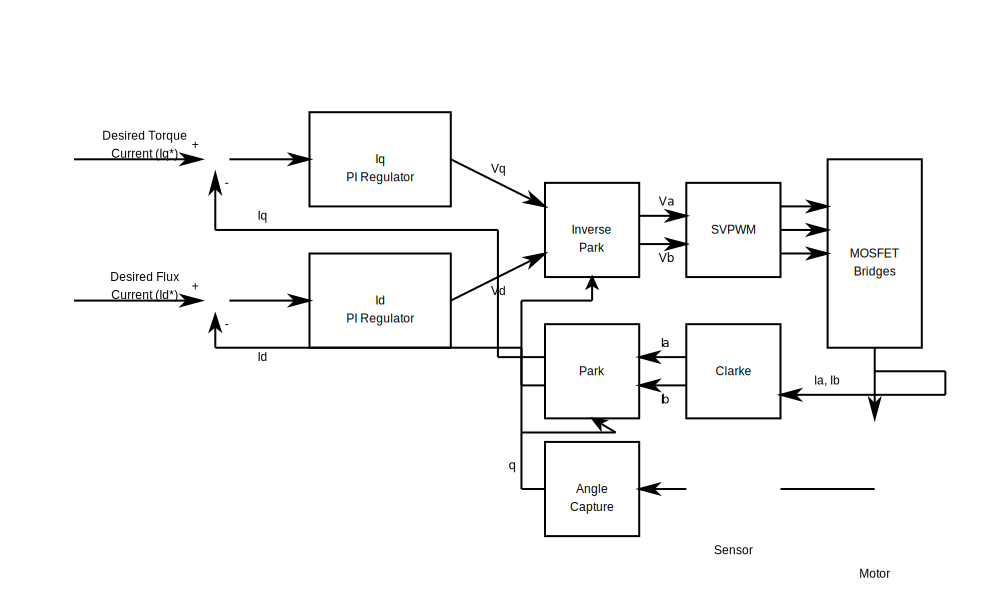
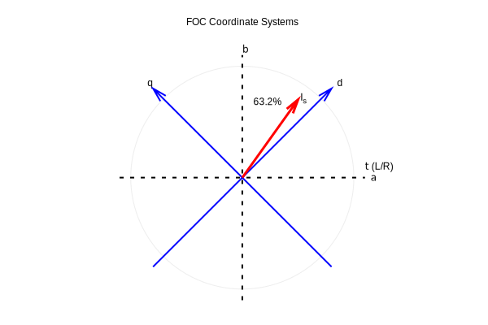
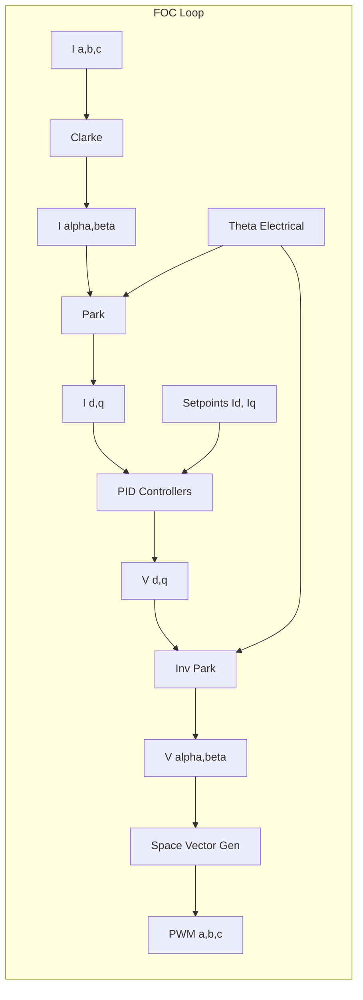

# Field-Oriented Control (FOC)

This document outlines the theory and implementation of the Field-Oriented Control algorithm used in `e-foc`. FOC allows for independent control of magnetic flux and torque by transforming the motor's three-phase currents into a rotating reference frame.

## Theory

Field-Oriented Control simplifies the control of AC motors (BLDC/PMSM) by acting on the stator currents as if they were DC quantities in a rotating frame aligned with the rotor.

### Coordinate Transformations

The core of FOC relies on mathematical transformations to decouple torque and flux:

1. **Clarke Transform** ($abc \to \alpha\beta$):
    Converts the three-phase stator currents ($i_a, i_b, i_c$) into a two-phase stationary reference frame ($i_\alpha, i_\beta$).

2. **Park Transform** ($\alpha\beta \to dq$):
    Rotates the stationary frame to align with the rotor flux, using the electrical angle $\theta_e$.
    * $i_d$ (Direct axis): Represents magnetic flux component. Usually controlled to 0 for PMSM motors to maximize efficiency.
    * $i_q$ (Quadrature axis): Represents torque component. Proportional to the output torque.

### Control Loops

Once in the $dq$ frame, standard PI/PID controllers are used:
* **D-Loop**: Maintains $i_d$ at 0 (or a setpoint for field weakening).
* **Q-Loop**: Controls $i_q$ to match the requested torque.

The outputs of these controllers are voltage commands ($v_d, v_q$).

### Inverse Transformations & Modulation

1. **Inverse Park**: Converts ($v_d, v_q$) back to stationary frame ($v_\alpha, v_\beta$).
2. **Space Vector Modulation (SVM)**: Generates the 3-phase PWM duty cycles from the voltage vector ($v_\alpha, v_\beta$) to drive the inverter MOSFETs efficiently.

## Implementation Details

The core FOC loop is implemented in `source/foc/instantiations/FieldOrientedControllerImpl.cpp` within the `FocTorqueImpl` class.

#### Control Diagram

### Key Components

* **`Calculate` Method**: The inner loop running at the PWM frequency (e.g., 20kHz).
    1. **Angle Calculation**: $\theta_{electrical} = \theta_{mechanical} \times N_{polepairs}$.
    2. **Transforms**: Calls `clarke.Forward()` and `park.Forward()`.
    3. **PID Processing**: `dPid.Process(id)` and `qPid.Process(iq)` calculate required voltages.
    4. **Inverse**: Calls `park.Inverse()`.
    5. **Modulation**: `spaceVectorModulator.Generate()` computes duty cycles.

* **PID Scaling**:
    The PID gains are normalized against the DC bus voltage ($V_{DC}$) to make stability independent of battery voltage changes.
    $$ K_{scaled} = K_{raw} \times \frac{1}{\frac{V_{DC}}{\sqrt{3}}} $$

* **Optimization**:
    The code uses `FastTrigonometry` (lookup tables or approximations) and `#pragma GCC optimize("O3")` to ensure the loop finishes within the tight timing budget of the interrupt.
