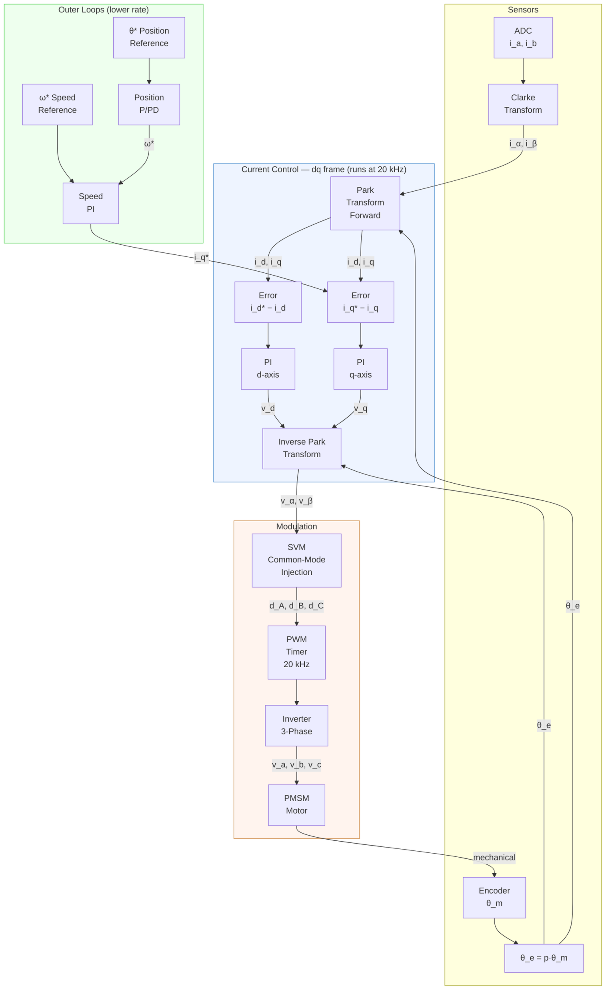

| Field     | Value                            |
|-----------|----------------------------------|
| Title     | Field-Oriented Control (FOC)     |
| Type      | theory                           |
| Status    | approved                         |
| Version   | 1.0.0                            |
| Component | foc                              |
| Date      | 2025-01-01                       |

## Overview

Field-Oriented Control (FOC) — also called vector control — is the standard high-performance control strategy for
Permanent Magnet Synchronous Motors (PMSM) and Brushless DC motors (BLDC). Its central insight is that a
three-phase AC motor can be controlled as simply as a DC motor if all quantities are expressed in a reference frame
that rotates synchronously with the rotor flux.

In the rotating (dq) reference frame the three-phase stator currents reduce to two DC components:
- $i_d$ — the flux-producing (direct) component, nominally zero for maximum torque per ampere (MTPA).
- $i_q$ — the torque-producing (quadrature) component, directly proportional to electrical torque.

Standard PI controllers can then regulate these DC quantities without phase lag caused by the AC coupling. The
inverse transforms and Space Vector Modulation (SVM) reconstruct the three-phase PWM duty cycles that drive the
inverter.

---

## Prerequisites

| Symbol        | Meaning                                         | Unit       |
|---------------|-------------------------------------------------|------------|
| $R_s$         | Stator resistance per phase                     | Ω          |
| $L_s$         | Stator inductance per phase (assuming $L_d = L_q$) | H       |
| $\psi_f$      | Permanent magnet flux linkage                   | Wb         |
| $p$           | Number of pole pairs                            | —          |
| $\theta_e$    | Electrical rotor angle                          | rad        |
| $\theta_m$    | Mechanical rotor angle                          | rad        |
| $\omega_e$    | Electrical angular velocity ($p \cdot \omega_m$)| rad/s      |
| $V_{dc}$      | DC bus voltage                                  | V          |
| $\tau_e$      | Electrical torque                               | N·m        |
| $1/\sqrt{3}$  | Reciprocal of $\sqrt{3}$, ≈ 0.5774             | —          |

The relationship between electrical and mechanical angles is:

$$
\theta_e = p \cdot \theta_m
$$

---

## Mathematical Foundation

### 1. PMSM Voltage Model (abc frame)

The PMSM stator voltage equations in the stationary abc reference frame are:

$$
v_a = R_s i_a + L_s \frac{di_a}{dt} + e_a
$$
$$
v_b = R_s i_b + L_s \frac{di_b}{dt} + e_b
$$
$$
v_c = R_s i_c + L_s \frac{di_c}{dt} + e_c
$$

where $e_a, e_b, e_c$ are the back-EMF voltages produced by the rotating permanent magnets:

$$
e_a = -\psi_f \omega_e \sin(\theta_e), \quad
e_b = -\psi_f \omega_e \sin\!\left(\theta_e - \tfrac{2\pi}{3}\right), \quad
e_c = -\psi_f \omega_e \sin\!\left(\theta_e + \tfrac{2\pi}{3}\right)
$$

These equations are coupled through the mutual inductance and back-EMF, making direct control difficult.
The Clarke and Park transforms decouple them into independently controllable quantities.

### 2. Clarke Transform — abc → αβ (Stationary Frame)

The Clarke transform projects the three-phase quantities onto a two-dimensional orthogonal stationary frame
($\alpha$–$\beta$). The **amplitude-invariant** form (factor $\tfrac{2}{3}$) preserves the physical voltage
and current magnitudes:

$$
\begin{pmatrix} i_\alpha \\ i_\beta \end{pmatrix}
= \frac{2}{3}
\begin{pmatrix} 1 & -\tfrac{1}{2} & -\tfrac{1}{2} \\[4pt]
                0 & \dfrac{\sqrt{3}}{2} & -\dfrac{\sqrt{3}}{2} \end{pmatrix}
\begin{pmatrix} i_a \\ i_b \\ i_c \end{pmatrix}
$$

For a balanced three-phase system ($i_a + i_b + i_c = 0$), the zero-sequence component vanishes and the
transform simplifies. With only two current sensors measuring $i_a$ and $i_b$ (and $i_c = -i_a - i_b$):

$$
i_\alpha = i_a, \qquad i_\beta = \frac{i_a + 2\,i_b}{\sqrt{3}}
$$

**Verification**: For a balanced current set $i_a = I\cos\theta_e$, $i_b = I\cos(\theta_e - \tfrac{2\pi}{3})$:

$$
i_\beta = \frac{I\cos\theta_e + 2I\!\left(-\tfrac{1}{2}\cos\theta_e + \tfrac{\sqrt{3}}{2}\sin\theta_e\right)}{\sqrt{3}}
= \frac{I\sqrt{3}\sin\theta_e}{\sqrt{3}} = I\sin\theta_e \checkmark
$$

The stator current space vector in the $\alpha$–$\beta$ frame thus has magnitude $I$ and rotates at
$\omega_e$: $\mathbf{I}_s = i_\alpha + j\,i_\beta = I e^{j\theta_e}$.

**Full three-sensor form** (when all three currents are available):

$$
i_\alpha = \tfrac{2}{3}\!\left(i_a - \tfrac{1}{2}i_b - \tfrac{1}{2}i_c\right),
\qquad
i_\beta = \tfrac{1}{\sqrt{3}}\!\left(i_b - i_c\right)
$$

### 3. Park Transform — αβ → dq (Rotating Frame)

The Park transform rotates the $\alpha$–$\beta$ space vector by $-\theta_e$ into the rotor-fixed dq frame:

$$
\begin{pmatrix} i_d \\ i_q \end{pmatrix}
= \begin{pmatrix} \cos\theta_e & \sin\theta_e \\ -\sin\theta_e & \cos\theta_e \end{pmatrix}
\begin{pmatrix} i_\alpha \\ i_\beta \end{pmatrix}
$$

$$
i_d = i_\alpha \cos\theta_e + i_\beta \sin\theta_e
$$
$$
i_q = -i_\alpha \sin\theta_e + i_\beta \cos\theta_e
$$

For the balanced rotating current $\mathbf{I}_s = I e^{j\theta_e}$:

$$
i_d + j\,i_q = I e^{j\theta_e} \cdot e^{-j\theta_e} = I \quad \Rightarrow \quad i_d = I,\ i_q = 0
$$

This confirms: when the current vector is aligned with the d-axis (rotor flux axis), $i_q = 0$ (zero torque).
When the current vector is 90° ahead of the rotor (MTPA), $i_d = 0$ and $i_q = I$ (maximum torque).

**Inverse Park Transform** (dq → αβ, for voltage reconstruction):

$$
\begin{pmatrix} v_\alpha \\ v_\beta \end{pmatrix}
= \begin{pmatrix} \cos\theta_e & -\sin\theta_e \\ \sin\theta_e & \cos\theta_e \end{pmatrix}
\begin{pmatrix} v_d \\ v_q \end{pmatrix}
$$

$$
v_\alpha = v_d \cos\theta_e - v_q \sin\theta_e
$$
$$
v_\beta  = v_d \sin\theta_e + v_q \cos\theta_e
$$

### 4. PMSM Model in the dq Frame

After applying the Park transform, the PMSM voltage equations in the rotating dq frame become:

$$
v_d = R_s i_d + L_s \frac{di_d}{dt} - \omega_e L_s i_q
$$
$$
v_q = R_s i_q + L_s \frac{di_q}{dt} + \omega_e L_s i_d + \omega_e \psi_f
$$

The cross-coupling terms $\omega_e L_s i_q$ and $\omega_e L_s i_d$ are decoupled by feed-forward compensation.
The back-EMF term $\omega_e \psi_f$ can also be added as a feed-forward. After decoupling, both d and q channels
reduce to independent first-order RL systems:

$$
v_d' = R_s i_d + L_s \frac{di_d}{dt}, \qquad v_q' = R_s i_q + L_s \frac{di_q}{dt}
$$

These are controlled by separate PI regulators.

### 5. Electrical Torque

The electromagnetic torque produced by the motor is:

$$
\boxed{\tau_e = \frac{3}{2}\, p\, \psi_f\, i_q}
$$

Since $\psi_f$ and $p$ are motor constants, torque is directly proportional to $i_q$. Setting the $i_q$
reference from an outer speed or position loop gives a torque-current-mode inner loop — the fundamental
advantage of FOC over scalar control.

### 6. PI Current Controller Design

Each PI controller regulates one dq-axis current channel (modelled as an RL system):

$$
G_{plant}(s) = \frac{1}{R_s + s L_s} = \frac{1/R_s}{1 + s \tau_e}, \qquad \tau_e = \frac{L_s}{R_s}
$$

The standard pole-zero cancellation design sets the PI zero at the plant pole:

$$
K_p = \frac{L_s \cdot \omega_{bw}}{1}, \qquad K_i = \frac{R_s \cdot \omega_{bw}}{1}
$$

where $\omega_{bw}$ is the desired current loop bandwidth in rad/s. Practical values for embedded PMSM drives
are $\omega_{bw} \approx 2\pi \cdot (500\text{–}2000)\ \text{rad/s}$.

### 7. PID Gain Normalisation

The PI controllers operate in **normalised units** where 1.0 corresponds to the maximum SVM output voltage.
The maximum phase voltage that SVM can deliver in the linear modulation region is:

$$
V_{max,phase} = \frac{V_{dc}}{\sqrt{3}}
$$

Physical gains (in V/A) must be scaled to normalised units before use:

$$
K_{p,norm} = K_{p,phys} \cdot \frac{\sqrt{3}}{V_{dc}} = \frac{K_{p,phys}}{V_{dc} \cdot \tfrac{1}{\sqrt{3}}}
$$

Similarly for $K_i$. The normalisation scale factor is:

$$
\text{scale} = \frac{1}{V_{dc} \cdot \tfrac{1}{\sqrt{3}}} = \frac{\sqrt{3}}{V_{dc}}
$$

This ensures that a PI output of 1.0 maps exactly to full bus utilisation through the SVM stage.

### 8. Space Vector Modulation (SVM)

SVM synthesises any reference voltage vector $\mathbf{V}_{ref} = V_\alpha + j V_\beta$ as a time-average of
the eight inverter states. The three-phase half-bridge inverter produces 8 switching states:

| Vector | Switches (A,B,C) | $V_\alpha$ (normalised) | $V_\beta$ (normalised) |
|--------|-----------------|------------------------|------------------------|
| $V_0$  | (0,0,0)         | 0                      | 0                      |
| $V_1$  | (1,0,0)         | $\tfrac{2}{3}$         | 0                      |
| $V_2$  | (1,1,0)         | $\tfrac{1}{3}$         | $\tfrac{1}{\sqrt{3}}$  |
| $V_3$  | (0,1,0)         | $-\tfrac{1}{3}$        | $\tfrac{1}{\sqrt{3}}$  |
| $V_4$  | (0,1,1)         | $-\tfrac{2}{3}$        | 0                      |
| $V_5$  | (0,0,1)         | $-\tfrac{1}{3}$        | $-\tfrac{1}{\sqrt{3}}$ |
| $V_6$  | (1,0,1)         | $\tfrac{1}{3}$         | $-\tfrac{1}{\sqrt{3}}$ |
| $V_7$  | (1,1,1)         | 0                      | 0                      |

The six active vectors ($V_1$–$V_6$) form a regular hexagon. The inscribed circle (maximum linear SVM range)
has radius $\tfrac{2}{3}$ in normalised units, corresponding to $V_{dc}/\sqrt{3}$ in physical volts.

**See**: `documentation/theory/images/svm_hexagon.svg` (generated by `documentation/tools/generate_plots.gp`)

#### Common-Mode Injection Method

This implementation uses the **common-mode injection** method (also called min-max injection), which avoids
explicit sector detection. The three reference phase voltages are computed from $V_\alpha, V_\beta$:

$$
v_A = V_\alpha
$$
$$
v_B = -\frac{V_\alpha}{2} + \frac{\sqrt{3}}{2}\,V_\beta
$$
$$
v_C = -\frac{V_\alpha}{2} - \frac{\sqrt{3}}{2}\,V_\beta
$$

A common-mode offset is added to centre the signals within the PWM range:

$$
v_{common} = -\frac{\max(v_A, v_B, v_C) + \min(v_A, v_B, v_C)}{2}
$$

Each phase duty cycle is then:

$$
d_k = \mathrm{clamp}\!\left(\frac{v_k + v_{common}}{\sqrt{3}} + 0.5,\ 0,\ 1\right), \quad k \in \{A, B, C\}
$$

The factor $1/\sqrt{3}$ in the duty cycle formula arises from the normalisation: at the hexagon boundary,
the maximum phase voltage (after common-mode injection) is $\sqrt{3}/2$ of the bus voltage, and the
factor maps this to the [0, 1] duty cycle range centred at 0.5.

**Advantages over sector-based SVM**:
- No angle or sector lookup required.
- Identical results to classical SVM for three-phase symmetric loads.
- Naturally handles over-modulation by saturation (clamping).

#### SVM Linear Modulation Region

The common-mode injection guarantees full hexagon utilisation. The maximum phase voltage in the linear
region corresponds to modulation index $m = 1.0$:

$$
|V_{ref}|_{max} = \frac{V_{dc}}{\sqrt{3}} \approx 0.577\, V_{dc}
$$

Beyond this circle, one or more phases saturate (clamp) and the output enters over-modulation.

### 9. Trigonometric Lookup Table

The Park/inverse-Park transforms require $\sin\theta_e$ and $\cos\theta_e$ at the FOC control rate (20 kHz).
To avoid calling `sinf/cosf` in the ISR:

- A **512-entry sine lookup table** is stored in flash, 16-byte aligned for cache efficiency.
- The table covers one full electrical revolution: `LUT[k] = sin(2π·k/512)`.
- Cosine is obtained by a 90° index offset: `cos(θ) = LUT[(k + 128) % 512]`.
- The electrical angle is mapped to a table index: `k = (uint16_t)(θ_norm * 512) & 0x1FF`.
- Angular range: angle is normalised to $[0, 1)$ representing $[0, 2\pi)$.

The fixed-step table introduces a bounded angle error of at most $\pi/512 \approx 0.35°$. This is acceptable
for 20 kHz FOC since the angle changes by at most $\omega_e/(20000) \approx 0.09°$ per step at 3000 rpm
with $p = 5$.

---

## Block Diagrams

### Complete FOC Loop


```mermaid
graph TD
    subgraph Sensors
        ADC[ADC\ni_a, i_b] --> CK[Clarke\nTransform]
        ENC[Encoder\nθ_m] --> ANG[θ_e = p·θ_m]
    end

    subgraph Current_Control["Current Control — dq frame (runs at 20 kHz)"]
        CK -->|i_α, i_β| PK[Park\nTransform\nForward]
        ANG -->|θ_e| PK
        PK -->|i_d, i_q| ERR_D[Error\ni_d* − i_d]
        PK -->|i_d, i_q| ERR_Q[Error\ni_q* − i_q]
        ERR_D --> PID_D[PI\nd-axis]
        ERR_Q --> PID_Q[PI\nq-axis]
        PID_D -->|v_d| IPK[Inverse Park\nTransform]
        PID_Q -->|v_q| IPK
        ANG -->|θ_e| IPK
    end

    subgraph SVM_stage["Modulation"]
        IPK -->|v_α, v_β| SVM[SVM\nCommon-Mode\nInjection]
        SVM -->|d_A, d_B, d_C| PWM[PWM\nTimer\n20 kHz]
        PWM --> INV[Inverter\n3-Phase]
        INV -->|v_a, v_b, v_c| MTR[PMSM\nMotor]
    end

    subgraph Outer_Loops["Outer Loops (lower rate)"]
        SPD_REF[ω* Speed\nReference] --> SPD_PID[Speed\nPI]
        SPD_PID -->|i_q*| ERR_Q
        POS_REF[θ* Position\nReference] --> POS_PID[Position\nP/PD]
        POS_PID -->|ω*| SPD_PID
    end

    MTR -->|mechanical| ENC
    style Current_Control fill:#eef4ff,stroke:#4488cc
    style SVM_stage fill:#fff4ee,stroke:#cc8844
    style Outer_Loops fill:#eeffee,stroke:#44cc44
```

### Coordinate System Relationships

```
                 β
                 ↑
                 |    q (rotates)
                 |   /
     Is ●--------/--/----→ α
        |       /  /
        |      /  d (rotates at ωe)
        |     / ↗
        |    / θe
        |   /
        (αβ stationary, dq rotates at ωe = p·ωm)
```

See also: `documentation/theory/images/foc_coordinates.svg` and `documentation/theory/images/svm_hexagon.svg`

---

## Numerical Properties

| Property            | Value / Condition                                        |
|---------------------|----------------------------------------------------------|
| Control rate        | 20 kHz (50 µs period)                                   |
| Transform latency   | < 20 CPU cycles (Clarke + Park combined)                 |
| LUT angle error     | ≤ $\pi/512 \approx 0.35°$                               |
| SVM duty resolution | 16-bit timer → ≈ 0.0015% per step                       |
| PI output range     | [−1.0, 1.0] normalised; anti-windup at ±1.0             |
| Torque linearity    | $\tau_e \propto i_q$ within MTPA region                 |
| Over-modulation     | Clamp-based saturation; duty cycles bounded to [0, 1]   |
| Gain normalisation  | $K_{p,norm} = K_{p,phys} \cdot \sqrt{3}/V_{dc}$        |
| LUT memory          | 512 × 4 bytes = 2048 bytes flash                        |

### Sensitivity Analysis

| Parameter         | Effect on Control Quality                                               |
|-------------------|-------------------------------------------------------------------------|
| $R_s$ error       | PI steady-state error in d/q current; compensated by integral term     |
| $L_s$ error       | PI bandwidth deviation; no steady-state error                          |
| $\theta_e$ error  | Cross-coupling between d and q axes; reduces torque at large error     |
| $V_{dc}$ variation| Affects gain normalisation; dynamic Vdc measurement recommended        |
| ADC offset        | Bias on $i_d$, $i_q$; must be calibrated at startup                   |

---

## Worked Example

Motor parameters: $R_s = 1.2\ \Omega$, $L_s = 0.5\ \text{mH}$, $p = 4$, $\psi_f = 0.05\ \text{Wb}$,
$V_{dc} = 24\ \text{V}$.

**Step 1 — Gain normalisation:**

$$\text{scale} = \frac{\sqrt{3}}{24} \approx 0.0722$$

**Step 2 — PI bandwidth** at $\omega_{bw} = 2\pi \cdot 1000 = 6283\ \text{rad/s}$:

$$K_p = L_s \cdot \omega_{bw} = 0.5 \times 10^{-3} \times 6283 \approx 3.14\ \text{V/A}$$
$$K_i = R_s \cdot \omega_{bw} = 1.2 \times 6283 \approx 7540\ \text{V/(A·s)}$$

**Step 3 — Normalised gains:**

$$K_{p,norm} = 3.14 \times 0.0722 \approx 0.227$$
$$K_{i,norm} = 7540 \times 0.0722 \approx 544.5\ \text{(per second)}$$

**Step 4 — Torque at $i_q = 5\ \text{A}$:**

$$\tau_e = \frac{3}{2} \times 4 \times 0.05 \times 5 = 1.5\ \text{N·m}$$

**Step 5 — SVM for $V_\alpha = 8\ \text{V}$, $V_\beta = 5\ \text{V}$** ($V_{dc} = 24\ \text{V}$):

$$v_A = 8,\quad v_B = -4 + 5 \cdot 0.866 = 0.33,\quad v_C = -4 - 4.33 = -8.33$$
$$v_{common} = -\frac{8 + (-8.33)}{2} = 0.165$$
$$d_A = \mathrm{clamp}\!\left(\frac{8.165}{\sqrt{3}} + 0.5,\ 0,\ 1\right) = \mathrm{clamp}(5.21, 0, 1) = 1$$

> Note: $|V_{ref}| = \sqrt{64+25} \approx 9.43\ \text{V} > V_{dc}/\sqrt{3} \approx 13.9\ \text{V}$…
> actually within range; recalculate normalised: $V_\alpha^{norm} = 8/13.9 = 0.576$,
> $V_\beta^{norm} = 5/13.9 = 0.360$. Common-mode injection brings duty into [0,1].

---

## Limitations & Assumptions

- **Assumes**: Surface-mounted PMSM with $L_d = L_q$ (non-salient). For interior PMSM ($L_d \neq L_q$),
  MTPA condition changes and the torque equation gains an additional reluctance term.
- **Assumes**: Balanced three-phase supply ($i_a + i_b + i_c = 0$). If a phase is open, Clarke reduction
  from two sensors is invalid.
- **Assumes**: The electrical rotor angle $\theta_e$ is accurately known (from encoder + alignment offset).
  Angle errors directly degrade torque production and can cause instability.
- **Does not handle**: Flux weakening above base speed (field weakening via non-zero $i_d$).
- **Does not handle**: Parameter adaptation (online $R_s$, $L_s$ estimation during operation).
- **Does not handle**: Sensorless operation (this implementation uses an encoder for $\theta_e$).

## References

1. Krishnan, R. — *Permanent Magnet Synchronous and Brushless DC Motor Drives*, CRC Press, 2010.
2. Holmes, D.G. & Lipo, T.A. — *Pulse Width Modulation for Power Converters*, IEEE Press / Wiley, 2003.
3. Bose, B.K. — *Modern Power Electronics and AC Drives*, Prentice Hall, 2002.
4. Texas Instruments Application Report SPRAA76A — *Adjusted Space Vector Pulse Width Modulation for Voltage
   Source Inverters*, 2005.
