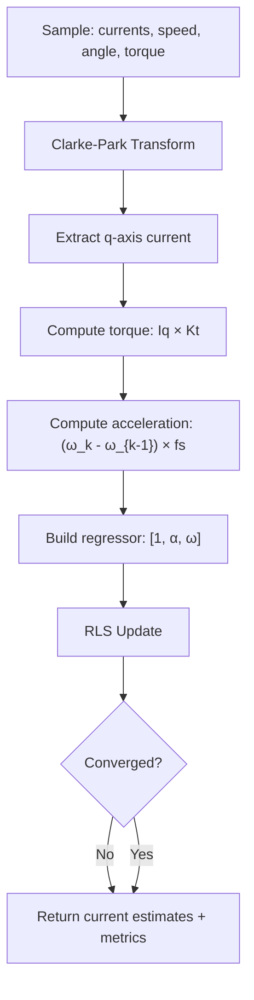

# Friction and Inertia Estimation

This document describes the theory and implementation details of the real-time mechanical parameter estimation in `e-foc`. Specifically, it covers how viscous friction ($B$) and moment of inertia ($J$) are estimated using Recursive Least Squares (RLS).

## Theory: Equation of Motion

A BLDC/PMSM motor's mechanical dynamics can be described by:

$$ \tau = J \ddot{\theta} + B \dot{\theta} + \tau_0 $$

Where:
* $\tau$ is the electromagnetic torque [Nm].
* $J$ is the moment of inertia [Nm·s²].
* $B$ is the viscous friction coefficient [Nm·s/rad].
* $\dot{\theta}$ is the angular velocity [rad/s].
* $\ddot{\theta}$ is the angular acceleration [rad/s²].
* $\tau_0$ is a constant (Coulomb friction / offset) [Nm].

This can be written in regressor form for parameter estimation:

$$ \tau = \begin{bmatrix} 1 & \ddot{\theta} & \dot{\theta} \end{bmatrix} \begin{bmatrix} \tau_0 \\ J \\ B \end{bmatrix} $$

Which maps directly to the RLS model $y = \phi^T \theta$ with 3 features.

## Recursive Least Squares (RLS)

RLS is used instead of batch least squares because:

1. **Real-time**: estimates are updated sample-by-sample without storing history.
2. **Memory-efficient**: only the covariance matrix $P$ ($3 \times 3$) and coefficient vector $\theta$ ($3 \times 1$) are stored.
3. **Adaptive**: the forgetting factor $\lambda$ (typically 0.99–0.999) allows tracking of slowly-varying parameters.

### Update Equations

At each sample $k$:

$$ K_k = \frac{P_{k-1} \phi_k}{\lambda + \phi_k^T P_{k-1} \phi_k} $$

$$ \theta_k = \theta_{k-1} + K_k (y_k - \phi_k^T \theta_{k-1}) $$

$$ P_k = \frac{1}{\lambda} (P_{k-1} - K_k \phi_k^T P_{k-1}) $$

Where:
* $K_k$ is the Kalman gain vector.
* $\lambda$ is the forgetting factor.
* $\phi_k$ is the regressor vector $[1, \ddot{\theta}_k, \dot{\theta}_k]^T$.
* $y_k$ is the measured torque.

### Convergence

The estimator reports convergence when:
* Innovation $|y_k - \phi_k^T \theta_{k-1}|$ falls below a threshold (default: $10^{-4}$).
* Uncertainty (trace of the gain) falls below a threshold (default: $10^{-2}$).

## Numerical Properties

| Property          | Value / Note                                                    |
|-------------------|-----------------------------------------------------------------|
| Complexity        | $O(n^2)$ per sample, where $n = 3$ (features)                  |
| Memory            | Fixed: $3 \times 3$ covariance + $3 \times 1$ coefficients     |
| Stability         | Forgetting factor $\lambda < 1$ prevents covariance wind-up    |
| Range             | Works for any motor size; initial covariance $P_0 = 1000 I$    |
| Sampling rate     | Must match the outer loop frequency of the speed controller     |

### Sensitivity

* **Forgetting factor** ($\lambda$): Lower values (e.g., 0.99) adapt faster but are noisier. Higher values (e.g., 0.999) are smoother but slower to converge.
* **Sampling frequency**: Acceleration is computed via finite differences ($\ddot{\theta} \approx (\dot{\theta}_k - \dot{\theta}_{k-1}) \cdot f_s$), so adequate sampling rate is essential for accuracy.
* **Torque estimation**: The electromagnetic torque is derived from the q-axis current via Clarke-Park transform, so accurate current sensing and electrical angle are required.

## Implementation Details

The implementation is located in [source/services/mechanical_system_ident/RealTimeFrictionAndInertiaEstimator.cpp](../../source/services/mechanical_system_ident/RealTimeFrictionAndInertiaEstimator.cpp).

### Process

1. **Clarke-Park Transform**: Phase currents are transformed to the rotating reference frame using the electrical angle to obtain $I_q$.
2. **Torque Calculation**: Electromagnetic torque is computed as $\tau = I_q \times K_t$.
3. **Acceleration**: Computed from the finite difference of consecutive speed measurements, scaled by sampling frequency.
4. **Regressor Construction**: The regressor vector $[1, \ddot{\theta}, \dot{\theta}]$ is built via `MakeRegressor`.
5. **RLS Update**: The estimator updates coefficients and returns metrics (innovation, residual, uncertainty).

### Coefficient Mapping

After estimation, the coefficient vector $\theta$ maps to physical parameters:

| Index | Coefficient | Physical Quantity        | Unit       |
|-------|-------------|--------------------------|------------|
| 0     | $\tau_0$    | Coulomb friction / bias  | Nm         |
| 1     | $J$         | Moment of inertia        | Nm·s²      |
| 2     | $B$         | Viscous friction         | Nm·s/rad   |

### Code Reference

* `RealTimeFrictionAndInertiaEstimator::Update`: Per-sample estimation update.
* `FrictionAndInertiaEstimator::Result`: Return struct with `inertia` ($J$, `NewtonMeterSecondSquared`) and `friction` ($B$, `NewtonMeterSecondPerRadian`).
* `MechanicalParametersIdentificationImpl`: Service-level wrapper that integrates with the FOC speed controller for closed-loop identification.
