| Field     | Value                                                          |
|-----------|----------------------------------------------------------------|
| Title     | Mechanical Parameters Identification — Friction and Inertia   |
| Type      | theory                                                         |
| Status    | approved                                                       |
| Version   | 1.0.0                                                          |
| Component | service-mechanical-ident                                       |
| Date      | 2025-01-01                                                     |

## Overview

Accurate knowledge of the mechanical plant parameters — rotor moment of inertia $J$, viscous friction
coefficient $B$, and Coulomb (static) friction torque $\tau_0$ — is required to design an optimal speed
or position loop, to implement feed-forward compensation, and to estimate system health over time.

This identification procedure uses **Recursive Least Squares (RLS)** to fit the parameters of Newton's
rotational equation of motion to real-time measurements of torque (estimated from $i_q$) and speed/
acceleration (derived from the encoder). RLS operates online in every control cycle, converging to the
true parameters as the motor is excited with varying speed profiles.

---

## Prerequisites

| Symbol       | Meaning                                                    | Unit       |
|--------------|------------------------------------------------------------|------------|
| $J$          | Rotor moment of inertia                                    | kg·m²      |
| $B$          | Viscous friction coefficient                               | N·m·s/rad  |
| $\tau_0$     | Coulomb friction (static offset)                           | N·m        |
| $\tau_e$     | Electrical (motor) torque = $\frac{3}{2}p\psi_f i_q$     | N·m        |
| $\tau_{load}$| External load torque (treated as disturbance)              | N·m        |
| $\omega$     | Rotor mechanical angular velocity                          | rad/s      |
| $\alpha$     | Rotor angular acceleration = $\dot\omega$                  | rad/s²     |
| $\mathbf{\theta}$ | Parameter vector $[J,\ B,\ \tau_0]^T$              | mixed      |
| $\mathbf{\phi}$   | Regressor vector $[\alpha,\ \omega,\ 1]^T$          | mixed      |
| $\lambda$    | RLS forgetting factor                                      | —          |
| $\mathbf{P}$ | Error covariance matrix (3×3)                              | —          |
| $\mathbf{K}$ | Kalman gain vector (3×1)                                   | —          |

---

## Mathematical Foundation

### 1. Mechanical Equation of Motion

The PMSM rotor dynamics are described by Newton's second law for rotation. Assuming viscous friction
and a constant Coulomb friction offset:

$$
\tau_e = J\dot\omega + B\omega + \tau_0 + \tau_{load}
$$

Ignoring unmeasured load torque (treated as noise by the estimator), this becomes a **linear regression**:

$$
\tau_e = \mathbf{\phi}^T \mathbf{\theta}
$$

where:

$$
\mathbf{\phi} = \begin{pmatrix}\dot\omega \\ \omega \\ 1\end{pmatrix}, \qquad
\mathbf{\theta} = \begin{pmatrix}J \\ B \\ \tau_0\end{pmatrix}
$$

The regression form makes the parameter vector $\mathbf{\theta}$ directly estimable from measured
input-output data $(\mathbf{\phi}, \tau_e)$ using least squares.

### 2. Batch Least Squares (Background)

If $N$ measurements are collected:
$$
\mathbf{y} = \mathbf{\Phi}\,\mathbf{\theta} + \mathbf{e}
$$

where $\mathbf{y} \in \mathbb{R}^N$ is the torque sequence, $\mathbf{\Phi} \in \mathbb{R}^{N \times 3}$
is the regressor matrix, and $\mathbf{e}$ is noise. The ordinary least-squares solution is:

$$
\hat{\mathbf{\theta}} = (\mathbf{\Phi}^T\mathbf{\Phi})^{-1}\mathbf{\Phi}^T\mathbf{y}
$$

This requires storing all $N$ measurements and inverting a 3×3 matrix. RLS computes the same result
recursively, processing one sample at a time with $O(n^2)$ cost where $n=3$ is the number of parameters.

### 3. Recursive Least Squares — Derivation

Define the weighted least-squares cost with exponential forgetting factor $\lambda \in (0, 1]$:

$$
J_N = \sum_{k=1}^{N} \lambda^{N-k}\!\left(\tau_e[k] - \mathbf{\phi}[k]^T\hat{\mathbf{\theta}}\right)^2
$$

The exponential weight $\lambda^{N-k}$ discounts older measurements, giving the estimator a finite
effective memory window of $\approx 1/(1-\lambda)$ samples.

Applying the **matrix inversion lemma (Woodbury identity)** to the recursive update of
$\mathbf{P}_N = (\sum_{k=1}^N \lambda^{N-k}\mathbf{\phi}[k]\mathbf{\phi}[k]^T)^{-1}$ yields:

$$
\boxed{
\mathbf{K}[n] = \frac{\mathbf{P}[n-1]\,\mathbf{\phi}[n]}{\lambda + \mathbf{\phi}[n]^T\mathbf{P}[n-1]\,\mathbf{\phi}[n]}
}
$$

$$
\boxed{
\hat{\mathbf{\theta}}[n] = \hat{\mathbf{\theta}}[n-1] + \mathbf{K}[n]\!\left(\tau_e[n] - \mathbf{\phi}[n]^T\hat{\mathbf{\theta}}[n-1]\right)
}
$$

$$
\boxed{
\mathbf{P}[n] = \frac{1}{\lambda}\!\left(\mathbf{I} - \mathbf{K}[n]\,\mathbf{\phi}[n]^T\right)\mathbf{P}[n-1]
}
$$

The scalar $e[n] = \tau_e[n] - \mathbf{\phi}[n]^T\hat{\mathbf{\theta}}[n-1]$ is called the **innovation**
(prediction error). The gain $\mathbf{K}$ weights how much to move the estimate in response to the innovation.

#### Forgetting Factor

For $\lambda = 1$ (no forgetting) the RLS is equivalent to batch LS over the entire history. For
$\lambda < 1$ older data is exponentially discounted. The effective memory window is:

$$
N_{eff} = \frac{1}{1 - \lambda}
$$

With $\lambda = 0.998$: $N_{eff} = 500$ samples. This allows the estimator to track slow parameter
variations (e.g. bearing wear increasing $B$) without diverging from the current plant.

**Trade-off**: smaller $\lambda$ → faster tracking, higher noise sensitivity. At $\lambda = 0.998$
and 1 kHz update rate, the effective window is 500 ms — appropriate for slowly varying mechanical
parameters.

### 4. Torque and Kinematics Estimation

**Torque**: The motor torque is estimated from the q-axis current:

$$
\tau_e = \frac{3}{2}\,p\,\psi_f\,i_q = K_T\, i_q
$$

The torque constant $K_T = \frac{3}{2}p\psi_f$ must be known from the electrical identification stage
or from the motor datasheet.

**Speed**: Measured directly from the encoder as:

$$
\omega[n] = \frac{\theta_m[n] - \theta_m[n-1]}{T_s}
$$

**Acceleration**: Estimated by finite difference of speed:

$$
\dot\omega[n] = \frac{\omega[n] - \omega[n-1]}{T_s}
$$

The double finite difference amplifies measurement noise. A low-pass filter (e.g. moving average) on
$\omega$ before differentiation reduces this effect at the cost of bandwidth.

### 5. Convergence Criteria

The algorithm has converged to reliable estimates when:

1. **Innovation is small**: $|e[n]| = |\tau_e[n] - \mathbf{\phi}[n]^T\hat{\mathbf{\theta}}[n]| < \epsilon_e$

   This indicates the model fits the data well (low residual error).

2. **Gain trace is small**: $\mathrm{tr}(\mathbf{K}[n]) < \epsilon_K$

   This indicates the covariance has collapsed (the estimator is no longer updating significantly),
   i.e. the estimate has stabilised.

The two thresholds in use: $\epsilon_e = 10^{-4}$ and $\epsilon_K = 10^{-2}$.

The gain trace criterion is a proxy for $\mathrm{tr}(\mathbf{P}[n])$ shrinking, which proves that
$\hat{\mathbf{\theta}}[n]$ has converged to a minimum-variance estimate given the data.

### 6. Observability Requirement

RLS identifies $J$, $B$, and $\tau_0$ simultaneously only if the regressor matrix $\mathbf{\Phi}$
is **persistently exciting** of order 3 — i.e. the columns $[\dot\omega, \omega, 1]$ are linearly
independent over the observation window. In practice this requires:

- $\dot\omega \neq 0$: the motor must accelerate and decelerate (constant-speed operation cannot
  identify $J$).
- $\omega$ must vary over a sufficient range to separate $B\omega$ from $\tau_0$.
- Both positive and negative torques should appear if possible (else $\tau_0$ is poorly identified).

A typical identification profile: triangular speed reference — ramp up, hold briefly, ramp down —
repeated $\ge 2$ times.

---

## Block Diagrams

### RLS Signal Flow

```mermaid
graph TD
    ENC[Encoder θ_m] --> SPD[Speed ω\nfinite difference]
    SPD --> ACC[Acceleration α\nfinite difference]
    IQ[Current i_q] --> TRQ[Torque τ_e\n= K_T · i_q]

    ACC --> REG[Regressor φ\n= &#91;α, ω, 1&#93;]
    SPD --> REG

    REG --> KG[Gain K\n= P·φ / λ + φᵀPφ]
    TRQ --> INN[Innovation e\n= τ_e − φᵀθ̂]
    KG --> UPD[θ̂ update\nθ̂ += K·e]
    INN --> UPD
    REG --> COV[P update\nP = 1/λ·I−Kφᵀ·P]
    KG --> COV

    UPD --> OUT_J[Ĵ = θ̂&#91;1&#93;]
    UPD --> OUT_B[B̂ = θ̂&#91;2&#93;]
    UPD --> OUT_T[τ̂₀ = θ̂&#91;3&#93;]

    COV --> CONV{Convergence\ncheck}
    UPD --> CONV
    CONV -->|tr K < ε_K\nAND &#124;e&#124; < ε_e| DONE[Converged]
```



### Effective Memory Window (Forgetting Factor)

```
Sample weight w[k] = λ^(N-k)

w │
1.0│ ●
   │  ●
   │    ●
0.5│       ●
   │          ●
   │               ●
   │                    ●
0.0└─────────────────────────────→ k (samples into past)
   N   N-50  N-100  N-200  N-500
            ↑
       N_eff = 500 samples at λ=0.998
       (data older than ~500 samples has weight < 0.37)
```

---

## Numerical Properties

| Property              | Value / Condition                                           |
|-----------------------|-------------------------------------------------------------|
| Parameter vector size | 3: $[J,\ B,\ \tau_0]^T$                                    |
| Covariance matrix     | $3\times 3$ symmetric positive definite                    |
| Forgetting factor     | $\lambda = 0.998$                                          |
| Effective window      | $N_{eff} = 1/(1-\lambda) = 500$ samples                   |
| Convergence check $\epsilon_e$ | $10^{-4}$ (innovation threshold)               |
| Convergence check $\epsilon_K$ | $10^{-2}$ (gain trace threshold)               |
| RLS per-step cost     | $O(n^2) = O(9)$ — 9 multiply-add ops for $n=3$             |
| Numerical stability   | $\mathbf{P}$ can become indefinite; use regularisation if $\lambda < 1$ for long runs |
| Initialisation        | $\mathbf{P}_0 = \alpha_0 \mathbf{I}$, $\hat{\mathbf{\theta}}_0 = \mathbf{0}$ |

### Sensitivity Analysis

| Source of Error                | Effect                                                          |
|--------------------------------|-----------------------------------------------------------------|
| $K_T$ error                    | All parameters scaled proportionally ($\tau_e$ is biased)     |
| Encoder quantisation           | Noise on $\alpha$; use long averaging window                   |
| Constant-speed operation       | $J$ unidentifiable ($\dot\omega = 0$ makes regressor rank-deficient) |
| Very short identification time | $\mathbf{P}$ not collapsed; noisy estimates                    |
| $\lambda$ too large            | Slow convergence to parameter changes                          |
| $\lambda$ too small            | Noisy, unstable estimates at steady state                      |

---

## Worked Example

Motor: $J = 2 \times 10^{-4}\ \text{kg·m}^2$, $B = 5 \times 10^{-4}\ \text{N·m·s/rad}$,
$\tau_0 = 0.01\ \text{N·m}$, $K_T = 0.3\ \text{N·m/A}$, $f_s = 1\ \text{kHz}$.

**Regressor at one sample** with $\dot\omega = 50\ \text{rad/s}^2$, $\omega = 100\ \text{rad/s}$,
$i_q = 2\ \text{A}$:

$$
\mathbf{\phi} = \begin{pmatrix}50\\ 100\\ 1\end{pmatrix}, \quad
\tau_e = K_T\, i_q = 0.3 \times 2 = 0.6\ \text{N·m}
$$

**True output**:

$$
\mathbf{\phi}^T\mathbf{\theta}_{true} = 50 \times 2\times10^{-4} + 100 \times 5\times10^{-4} + 0.01
= 0.01 + 0.05 + 0.01 = 0.07\ \text{N·m}
$$

The difference 0.6 − 0.07 = 0.53 N·m is the load torque $\tau_{load}$, which becomes the innovation
residual from the estimator perspective — it will be treated as noise and averaged out over
$N_{eff}$ samples.

---

## Limitations & Assumptions

- **Assumes**: $\tau_{load}$ is zero mean over the effective window (i.e. no sustained external load
  that would be attributed to $\tau_0$ or $J$).
- **Assumes**: Motor torque constant $K_T$ is known a priori (from electrical identification).
- **Assumes**: The mechanical system is linear in $J$, $B$, $\tau_0$ — nonlinear effects (e.g.
  position-dependent cogging, Stribeck friction) are not modelled.
- **Does not handle**: Rapidly varying $J$ (e.g. moving load). The $N_{eff} = 500$ sample window
  means changes faster than 500 ms update time are tracked with lag.
- **Does not handle**: Identification in the presence of external vibration or impact loads.

## References

1. Ljung, L. — *System Identification: Theory for the User*, 2nd ed., Prentice Hall, 1999.
2. Åström, K.J. & Wittenmark, B. — *Adaptive Control*, 2nd ed., Addison-Wesley, 1995.
3. Kim, J.-H. et al. — "Online Parameter Identification of PMSM Using Recursive Least-Squares Algorithm",
   *IEEE International Electric Machines and Drives Conference*, 2007.
