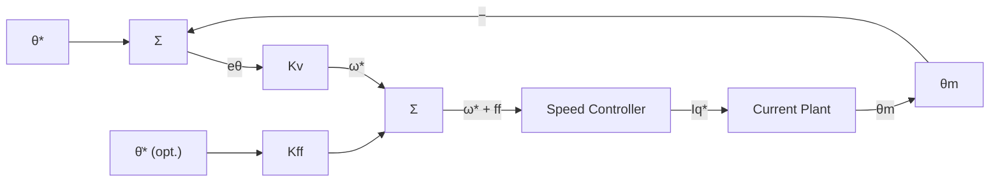

| Field     | Value                         |
|-----------|-------------------------------|
| Title     | Position Loop — P2: Cascade P |
| Type      | theory                        |
| Status    | draft                         |
| Version   | 1.0.0                         |
| Component | position-loop-cascade-p       |
| Date      | 2026-08-31                    |

> **Theory document**: Explains the mathematical and engineering principles behind a component or algorithm.
> This document is descriptive — it records the *why* and *how* at a scientific level, independent of any
> specific implementation. Equations use KaTeX ($inline$ and $$block$$). Block diagrams use Mermaid or
> ASCII art.

---

## Overview

P2 (Cascade P→PI) is the industry-standard servo position architecture used by SERCOS, EtherCAT,
and most industrial servo drives. A proportional position controller outputs a speed reference which
is tracked by the inner speed loop. The single parameter $K_v$ (velocity loop gain) directly sets
the position-loop bandwidth in a physically transparent way — the baseline architecture servo
engineers expect to configure. No parameter identification is required.

Operates exclusively in the **1 kHz outer handler**.

---

## Prerequisites

| Symbol          | Meaning                                                    | Unit          |
|-----------------|------------------------------------------------------------|---------------|
| $K_v$           | Velocity loop gain (position controller proportional gain) | rad/s per rad |
| $K_{ff}$        | Velocity feedforward fraction                              | —             |
| $\omega_{bw}^s$ | Inner speed-loop closed-loop bandwidth                     | rad/s         |

See `documentation/theory/foc-plant-models.md` §3 for the position plant derivation.

---

## Mathematical Foundation

All position-loop controllers operate on the **discrete two-state position plant** from
`documentation/theory/foc-plant-models.md` §3:

$$
A_d^p = \begin{pmatrix} 1 & T_s^o \\ 0 & A_d^o \end{pmatrix},\;
B_d^p = \begin{pmatrix} 0 \\ B_d^o \end{pmatrix}
$$

P2 treats the speed loop as ideal and closes only the outer position loop with a proportional gain.

---

## P2 — Cascade P→PI Position Control

**Control law** (position P controller):

$$
\boxed{\omega_m^*[k] = K_v \cdot (\theta_m^*[k] - \theta_m[k])}
$$

The speed reference $\omega_m^*[k]$ is passed to the selected speed-loop controller (PID, LQI,
ADRC, or Two-DOF). Cascade P is a position-loop choice; it does not constrain the speed-loop algorithm.

**Position-loop bandwidth**:

$$
\omega_{pos} \approx K_v
$$

Valid under cascade separation: $K_v \leq \omega_{speed}/5$.

**Velocity feedforward extension**:

$$
\omega_m^*[k] = K_v\,(\theta_m^*[k] - \theta_m[k]) + K_{ff}\,\dot{\theta}_m^*[k]
$$

With $K_{ff} = 1$, steady-state velocity tracking error is theoretically zero. Use $K_{ff} \in (0,1)$
when the velocity reference signal carries noise.

**Tuning**:
- $K_v$ (rad/s / rad): start at $\omega_{speed}/5$.
- $K_{ff} \in [0,\,1]$: start at 0; increase after speed loop is tuned and stable.

---

## Numerical Properties

| Property                    | Value                              |
|-----------------------------|------------------------------------|
| Ops per 1 kHz cycle         | 2 MACs                             |
| Steady-state position error | Speed-loop dependent; zero at rest |
| Industry prevalence         | Dominant in industrial servo       |
| Requires J, Bf              | No                                 |
| Tuning knobs                | 1–2 ($K_v$, optional $K_{ff}$)     |

---

## Limitations & Assumptions

- Treat speed loop as ideal. Requires a properly tuned inner speed loop.
- $K_v \leq \omega_{speed}/5$ is a hard stability limit. Exceeding it causes oscillation.
- Velocity feedforward $K_{ff}$ requires a clean velocity reference. Apply a derivative filter before
  computing $\dot{\theta}_m^*$ from a noisy position reference.
- Encoder noise enters position and velocity estimates. A state observer upstream improves robustness.

---

## References

1. Krishnan, R. — *Permanent Magnet Synchronous and Brushless DC Motor Drives*, CRC Press, 2010.
2. Åström, K.J. & Wittenmark, B. — *Computer-Controlled Systems*, 3rd ed., Prentice Hall, 1997.
3. Åström, K.J. & Hägglund, T. — *Advanced PID Control*, ISA, 2006.
