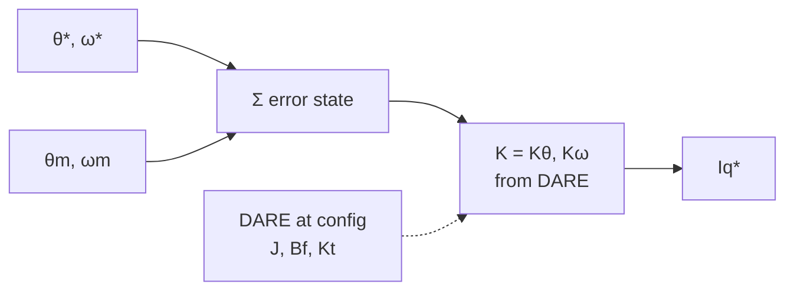
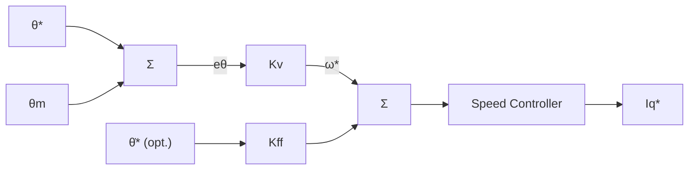

| Field     | Value                                          |
|-----------|------------------------------------------------|
| Title     | Position Loop Controllers and Friction Compensation |
| Type      | theory                                         |
| Status    | draft                                          |
| Version   | 0.1.0                                          |
| Component | position-loop-controllers                      |
| Date      | 2026-08-10                                     |

> **Theory document**: Explains the mathematical and engineering principles behind a component or algorithm.
> This document is descriptive — it records the *why* and *how* at a scientific level, independent of any
> specific implementation. Equations use KaTeX ($inline$ and $$block$$). Block diagrams use Mermaid or
> ASCII art.

---

## Overview

This document covers the four advanced position-loop controller algorithms and the friction
compensation feedforward augmentation. All position-loop controllers operate exclusively in the
**1 kHz low-priority handler**. They are not valid for the current or speed loops.

**Plant model prerequisite**: All controllers operate on the discrete two-state position plant
derived in `documentation/theory/foc-plant-models.md` Section 3:

$$
\begin{pmatrix} \theta_m[k+1] \\ \omega_m[k+1] \end{pmatrix}
=
A_d^p
\begin{pmatrix} \theta_m[k] \\ \omega_m[k] \end{pmatrix}
+ B_d^p\, u[k]
$$

The control output $u = i_q^*$ is passed to the speed loop (for Cascade P) or directly to the
current loop (for LQR/LQI, Two-DOF, ILC used in torque mode).

| Algorithm | Key Advantage |
|-----------|---------------|
| P1 — LQR / LQI | Optimal simultaneous position and velocity regulation; DARE-computed gains |
| P2 — Cascade P→PI | Industry-standard servo architecture; single transparent Kv parameter |
| P3 — Two-DOF | Decoupled command tracking and load stiffness; servo-grade positioning |
| P4 — ILC | Near-zero residual error on repetitive tasks after a few learning cycles |
| Friction augmentation | Cancels Coulomb and Stribeck friction; eliminates hunting at rest |

---

## Prerequisites

| Symbol | Meaning | Unit |
|--------|---------|------|
| $A_d^p, B_d^p$ | Discrete position plant matrices | — |
| $K_\theta, K_\omega$ | LQR position and velocity gains | A/rad, A·s/rad |
| $K_v$ | Cascade P velocity loop gain | rad/s per rad |
| $K_{ff}$ | Velocity feedforward fraction | — |
| $\tau_{ff}$ | Two-DOF pre-filter time constant | s |
| $Q, \ell$ | ILC robustness filter and learning gain | — |
| $N$ | ILC trial length in samples | — |
| $T_c, T_s, \omega_{st}$ | Coulomb, static, and Stribeck friction parameters | N·m, N·m, rad/s |

See `documentation/theory/foc-plant-models.md` for all base symbols.

---

## Mathematical Foundation

All position-loop controllers operate on the **discrete two-state position plant** from
`documentation/theory/foc-plant-models.md` Section 3:

$$
\begin{pmatrix} \theta_m[k+1] \\ \omega_m[k+1] \end{pmatrix}
= A_d^p \begin{pmatrix} \theta_m[k] \\ \omega_m[k] \end{pmatrix} + B_d^p\,u[k], \quad
A_d^p = \begin{pmatrix} 1 & T_s^o \\ 0 & A_d^o \end{pmatrix},\;
B_d^p = \begin{pmatrix} 0 \\ B_d^o \end{pmatrix}
$$

The control input $u = i_q^*$ is passed to the speed loop (Cascade P, Two-DOF) or directly to
the current loop (LQR/LQI in direct torque mode). P4 (ILC) augments any stable feedback
controller with a per-sample learned feedforward. Friction compensation adds a nonlinear Iq
correction outside the linear plant model.

---

## P1 — LQR / LQI Position Control

**Motivation**: A position P-controller on top of a speed PI gives ad-hoc gain selection with no
principled trade-off between position error, speed overshoot, and control effort. LQR state-feedback
simultaneously regulates both $\theta_m$ and $\omega_m$ with a single gain vector derived from the
physical plant parameters and an explicit performance cost.

**LQR gain design**: For the discrete position plant $(A_d^p, B_d^p)$, solve the DARE:

$$
P = (A_d^p)^T P A_d^p - (A_d^p)^T P B_d^p\bigl(R + (B_d^p)^T P B_d^p\bigr)^{-1}(B_d^p)^T P A_d^p + Q
$$

Optimal gain vector with $Q = \mathrm{diag}(q_\theta, q_\omega)$:

$$
\mathbf{K} = [K_\theta,\; K_\omega] = \bigl(R + (B_d^p)^T P B_d^p\bigr)^{-1}(B_d^p)^T P A_d^p
$$

**LQR control law** (2 multiplications + 1 addition at run time):

$$
u[k] = -K_\theta\,(\theta_m[k] - \theta_m^*[k]) - K_\omega\,(\omega_m[k] - \omega_m^*[k])
$$

**LQI extension**: Add an integral state $x_I[k+1] = x_I[k] + (\theta_m^*[k] - \theta_m[k])$ for
zero steady-state error under constant load. Augmented gains $[K_\theta, K_\omega, K_I]$ computed
from the same DARE structure extended to dimension 3.

**Tuning**:
- $q_\theta$: position error penalty. Increase to tighten position accuracy.
- $q_\omega$: velocity error penalty. Increase to reduce overshoot and ringing.
- $R$: input penalty. Maps directly to peak $i_q^*$; set $R = 1/I_{q,max}^2$ as a starting point.

**Stability**: The closed-loop matrix $A_d^p - B_d^p \mathbf{K}$ must have all eigenvalues strictly
inside the unit circle. Guaranteed by the DARE solution when the plant is controllable.

**Relation to toolbox**: `Lqr<float,2,1>` provides the gain container. DARE computed at configuration
time via `DiscreteAlgebraicRiccatiEquation`. `IntegralStateFeedbackLqi` provides the LQI variant.

<!-- tikz:diagrams/position-loop-lqr.tex -->

<!-- /tikz -->

---

## P2 — Cascade P→PI Position Control

**Motivation**: The industry-standard servo position architecture used by SERCOS, EtherCAT, and most
industrial servo drives. A proportional position controller outputs a speed reference which is tracked
by the inner speed loop. The single parameter $K_v$ (velocity loop gain) directly sets the
position-loop bandwidth in a physically transparent way — the baseline architecture servo engineers
expect to configure.

**Control law** (position P controller):

$$
\boxed{\omega_m^*[k] = K_v \cdot (\theta_m^*[k] - \theta_m[k])}
$$

The speed reference $\omega_m^*[k]$ is passed to the selected speed-loop controller (PID, LQI,
ADRC, or Two-DOF). Cascade P is a position-loop choice; it does not constrain the speed-loop algorithm.

<!-- tikz:diagrams/position-loop-cascade-p.tex -->

<!-- /tikz -->

**Position-loop bandwidth**:

$$
\omega_{pos} \approx K_v
$$

Valid under cascade separation: $K_v \leq \omega_{speed}/5$.

**Velocity feedforward extension**:

$$
\omega_m^*[k] = K_v\,(\theta_m^*[k] - \theta_m[k]) + K_{ff}\,\dot{\theta}_m^*[k]
$$

With $K_{ff} = 1$, steady-state velocity tracking error is theoretically zero. Use $K_{ff} \in (0,1)$
when the velocity reference signal carries noise.

**Tuning**:
- $K_v$ (rad/s / rad): start at $\omega_{speed}/5$.
- $K_{ff} \in [0,\,1]$: start at 0; increase after speed loop is tuned and stable.

---

## P3 — Two-DOF Position Control

**Motivation**: Identical in principle to S3 (Two-DOF speed), applied to the position loop. The
reference pre-filter $F(z)$ shapes how the position setpoint is approached, independently from the
feedback loop designed for load-disturbance stiffness. This eliminates the fundamental tracking
vs. stiffness tradeoff inherent in single-DOF position controllers.

**Structure**: A PD or LQR feedback controller acts on the pre-filtered position error:

$$
e_{fb}[k] = F(z)\,\theta_m^*[k] - \theta_m[k]
$$

**Relation to P2**: When $F(z) = 1$ and the feedback controller is a proportional P, the structure
collapses to Cascade P→PI. Two-DOF position control is the generalisation — $F(z)$ independently
shapes tracking and the feedback controller independently shapes stiffness.

**Relation to toolbox**: `Feedforward2Dof` implements this structure.

**Tuning**: $\tau_{ff}$ for tracking speed; feedback gains for disturbance rejection. As S3.

---

## P4 — Iterative Learning Control (ILC)

**Motivation**: For repetitive servo tasks — pick-and-place, CNC passes, inspection cycles — the
same position tracking error recurs on every trial because the same reference is executed against
the same mechanical dynamics. ILC exploits this: it learns the per-sample feedforward correction
that cancels the repeating error over successive trials until the residual is near the sensor noise
floor. No other controller achieves this tracking accuracy for periodic tasks.

**D-type update law**: Let $e^{(j)}[k] = \theta_m^*[k] - \theta_m^{(j)}[k]$ be the position error
on trial $j$ at sample $k$:

$$
\boxed{u_{ILC}^{(j+1)}[k] = Q \cdot \Bigl(u_{ILC}^{(j)}[k] + \ell \cdot e^{(j)}[k+1]\Bigr)}
$$

where:
- $Q \in (0,\,1]$: robustness filter. $Q < 1$ suppresses high-frequency noise at the cost of slower
  convergence. Typical: $Q = 0.95$.
- $\ell > 0$: learning gain. Convergence guaranteed for $\ell \in (0,\,2)$ on a unity-gain plant.

**Total control signal**: Learned correction added as feedforward to any position feedback controller:

$$
u_{total}^{(j)}[k] = u_{fb}^{(j)}[k] + u_{ILC}^{(j)}[k]
$$

$u_{fb}$ is the output of the active position feedback controller (P2, P1, or P3). ILC does not
replace the feedback controller — it augments it.

**Storage**: One full trial of $N$ samples stored in a bounded array. At 1 kHz, a 5-second trial
requires $N = 5000$ floats (20 kB). $N$ is fixed at build time; ILC is the only position algorithm
whose storage scales with trial duration.

**Convergence condition**: $|Q(1 - \ell\,P_{nom})| < 1$ across all frequencies, where $P_{nom}$
is the nominal position plant. Guaranteed by $Q < 1$ and $\ell$ within its stability range.

**Tuning**:
- $N$: trial length in samples (must exactly match the repetitive task period).
- $Q$: robustness vs. convergence speed tradeoff.
- $\ell$: learning rate. Start at $0.5$, increase toward $1.0$.

---

## Augmentation — Friction Compensation Feedforward

**Scope**: Friction compensation is not a selectable algorithm — it is an independently enabled
feedforward that stacks on top of any speed or position feedback controller. It is documented here
because it is essential for servo precision and its parameters come from a dedicated identification
step separate from the RLS calibration.

**Motivation**: Viscous friction ($B_f \cdot \omega_m$) is estimated by the mechanical RLS and
compensated implicitly by the feedback controllers. Coulomb and Stribeck friction are nonlinear:
at low speeds the motor sticks until the drive overcomes the static breakaway torque, then slips.
This creates position hunting at rest and velocity ripple during slow moves — the classic precision
servo failure mode that no linear feedback controller can fully eliminate.

**Friction model** (Coulomb + Stribeck):

$$
\boxed{T_f(\omega_m) = \Bigl[T_c + (T_s - T_c)\,e^{-(\omega_m/\omega_{st})^2}\Bigr]\cdot\mathrm{sgn}(\omega_m)}
$$

where:
- $T_c$: Coulomb (kinetic) friction torque — the flat plateau at moderate speed
- $T_s$: static (breakaway) torque, $T_s > T_c$ — the peak at near-zero speed
- $\omega_{st}$: Stribeck velocity — speed at which kinetic friction reaches its minimum

**Current feedforward**: Converting friction torque to $i_q$ and injecting before the current loop:

$$
i_{ff}(\omega_m) = \frac{T_f(\omega_m)}{K_t}
$$
$$
i_q^{*,total} = i_q^{*,ctrl} + i_{ff}(\omega_m)
$$

**Dead-zone smoothing**: The $\mathrm{sgn}(\omega_m)$ discontinuity at $\omega_m = 0$ must be
replaced with a linear ramp over $\pm\omega_{dead}$ to prevent chattering during direction reversals
and holding. Typical $\omega_{dead} = 0.05$–$0.2$ rad/s.

**Parameter identification**: $T_c$, $T_s$, and $\omega_{st}$ require a dedicated friction sweep
(ramp velocity at steady state while logging $i_q^*$). This is separate from the mechanical RLS,
which estimates only the linear viscous coefficient $B_f$.

**Tuning**:
- $T_c$ (N·m): read from the $i_q^* \times K_t$ plateau at constant low speed.
- $T_s$ (N·m): read from the breakaway $i_q^*$ at near-zero speed.
- $\omega_{st}$ (rad/s): speed at which the $i_q^*$ vs. $\omega_m$ curve reaches its kinetic minimum.

---

## Numerical Properties

| Property | PID | Cascade P (P2) | LQR/LQI (P1) | Two-DOF (P3) | ILC (P4) |
|----------|:---:|:--------------:|:------------:|:------------:|:--------:|
| Ops per 1 kHz cycle | ~6 MACs | 2 MACs | 4 MACs | ~8 MACs | 2 MACs + array read |
| Steady-state position error | Zero (D) | Speed-loop dep. | Zero (LQI) | Configurable | Near-zero after learning |
| Tracking vs. stiffness | Coupled | Coupled | Coupled | Decoupled | N/A — periodic only |
| Industry prevalence | Common | Dominant in servo | Modern servo | Modern servo | Specialist |
| Requires J, Bf | No | No | Yes | No | No |
| Storage | Constant | Constant | Constant | Constant | N × float (bounded array) |

---

## Limitations & Assumptions

**All position controllers**:
- Treat speed loop as ideal. P2 (Cascade P) requires a properly tuned inner speed loop.
- Encoder noise enters position and velocity estimates. A Luenberger or Kalman state observer
  upstream of any position controller improves robustness.

**P1 — LQR/LQI**:
- Assumes current loop is ideal. Current-loop transient delay acts as a pure time delay reducing
  achievable LQR bandwidth. Use a conservative $q_\omega / q_\theta$ ratio to account for this.
- LQI integral state must be clamped during mechanical hard stops (anti-windup required).

**P2 — Cascade P→PI**:
- $K_v \leq \omega_{speed}/5$ is a hard stability limit. Exceeding it causes oscillation.
- Velocity feedforward $K_{ff}$ requires a clean velocity reference. Apply a derivative filter before
  computing $\dot{\theta}_m^*$ from a noisy position reference.

**P3 — Two-DOF**:
- Pre-filter pole must be faster than the desired closed-loop position bandwidth. Verify that
  $1/\tau_{ff} > \omega_{pos}$.

**P4 — ILC**:
- Only valid for strictly repetitive references. A changed reference period or non-repeatable
  reference (jogging) will cause the learned correction from the previous trial to degrade tracking.
- Trial length $N$ is fixed at selection time. It cannot change at runtime.
- ILC requires a stable inner feedback controller (P1, P2, or P3). ILC alone does not stabilise
  position — it only improves tracking of the feedback loop.

**Friction compensation**:
- Over-compensation ($T_s$ or $T_c$ over-estimated) causes position overshoot at zero crossing.
  Prefer slight under-compensation and let the feedback controller handle the residual.
- Friction parameters drift with temperature and wear. Re-identification is recommended when
  low-speed precision degrades.

---

## References

1. Krishnan, R. — *Permanent Magnet Synchronous and Brushless DC Motor Drives*, CRC Press, 2010.
2. Åström, K.J. & Wittenmark, B. — *Computer-Controlled Systems*, 3rd ed., Prentice Hall, 1997.
3. Åström, K.J. & Hägglund, T. — *Advanced PID Control*, ISA, 2006.
   (Cascade control, Two-DOF PID, reference pre-filter design.)
4. Bristow, D.A., Tharayil, M. & Alleyne, A.G. — "A Survey of Iterative Learning Control",
   *IEEE Control Systems Magazine*, 26(3):96–114, 2006.
5. Armstrong-Hélouvry, B., Dupont, P. & De Wit, C.C. — "A Survey of Models, Analysis Tools
   and Compensation Methods for the Control of Machines with Friction",
   *Automatica*, 30(7):1083–1138, 1994.
