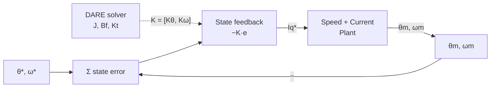

| Field     | Value                         |
|-----------|-------------------------------|
| Title     | Position Loop — P1: LQR / LQI |
| Type      | theory                        |
| Status    | draft                         |
| Version   | 1.0.0                         |
| Component | position-loop-lqr-lqi         |
| Date      | 2026-08-31                    |

> **Theory document**: Explains the mathematical and engineering principles behind a component or algorithm.
> This document is descriptive — it records the *why* and *how* at a scientific level, independent of any
> specific implementation. Equations use KaTeX ($inline$ and $$block$$). Block diagrams use Mermaid or
> ASCII art.

---

## Overview

P1 (LQR/LQI) simultaneously regulates both $\theta_m$ and $\omega_m$ with a single gain vector
derived from the physical plant parameters and an explicit performance cost. A position P-controller
on top of a speed PI gives ad-hoc gain selection with no principled trade-off between position error,
speed overshoot, and control effort. LQR state-feedback replaces this with DARE-computed gains.
The LQI extension adds an integral state for zero steady-state error under constant load.

Operates exclusively in the **1 kHz outer handler**. Requires mechanical RLS convergence ($J$, $B_f$, $K_t$).

---

## Prerequisites

| Symbol               | Meaning                          | Unit           |
|----------------------|----------------------------------|----------------|
| $A_d^p, B_d^p$       | Discrete position plant matrices | —              |
| $K_\theta, K_\omega$ | LQR position and velocity gains  | A/rad, A·s/rad |
| $Q, R$               | LQR weighting matrices           | —              |
| $P$                  | DARE solution                    | —              |

See `documentation/theory/foc-plant-models.md` §3 for the position plant derivation.

---

## Mathematical Foundation

All position-loop controllers operate on the **discrete two-state position plant** from
`documentation/theory/foc-plant-models.md` §3:

$$
\begin{pmatrix} \theta_m[k+1] \\ \omega_m[k+1] \end{pmatrix}
= A_d^p \begin{pmatrix} \theta_m[k] \\ \omega_m[k] \end{pmatrix} + B_d^p\,u[k], \quad
A_d^p = \begin{pmatrix} 1 & T_s^o \\ 0 & A_d^o \end{pmatrix},\;
B_d^p = \begin{pmatrix} 0 \\ B_d^o \end{pmatrix}
$$

---

## P1 — LQR / LQI Position Control

**LQR gain design**: For the discrete position plant $(A_d^p, B_d^p)$, solve the DARE:

$$
P = (A_d^p)^T P A_d^p - (A_d^p)^T P B_d^p\bigl(R + (B_d^p)^T P B_d^p\bigr)^{-1}(B_d^p)^T P A_d^p + Q
$$

Optimal gain vector with $Q = \mathrm{diag}(q_\theta, q_\omega)$:

$$
\mathbf{K} = [K_\theta,\; K_\omega] = \bigl(R + (B_d^p)^T P B_d^p\bigr)^{-1}(B_d^p)^T P A_d^p
$$

**LQR control law** (2 multiplications + 1 addition at run time):

$$
u[k] = -K_\theta\,(\theta_m[k] - \theta_m^*[k]) - K_\omega\,(\omega_m[k] - \omega_m^*[k])
$$

**LQI extension**: Add an integral state $x_I[k+1] = x_I[k] + (\theta_m^*[k] - \theta_m[k])$ for
zero steady-state error under constant load. Augmented gains $[K_\theta, K_\omega, K_I]$ computed
from the same DARE structure extended to dimension 3.

**Tuning**:
- $q_\theta$: position error penalty. Increase to tighten position accuracy.
- $q_\omega$: velocity error penalty. Increase to reduce overshoot and ringing.
- $R$: input penalty. Maps directly to peak $i_q^*$; set $R = 1/I_{q,max}^2$ as a starting point.

**Stability**: The closed-loop matrix $A_d^p - B_d^p \mathbf{K}$ must have all eigenvalues strictly
inside the unit circle. Guaranteed by the DARE solution when the plant is controllable.

**Relation to toolbox**: `Lqr<float,2,1>` provides the gain container. DARE computed at configuration
time via `DiscreteAlgebraicRiccatiEquation`. `IntegralStateFeedbackLqi` provides the LQI variant.

---

## Numerical Properties

| Property                    | Value                                  |
|-----------------------------|----------------------------------------|
| Ops per 1 kHz cycle         | 4 MACs ($\mathbf{K} \cdot x$, 2-state) |
| Steady-state position error | Zero with LQI (integral augmentation)  |
| Requires J, Bf              | Yes                                    |
| DARE timing                 | Once at config time, < 2 µs at 120 MHz |
| Tuning knobs                | 3 ($q_\theta$, $q_\omega$, $R$)        |

---

## Limitations & Assumptions

- Treats the speed and current loops as ideal. Current-loop transient delay acts as a pure time
  delay reducing achievable LQR bandwidth. Use a conservative $q_\omega / q_\theta$ ratio.
- LQI integral state must be clamped during mechanical hard stops (anti-windup required).
- Encoder noise enters position and velocity estimates. A Luenberger or Kalman observer upstream
  improves robustness.

---

## References

1. Krishnan, R. — *Permanent Magnet Synchronous and Brushless DC Motor Drives*, CRC Press, 2010.
2. Åström, K.J. & Wittenmark, B. — *Computer-Controlled Systems*, 3rd ed., Prentice Hall, 1997.
